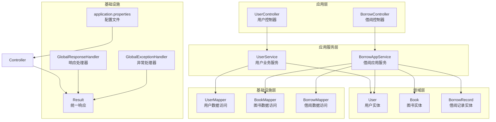
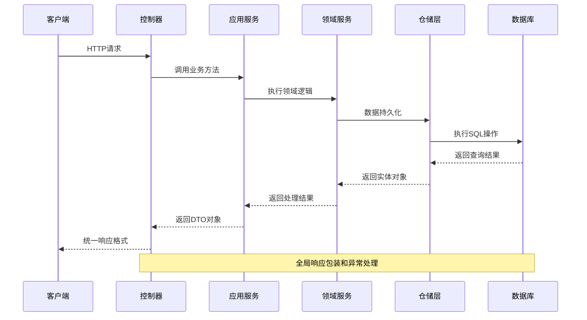
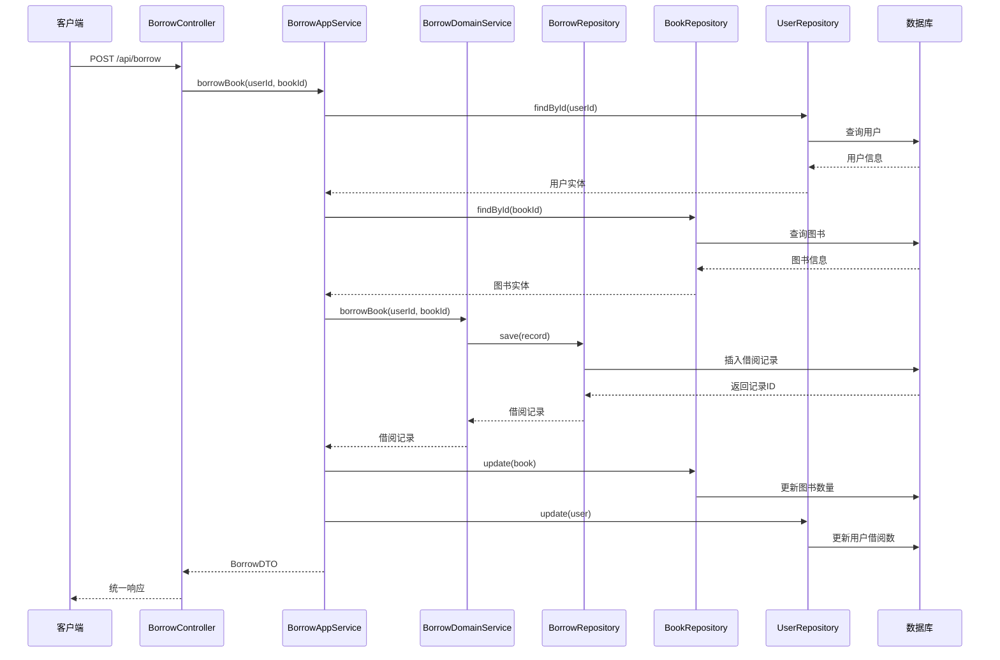
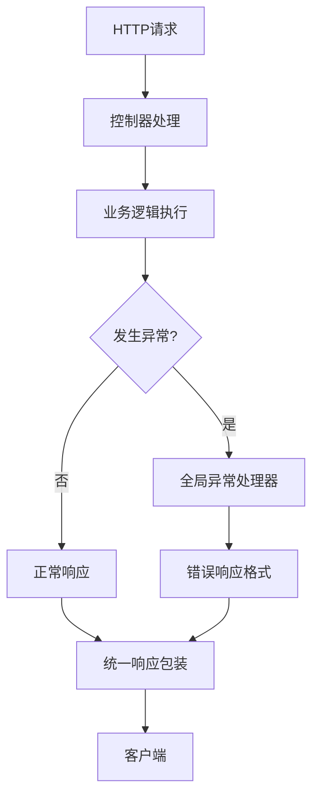
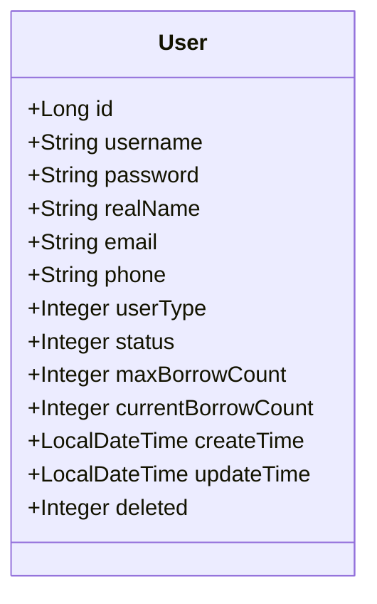
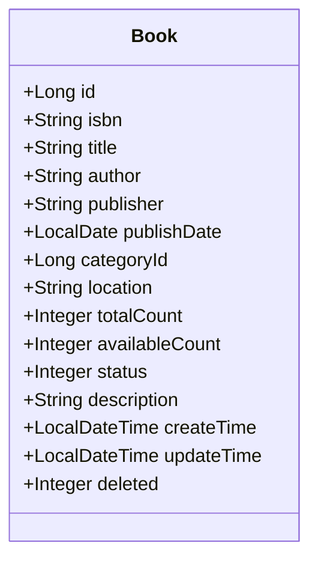
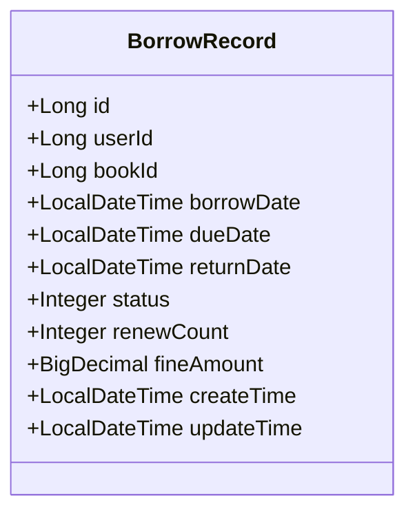
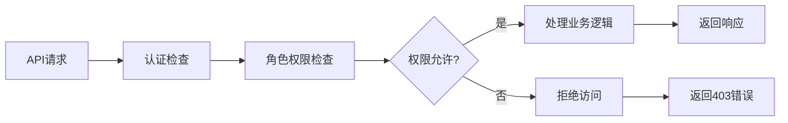

# API接口文档

<cite>
**本文档引用的文件**
- [UserController.java](file://src/main/java/com/example/springbootmybatis/adapter/controller/UserController.java)
- [BorrowController.java](file://src/main/java/com/example/springbootmybatis/adapter/controller/BorrowController.java)
- [User.java](file://src/main/java/com/example/springbootmybatis/domain/model/entity/User.java)
- [Book.java](file://src/main/java/com/example/springbootmybatis/domain/model/entity/Book.java)
- [BorrowRecord.java](file://src/main/java/com/example/springbootmybatis/domain/model/entity/BorrowRecord.java)
- [BorrowDTO.java](file://src/main/java/com/example/springbootmybatis/application/dto/BorrowDTO.java)
- [BorrowAppService.java](file://src/main/java/com/example/springbootmybatis/application/service/BorrowAppService.java)
- [BorrowRepository.java](file://src/main/java/com/example/springbootmybatis/domain/support/BorrowRepository.java)
- [BorrowMapper.xml](file://src/main/resources/mapper/BorrowMapper.xml)
- [UserMapper.xml](file://src/main/resources/mapper/UserMapper.xml)
- [Result.java](file://src/main/java/com/example/springbootmybatis/common/Result.java)
- [GlobalResponseHandler.java](file://src/main/java/com/example/springbootmybatis/advice/GlobalResponseHandler.java)
- [GlobalExceptionHandler.java](file://src/main/java/com/example/springbootmybatis/advice/GlobalExceptionHandler.java)
- [application.properties](file://src/main/resources/application.properties)
- [pom.xml](file://src/main/pom.xml)
</cite>

## 更新摘要
**变更内容**
- 新增借书系统API文档章节
- 添加借阅、归还、查询用户当前借阅等功能接口说明
- 更新数据模型以包含借阅记录实体
- 增加借书系统架构图和流程图
- 完善统一响应格式说明

## 目录
1. [项目概述](#项目概述)
2. [项目结构](#项目结构)
3. [核心组件](#核心组件)
4. [架构概览](#架构概览)
5. [用户管理系统API](#用户管理系统api)
6. [借书系统API](#借书系统api)
7. [统一响应格式](#统一响应格式)
8. [错误处理机制](#错误处理机制)
9. [数据模型](#数据模型)
10. [性能优化建议](#性能优化建议)
11. [客户端实现指南](#客户端实现指南)
12. [安全考虑](#安全考虑)
13. [版本控制与兼容性](#版本控制与兼容性)
14. [故障排除指南](#故障排除指南)
15. [总结](#总结)

## 项目概述

本项目是一个基于Spring Boot和MyBatis的综合管理系统，包含用户管理和借书两大核心功能模块。系统采用DDD（领域驱动设计）分层架构，包括控制器层、应用服务层、领域层、基础设施层和实体层，实现了统一的响应格式和全局异常处理机制。

## 项目结构



**图表来源**
- [UserController.java:1-68](file://src/main/java/com/example/springbootmybatis/adapter/controller/UserController.java#L1-L68)
- [BorrowController.java:1-70](file://src/main/java/com/example/springbootmybatis/adapter/controller/BorrowController.java#L1-L70)
- [User.java:1-158](file://src/main/java/com/example/springbootmybatis/domain/model/entity/User.java#L1-L158)
- [Book.java:1-112](file://src/main/java/com/example/springbootmybatis/domain/model/entity/Book.java#L1-L112)
- [BorrowRecord.java:1-80](file://src/main/java/com/example/springbootmybatis/domain/model/entity/BorrowRecord.java#L1-L80)

**章节来源**
- [pom.xml:32-67](file://src/main/pom.xml#L32-L67)
- [application.properties:1-16](file://src/main/resources/application.properties#L1-L16)

## 核心组件

### 控制器层
- **UserController**: 处理所有用户相关的HTTP请求，提供RESTful API端点
- **BorrowController**: 处理借阅相关的HTTP请求，提供借阅、归还、查询接口

### 服务层
- **UserService**: 实现用户业务逻辑，协调数据访问操作
- **BorrowAppService**: 实现借阅业务逻辑，协调图书和用户的状态更新

### 领域层
- **User**: 用户数据模型，包含用户基本信息和借阅状态
- **Book**: 图书数据模型，包含图书基本信息和可借数量
- **BorrowRecord**: 借阅记录领域实体，管理借阅状态和时间信息

### 基础设施层
- **UserMapper**: 用户数据访问接口
- **BookMapper**: 图书数据访问接口
- **BorrowMapper**: 借阅记录数据访问接口

**章节来源**
- [UserController.java:1-68](file://src/main/java/com/example/springbootmybatis/adapter/controller/UserController.java#L1-L68)
- [BorrowController.java:1-70](file://src/main/java/com/example/springbootmybatis/adapter/controller/BorrowController.java#L1-L70)
- [User.java:1-158](file://src/main/java/com/example/springbootmybatis/domain/model/entity/User.java#L1-L158)
- [Book.java:1-112](file://src/main/java/com/example/springbootmybatis/domain/model/entity/Book.java#L1-L112)
- [BorrowRecord.java:1-80](file://src/main/java/com/example/springbootmybatis/domain/model/entity/BorrowRecord.java#L1-L80)

## 架构概览



**图表来源**
- [GlobalResponseHandler.java:15-39](file://src/main/java/com/example/springbootmybatis/advice/GlobalResponseHandler.java#L15-L39)
- [GlobalExceptionHandler.java:10-22](file://src/main/java/com/example/springbootmybatis/advice/GlobalExceptionHandler.java#L10-L22)

## 用户管理系统API

### 基础信息

- **基础URL**: `/api/users`
- **内容类型**: `application/json`
- **字符编码**: UTF-8

### 获取单个用户

**GET** `/api/users/{id}`

**请求参数**:
- `id` (路径参数): 用户唯一标识符，类型: `Long`

**响应数据**:
- 用户对象，包含所有用户字段

**请求示例**:
```bash
curl -X GET "http://localhost:8080/api/users/1"
```

**响应示例**:
```json
{
  "success": true,
  "message": "操作成功",
  "data": {
    "id": 1,
    "username": "john_doe",
    "password": "hashed_password",
    "realName": "张三",
    "email": "zhangsan@example.com",
    "phone": "13800000000",
    "userType": 1,
    "status": 1,
    "maxBorrowCount": 5,
    "currentBorrowCount": 2,
    "createTime": "2023-01-01T00:00:00",
    "updateTime": "2023-01-01T00:00:00",
    "deleted": 0
  },
  "timestamp": 1699123456789
}
```

### 按用户名获取用户

**GET** `/api/users/username/{username}`

**请求参数**:
- `username` (路径参数): 用户名，类型: `String`

**响应数据**:
- 用户对象

**请求示例**:
```bash
curl -X GET "http://localhost:8080/api/users/username/john_doe"
```

### 按状态获取用户列表

**GET** `/api/users/status/{status}`

**请求参数**:
- `status` (路径参数): 用户状态，类型: `Integer`

**响应数据**:
- 用户对象数组

**请求示例**:
```bash
curl -X GET "http://localhost:8080/api/users/status/1"
```

### 获取所有用户

**GET** `/api/users/all`

**请求参数**: 无

**响应数据**:
- 用户对象数组

**请求示例**:
```bash
curl -X GET "http://localhost:8080/api/users/all"
```

### 创建用户

**POST** `/api/users`

**请求头**:
- `Content-Type: application/json`

**请求体**:
- 用户对象（除ID外的所有字段）

**响应数据**:
- 新创建的用户对象

**请求示例**:
```bash
curl -X POST "http://localhost:8080/api/users" \
  -H "Content-Type: application/json" \
  -d '{
    "username": "jane_doe",
    "password": "hashed_password",
    "realName": "李四",
    "email": "lisi@example.com",
    "phone": "13900000000",
    "userType": 2,
    "status": 1,
    "maxBorrowCount": 3
  }'
```

### 更新用户

**PUT** `/api/users`

**请求头**:
- `Content-Type: application/json`

**请求体**:
- 完整的用户对象（必须包含ID）

**响应数据**:
- 更新后的用户对象

**请求示例**:
```bash
curl -X PUT "http://localhost:8080/api/users" \
  -H "Content-Type: application/json" \
  -d '{
    "id": 1,
    "username": "john_updated",
    "password": "new_hashed_password",
    "realName": "张三丰",
    "email": "zhangsanfeng@example.com",
    "phone": "13811111111",
    "userType": 1,
    "status": 1,
    "maxBorrowCount": 10,
    "currentBorrowCount": 3
  }'
```

### 删除用户

**DELETE** `/api/users/{id}`

**请求参数**:
- `id` (路径参数): 用户唯一标识符

**响应数据**:
- `true` 表示删除成功

**请求示例**:
```bash
curl -X DELETE "http://localhost:8080/api/users/1"
```

**章节来源**
- [UserController.java:17-67](file://src/main/java/com/example/springbootmybatis/adapter/controller/UserController.java#L17-L67)

## 借书系统API

### 基础信息

- **基础URL**: `/api/borrow`
- **内容类型**: `application/json`
- **字符编码**: UTF-8

### 借阅图书

**POST** `/api/borrow`

**请求头**:
- `Content-Type: application/json`

**请求体**:
- `userId`: 用户唯一标识符，类型: `Long`
- `bookId`: 图书唯一标识符，类型: `Long`

**响应数据**:
- 借阅记录对象

**请求示例**:
```bash
curl -X POST "http://localhost:8080/api/borrow" \
  -H "Content-Type: application/json" \
  -d '{
    "userId": 1,
    "bookId": 1
  }'
```

**响应示例**:
```json
{
  "success": true,
  "message": "操作成功",
  "data": {
    "id": 1,
    "userId": 1,
    "bookId": 1,
    "status": 1,
    "borrowDate": "2023-01-01T00:00:00",
    "dueDate": "2023-01-31T00:00:00",
    "returnDate": null,
    "renewCount": 0,
    "fineAmount": 0.00
  },
  "timestamp": 1699123456789
}
```

### 归还图书

**POST** `/api/borrow/{id}/return`

**请求参数**:
- `id` (路径参数): 借阅记录唯一标识符，类型: `Long`

**响应数据**:
- 更新后的借阅记录对象

**请求示例**:
```bash
curl -X POST "http://localhost:8080/api/borrow/1/return"
```

**响应示例**:
```json
{
  "success": true,
  "message": "操作成功",
  "data": {
    "id": 1,
    "userId": 1,
    "bookId": 1,
    "status": 2,
    "borrowDate": "2023-01-01T00:00:00",
    "dueDate": "2023-01-31T00:00:00",
    "returnDate": "2023-01-15T00:00:00",
    "renewCount": 0,
    "fineAmount": 0.00
  },
  "timestamp": 1699123456789
}
```

### 查询用户当前借阅列表

**GET** `/api/borrow/user/{userId}`

**请求参数**:
- `userId` (路径参数): 用户唯一标识符，类型: `Long`

**响应数据**:
- 借阅记录对象数组（状态为"借阅中"）

**请求示例**:
```bash
curl -X GET "http://localhost:8080/api/borrow/user/1"
```

**响应示例**:
```json
{
  "success": true,
  "message": "操作成功",
  "data": [
    {
      "id": 1,
      "userId": 1,
      "bookId": 1,
      "status": 1,
      "borrowDate": "2023-01-01T00:00:00",
      "dueDate": "2023-01-31T00:00:00",
      "returnDate": null,
      "renewCount": 0,
      "fineAmount": 0.00
    },
    {
      "id": 2,
      "userId": 1,
      "bookId": 2,
      "status": 1,
      "borrowDate": "2023-01-02T00:00:00",
      "dueDate": "2023-01-31T00:00:00",
      "returnDate": null,
      "renewCount": 0,
      "fineAmount": 0.00
    }
  ],
  "timestamp": 1699123456789
}
```

### 借阅流程时序图



**图表来源**
- [BorrowController.java:29-44](file://src/main/java/com/example/springbootmybatis/adapter/controller/BorrowController.java#L29-L44)
- [BorrowAppService.java:42-82](file://src/main/java/com/example/springbootmybatis/application/service/BorrowAppService.java#L42-L82)

**章节来源**
- [BorrowController.java:24-68](file://src/main/java/com/example/springbootmybatis/adapter/controller/BorrowController.java#L24-L68)
- [BorrowAppService.java:39-123](file://src/main/java/com/example/springbootmybatis/application/service/BorrowAppService.java#L39-L123)

## 统一响应格式

### 响应结构

所有API响应都遵循统一的JSON格式：

```json
{
  "success": true,
  "message": "操作成功",
  "data": {},
  "timestamp": 1699123456789
}
```

### 字段说明

| 字段名 | 类型 | 必填 | 描述 |
|--------|------|------|------|
| success | boolean | 是 | 操作是否成功 |
| message | string | 是 | 操作结果描述 |
| data | any | 否 | 返回的数据内容 |
| timestamp | long | 是 | 响应时间戳（毫秒） |

### 成功响应示例

```json
{
  "success": true,
  "message": "操作成功",
  "data": {
    "id": 1,
    "username": "john_doe"
  },
  "timestamp": 1699123456789
}
```

### 失败响应示例

```json
{
  "success": false,
  "message": "用户添加失败",
  "data": null,
  "timestamp": 1699123456789
}
```

**章节来源**
- [Result.java:8-87](file://src/main/java/com/example/springbootmybatis/common/Result.java#L8-L87)
- [GlobalResponseHandler.java:15-39](file://src/main/java/com/example/springbootmybatis/advice/GlobalResponseHandler.java#L15-L39)

## 错误处理机制

### 全局异常处理

系统使用全局异常处理器统一处理各种异常情况：



**图表来源**
- [GlobalExceptionHandler.java:10-22](file://src/main/java/com/example/springbootmybatis/advice/GlobalExceptionHandler.java#L10-L22)
- [GlobalResponseHandler.java:15-39](file://src/main/java/com/example/springbootmybatis/advice/GlobalResponseHandler.java#L15-L39)

### 异常类型及处理

| 异常类型 | 状态码 | 错误消息前缀 | 处理方式 |
|----------|--------|-------------|----------|
| Exception | 500 | 系统错误: | 返回通用系统错误 |
| RuntimeException | 500 | 运行时错误: | 返回运行时错误信息 |

### 自定义错误示例

当用户操作失败时，系统会抛出运行时异常并被全局处理器捕获：

```json
{
  "success": false,
  "message": "运行时错误: 用户添加失败",
  "data": null,
  "timestamp": 1699123456789
}
```

**章节来源**
- [GlobalExceptionHandler.java:13-21](file://src/main/java/com/example/springbootmybatis/advice/GlobalExceptionHandler.java#L13-L21)

## 数据模型

### 用户实体结构

用户实体包含以下字段：



**图表来源**
- [User.java:8-22](file://src/main/java/com/example/springbootmybatis/domain/model/entity/User.java#L8-L22)

### 图书实体结构

图书实体包含以下字段：



**图表来源**
- [Book.java:9-25](file://src/main/java/com/example/springbootmybatis/domain/model/entity/Book.java#L9-L25)

### 借阅记录实体结构

借阅记录实体包含以下字段：



**图表来源**
- [BorrowRecord.java:10-22](file://src/main/java/com/example/springbootmybatis/domain/model/entity/BorrowRecord.java#L10-L22)

### 字段详细说明

#### 用户字段说明

| 字段名 | 类型 | 必填 | 描述 | 示例值 |
|--------|------|------|------|--------|
| id | Long | 否 | 用户唯一标识符 | 1 |
| username | String | 是 | 用户名 | john_doe |
| password | String | 是 | 密码（已哈希） | hashed_password |
| realName | String | 否 | 真实姓名 | 张三 |
| email | String | 否 | 邮箱地址 | zhangsan@example.com |
| phone | String | 否 | 电话号码 | 13800000000 |
| userType | Integer | 否 | 用户类型 | 1 |
| status | Integer | 否 | 用户状态 | 1 |
| maxBorrowCount | Integer | 否 | 最大借阅数量 | 5 |
| currentBorrowCount | Integer | 否 | 当前借阅数量 | 2 |
| createTime | LocalDateTime | 否 | 创建时间 | 2023-01-01T00:00:00 |
| updateTime | LocalDateTime | 否 | 更新时间 | 2023-01-01T00:00:00 |
| deleted | Integer | 否 | 删除标记 | 0 |

#### 图书字段说明

| 字段名 | 类型 | 必填 | 描述 | 示例值 |
|--------|------|------|------|--------|
| id | Long | 否 | 图书唯一标识符 | 1 |
| isbn | String | 否 | ISBN编号 | 978-0123456789 |
| title | String | 是 | 图书标题 | Spring Boot实战 |
| author | String | 是 | 作者 | 张三 |
| publisher | String | 否 | 出版社 | 技术出版社 |
| publishDate | LocalDate | 否 | 出版日期 | 2023-01-01 |
| categoryId | Long | 否 | 分类ID | 1 |
| location | String | 否 | 位置 | A区01架 |
| totalCount | Integer | 否 | 总数量 | 10 |
| availableCount | Integer | 否 | 可借数量 | 8 |
| status | Integer | 否 | 图书状态 | 1 |
| description | String | 否 | 图书描述 | Spring Boot入门教程 |
| createTime | LocalDateTime | 否 | 创建时间 | 2023-01-01T00:00:00 |
| updateTime | LocalDateTime | 否 | 更新时间 | 2023-01-01T00:00:00 |
| deleted | Integer | 否 | 删除标记 | 0 |

#### 借阅记录字段说明

| 字段名 | 类型 | 必填 | 描述 | 示例值 |
|--------|------|------|------|--------|
| id | Long | 否 | 借阅记录唯一标识符 | 1 |
| userId | Long | 是 | 用户唯一标识符 | 1 |
| bookId | Long | 是 | 图书唯一标识符 | 1 |
| borrowDate | LocalDateTime | 是 | 借阅时间 | 2023-01-01T00:00:00 |
| dueDate | LocalDateTime | 是 | 应还时间 | 2023-01-31T00:00:00 |
| returnDate | LocalDateTime | 否 | 实际归还时间 | 2023-01-15T00:00:00 |
| status | Integer | 否 | 借阅状态 | 1 |
| renewCount | Integer | 否 | 续借次数 | 0 |
| fineAmount | BigDecimal | 否 | 超时费用 | 0.00 |
| createTime | LocalDateTime | 否 | 创建时间 | 2023-01-01T00:00:00 |
| updateTime | LocalDateTime | 否 | 更新时间 | 2023-01-01T00:00:00 |

**章节来源**
- [User.java:1-158](file://src/main/java/com/example/springbootmybatis/domain/model/entity/User.java#L1-L158)
- [Book.java:1-112](file://src/main/java/com/example/springbootmybatis/domain/model/entity/Book.java#L1-L112)
- [BorrowRecord.java:1-80](file://src/main/java/com/example/springbootmybatis/domain/model/entity/BorrowRecord.java#L1-L80)
- [UserMapper.xml:5-19](file://src/main/resources/mapper/UserMapper.xml#L5-L19)
- [BorrowMapper.xml:5-17](file://src/main/resources/mapper/BorrowMapper.xml#L5-L17)

## 性能优化建议

### 数据库层面优化

1. **索引优化**
   - 为常用查询字段建立适当索引
   - 考虑在username、status等字段上建立索引
   - 为借阅记录表建立复合索引：`(user_id, status)` 和 `(book_id, status)`

2. **查询优化**
   - 使用分页查询处理大量数据
   - 避免SELECT *，只查询必要字段
   - 对频繁查询的字段建立合适的索引

3. **连接池配置**
   - 合理配置数据库连接池大小
   - 设置合适的超时时间和重试机制

### 应用层面优化

1. **缓存策略**
   - 对热点数据实施缓存
   - 使用Redis或本地缓存减少数据库压力
   - 缓存用户和图书的基本信息

2. **批量操作**
   - 支持批量插入和更新操作
   - 减少网络往返次数

3. **异步处理**
   - 对非关键操作进行异步处理
   - 使用消息队列处理耗时任务

### API层面优化

1. **响应压缩**
   - 启用GZIP压缩减少传输数据量
   - 对大对象进行分页返回

2. **并发控制**
   - 实施适当的并发限制
   - 使用乐观锁避免数据冲突

## 客户端实现指南

### 基础设置

1. **HTTP客户端选择**
   - 推荐使用现代HTTP客户端库
   - 确保支持JSON序列化和反序列化

2. **错误处理**
   - 实现统一的错误处理逻辑
   - 区分业务错误和系统错误

3. **重试机制**
   - 实现指数退避重试
   - 对临时性错误进行自动重试

### 请求构建示例

```javascript
// JavaScript示例
const apiClient = {
  baseUrl: 'http://localhost:8080/api',
  
  async borrowBook(userId, bookId) {
    try {
      const response = await fetch(`${this.baseUrl}/borrow`, {
        method: 'POST',
        headers: {
          'Content-Type': 'application/json',
        },
        body: JSON.stringify({ userId, bookId })
      });
      
      const result = await response.json();
      
      if (!result.success) {
        throw new Error(result.message);
      }
      
      return result.data;
    } catch (error) {
      console.error('借阅失败:', error);
      throw error;
    }
  },
  
  async returnBook(recordId) {
    try {
      const response = await fetch(`${this.baseUrl}/borrow/${recordId}/return`, {
        method: 'POST'
      });
      
      const result = await response.json();
      
      if (!result.success) {
        throw new Error(result.message);
      }
      
      return result.data;
    } catch (error) {
      console.error('归还失败:', error);
      throw error;
    }
  }
};
```

### 响应处理

```javascript
// 统一响应处理
function handleApiResponse(response) {
  if (!response.success) {
    // 处理业务错误
    console.error(`业务错误: ${response.message}`);
    return null;
  }
  
  // 处理成功响应
  return response.data;
}
```

## 安全考虑

### 认证机制

当前系统未实现专门的认证机制。建议在生产环境中集成以下认证方案：

1. **JWT Token认证**
   - 实现基于JWT的无状态认证
   - 在请求头中携带Authorization: Bearer token

2. **会话认证**
   - 使用Spring Session管理用户会话
   - 结合Cookie和CSRF保护

3. **OAuth2/OpenID Connect**
   - 集成第三方身份提供商
   - 支持单点登录(SSO)

### 授权控制



### 安全最佳实践

1. **输入验证**
   - 对所有用户输入进行严格验证
   - 防止SQL注入和XSS攻击

2. **敏感信息保护**
   - 密码必须进行哈希存储
   - 不在日志中记录敏感信息

3. **CORS配置**
   - 正确配置跨域资源共享
   - 限制允许的源和方法

## 版本控制与兼容性

### API版本控制策略

当前API未实现显式的版本控制。建议采用以下策略：

1. **URL版本控制**
   ```
   /api/v1/users
   /api/v2/users
   ```

2. **Header版本控制**
   ```
   Accept: application/vnd.company.v1+json
   ```

3. **媒体类型版本控制**
   ```
   Content-Type: application/json; version=1.0
   ```

### 向后兼容性保证

1. **字段兼容性**
   - 新增字段时保持向后兼容
   - 不要删除或修改现有字段

2. **响应格式**
   - 保持统一响应格式不变
   - 新增字段时在data对象中扩展

3. **错误码**
   - 保持错误码稳定
   - 新增错误场景时提供清晰的消息

## 故障排除指南

### 常见问题及解决方案

#### 数据库连接问题

**症状**: 启动时出现数据库连接错误

**解决方案**:
1. 检查数据库连接字符串配置
2. 确认数据库服务正常运行
3. 验证用户名和密码正确性

#### MyBatis映射问题

**症状**: 查询或更新操作失败

**解决方案**:
1. 检查UserMapper.xml和BorrowMapper.xml中的SQL语句
2. 确认字段名称与数据库表结构匹配
3. 验证resultMap配置正确

#### 响应格式异常

**症状**: API响应不符合统一格式

**解决方案**:
1. 检查GlobalResponseHandler配置
2. 确认没有直接返回原始对象
3. 验证Result类的使用

### 调试技巧

1. **启用详细日志**
   ```properties
   logging.level.com.example.springbootmybatis=DEBUG
   ```

2. **使用Postman进行测试**
   - 验证所有API端点
   - 测试边界条件和异常情况

3. **监控指标收集**
   - 监控API响应时间
   - 跟踪错误率和成功率

**章节来源**
- [application.properties:3-15](file://src/main/resources/application.properties#L3-L15)

## 总结

本综合管理系统提供了完整的RESTful API接口，具有以下特点：

1. **完整的CRUD操作**: 支持用户的基本增删改查操作
2. **借书系统完整功能**: 支持借阅、归还、查询用户当前借阅列表
3. **统一响应格式**: 所有API响应遵循一致的JSON格式
4. **全局异常处理**: 统一处理各种异常情况
5. **DDD分层架构**: 清晰的领域驱动设计分层结构
6. **可扩展性**: 易于添加新的功能和API端点

建议在生产环境中进一步完善：
- 添加认证授权机制
- 实现API版本控制
- 增强安全防护措施
- 优化性能和监控
- 完善测试覆盖
- 扩展借阅功能（如续借、逾期管理等）