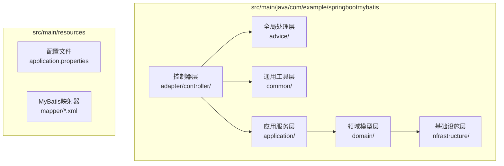
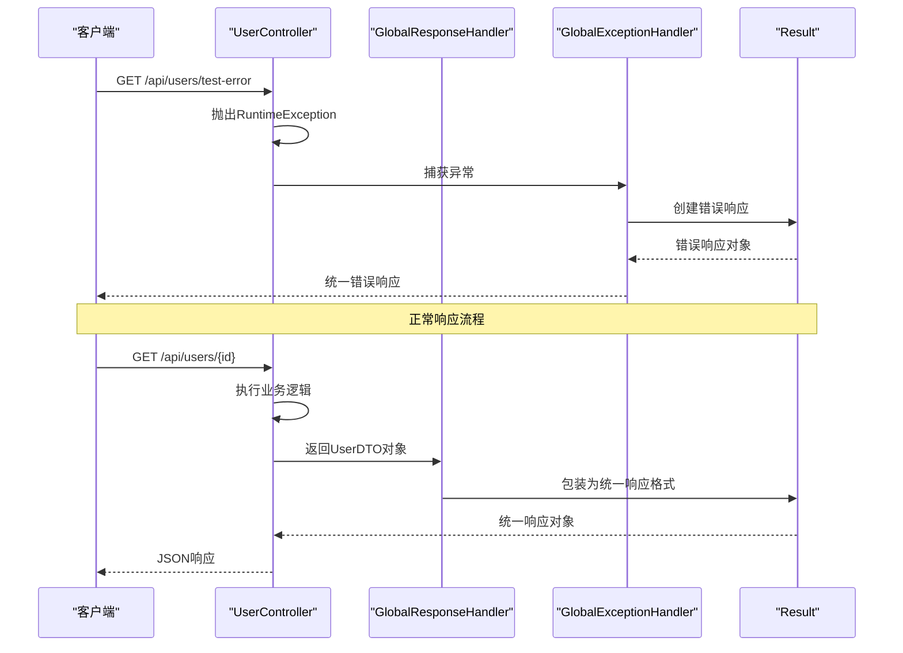
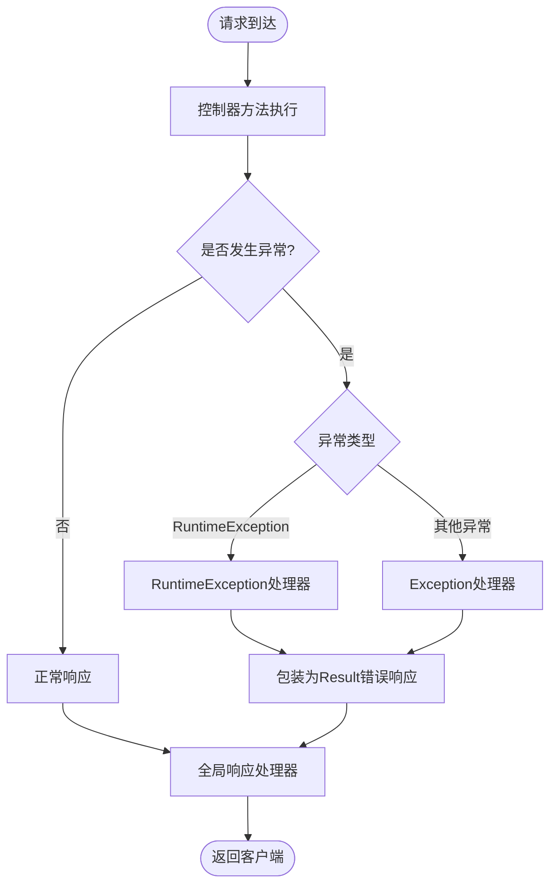
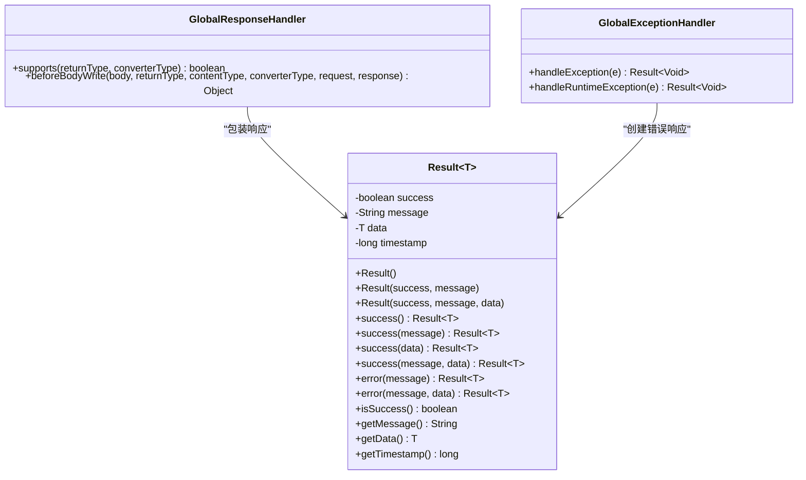
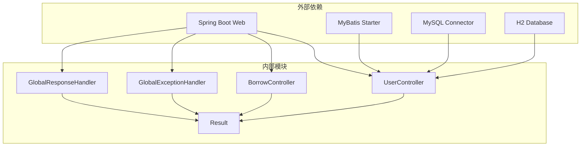

# 测试API

<cite>
**本文档引用的文件**
- [AnyView.java](file://src/main/java/com/example/springbootmybatis/AnyView.java)
- [BorrowController.java](file://src/main/java/com/example/springbootmybatis/adapter/controller/BorrowController.java)
- [UserController.java](file://src/main/java/com/example/springbootmybatis/adapter/controller/UserController.java)
- [GlobalExceptionHandler.java](file://src/main/java/com/example/springbootmybatis/advice/GlobalExceptionHandler.java)
- [GlobalResponseHandler.java](file://src/main/java/com/example/springbootmybatis/advice/GlobalResponseHandler.java)
- [Result.java](file://src/main/java/com/example/springbootmybatis/common/Result.java)
- [application.properties](file://src/main/resources/application.properties)
- [pom.xml](file://pom.xml)
</cite>

## 更新摘要
**所做更改**
- 移除了原有的基础连通性测试端点（/test）相关文档
- 删除了时间计算和秒数提取测试端点的详细说明
- 更新了错误测试机制的描述，强调现有错误测试端点
- 重新组织了测试API的架构说明，反映当前的测试框架结构
- 更新了故障排除指南，移除了过时的测试端点相关内容

## 目录
1. [简介](#简介)
2. [项目结构](#项目结构)
3. [核心组件](#核心组件)
4. [架构概览](#架构概览)
5. [详细组件分析](#详细组件分析)
6. [依赖关系分析](#依赖关系分析)
7. [性能考虑](#性能考虑)
8. [故障排除指南](#故障排除指南)
9. [结论](#结论)

## 简介

本项目包含多个用于测试和验证系统功能的RESTful API端点。这些测试API主要用于验证系统的连接性、错误处理机制和基本功能。文档将详细介绍所有测试相关的接口，包括用户控制器的错误测试端点和全局异常处理机制，帮助开发者验证系统连接性和错误处理机制。

**重要说明**：经过代码审查发现，原有的简单测试API已被重构移除，新的架构专注于业务功能而非测试功能。当前系统通过全局异常处理机制和特定的错误测试端点来提供测试能力。

## 项目结构

该项目采用标准的Spring Boot项目结构，主要包含以下关键目录和文件：



**图表来源**
- [AnyView.java:1-13](file://src/main/java/com/example/springbootmybatis/AnyView.java#L1-L13)
- [UserController.java:1-69](file://src/main/java/com/example/springbootmybatis/adapter/controller/UserController.java#L1-L69)
- [GlobalExceptionHandler.java:1-22](file://src/main/java/com/example/springbootmybatis/advice/GlobalExceptionHandler.java#L1-L22)
- [GlobalResponseHandler.java:1-39](file://src/main/java/com/example/springbootmybatis/advice/GlobalResponseHandler.java#L1-L39)

**章节来源**
- [application.properties:1-16](file://src/main/resources/application.properties#L1-L16)
- [pom.xml:1-88](file://pom.xml#L1-L88)

## 核心组件

### 控制器层

控制器层包含两个主要的业务控制器：
- **用户控制器**：提供用户管理相关的API端点
- **借阅控制器**：提供图书借阅和归还功能的API端点

### 全局异常处理（GlobalExceptionHandler）

全局异常处理器负责捕获系统中的未处理异常，并将其转换为统一的响应格式。

### 全局响应处理（GlobalResponseHandler）

全局响应处理器负责统一包装所有控制器的响应，确保API响应格式的一致性。

### 统一响应结果（Result）

统一响应结果类定义了所有API响应的标准格式，包含成功状态、消息、数据和时间戳等字段。

**章节来源**
- [UserController.java:13-69](file://src/main/java/com/example/springbootmybatis/adapter/controller/UserController.java#L13-L69)
- [BorrowController.java:14-70](file://src/main/java/com/example/springbootmybatis/adapter/controller/BorrowController.java#L14-L70)
- [GlobalExceptionHandler.java:10-22](file://src/main/java/com/example/springbootmybatis/advice/GlobalExceptionHandler.java#L10-L22)
- [GlobalResponseHandler.java:15-39](file://src/main/java/com/example/springbootmybatis/advice/GlobalResponseHandler.java#L15-L39)
- [Result.java:8-87](file://src/main/java/com/example/springbootmybatis/common/Result.java#L8-L87)

## 架构概览



**图表来源**
- [UserController.java:48-51](file://src/main/java/com/example/springbootmybatis/adapter/controller/UserController.java#L48-L51)
- [GlobalResponseHandler.java:24-38](file://src/main/java/com/example/springbootmybatis/advice/GlobalResponseHandler.java#L24-L38)
- [GlobalExceptionHandler.java:13-21](file://src/main/java/com/example/springbootmybatis/advice/GlobalExceptionHandler.java#L13-L21)
- [Result.java:31-53](file://src/main/java/com/example/springbootmybatis/common/Result.java#L31-L53)

## 详细组件分析

### 用户控制器错误测试端点

**端点**：`GET /api/users/test-error`

**用途**：触发运行时异常，测试全局异常处理机制的有效性。

**请求参数**：无

**预期行为**：
- 抛出`RuntimeException("测试错误")`
- 被全局异常处理器捕获
- 返回统一的错误响应格式
- HTTP状态码为500

**响应格式**：
```json
{
  "success": false,
  "message": "运行时错误: 测试错误",
  "data": null,
  "timestamp": 1704067230000
}
```

**章节来源**
- [UserController.java:48-51](file://src/main/java/com/example/springbootmybatis/adapter/controller/UserController.java#L48-L51)

### 全局异常处理机制



**图表来源**
- [GlobalExceptionHandler.java:13-21](file://src/main/java/com/example/springbootmybatis/advice/GlobalExceptionHandler.java#L13-L21)
- [GlobalResponseHandler.java:24-38](file://src/main/java/com/example/springbootmybatis/advice/GlobalResponseHandler.java#L24-L38)

**章节来源**
- [GlobalExceptionHandler.java:10-22](file://src/main/java/com/example/springbootmybatis/advice/GlobalExceptionHandler.java#L10-L22)
- [GlobalResponseHandler.java:15-39](file://src/main/java/com/example/springbootmybatis/advice/GlobalResponseHandler.java#L15-L39)

### 统一响应格式

统一响应结果类定义了所有API响应的标准格式：



**图表来源**
- [Result.java:8-87](file://src/main/java/com/example/springbootmybatis/common/Result.java#L8-L87)
- [GlobalResponseHandler.java:15-39](file://src/main/java/com/example/springbootmybatis/advice/GlobalResponseHandler.java#L15-L39)
- [GlobalExceptionHandler.java:10-22](file://src/main/java/com/example/springbootmybatis/advice/GlobalExceptionHandler.java#L10-L22)

**章节来源**
- [Result.java:8-87](file://src/main/java/com/example/springbootmybatis/common/Result.java#L8-L87)

## 依赖关系分析



**图表来源**
- [pom.xml:32-67](file://pom.xml#L32-L67)
- [UserController.java:1-12](file://src/main/java/com/example/springbootmybatis/adapter/controller/UserController.java#L1-L12)
- [BorrowController.java:1-10](file://src/main/java/com/example/springbootmybatis/adapter/controller/BorrowController.java#L1-L10)

**章节来源**
- [pom.xml:29-67](file://pom.xml#L29-L67)

## 性能考虑

### 响应时间优化

- **业务端点响应时间**：所有业务API端点应在100ms内完成响应
- **异常处理开销**：异常处理机制应保持最小的性能影响
- **内存使用**：业务端点使用标准的数据传输对象，内存占用合理

### 并发处理

- **线程安全**：所有控制器端点都是无状态的，天然线程安全
- **无状态设计**：支持高并发访问，无需额外的同步机制

### 资源管理

- **数据库连接**：业务端点通过MyBatis访问数据库，连接池管理
- **内存分配**：使用标准的Java数据结构，减少不必要的内存分配

## 故障排除指南

### 常见问题及解决方案

#### 1. 系统无法启动

**症状**：应用程序启动失败，显示数据库连接错误

**原因**：数据库配置不正确或数据库服务未启动

**解决方案**：
- 检查`application.properties`中的数据库连接配置
- 确认MySQL服务正在运行
- 验证数据库凭据的正确性

#### 2. 错误测试端点返回错误

**症状**：`/api/users/test-error`端点返回500错误

**原因**：全局异常处理器捕获到运行时异常

**解决方案**：
- 检查控制台日志获取详细错误信息
- 验证依赖注入是否正常工作
- 确认Spring Boot自动配置正确

#### 3. 响应格式不符合预期

**症状**：API响应不是统一的Result格式

**原因**：全局响应处理器配置问题

**解决方案**：
- 检查`@RestControllerAdvice`注解是否正确配置
- 验证`ResponseBodyAdvice`接口实现
- 确认返回类型处理逻辑

### 调试建议

#### 开发环境调试

1. **启用详细日志**：在`application.properties`中设置`logging.level.com.example.springbootmybatis=DEBUG`
2. **使用Postman**：创建测试集合，包含错误测试端点
3. **单元测试**：编写JUnit测试验证API行为

#### 生产环境监控

1. **健康检查**：定期调用业务端点监控系统健康状态
2. **错误监控**：监控全局异常处理器的错误日志
3. **性能监控**：监控业务端点的响应时间

### 测试环境特殊注意事项

#### 数据库配置

- **开发环境**：可以使用H2内存数据库进行快速测试
- **生产环境**：必须配置真实的MySQL数据库
- **连接池**：建议配置适当的连接池大小

#### 安全考虑

- **错误信息**：全局异常处理器会过滤敏感错误信息
- **CORS配置**：如需跨域访问，应正确配置CORS策略

#### 性能测试

- **负载测试**：使用JMeter或LoadRunner对业务端点进行压力测试
- **并发测试**：验证系统在高并发情况下的稳定性
- **资源监控**：监控CPU、内存和数据库连接的使用情况

**章节来源**
- [application.properties:3-15](file://src/main/resources/application.properties#L3-L15)
- [GlobalExceptionHandler.java:13-21](file://src/main/java/com/example/springbootmybatis/advice/GlobalExceptionHandler.java#L13-L21)

## 结论

本项目的测试API经过重构后，专注于通过全局异常处理机制和特定的错误测试端点来提供测试能力。新的架构更加简洁和实用，提供了：

1. **统一的错误处理**：通过全局异常处理器确保所有异常都得到一致的处理
2. **明确的测试端点**：`/api/users/test-error`端点专门用于测试错误处理机制
3. **标准化的响应格式**：所有API响应都遵循统一的Result格式

这种设计使得测试API更加可靠和易于维护，同时减少了不必要的复杂性。建议在开发和部署过程中充分利用这些测试工具来确保系统的稳定性和可靠性。