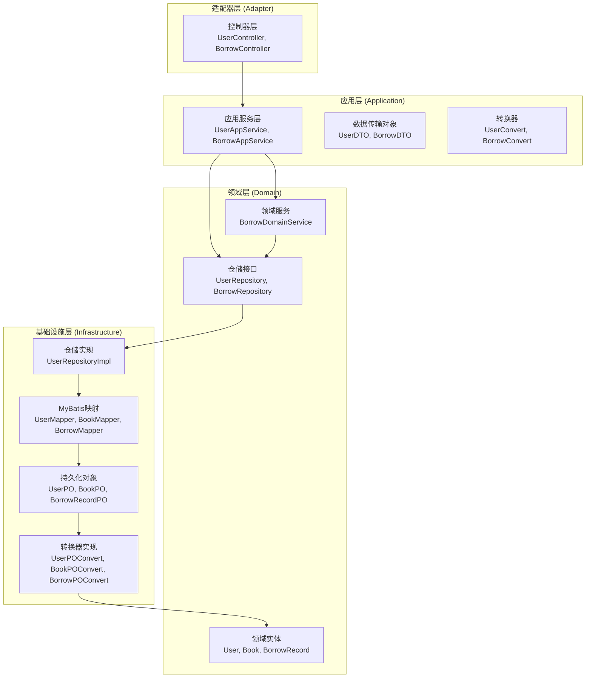
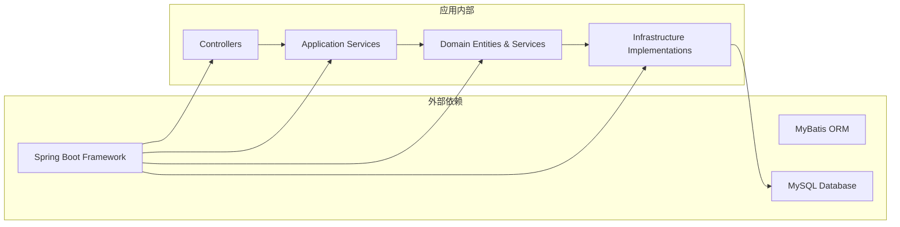
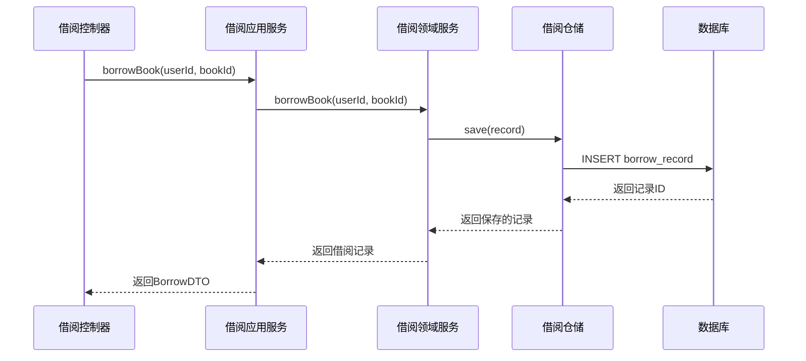
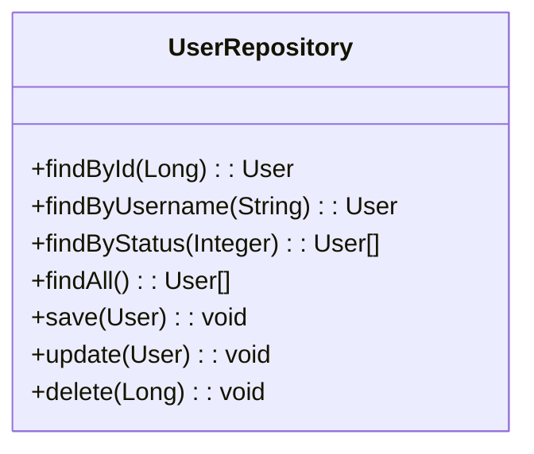
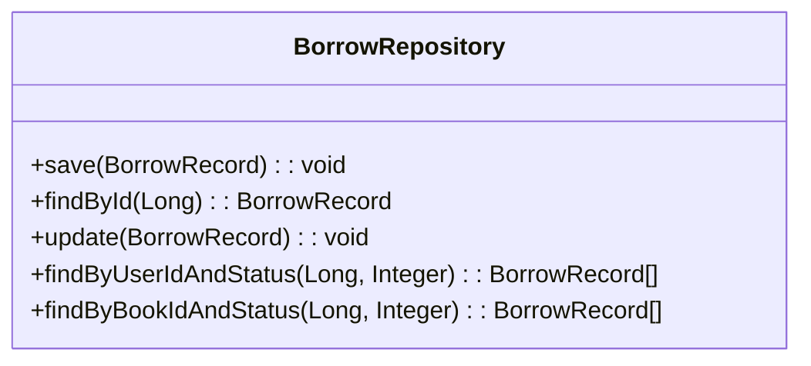
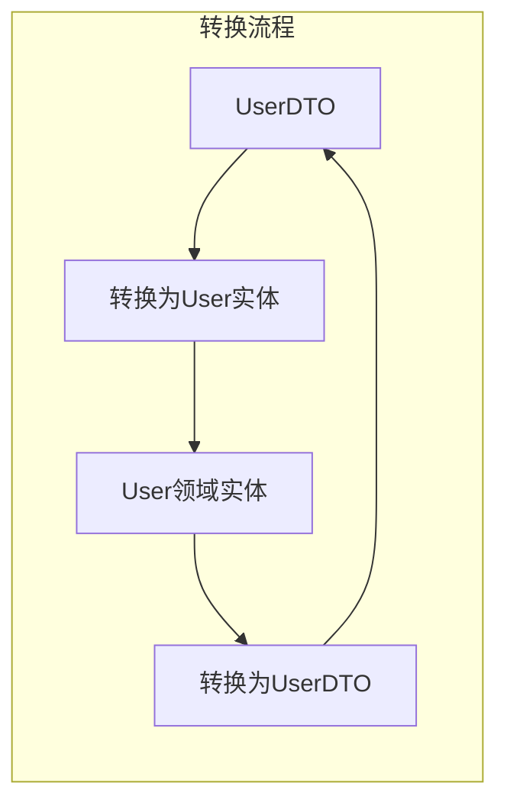
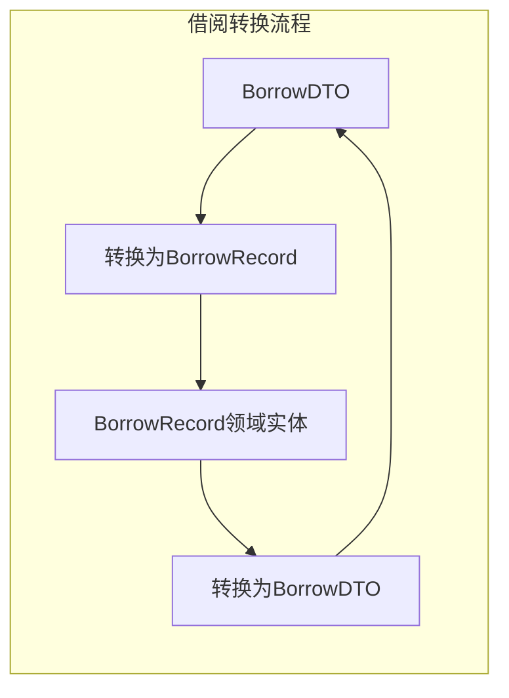
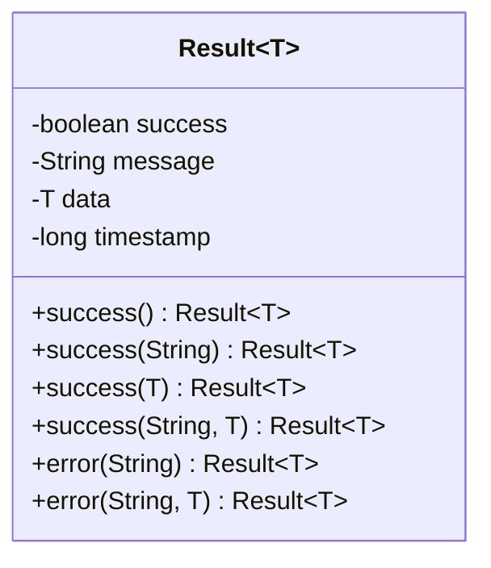

# 用户管理API

<cite>
**本文档引用的文件**
- [UserController.java](file://src/main/java/com/example/springbootmybatis/adapter/controller/UserController.java)
- [BorrowController.java](file://src/main/java/com/example/springbootmybatis/adapter/controller/BorrowController.java)
- [UserAppService.java](file://src/main/java/com/example/springbootmybatis/application/service/UserAppService.java)
- [BorrowAppService.java](file://src/main/java/com/example/springbootmybatis/application/service/BorrowAppService.java)
- [UserDTO.java](file://src/main/java/com/example/springbootmybatis/application/dto/UserDTO.java)
- [BorrowDTO.java](file://src/main/java/com/example/springbootmybatis/application/dto/BorrowDTO.java)
- [User.java](file://src/main/java/com/example/springbootmybatis/domain/model/entity/User.java)
- [Book.java](file://src/main/java/com/example/springbootmybatis/domain/model/entity/Book.java)
- [BorrowRecord.java](file://src/main/java/com/example/springbootmybatis/domain/model/entity/BorrowRecord.java)
- [UserRepository.java](file://src/main/java/com/example/springbootmybatis/domain/support/UserRepository.java)
- [BorrowRepository.java](file://src/main/java/com/example/springbootmybatis/domain/support/BorrowRepository.java)
- [UserRepositoryImpl.java](file://src/main/java/com/example/springbootmybatis/infrastructure/repository/impl/UserRepositoryImpl.java)
- [BorrowDomainService.java](file://src/main/java/com/example/springbootmybatis/domain/service/BorrowDomainService.java)
- [UserConvert.java](file://src/main/java/com/example/springbootmybatis/application/convert/UserConvert.java)
- [BorrowConvert.java](file://src/main/java/com/example/springbootmybatis/application/convert/BorrowConvert.java)
- [Result.java](file://src/main/java/com/example/springbootmybatis/common/Result.java)
- [DDD项目代码结构规范.md](file://docs/DDD项目代码结构规范.md)
- [2025-03-14-book-borrowing-plan.md](file://docs/superpowers/plans/2025-03-14-book-borrowing-plan.md)
</cite>

## 更新摘要
**所做更改**
- 更新架构概述以反映DDD分层架构
- 新增借阅管理API文档
- 更新数据模型以包含图书和借阅记录实体
- 更新接口文档以包含完整的图书馆管理系统API
- 新增领域驱动设计相关的架构图和数据流图

## 目录
1. [简介](#简介)
2. [项目架构](#项目架构)
3. [核心组件](#核心组件)
4. [图书馆管理系统API](#图书馆管理系统api)
5. [用户管理API](#用户管理api)
6. [借阅管理API](#借阅管理api)
7. [数据模型](#数据模型)
8. [领域服务](#领域服务)
9. [仓储接口](#仓储接口)
10. [转换器](#转换器)
11. [错误处理](#错误处理)
12. [性能考虑](#性能考虑)
13. [故障排除指南](#故障排除指南)
14. [结论](#结论)

## 简介

本项目是一个基于Spring Boot和MyBatis的图书馆管理系统API，采用领域驱动设计（DDD）架构。系统不仅提供用户管理功能，还包含了完整的图书借阅管理能力，支持用户、图书、借阅记录等复杂业务实体的管理。

系统采用四层架构设计：适配器层（Adapter）、应用层（Application）、领域层（Domain）、基础设施层（Infrastructure），确保了代码的可维护性、可扩展性和业务逻辑的清晰分离。

## 项目架构

系统采用领域驱动设计（DDD）的四层架构模式，通过清晰的分层和依赖关系实现业务逻辑的模块化：



**图表来源**
- [DDD项目代码结构规范.md:1-185](file://docs/DDD项目代码结构规范.md#L1-L185)
- [UserController.java:1-69](file://src/main/java/com/example/springbootmybatis/adapter/controller/UserController.java#L1-L69)
- [BorrowController.java:1-70](file://src/main/java/com/example/springbootmybatis/adapter/controller/BorrowController.java#L1-L70)

### 依赖关系图



**图表来源**
- [UserAppService.java:1-83](file://src/main/java/com/example/springbootmybatis/application/service/UserAppService.java#L1-L83)
- [BorrowAppService.java:1-125](file://src/main/java/com/example/springbootmybatis/application/service/BorrowAppService.java#L1-L125)

## 核心组件

### 适配器层 (Adapter)
负责处理HTTP请求和响应，提供RESTful API端点：
- **UserController**: 处理用户相关的HTTP请求
- **BorrowController**: 处理借阅相关的HTTP请求

### 应用层 (Application)
封装业务逻辑，协调领域对象和基础设施：
- **UserAppService**: 用户业务逻辑编排
- **BorrowAppService**: 借阅业务逻辑编排
- **UserConvert**: 用户DTO与领域实体转换
- **BorrowConvert**: 借阅DTO与领域实体转换

### 领域层 (Domain)
包含核心业务逻辑和领域模型：
- **User**: 用户领域实体，包含用户状态管理和借阅限制
- **Book**: 图书领域实体，包含库存管理和状态控制
- **BorrowRecord**: 借阅记录领域实体，包含借阅生命周期管理
- **BorrowDomainService**: 借阅领域的核心业务逻辑

### 基础设施层 (Infrastructure)
提供技术实现细节：
- **UserRepositoryImpl**: 用户数据访问实现
- **BorrowRepositoryImpl**: 借阅记录数据访问实现
- **各种Mapper接口**: MyBatis数据库映射
- **PO持久化对象**: 数据库实体映射

**章节来源**
- [UserController.java:1-69](file://src/main/java/com/example/springbootmybatis/adapter/controller/UserController.java#L1-L69)
- [BorrowController.java:1-70](file://src/main/java/com/example/springbootmybatis/adapter/controller/BorrowController.java#L1-L70)
- [UserAppService.java:1-83](file://src/main/java/com/example/springbootmybatis/application/service/UserAppService.java#L1-L83)
- [BorrowAppService.java:1-125](file://src/main/java/com/example/springbootmybatis/application/service/BorrowAppService.java#L1-L125)

## 图书馆管理系统API

### 用户管理API

#### 获取单个用户

**HTTP方法**: GET  
**URL路径**: `/api/users/{id}`  
**路径参数**: 
- `id` (Long): 用户唯一标识符

**请求示例**:
```bash
curl -X GET http://localhost:8080/api/users/1
```

**响应数据结构**:
```json
{
  "id": 1,
  "username": "john_doe",
  "password": "hashed_password",
  "realName": "John Doe",
  "email": "john@example.com",
  "phone": "13800000000",
  "userType": 1,
  "status": 1,
  "maxBorrowCount": 10,
  "currentBorrowCount": 0
}
```

**状态码**:
- 200 OK: 请求成功
- 404 Not Found: 用户不存在

**章节来源**
- [UserController.java:20-27](file://src/main/java/com/example/springbootmybatis/adapter/controller/UserController.java#L20-L27)
- [UserAppService.java:27-30](file://src/main/java/com/example/springbootmybatis/application/service/UserAppService.java#L27-L30)

#### 按用户名查询

**HTTP方法**: GET  
**URL路径**: `/api/users/username/{username}`  
**路径参数**: 
- `username` (String): 用户名

**请求示例**:
```bash
curl -X GET http://localhost:8080/api/users/username/john_doe
```

**响应数据结构**:
- 成功: 返回UserDTO对象
- 失败: 抛出运行时异常

**状态码**:
- 200 OK: 请求成功
- 500 Internal Server Error: 用户不存在

**章节来源**
- [UserController.java:29-36](file://src/main/java/com/example/springbootmybatis/adapter/controller/UserController.java#L29-L36)
- [UserAppService.java:35-38](file://src/main/java/com/example/springbootmybatis/application/service/UserAppService.java#L35-L38)

#### 按状态查询

**HTTP方法**: GET  
**URL路径**: `/api/users/status/{status}`  
**路径参数**: 
- `status` (Integer): 用户状态值

**请求示例**:
```bash
curl -X GET http://localhost:8080/api/users/status/1
```

**响应数据结构**:
- 成功: 返回UserDTO列表
- 失败: 返回空列表

**状态码**:
- 200 OK: 请求成功

**章节来源**
- [UserController.java:38-41](file://src/main/java/com/example/springbootmybatis/adapter/controller/UserController.java#L38-L41)
- [UserAppService.java:43-46](file://src/main/java/com/example/springbootmybatis/application/service/UserAppService.java#L43-L46)

#### 获取所有用户

**HTTP方法**: GET  
**URL路径**: `/api/users/all`  

**请求示例**:
```bash
curl -X GET http://localhost:8080/api/users/all
```

**响应数据结构**:
- 成功: 返回UserDTO数组

**状态码**:
- 200 OK: 请求成功

**章节来源**
- [UserController.java:43-46](file://src/main/java/com/example/springbootmybatis/adapter/controller/UserController.java#L43-L46)
- [UserAppService.java:51-54](file://src/main/java/com/example/springbootmybatis/application/service/UserAppService.java#L51-L54)

#### 创建用户

**HTTP方法**: POST  
**URL路径**: `/api/users`  
**请求头**: `Content-Type: application/json`  
**请求体**: UserDTO JSON格式

**请求示例**:
```bash
curl -X POST http://localhost:8080/api/users \
  -H "Content-Type: application/json" \
  -d '{
    "username": "john_doe",
    "password": "secure_password",
    "realName": "John Doe",
    "email": "john@example.com",
    "phone": "13800000000",
    "userType": 1,
    "status": 1,
    "maxBorrowCount": 10
  }'
```

**响应数据结构**:
- 成功: 返回创建的UserDTO对象

**状态码**:
- 200 OK: 创建成功

**章节来源**
- [UserController.java:53-56](file://src/main/java/com/example/springbootmybatis/adapter/controller/UserController.java#L53-L56)
- [UserAppService.java:59-63](file://src/main/java/com/example/springbootmybatis/application/service/UserAppService.java#L59-L63)

#### 更新用户

**HTTP方法**: PUT  
**URL路径**: `/api/users`  
**请求头**: `Content-Type: application/json`  
**请求体**: 完整的UserDTO JSON格式

**请求示例**:
```bash
curl -X PUT http://localhost:8080/api/users \
  -H "Content-Type: application/json" \
  -d '{
    "id": 1,
    "username": "john_doe_updated",
    "password": "new_secure_password",
    "realName": "John Smith",
    "email": "john.updated@example.com",
    "phone": "13800000001",
    "userType": 1,
    "status": 1,
    "maxBorrowCount": 15
  }'
```

**响应数据结构**:
- 成功: 返回更新后的UserDTO对象

**状态码**:
- 200 OK: 更新成功

**章节来源**
- [UserController.java:58-61](file://src/main/java/com/example/springbootmybatis/adapter/controller/UserController.java#L58-L61)
- [UserAppService.java:68-74](file://src/main/java/com/example/springbootmybatis/application/service/UserAppService.java#L68-L74)

#### 删除用户

**HTTP方法**: DELETE  
**URL路径**: `/api/users/{id}`  
**路径参数**: 
- `id` (Long): 要删除的用户ID

**请求示例**:
```bash
curl -X DELETE http://localhost:8080/api/users/1
```

**响应数据结构**:
- 成功: 返回 `true`

**状态码**:
- 200 OK: 删除成功

**章节来源**
- [UserController.java:63-67](file://src/main/java/com/example/springbootmybatis/adapter/controller/UserController.java#L63-L67)
- [UserAppService.java:79-81](file://src/main/java/com/example/springbootmybatis/application/service/UserAppService.java#L79-L81)

### 借阅管理API

#### 借阅图书

**HTTP方法**: POST  
**URL路径**: `/api/borrow`  
**请求头**: `Content-Type: application/json`  
**请求体**: 
```json
{
  "userId": 1,
  "bookId": 1
}
```

**请求示例**:
```bash
curl -X POST http://localhost:8080/api/borrow \
  -H "Content-Type: application/json" \
  -d '{"userId": 1, "bookId": 1}'
```

**响应数据结构**:
```json
{
  "success": true,
  "message": "操作成功",
  "data": {
    "id": 1,
    "userId": 1,
    "bookId": 1,
    "borrowDate": "2024-01-01T10:00:00",
    "dueDate": "2024-01-31T10:00:00",
    "returnDate": null,
    "status": 1,
    "renewCount": 0,
    "fineAmount": 0.00
  },
  "timestamp": 1704067200000
}
```

**状态码**:
- 200 OK: 借阅成功
- 400 Bad Request: 参数无效或业务规则违反

**章节来源**
- [BorrowController.java:29-44](file://src/main/java/com/example/springbootmybatis/adapter/controller/BorrowController.java#L29-L44)
- [BorrowAppService.java:42-82](file://src/main/java/com/example/springbootmybatis/application/service/BorrowAppService.java#L42-L82)

#### 归还图书

**HTTP方法**: POST  
**URL路径**: `/api/borrow/{id}/return`  
**路径参数**: 
- `id` (Long): 借阅记录ID

**请求示例**:
```bash
curl -X POST http://localhost:8080/api/borrow/1/return
```

**响应数据结构**:
```json
{
  "success": true,
  "message": "操作成功",
  "data": {
    "id": 1,
    "userId": 1,
    "bookId": 1,
    "borrowDate": "2024-01-01T10:00:00",
    "dueDate": "2024-01-31T10:00:00",
    "returnDate": "2024-01-15T14:30:00",
    "status": 2,
    "renewCount": 0,
    "fineAmount": 0.00
  },
  "timestamp": 1704067200000
}
```

**状态码**:
- 200 OK: 归还成功
- 400 Bad Request: 借阅记录不存在或状态异常

**章节来源**
- [BorrowController.java:50-58](file://src/main/java/com/example/springbootmybatis/adapter/controller/BorrowController.java#L50-L58)
- [BorrowAppService.java:87-113](file://src/main/java/com/example/springbootmybatis/application/service/BorrowAppService.java#L87-L113)

#### 查询用户当前借阅列表

**HTTP方法**: GET  
**URL路径**: `/api/borrow/user/{userId}`  
**路径参数**: 
- `userId` (Long): 用户ID

**请求示例**:
```bash
curl -X GET http://localhost:8080/api/borrow/user/1
```

**响应数据结构**:
```json
{
  "success": true,
  "message": "操作成功",
  "data": [
    {
      "id": 1,
      "userId": 1,
      "bookId": 1,
      "borrowDate": "2024-01-01T10:00:00",
      "dueDate": "2024-01-31T10:00:00",
      "returnDate": null,
      "status": 1,
      "renewCount": 0,
      "fineAmount": 0.00
    }
  ],
  "timestamp": 1704067200000
}
```

**状态码**:
- 200 OK: 查询成功

**章节来源**
- [BorrowController.java:64-68](file://src/main/java/com/example/springbootmybatis/adapter/controller/BorrowController.java#L64-L68)
- [BorrowAppService.java:118-123](file://src/main/java/com/example/springbootmybatis/application/service/BorrowAppService.java#L118-L123)

## 数据模型

### 用户实体 (User)

用户实体是系统的核心数据模型，包含以下字段：

| 字段名 | 类型 | 描述 | 必填 |
|--------|------|------|------|
| id | Long | 用户唯一标识符 | 否 |
| username | String | 用户名 | 是 |
| password | String | 密码 | 是 |
| realName | String | 真实姓名 | 否 |
| email | String | 邮箱地址 | 否 |
| phone | String | 电话号码 | 否 |
| userType | Integer | 用户类型 | 否 |
| status | Integer | 用户状态 | 否 |
| maxBorrowCount | Integer | 最大借阅数量 | 否 |
| currentBorrowCount | Integer | 当前借阅数量 | 否 |
| createTime | LocalDateTime | 创建时间 | 否 |
| updateTime | LocalDateTime | 更新时间 | 否 |
| deleted | Integer | 删除标记 | 否 |

### 图书实体 (Book)

图书实体包含图书的基本信息和库存管理：

| 字段名 | 类型 | 描述 | 必填 |
|--------|------|------|------|
| id | Long | 图书唯一标识符 | 否 |
| isbn | String | ISBN编号 | 是 |
| title | String | 图书标题 | 是 |
| author | String | 作者 | 是 |
| publisher | String | 出版社 | 否 |
| publishDate | LocalDate | 出版日期 | 否 |
| categoryId | Long | 分类ID | 否 |
| location | String | 书籍位置 | 否 |
| totalCount | Integer | 总数量 | 否 |
| availableCount | Integer | 可借数量 | 否 |
| status | Integer | 图书状态 | 否 |
| description | String | 图书描述 | 否 |
| createTime | LocalDateTime | 创建时间 | 否 |
| updateTime | LocalDateTime | 更新时间 | 否 |
| deleted | Integer | 删除标记 | 否 |

### 借阅记录实体 (BorrowRecord)

借阅记录实体管理图书借阅的完整生命周期：

| 字段名 | 类型 | 描述 | 必填 |
|--------|------|------|------|
| id | Long | 借阅记录唯一标识符 | 否 |
| userId | Long | 用户ID | 是 |
| bookId | Long | 图书ID | 是 |
| borrowDate | LocalDateTime | 借阅日期 | 否 |
| dueDate | LocalDateTime | 应还日期 | 否 |
| returnDate | LocalDateTime | 实际归还日期 | 否 |
| status | Integer | 借阅状态 | 否 |
| renewCount | Integer | 续借次数 | 否 |
| fineAmount | BigDecimal | 超时费用 | 否 |
| createTime | LocalDateTime | 创建时间 | 否 |
| updateTime | LocalDateTime | 更新时间 | 否 |

**章节来源**
- [User.java:8-158](file://src/main/java/com/example/springbootmybatis/domain/model/entity/User.java#L8-L158)
- [Book.java:9-112](file://src/main/java/com/example/springbootmybatis/domain/model/entity/Book.java#L9-L112)
- [BorrowRecord.java:10-80](file://src/main/java/com/example/springbootmybatis/domain/model/entity/BorrowRecord.java#L10-L80)

## 领域服务

### 借阅领域服务 (BorrowDomainService)

借阅领域服务处理借阅的核心业务逻辑，确保借阅操作的原子性和一致性：



**图表来源**
- [BorrowDomainService.java:24-30](file://src/main/java/com/example/springbootmybatis/domain/service/BorrowDomainService.java#L24-L30)
- [BorrowAppService.java:71-82](file://src/main/java/com/example/springbootmybatis/application/service/BorrowAppService.java#L71-L82)

**章节来源**
- [BorrowDomainService.java:1-50](file://src/main/java/com/example/springbootmybatis/domain/service/BorrowDomainService.java#L1-L50)

## 仓储接口

### 用户仓储接口 (UserRepository)

用户仓储接口定义了用户数据访问的标准方法：



**图表来源**
- [UserRepository.java:9-46](file://src/main/java/com/example/springbootmybatis/domain/support/UserRepository.java#L9-L46)

### 借阅仓储接口 (BorrowRepository)

借阅仓储接口管理借阅记录的查询和操作：



**图表来源**
- [BorrowRepository.java:9-36](file://src/main/java/com/example/springbootmybatis/domain/support/BorrowRepository.java#L9-L36)

**章节来源**
- [UserRepository.java:1-46](file://src/main/java/com/example/springbootmybatis/domain/support/UserRepository.java#L1-L46)
- [BorrowRepository.java:1-36](file://src/main/java/com/example/springbootmybatis/domain/support/BorrowRepository.java#L1-L36)

## 转换器

### 用户转换器 (UserConvert)

用户转换器负责UserDTO与User领域实体之间的双向转换：



**图表来源**
- [UserConvert.java:19-72](file://src/main/java/com/example/springbootmybatis/application/convert/UserConvert.java#L19-L72)

### 借阅转换器 (BorrowConvert)

借阅转换器负责BorrowDTO与BorrowRecord领域实体之间的转换：



**图表来源**
- [BorrowConvert.java:11-26](file://src/main/java/com/example/springbootmybatis/application/convert/BorrowConvert.java#L11-L26)

**章节来源**
- [UserConvert.java:1-88](file://src/main/java/com/example/springbootmybatis/application/convert/UserConvert.java#L1-L88)
- [BorrowConvert.java:1-28](file://src/main/java/com/example/springbootmybatis/application/convert/BorrowConvert.java#L1-L28)

## 错误处理

系统采用统一的Result包装类来处理API响应和错误：



**图表来源**
- [Result.java:8-87](file://src/main/java/com/example/springbootmybatis/common/Result.java#L8-L87)

### 错误响应格式

所有API响应都遵循统一的Result格式：

```json
{
  "success": false,
  "message": "用户不存在",
  "data": null,
  "timestamp": 1704067200000
}
```

**章节来源**
- [Result.java:1-87](file://src/main/java/com/example/springbootmybatis/common/Result.java#L1-L87)

## 性能考虑

### 数据库优化
- 使用MyBatis的懒加载机制减少不必要的数据加载
- 通过XML映射文件优化SQL查询性能
- 合理使用索引提高查询效率

### 缓存策略
- 可在应用层添加缓存机制减少数据库访问
- 对频繁查询的用户和图书信息进行缓存
- 设置合理的缓存过期时间

### 事务管理
- 借阅操作使用@Transactional注解确保数据一致性
- 在BorrowAppService中统一管理借阅相关的事务

### 异步处理
- 对于耗时的操作可以考虑异步处理
- 使用线程池管理并发请求
- 实现请求限流防止系统过载

## 故障排除指南

### 常见问题及解决方案

**借阅规则冲突**
- 用户借阅数量已达上限
- 图书已全部借完
- 用户状态异常（非激活状态）

**数据库连接问题**
- 检查数据库连接配置
- 验证数据库服务状态
- 确认网络连接正常

**参数验证错误**
- 检查请求参数格式是否正确
- 验证必填字段是否完整
- 确认数据类型匹配

### 日志监控

系统会自动记录异常信息，便于问题排查：
- 统一的Result响应格式便于前端处理
- 详细的错误消息帮助定位问题
- 借阅操作的事务日志便于审计

**章节来源**
- [BorrowAppService.java:46-68](file://src/main/java/com/example/springbootmybatis/application/service/BorrowAppService.java#L46-L68)

## 结论

本图书馆管理系统API基于领域驱动设计（DDD）架构，提供了完整、规范的RESTful接口，具有以下特点：

1. **完整的DDD架构**：采用四层架构设计，职责清晰分离
2. **丰富的业务功能**：支持用户管理、图书管理和借阅管理
3. **统一的响应格式**：采用统一的Result包装，便于前后端对接
4. **完善的错误处理**：全局异常处理机制确保系统的稳定性
5. **清晰的领域建模**：用户、图书、借阅记录等实体建模准确
6. **事务一致性保证**：借阅操作的事务管理确保数据完整性

该API适合用于各种图书馆管理系统场景，可根据具体需求进行功能扩展和性能优化。系统的设计充分体现了DDD的核心思想，通过清晰的分层和职责划分，为复杂的业务逻辑提供了良好的可维护性和可扩展性。