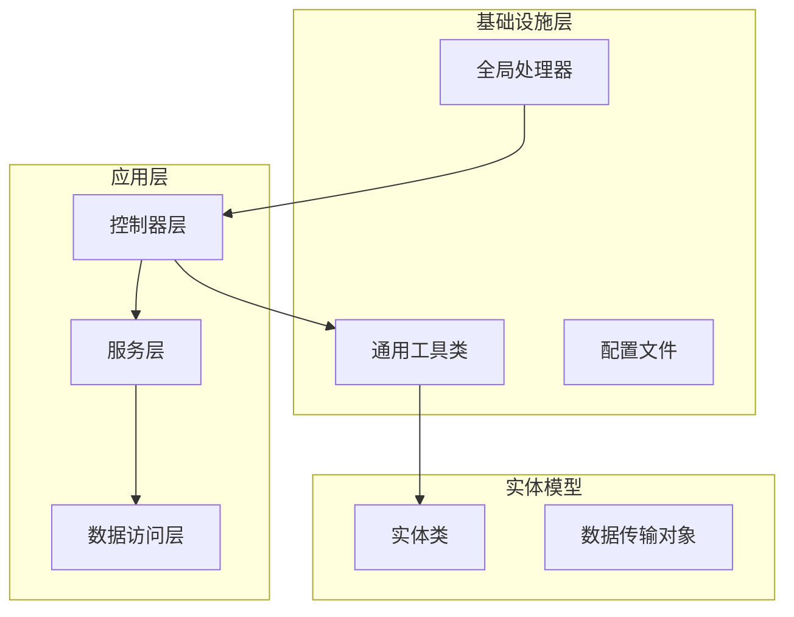
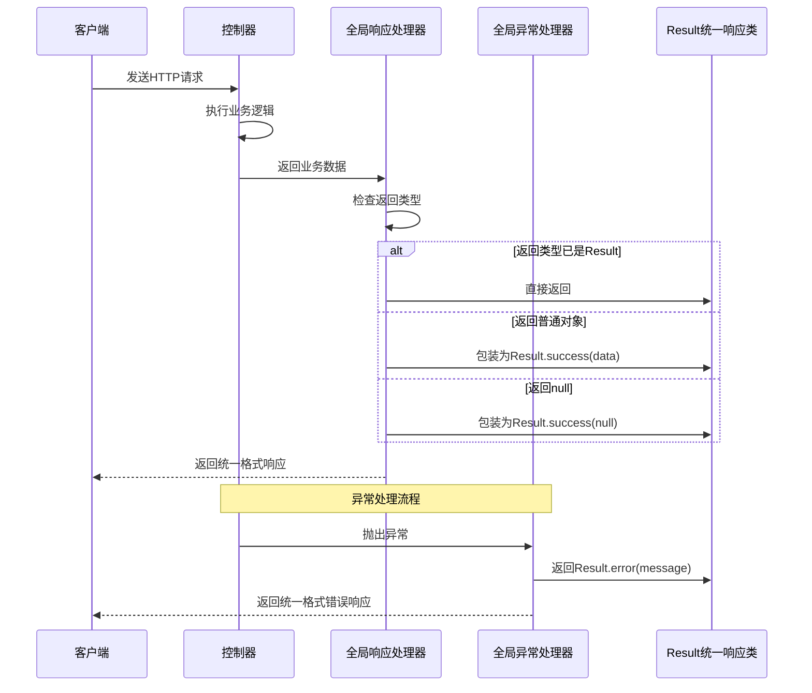
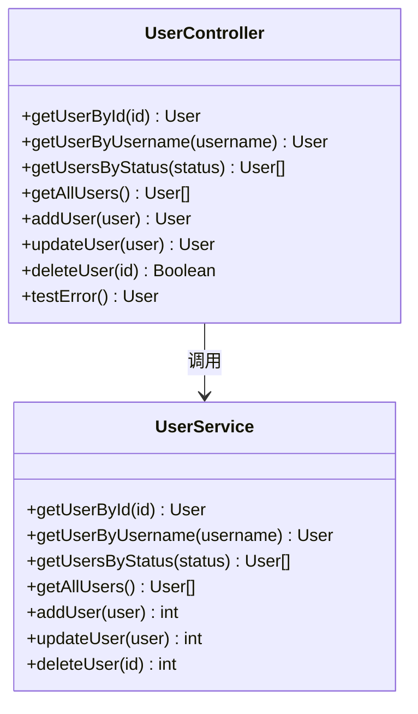
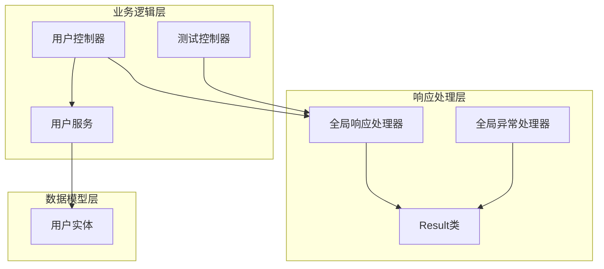

# 统一响应格式

<cite>
**本文档引用的文件**
- [Result.java](file://src/main/java/com/example/springbootmybatis/common/Result.java)
- [GlobalResponseHandler.java](file://src/main/java/com/example/springbootmybatis/advice/GlobalResponseHandler.java)
- [GlobalExceptionHandler.java](file://src/main/java/com/example/springbootmybatis/advice/GlobalExceptionHandler.java)
- [UserController.java](file://src/main/java/com/example/springbootmybatis/controller/UserController.java)
- [TestController.java](file://src/main/java/com/example/springbootmybatis/controller/TestController.java)
- [UserService.java](file://src/main/java/com/example/springbootmybatis/service/UserService.java)
- [User.java](file://src/main/java/com/example/springbootmybatis/entity/User.java)
- [application.properties](file://src/main/resources/application.properties)
- [pom.xml](file://pom.xml)
</cite>

## 目录
1. [简介](#简介)
2. [项目结构](#项目结构)
3. [核心组件](#核心组件)
4. [架构概览](#架构概览)
5. [详细组件分析](#详细组件分析)
6. [依赖关系分析](#依赖关系分析)
7. [性能考虑](#性能考虑)
8. [故障排除指南](#故障排除指南)
9. [结论](#结论)
10. [附录](#附录)

## 简介

本项目实现了统一的API响应格式，通过标准化的响应结构为所有HTTP请求提供一致的返回格式。该系统采用Spring Boot框架，结合全局响应处理器和异常处理器，确保所有接口都遵循相同的响应规范。

统一响应格式的核心设计理念是：
- **一致性**：所有接口返回相同的数据结构
- **可读性**：清晰的状态标识和消息说明
- **扩展性**：支持泛型数据载体
- **向后兼容**：保持响应格式的稳定性

## 项目结构

项目采用标准的Spring Boot目录结构，主要分为以下几个层次：



**图表来源**
- [Result.java](file://src/main/java/com/example/springbootmybatis/common/Result.java#L1-L87)
- [GlobalResponseHandler.java](file://src/main/java/com/example/springbootmybatis/advice/GlobalResponseHandler.java#L1-L39)
- [GlobalExceptionHandler.java](file://src/main/java/com/example/springbootmybatis/advice/GlobalExceptionHandler.java#L1-L22)

**章节来源**
- [application.properties](file://src/main/resources/application.properties#L1-L16)
- [pom.xml](file://pom.xml#L1-L88)

## 核心组件

### Result统一响应类

Result类是整个统一响应格式的核心，它是一个泛型类，用于封装所有API调用的响应结果。

#### 设计理念

Result类的设计遵循以下原则：
- **泛型支持**：通过泛型参数T支持任意类型的响应数据
- **序列化兼容**：实现Serializable接口，确保JSON序列化正常工作
- **静态工厂方法**：提供多种便捷的构造方式
- **时间戳追踪**：自动记录响应生成时间

#### 字段定义

| 字段名 | 类型 | 描述 | 默认值 |
|--------|------|------|--------|
| success | boolean | 操作执行状态标识 | false |
| message | String | 响应消息描述 | null |
| data | T | 泛型数据载体 | null |
| timestamp | long | 响应生成时间戳 | 当前毫秒时间 |

#### 使用规范

Result类提供了丰富的静态工厂方法：
- `success()` - 成功响应（无数据）
- `success(message)` - 成功响应（带自定义消息）
- `success(data)` - 成功响应（带数据）
- `success(message, data)` - 成功响应（带消息和数据）
- `error(message)` - 失败响应（带错误消息）
- `error(message, data)` - 失败响应（带错误消息和数据）

**章节来源**
- [Result.java](file://src/main/java/com/example/springbootmybatis/common/Result.java#L1-L87)

## 架构概览

系统采用分层架构设计，通过全局处理器实现响应格式的统一化：



**图表来源**
- [GlobalResponseHandler.java](file://src/main/java/com/example/springbootmybatis/advice/GlobalResponseHandler.java#L18-L38)
- [GlobalExceptionHandler.java](file://src/main/java/com/example/springbootmybatis/advice/GlobalExceptionHandler.java#L13-L21)

## 详细组件分析

### 全局响应处理器

GlobalResponseHandler是实现统一响应格式的关键组件，它实现了ResponseBodyAdvice接口。

#### 工作机制

处理器通过以下策略实现响应包装：

```mermaid
flowchart TD
Start([请求到达]) --> CheckType{检查返回类型}
CheckType --> |Result类型| DirectReturn[直接返回]
CheckType --> |其他类型| CheckNull{检查是否为null}
CheckNull --> |null| WrapNull[包装为Result.success(null)]
CheckNull --> |非null| WrapData[包装为Result.success(data)]
DirectReturn --> End([响应发送])
WrapNull --> End
WrapData --> End
```

**图表来源**
- [GlobalResponseHandler.java](file://src/main/java/com/example/springbootmybatis/advice/GlobalResponseHandler.java#L19-L38)

#### 处理逻辑

1. **类型检查**：首先检查返回类型是否已经是Result类型
2. **空值处理**：如果返回null，包装为成功的空数据响应
3. **数据包装**：将普通对象包装为Result.success(data)
4. **直接返回**：Result类型直接返回，避免重复包装

**章节来源**
- [GlobalResponseHandler.java](file://src/main/java/com/example/springbootmybatis/advice/GlobalResponseHandler.java#L1-L39)

### 全局异常处理器

GlobalExceptionHandler负责捕获系统中的未处理异常，并将其转换为统一的错误响应格式。

#### 异常处理策略

```mermaid
flowchart TD
Exception([异常发生]) --> CheckType{检查异常类型}
CheckType --> |Exception| GeneralError[返回通用错误]
CheckType --> |RuntimeException| RuntimeError[返回运行时错误]
GeneralError --> AddPrefix[添加"系统错误:"前缀]
RuntimeError --> AddRuntimePrefix[添加"运行时错误:"前缀]
AddPrefix --> WrapError[包装为Result.error]
AddRuntimePrefix --> WrapError
WrapError --> SendResponse[发送统一错误响应]
```

**图表来源**
- [GlobalExceptionHandler.java](file://src/main/java/com/example/springbootmybatis/advice/GlobalExceptionHandler.java#L13-L21)

#### 错误响应格式

异常处理器将所有异常转换为以下格式：
- **success**: false
- **message**: "系统错误: " + 异常消息 或 "运行时错误: " + 异常消息
- **data**: null
- **timestamp**: 当前时间戳

**章节来源**
- [GlobalExceptionHandler.java](file://src/main/java/com/example/springbootmybatis/advice/GlobalExceptionHandler.java#L1-L22)

### 控制器层响应示例

#### 用户管理控制器

UserController展示了不同类型响应的实际应用场景：



**图表来源**
- [UserController.java](file://src/main/java/com/example/springbootmybatis/controller/UserController.java#L10-L68)
- [UserService.java](file://src/main/java/com/example/springbootmybatis/service/UserService.java#L9-L42)

#### 测试控制器

TestController提供了简单的响应示例，展示了如何在控制器中直接返回数据：

**章节来源**
- [UserController.java](file://src/main/java/com/example/springbootmybatis/controller/UserController.java#L1-L68)
- [TestController.java](file://src/main/java/com/example/springbootmybatis/controller/TestController.java#L1-L66)

## 依赖关系分析

系统各组件之间的依赖关系如下：



**图表来源**
- [Result.java](file://src/main/java/com/example/springbootmybatis/common/Result.java#L1-L87)
- [GlobalResponseHandler.java](file://src/main/java/com/example/springbootmybatis/advice/GlobalResponseHandler.java#L1-L39)
- [GlobalExceptionHandler.java](file://src/main/java/com/example/springbootmybatis/advice/GlobalExceptionHandler.java#L1-L22)
- [UserController.java](file://src/main/java/com/example/springbootmybatis/controller/UserController.java#L1-L68)
- [TestController.java](file://src/main/java/com/example/springbootmybatis/controller/TestController.java#L1-L66)
- [UserService.java](file://src/main/java/com/example/springbootmybatis/service/UserService.java#L1-L42)
- [User.java](file://src/main/java/com/example/springbootmybatis/entity/User.java#L1-L21)

### 关键依赖特性

1. **循环依赖避免**：控制器不直接依赖Result类，通过全局处理器间接使用
2. **松耦合设计**：各组件通过接口和抽象类进行交互
3. **可扩展性**：新的控制器无需关心响应格式，自动由全局处理器处理

**章节来源**
- [pom.xml](file://pom.xml#L32-L67)

## 性能考虑

### 响应处理性能

全局响应处理器采用轻量级的类型检查和包装策略，对性能影响最小：

- **类型检查复杂度**：O(1) - 通过Class比较判断
- **包装操作复杂度**：O(1) - 简单的对象赋值
- **内存开销**：每个响应增加固定大小的对象头信息

### 序列化优化

Result类实现了Serializable接口，确保JSON序列化效率：
- **字段数量少**：仅4个基本字段，序列化开销小
- **类型明确**：所有字段类型明确，减少序列化歧义
- **时间戳优化**：long类型时间戳序列化效率高

## 故障排除指南

### 常见问题及解决方案

#### 1. 响应格式不符合预期

**问题现象**：某些接口返回的响应格式与统一格式不符

**可能原因**：
- 控制器直接返回了Result类型
- 控制器抛出了未捕获的异常

**解决方法**：
- 检查控制器是否直接返回Result实例
- 确认异常处理器正确配置

#### 2. 数据丢失或格式错误

**问题现象**：响应中的数据内容不正确

**可能原因**：
- 业务逻辑返回null值
- 数据类型转换错误

**解决方法**：
- 在业务层确保返回有效数据
- 检查数据映射和转换逻辑

#### 3. 异常处理失效

**问题现象**：系统异常没有被统一处理

**可能原因**：
- 全局异常处理器注解配置错误
- 异常类型不在处理范围内

**解决方法**：
- 确认@RestControllerAdvice注解正确配置
- 检查异常处理方法的签名

**章节来源**
- [GlobalResponseHandler.java](file://src/main/java/com/example/springbootmybatis/advice/GlobalResponseHandler.java#L18-L38)
- [GlobalExceptionHandler.java](file://src/main/java/com/example/springbootmybatis/advice/GlobalExceptionHandler.java#L13-L21)

## 结论

本项目成功实现了统一的API响应格式，通过以下关键特性确保了系统的稳定性和一致性：

1. **标准化响应结构**：所有接口遵循相同的响应格式
2. **自动处理机制**：通过全局处理器自动包装响应
3. **异常统一处理**：所有异常转换为标准错误格式
4. **向后兼容性**：保持响应格式的稳定性
5. **性能优化**：最小化的性能开销

这种设计模式特别适合微服务架构和API网关场景，为后续的功能扩展和维护奠定了良好的基础。

## 附录

### 响应格式规范

#### 成功响应格式
```json
{
  "success": true,
  "message": "操作成功",
  "data": {},
  "timestamp": 1640995200000
}
```

#### 失败响应格式
```json
{
  "success": false,
  "message": "系统错误: 错误详情",
  "data": null,
  "timestamp": 1640995200000
}
```

### 版本控制和兼容性

- **版本号**：0.0.1-SNAPSHOT
- **Java版本**：1.8+
- **Spring Boot版本**：2.7.18
- **向后兼容性**：保持响应格式不变，新增字段时保持默认值

### 配置参考

系统配置位于application.properties文件中，主要包含：
- 数据库连接配置
- MyBatis映射配置
- 自动驼峰命名转换

**章节来源**
- [application.properties](file://src/main/resources/application.properties#L1-L16)
- [pom.xml](file://pom.xml#L29-L31)