# 业务逻辑层设计

<cite>
**本文档引用的文件**
- [BorrowAppService.java](file://src/main/java/com/example/springbootmybatis/application/service/BorrowAppService.java)
- [UserAppService.java](file://src/main/java/com/example/springbootmybatis/application/service/UserAppService.java)
- [BorrowDTO.java](file://src/main/java/com/example/springbootmybatis/application/dto/BorrowDTO.java)
- [UserDTO.java](file://src/main/java/com/example/springbootmybatis/application/dto/UserDTO.java)
- [BorrowConvert.java](file://src/main/java/com/example/springbootmybatis/application/convert/BorrowConvert.java)
- [UserConvert.java](file://src/main/java/com/example/springbootmybatis/application/convert/UserConvert.java)
- [BorrowController.java](file://src/main/java/com/example/springbootmybatis/adapter/controller/BorrowController.java)
- [UserController.java](file://src/main/java/com/example/springbootmybatis/adapter/controller/UserController.java)
- [BorrowDomainService.java](file://src/main/java/com/example/springbootmybatis/domain/service/BorrowDomainService.java)
- [BookRepository.java](file://src/main/java/com/example/springbootmybatis/domain/support/BookRepository.java)
- [BorrowRepository.java](file://src/main/java/com/example/springbootmybatis/domain/support/BorrowRepository.java)
- [UserRepository.java](file://src/main/java/com/example/springbootmybatis/domain/support/UserRepository.java)
- [Book.java](file://src/main/java/com/example/springbootmybatis/domain/model/entity/Book.java)
- [BorrowRecord.java](file://src/main/java/com/example/springbootmybatis/domain/model/entity/BorrowRecord.java)
- [User.java](file://src/main/java/com/example/springbootmybatis/domain/model/entity/User.java)
- [GlobalExceptionHandler.java](file://src/main/java/com/example/springbootmybatis/advice/GlobalExceptionHandler.java)
- [GlobalResponseHandler.java](file://src/main/java/com/example/springbootmybatis/advice/GlobalResponseHandler.java)
- [Result.java](file://src/main/java/com/example/springbootmybatis/common/Result.java)
- [application.properties](file://src/main/resources/application.properties)
- [pom.xml](file://pom.xml)
</cite>

## 目录
1. [引言](#引言)
2. [项目结构](#项目结构)
3. [核心组件](#核心组件)
4. [架构概览](#架构概览)
5. [详细组件分析](#详细组件分析)
6. [依赖关系分析](#依赖关系分析)
7. [性能考虑](#性能考虑)
8. [故障排除指南](#故障排除指南)
9. [结论](#结论)

## 引言

本项目是一个基于Spring Boot和MyBatis的图书借阅管理系统，采用DDD（领域驱动设计）分层架构。本文档专注于应用服务层（Application Service Layer）的设计与实现，深入分析BorrowAppService和UserAppService的业务编排逻辑、流程控制、数据验证、异常处理以及事务管理等关键方面。该系统提供了完整的用户管理和图书借阅业务功能，并通过统一的响应格式和全局异常处理机制确保了良好的用户体验和系统稳定性。

## 项目结构

该项目遵循标准的Maven项目结构，采用分层架构设计，现已从传统的三层架构演进为四层架构：

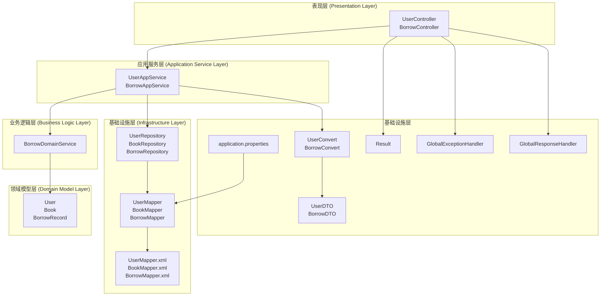

**图表来源**
- [BorrowAppService.java:22-37](file://src/main/java/com/example/springbootmybatis/application/service/BorrowAppService.java#L22-L37)
- [UserAppService.java:16-22](file://src/main/java/com/example/springbootmybatis/application/service/UserAppService.java#L16-L22)
- [BorrowController.java:18-22](file://src/main/java/com/example/springbootmybatis/adapter/controller/BorrowController.java#L18-L22)
- [UserController.java:17-18](file://src/main/java/com/example/springbootmybatis/adapter/controller/UserController.java#L17-L18)

**章节来源**
- [application.properties:1-16](file://src/main/resources/application.properties#L1-L16)
- [pom.xml:32-67](file://pom.xml#L32-L67)

## 核心组件

### 应用服务层组件

应用服务层作为业务用例的编排者，承担着协调多个领域服务和仓储操作的责任：

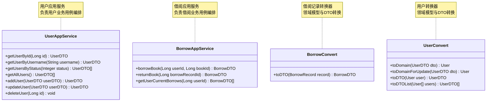

**图表来源**
- [UserAppService.java:16-82](file://src/main/java/com/example/springbootmybatis/application/service/UserAppService.java#L16-L82)
- [BorrowAppService.java:22-82](file://src/main/java/com/example/springbootmybatis/application/service/BorrowAppService.java#L22-L82)
- [BorrowConvert.java:9-26](file://src/main/java/com/example/springbootmybatis/application/convert/BorrowConvert.java#L9-L26)
- [UserConvert.java:14-87](file://src/main/java/com/example/springbootmybatis/application/convert/UserConvert.java#L14-L87)

### DTO数据传输对象

应用服务层使用专门的DTO进行跨层数据传输：

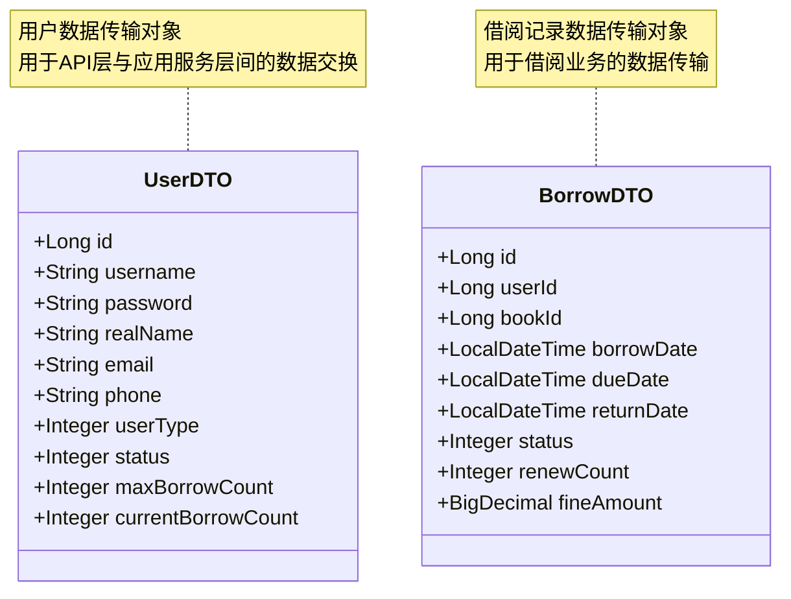

**图表来源**
- [UserDTO.java:6-98](file://src/main/java/com/example/springbootmybatis/application/dto/UserDTO.java#L6-L98)
- [BorrowDTO.java:9-47](file://src/main/java/com/example/springbootmybatis/application/dto/BorrowDTO.java#L9-L47)

**章节来源**
- [UserDTO.java:1-99](file://src/main/java/com/example/springbootmybatis/application/dto/UserDTO.java#L1-L99)
- [BorrowDTO.java:1-48](file://src/main/java/com/example/springbootmybatis/application/dto/BorrowDTO.java#L1-L48)
- [UserConvert.java:1-88](file://src/main/java/com/example/springbootmybatis/application/convert/UserConvert.java#L1-L88)
- [BorrowConvert.java:1-28](file://src/main/java/com/example/springbootmybatis/application/convert/BorrowConvert.java#L1-L28)

## 架构概览

系统采用DDD分层架构，应用服务层作为业务用例的协调者：

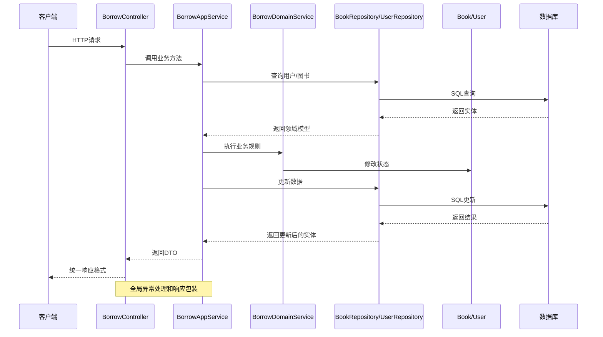

**图表来源**
- [BorrowController.java:30-44](file://src/main/java/com/example/springbootmybatis/adapter/controller/BorrowController.java#L30-L44)
- [BorrowAppService.java:42-82](file://src/main/java/com/example/springbootmybatis/application/service/BorrowAppService.java#L42-L82)
- [BorrowDomainService.java](file://src/main/java/com/example/springbootmybatis/domain/service/BorrowDomainService.java)
- [GlobalExceptionHandler.java:10-22](file://src/main/java/com/example/springbootmybatis/advice/GlobalExceptionHandler.java#L10-L22)
- [GlobalResponseHandler.java:15-39](file://src/main/java/com/example/springbootmybatis/advice/GlobalResponseHandler.java#L15-L39)

## 详细组件分析

### BorrowAppService业务编排实现

BorrowAppService作为借阅业务的核心应用服务，承担着复杂的业务编排职责：

#### 1. 借阅业务流程

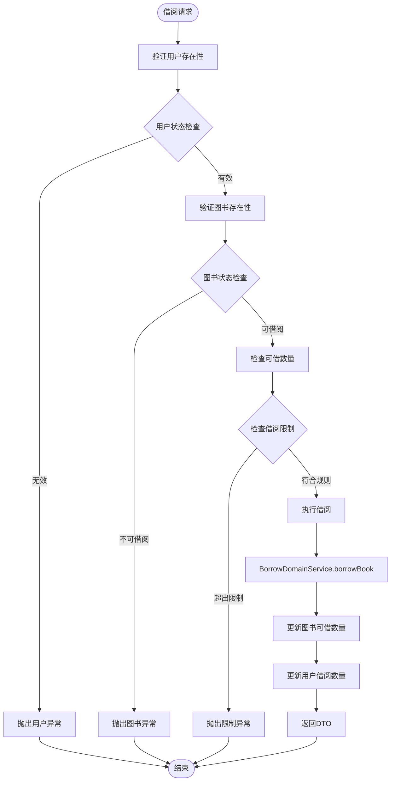

**图表来源**
- [BorrowAppService.java:42-82](file://src/main/java/com/example/springbootmybatis/application/service/BorrowAppService.java#L42-L82)

#### 2. 归还业务流程

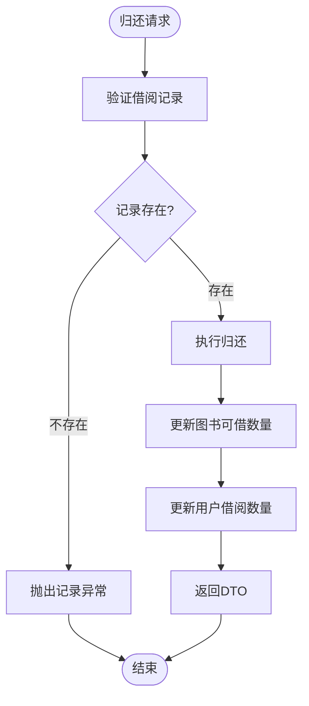

**图表来源**
- [BorrowAppService.java:87-113](file://src/main/java/com/example/springbootmybatis/application/service/BorrowAppService.java#L87-L113)

#### 3. 业务规则检查

BorrowAppService实现了严格的业务规则验证：

**用户验证规则：**
- 用户必须存在且状态正常（status = 1）
- 用户当前借阅数量不能超过最大借阅限制

**图书验证规则：**
- 图书必须存在且状态正常（status = 1）
- 图书可用数量必须大于0
- 图书必须处于可借阅状态

**事务管理：**
- 使用`@Transactional`注解确保借阅操作的原子性
- 借阅和归还操作都包含完整的事务控制

**章节来源**
- [BorrowAppService.java:1-125](file://src/main/java/com/example/springbootmybatis/application/service/BorrowAppService.java#L1-L125)

### UserAppService用户管理实现

UserAppService负责用户管理的完整业务流程：

#### 1. 用户CRUD操作

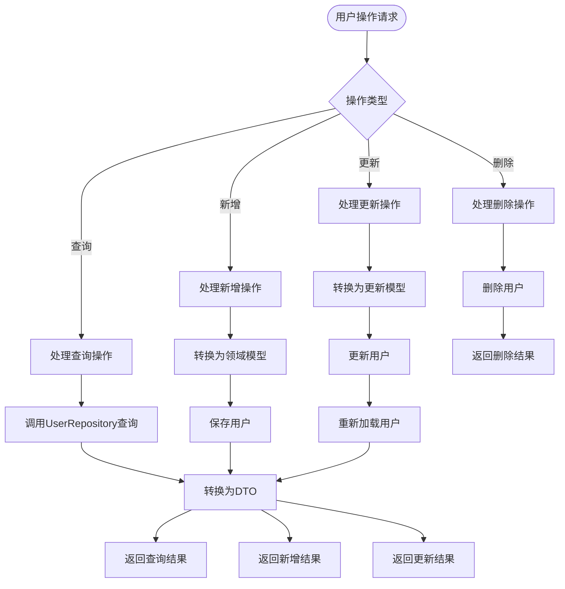

**图表来源**
- [UserAppService.java:27-81](file://src/main/java/com/example/springbootmybatis/application/service/UserAppService.java#L27-L81)

#### 2. 数据转换机制

UserAppService通过UserConvert实现DTO与领域模型的双向转换：

**新增用户转换：**
- 使用工厂方法User.create()创建新用户
- 自动填充必要的默认值

**更新用户转换：**
- 创建新的User实例并设置所有字段
- 支持部分字段更新

**章节来源**
- [UserAppService.java:1-83](file://src/main/java/com/example/springbootmybatis/application/service/UserAppService.java#L1-L83)
- [UserConvert.java:1-88](file://src/main/java/com/example/springbootmybatis/application/convert/UserConvert.java#L1-L88)

### 控制器层交互

#### 统一响应处理

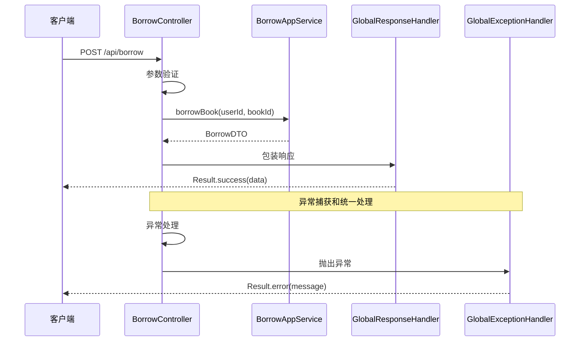

**图表来源**
- [BorrowController.java:30-44](file://src/main/java/com/example/springbootmybatis/adapter/controller/BorrowController.java#L30-L44)
- [GlobalResponseHandler.java:15-39](file://src/main/java/com/example/springbootmybatis/advice/GlobalResponseHandler.java#L15-L39)
- [GlobalExceptionHandler.java:10-22](file://src/main/java/com/example/springbootmybatis/advice/GlobalExceptionHandler.java#L10-L22)

**章节来源**
- [BorrowController.java:1-70](file://src/main/java/com/example/springbootmybatis/adapter/controller/BorrowController.java#L1-L70)
- [UserController.java:1-69](file://src/main/java/com/example/springbootmybatis/adapter/controller/UserController.java#L1-L69)

### 异常处理机制

#### 全局异常处理

系统实现了两级异常处理机制，应用服务层提供业务异常，控制器层提供统一响应包装：

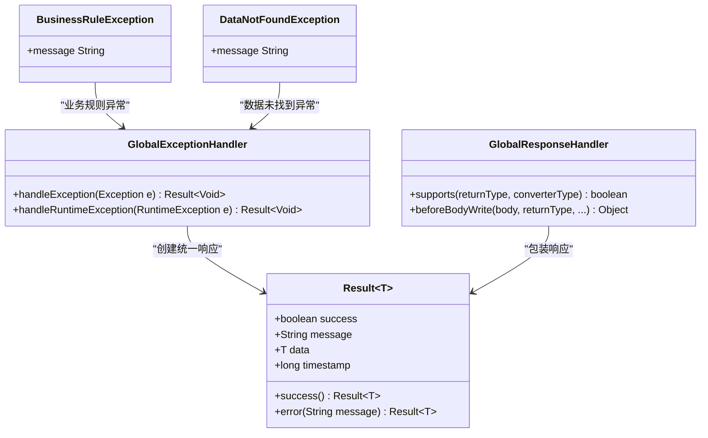

**图表来源**
- [GlobalExceptionHandler.java:10-22](file://src/main/java/com/example/springbootmybatis/advice/GlobalExceptionHandler.java#L10-L22)
- [GlobalResponseHandler.java:15-39](file://src/main/java/com/example/springbootmybatis/advice/GlobalResponseHandler.java#L15-L39)
- [Result.java:8-87](file://src/main/java/com/example/springbootmybatis/common/Result.java#L8-L87)

**章节来源**
- [GlobalExceptionHandler.java:1-22](file://src/main/java/com/example/springbootmybatis/advice/GlobalExceptionHandler.java#L1-L22)
- [GlobalResponseHandler.java:1-39](file://src/main/java/com/example/springbootmybatis/advice/GlobalResponseHandler.java#L1-L39)
- [Result.java:1-87](file://src/main/java/com/example/springbootmybatis/common/Result.java#L1-L87)

## 依赖关系分析

### 组件依赖图

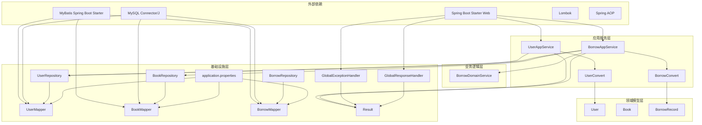

**图表来源**
- [pom.xml:32-67](file://pom.xml#L32-L67)
- [application.properties:3-15](file://src/main/resources/application.properties#L3-L15)

### 数据流分析

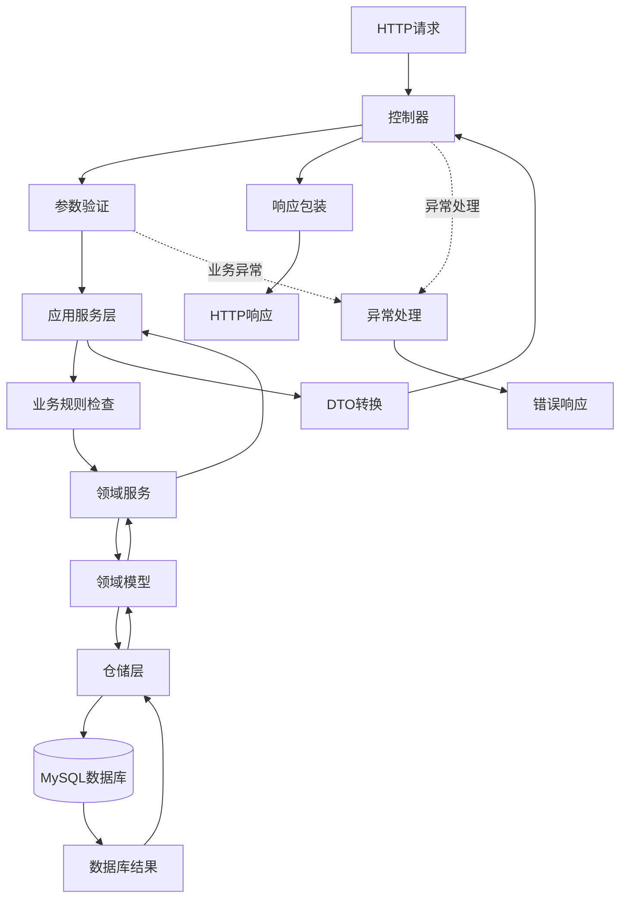

**图表来源**
- [BorrowController.java:30-44](file://src/main/java/com/example/springbootmybatis/adapter/controller/BorrowController.java#L30-L44)
- [UserAppService.java:59-63](file://src/main/java/com/example/springbootmybatis/application/service/UserAppService.java#L59-L63)

**章节来源**
- [pom.xml:32-67](file://pom.xml#L32-L67)

## 性能考虑

### 当前性能特征

基于现有代码分析，应用服务层具有以下性能特点：

**优势：**
- 清晰的分层架构，便于性能优化
- 使用Spring AOP实现声明式事务管理
- DTO转换器避免了不必要的对象创建
- 批量操作支持（列表转换）

**潜在性能瓶颈：**
- 缺少缓存机制
- 无批量操作支持
- 未实现分页查询
- 无连接池优化配置

### 性能优化建议

#### 1. 缓存策略
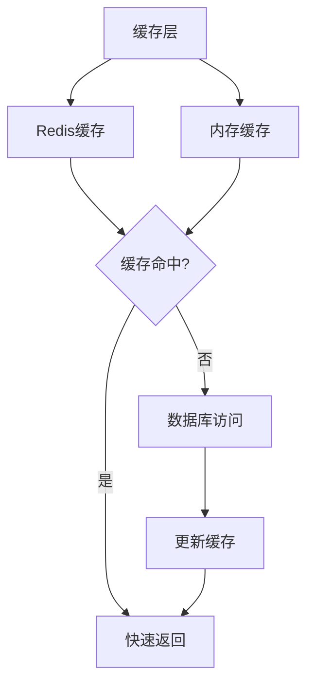

#### 2. 连接池配置
在application.properties中添加：
- `spring.datasource.hikari.maximum-pool-size=20`
- `spring.datasource.hikari.minimum-idle=5`
- `spring.datasource.hikari.connection-timeout=30000`

#### 3. 查询优化
- 实现分页查询支持
- 添加适当的索引
- 优化复杂查询语句

**章节来源**
- [application.properties:3-15](file://src/main/resources/application.properties#L3-L15)

## 故障排除指南

### 常见问题诊断

#### 1. 应用服务层异常
**症状：** 业务规则异常或数据访问异常
**排查步骤：**
1. 检查应用服务层的业务规则验证
2. 验证仓储层的数据访问
3. 确认事务管理配置
4. 查看异常日志输出

#### 2. DTO转换异常
**症状：** 对象转换失败或字段映射错误
**排查步骤：**
1. 验证DTO与领域模型的字段对应关系
2. 检查转换器的null值处理
3. 确认字段类型兼容性
4. 查看转换过程的日志

#### 3. 事务管理问题
**症状：** 数据一致性问题或事务回滚异常
**排查步骤：**
1. 检查@Transaction注解配置
2. 验证事务传播行为
3. 确认异常类型与事务回滚规则
4. 查看事务管理器配置

**章节来源**
- [GlobalExceptionHandler.java:10-22](file://src/main/java/com/example/springbootmybatis/advice/GlobalExceptionHandler.java#L10-L22)
- [GlobalResponseHandler.java:15-39](file://src/main/java/com/example/springbootmybatis/advice/GlobalResponseHandler.java#L15-L39)

### 调试技巧

1. **启用SQL日志：**
   ```properties
   logging.level.com.example.springbootmybatis.mapper=DEBUG
   ```

2. **启用异常堆栈跟踪：**
   ```properties
   debug=true
   ```

3. **使用Postman测试API：**
   - POST `/api/borrow` - 借阅图书
   - POST `/api/borrow/{id}/return` - 归还图书
   - GET `/api/borrow/user/{userId}` - 查询用户借阅列表

## 结论

本项目展现了基于DDD的现代化架构设计，应用服务层作为业务用例的编排者，提供了清晰的职责分离和良好的扩展性。BorrowAppService和UserAppService分别负责复杂的借阅业务和标准的用户管理业务，体现了应用服务层在企业级应用中的重要作用。

### 主要优点

1. **清晰的分层架构：** 应用服务层、业务逻辑层、领域模型层职责分明
2. **强大的业务编排能力：** 应用服务层能够协调多个仓储和领域服务
3. **统一的响应格式：** 通过Result类和GlobalResponseHandler确保一致的API输出
4. **完善的异常处理：** 全局异常处理器提供统一的错误响应机制
5. **灵活的数据转换：** DTO与领域模型的双向转换支持业务需求变化

### 改进建议

1. **增强业务规则：** 在应用服务层添加更详细的输入验证和业务规则检查
2. **实现事务管理：** 使用@Transactional注解确保数据一致性
3. **添加缓存机制：** 提升高频查询的性能
4. **完善异常处理：** 在应用服务层进行更细粒度的异常处理
5. **增加监控指标：** 添加性能监控和日志记录

### 扩展性设计

应用服务层为未来的业务扩展预留了充足的空间：
- 可以轻松添加新的业务用例到应用服务层
- 支持通过接口抽象实现多实现策略
- DTO转换器便于添加新的数据传输需求
- Spring Boot配置简单，便于环境切换

该设计为构建稳定、可维护、高性能的企业级应用奠定了坚实的基础。