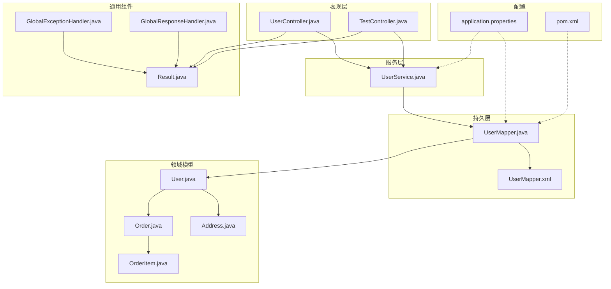
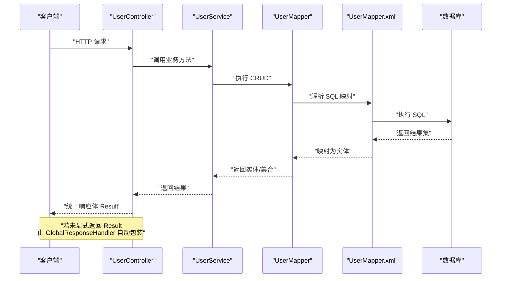
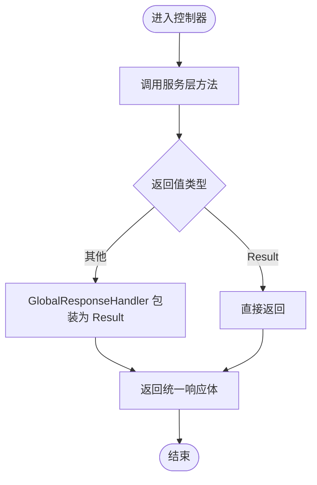
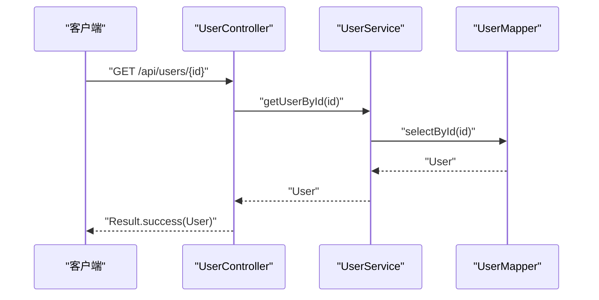
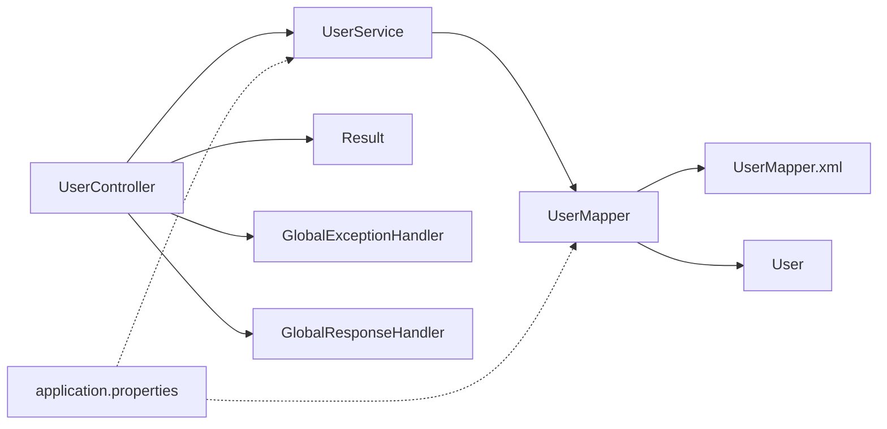

# 代码规范

<cite>
**本文引用的文件**
- [pom.xml](file://pom.xml)
- [application.properties](file://src/main/resources/application.properties)
- [User.java](file://src/main/java/com/example/springbootmybatis/entity/User.java)
- [Address.java](file://src/main/java/com/example/springbootmybatis/entity/Address.java)
- [Order.java](file://src/main/java/com/example/springbootmybatis/entity/Order.java)
- [OrderItem.java](file://src/main/java/com/example/springbootmybatis/entity/OrderItem.java)
- [UserMapper.java](file://src/main/java/com/example/springbootmybatis/mapper/UserMapper.java)
- [UserMapper.xml](file://src/main/resources/mapper/UserMapper.xml)
- [UserService.java](file://src/main/java/com/example/springbootmybatis/service/UserService.java)
- [UserController.java](file://src/main/java/com/example/springbootmybatis/controller/UserController.java)
- [TestController.java](file://src/main/java/com/example/springbootmybatis/controller/TestController.java)
- [Result.java](file://src/main/java/com/example/springbootmybatis/common/Result.java)
- [GlobalExceptionHandler.java](file://src/main/java/com/example/springbootmybatis/advice/GlobalExceptionHandler.java)
- [GlobalResponseHandler.java](file://src/main/java/com/example/springbootmybatis/advice/GlobalResponseHandler.java)
- [misc.xml](file://.idea/misc.xml)
- [compiler.xml](file://.idea/compiler.xml)
</cite>

## 目录
1. 引言
2. 项目结构
3. 核心组件
4. 架构总览
5. 详细组件分析
6. 依赖关系分析
7. 性能与可维护性建议
8. 故障排查指南
9. 结论
10. 附录：IDE配置与格式化模板

## 引言
本文件面向 Spring Boot + MyBatis 的 Java 工程，提供一套完整的代码规范与最佳实践，覆盖命名约定、注释规范、包结构与文件命名、Lombok 使用、Spring Boot 与 MyBatis 特定约定、IDE 配置与代码格式化设置，并结合仓库中现有实现给出可落地的示例路径，帮助团队统一风格、提升协作效率与代码质量。

## 项目结构
项目采用标准 Maven 多模块布局，按关注点分层组织：
- controller 层：对外暴露 REST 接口
- service 层：业务逻辑编排与事务边界
- mapper 层：MyBatis 映射接口与 XML
- entity 层：领域模型与 JSON 序列化注解
- common 层：统一响应体与工具
- advice 层：全局异常与响应包装
- resources：MyBatis XML、静态资源、配置文件

图表来源
- [UserController.java](file://src/main/java/com/example/springbootmybatis/controller/UserController.java#L1-L68)
- [TestController.java](file://src/main/java/com/example/springbootmybatis/controller/TestController.java#L1-L66)
- [UserService.java](file://src/main/java/com/example/springbootmybatis/service/UserService.java#L1-L42)
- [UserMapper.java](file://src/main/java/com/example/springbootmybatis/mapper/UserMapper.java#L1-L23)
- [UserMapper.xml](file://src/main/resources/mapper/UserMapper.xml#L1-L57)
- [User.java](file://src/main/java/com/example/springbootmybatis/entity/User.java#L1-L21)
- [Address.java](file://src/main/java/com/example/springbootmybatis/entity/Address.java#L1-L17)
- [Order.java](file://src/main/java/com/example/springbootmybatis/entity/Order.java#L1-L18)
- [OrderItem.java](file://src/main/java/com/example/springbootmybatis/entity/OrderItem.java#L1-L16)
- [Result.java](file://src/main/java/com/example/springbootmybatis/common/Result.java#L1-L87)
- [GlobalExceptionHandler.java](file://src/main/java/com/example/springbootmybatis/advice/GlobalExceptionHandler.java#L1-L22)
- [GlobalResponseHandler.java](file://src/main/java/com/example/springbootmybatis/advice/GlobalResponseHandler.java#L1-L39)
- [application.properties](file://src/main/resources/application.properties#L1-L16)
- [pom.xml](file://pom.xml#L1-L88)

章节来源
- [pom.xml](file://pom.xml#L1-L88)
- [application.properties](file://src/main/resources/application.properties#L1-L16)

## 核心组件
- 统一响应体 Result：封装 success/message/data/timestamp 字段，提供多种静态工厂方法，用于统一 API 响应格式。
- 全局异常处理 GlobalExceptionHandler：捕获 Exception 与 RuntimeException，统一返回 Result.error。
- 全局响应包装 GlobalResponseHandler：对非 Result 类型的响应进行自动包装；对 null 返回 Result.success(null)；对已为 Result 的直接透传。
- 控制器层：RESTful 接口定义，参数校验与异常抛出示例。
- 服务层：调用 Mapper 完成 CRUD，返回基础类型或实体集合。
- 持久层：Mapper 接口 + XML 映射，遵循驼峰映射配置。

章节来源
- [Result.java](file://src/main/java/com/example/springbootmybatis/common/Result.java#L1-L87)
- [GlobalExceptionHandler.java](file://src/main/java/com/example/springbootmybatis/advice/GlobalExceptionHandler.java#L1-L22)
- [GlobalResponseHandler.java](file://src/main/java/com/example/springbootmybatis/advice/GlobalResponseHandler.java#L1-L39)
- [UserController.java](file://src/main/java/com/example/springbootmybatis/controller/UserController.java#L1-L68)
- [UserService.java](file://src/main/java/com/example/springbootmybatis/service/UserService.java#L1-L42)
- [UserMapper.java](file://src/main/java/com/example/springbootmybatis/mapper/UserMapper.java#L1-L23)
- [UserMapper.xml](file://src/main/resources/mapper/UserMapper.xml#L1-L57)

## 架构总览
下图展示了从客户端到数据库的典型请求链路，以及统一响应与异常处理的横切面。

图表来源
- [UserController.java](file://src/main/java/com/example/springbootmybatis/controller/UserController.java#L1-L68)
- [UserService.java](file://src/main/java/com/example/springbootmybatis/service/UserService.java#L1-L42)
- [UserMapper.java](file://src/main/java/com/example/springbootmybatis/mapper/UserMapper.java#L1-L23)
- [UserMapper.xml](file://src/main/resources/mapper/UserMapper.xml#L1-L57)
- [GlobalResponseHandler.java](file://src/main/java/com/example/springbootmybatis/advice/GlobalResponseHandler.java#L1-L39)

## 详细组件分析

### 命名规范与代码风格
- 包名：全小写，采用反向域名，如 com.example.springbootmybatis。
- 类名：PascalCase，如 UserController、UserService、UserMapper、Result。
- 方法名：camelCase，如 getUserById、addUser、selectAll。
- 变量名：camelCase，如 userService、userMapper、id、username。
- 常量：UPPER_SNAKE_CASE，如 serialVersionUID。
- 文件名：与类名一致，如 User.java、UserMapper.java、UserMapper.xml。
- 注释：见“注释规范”章节。

章节来源
- [User.java](file://src/main/java/com/example/springbootmybatis/entity/User.java#L1-L21)
- [UserController.java](file://src/main/java/com/example/springbootmybatis/controller/UserController.java#L1-L68)
- [UserService.java](file://src/main/java/com/example/springbootmybatis/service/UserService.java#L1-L42)
- [UserMapper.java](file://src/main/java/com/example/springbootmybatis/mapper/UserMapper.java#L1-L23)
- [Result.java](file://src/main/java/com/example/springbootmybatis/common/Result.java#L1-L87)

### 注释规范
- 类注释：位于 package 语句之后、导入之前，简述职责与用途，如 Result 类注释说明“统一API响应结果类”。
- 方法注释：简要描述入参、出参与行为；对于复杂流程可补充说明前置条件与异常场景。
- 字段注释：简单说明含义；配合 JSON 注解时可标注序列化键名。
- 示例参考：
  - Result 类注释与构造方法注释
  - GlobalExceptionHandler 与 GlobalResponseHandler 的类注释
  - 实体类字段注释与 JSON 注解组合

章节来源
- [Result.java](file://src/main/java/com/example/springbootmybatis/common/Result.java#L5-L8)
- [GlobalExceptionHandler.java](file://src/main/java/com/example/springbootmybatis/advice/GlobalExceptionHandler.java#L7-L9)
- [GlobalResponseHandler.java](file://src/main/java/com/example/springbootmybatis/advice/GlobalResponseHandler.java#L12-L14)
- [User.java](file://src/main/java/com/example/springbootmybatis/entity/User.java#L3-L4)

### Lombok 使用规范
- @Data：在实体类上使用，自动生成 getter/setter/toString/equals/hashCode。
- @JsonIgnoreProperties(ignoreUnknown = true)：忽略未知属性，增强兼容性。
- @JsonProperty：显式指定 JSON 字段名，避免默认命名差异导致的不一致。
- 注意：确保 Lombok 插件在 IDE 中启用，且 Maven 编译配置包含注解处理。

章节来源
- [User.java](file://src/main/java/com/example/springbootmybatis/entity/User.java#L3-L4)
- [Address.java](file://src/main/java/com/example/springbootmybatis/entity/Address.java#L3-L9)
- [Order.java](file://src/main/java/com/example/springbootmybatis/entity/Order.java#L3-L5)
- [OrderItem.java](file://src/main/java/com/example/springbootmybatis/entity/OrderItem.java#L3-L4)
- [compiler.xml](file://.idea/compiler.xml#L4-L11)

### Spring Boot 特定约定
- 控制器：使用 @RestController 与 @RequestMapping，方法使用 @GetMapping/@PostMapping 等。
- 服务层：使用 @Service，通过 @Autowired 注入 Mapper。
- 配置：application.properties 中设置数据源、MyBatis 扫描路径、驼峰映射等。
- 全局处理：通过 @RestControllerAdvice 统一异常与响应包装。

章节来源
- [UserController.java](file://src/main/java/com/example/springbootmybatis/controller/UserController.java#L10-L11)
- [UserService.java](file://src/main/java/com/example/springbootmybatis/service/UserService.java#L9-L13)
- [application.properties](file://src/main/resources/application.properties#L3-L15)
- [GlobalExceptionHandler.java](file://src/main/java/com/example/springbootmybatis/advice/GlobalExceptionHandler.java#L10-L11)
- [GlobalResponseHandler.java](file://src/main/java/com/example/springbootmybatis/advice/GlobalResponseHandler.java#L15-L16)

### MyBatis 特定约定
- Mapper 接口：位于 mapper 包，方法名与 XML 中 id 对应。
- XML 映射：resultMap 将数据库列与实体字段映射，注意下划线到驼峰的转换已在配置中开启。
- SQL：使用 #{} 占位符，避免硬编码；插入时可使用 useGeneratedKeys/keyProperty。
- 配置：mapper-locations、type-aliases-package、map-underscore-to-camel-case。

章节来源
- [UserMapper.java](file://src/main/java/com/example/springbootmybatis/mapper/UserMapper.java#L7-L8)
- [UserMapper.xml](file://src/main/resources/mapper/UserMapper.xml#L5-L19)
- [application.properties](file://src/main/resources/application.properties#L9-L15)

### 统一响应与异常处理
- Result：提供 success/error 静态工厂方法，支持无参、仅消息、带数据三种形式；包含时间戳字段。
- GlobalResponseHandler：在返回体不是 Result 时自动包装；null 返回空数据的成功结果；已为 Result 的直接透传。
- GlobalExceptionHandler：捕获 Exception 与 RuntimeException，统一返回 Result.error。

图表来源
- [GlobalResponseHandler.java](file://src/main/java/com/example/springbootmybatis/advice/GlobalResponseHandler.java#L18-L38)
- [Result.java](file://src/main/java/com/example/springbootmybatis/common/Result.java#L31-L53)

章节来源
- [Result.java](file://src/main/java/com/example/springbootmybatis/common/Result.java#L1-L87)
- [GlobalResponseHandler.java](file://src/main/java/com/example/springbootmybatis/advice/GlobalResponseHandler.java#L1-L39)
- [GlobalExceptionHandler.java](file://src/main/java/com/example/springbootmybatis/advice/GlobalExceptionHandler.java#L1-L22)

### 控制器与服务层示例
- 控制器：定义 REST 路径与方法，调用服务层；对异常进行抛出以便全局处理。
- 服务层：调用 Mapper 完成查询/更新；返回基础类型或集合。

图表来源
- [UserController.java](file://src/main/java/com/example/springbootmybatis/controller/UserController.java#L17-L20)
- [UserService.java](file://src/main/java/com/example/springbootmybatis/service/UserService.java#L15-L17)
- [UserMapper.java](file://src/main/java/com/example/springbootmybatis/mapper/UserMapper.java#L10-L10)

章节来源
- [UserController.java](file://src/main/java/com/example/springbootmybatis/controller/UserController.java#L1-L68)
- [UserService.java](file://src/main/java/com/example/springbootmybatis/service/UserService.java#L1-L42)
- [UserMapper.java](file://src/main/java/com/example/springbootmybatis/mapper/UserMapper.java#L1-L23)

### 实体类与 JSON 映射
- 使用 @Data 自动生成访问器。
- 使用 @JsonProperty 指定 JSON 字段名，保证前后端字段一致性。
- 使用 @JsonIgnoreProperties(ignoreUnknown = true) 提升兼容性。

章节来源
- [Address.java](file://src/main/java/com/example/springbootmybatis/entity/Address.java#L3-L9)
- [Order.java](file://src/main/java/com/example/springbootmybatis/entity/Order.java#L3-L5)
- [OrderItem.java](file://src/main/java/com/example/springbootmybatis/entity/OrderItem.java#L3-L4)

## 依赖关系分析
- 控制器依赖服务层；服务层依赖 Mapper 接口；Mapper 依赖 XML 映射与实体类。
- 全局异常与响应包装横切于所有控制器之上。
- 配置文件影响 MyBatis 的 XML 扫描、类型别名与驼峰映射。

图表来源
- [UserController.java](file://src/main/java/com/example/springbootmybatis/controller/UserController.java#L1-L68)
- [UserService.java](file://src/main/java/com/example/springbootmybatis/service/UserService.java#L1-L42)
- [UserMapper.java](file://src/main/java/com/example/springbootmybatis/mapper/UserMapper.java#L1-L23)
- [UserMapper.xml](file://src/main/resources/mapper/UserMapper.xml#L1-L57)
- [Result.java](file://src/main/java/com/example/springbootmybatis/common/Result.java#L1-L87)
- [GlobalExceptionHandler.java](file://src/main/java/com/example/springbootmybatis/advice/GlobalExceptionHandler.java#L1-L22)
- [GlobalResponseHandler.java](file://src/main/java/com/example/springbootmybatis/advice/GlobalResponseHandler.java#L1-L39)
- [application.properties](file://src/main/resources/application.properties#L1-L16)

章节来源
- [pom.xml](file://pom.xml#L32-L67)
- [application.properties](file://src/main/resources/application.properties#L9-L15)

## 性能与可维护性建议
- 查询优化：尽量使用精确条件与索引字段；避免 N+1 查询，必要时使用关联查询或批量加载。
- 分页与排序：在服务层统一处理分页参数，避免在控制器层重复逻辑。
- 缓存策略：对热点读取数据引入缓存（如 Redis），降低数据库压力。
- 日志与监控：为关键业务增加日志埋点，结合链路追踪定位性能瓶颈。
- DTO/VO：复杂接口可引入 DTO/VO，减少不必要的字段传输与序列化开销。
- 单元测试：为 Service/Mapper 编写单元测试，确保核心逻辑稳定。

## 故障排查指南
- 统一异常处理：若出现未捕获异常，检查 GlobalExceptionHandler 是否生效；确认返回体被 GlobalResponseHandler 正确包装。
- 响应格式：若返回体不符合预期，检查 GlobalResponseHandler 的 supports 与 beforeBodyWrite 判定逻辑。
- 数据库连接：核对 application.properties 中的数据源 URL、用户名、密码与驱动类。
- MyBatis 映射：核对 XML 中的 namespace、id 与实体字段驼峰映射配置。

章节来源
- [GlobalExceptionHandler.java](file://src/main/java/com/example/springbootmybatis/advice/GlobalExceptionHandler.java#L13-L21)
- [GlobalResponseHandler.java](file://src/main/java/com/example/springbootmybatis/advice/GlobalResponseHandler.java#L19-L38)
- [application.properties](file://src/main/resources/application.properties#L3-L15)

## 结论
本规范以项目现有实现为基础，明确了命名、注释、包结构、Lombok 使用、Spring Boot 与 MyBatis 约定及统一响应与异常处理策略。建议团队在开发过程中严格遵循，持续改进以提升代码一致性与可维护性。

## 附录：IDE配置与格式化模板
- JDK 版本：Java 8（IDE 项目配置）
- 注解处理：启用注解处理（Lombok）与生成目录配置
- Maven 插件：spring-boot-maven-plugin，排除 Lombok
- MyBatis 配置：mapper-locations、type-aliases-package、map-underscore-to-camel-case
- 示例参考路径：
  - [IDE 项目配置](file://.idea/misc.xml#L11-L11)
  - [注解处理与 javac 参数](file://.idea/compiler.xml#L4-L17)
  - [Maven 依赖与插件](file://pom.xml#L32-L85)
  - [MyBatis 配置项](file://src/main/resources/application.properties#L9-L15)

章节来源
- [.idea/misc.xml](file://.idea/misc.xml#L11-L11)
- [.idea/compiler.xml](file://.idea/compiler.xml#L4-L17)
- [pom.xml](file://pom.xml#L32-L85)
- [application.properties](file://src/main/resources/application.properties#L9-L15)