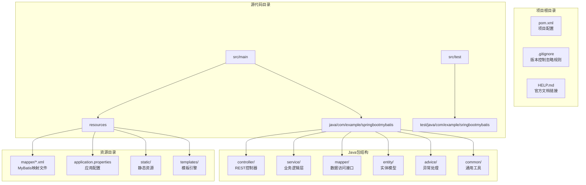
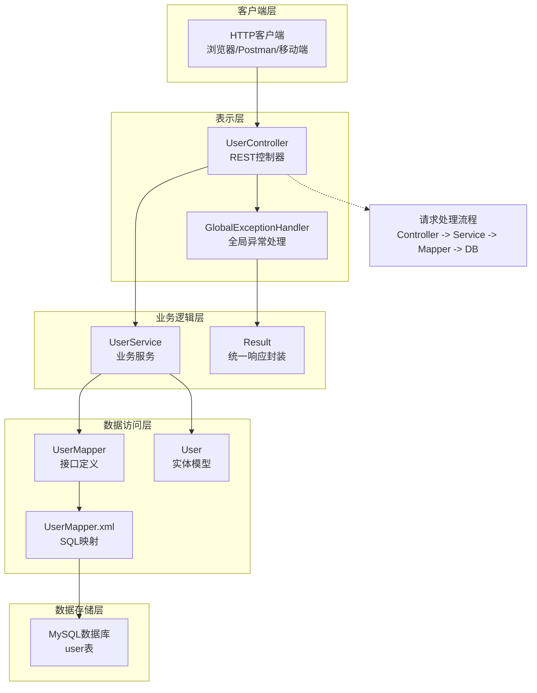
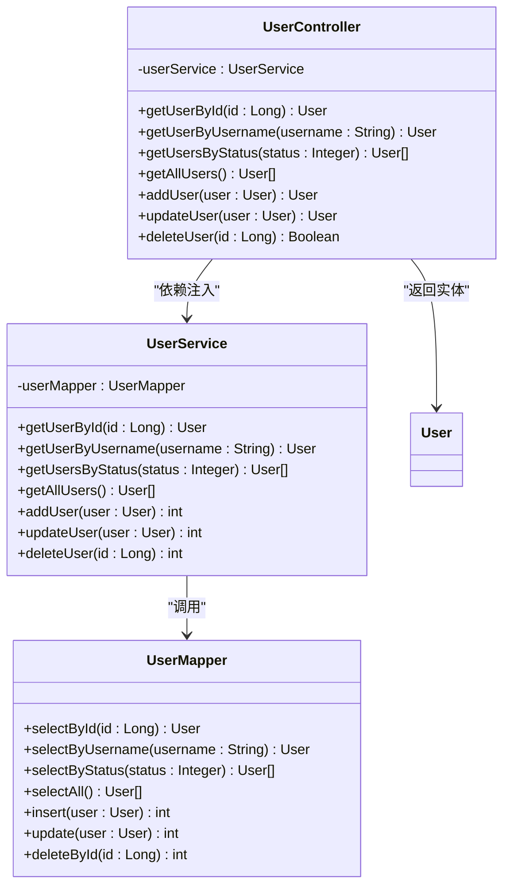
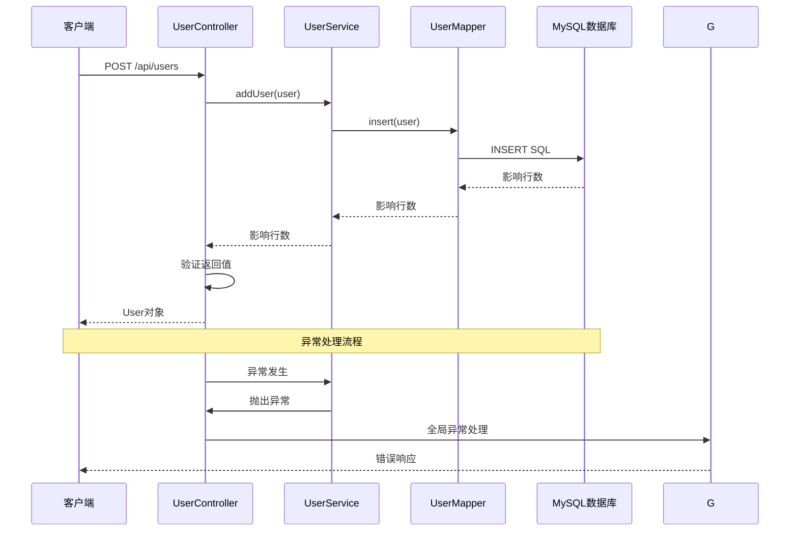
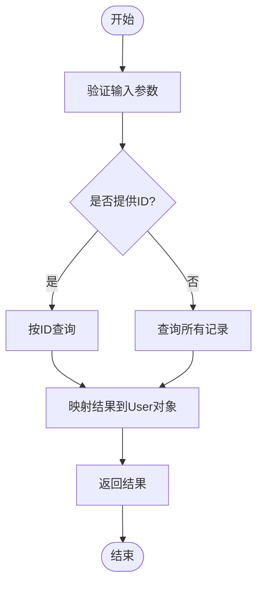
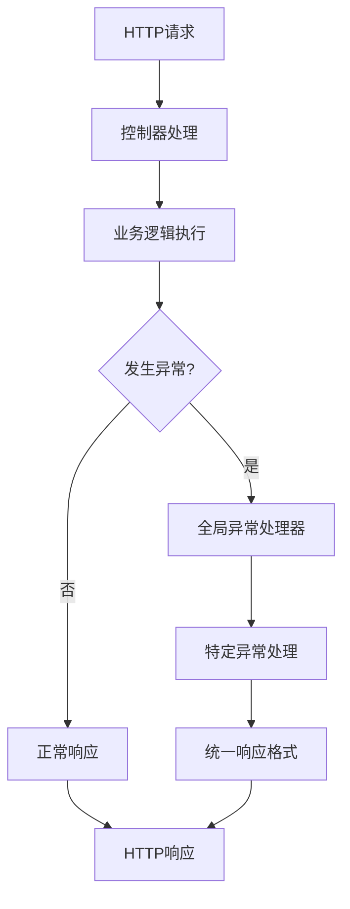
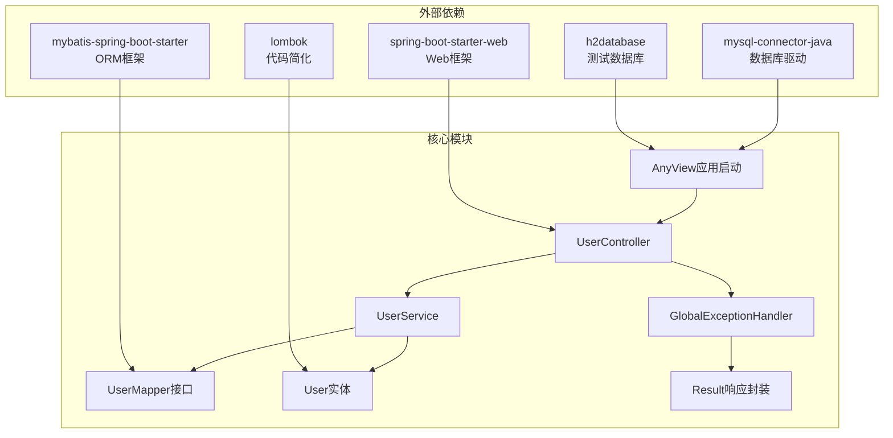

# 开发指南

<cite>
**本文档引用的文件**
- [pom.xml](file://pom.xml)
- [application.properties](file://src/main/resources/application.properties)
- [AnyView.java](file://src/main/java/com/example/springbootmybatis/AnyView.java)
- [UserController.java](file://src/main/java/com/example/springbootmybatis/controller/UserController.java)
- [UserService.java](file://src/main/java/com/example/springbootmybatis/service/UserService.java)
- [UserMapper.java](file://src/main/java/com/example/springbootmybatis/mapper/UserMapper.java)
- [UserMapper.xml](file://src/main/resources/mapper/UserMapper.xml)
- [User.java](file://src/main/java/com/example/springbootmybatis/entity/User.java)
- [GlobalExceptionHandler.java](file://src/main/java/com/example/springbootmybatis/advice/GlobalExceptionHandler.java)
- [Result.java](file://src/main/java/com/example/springbootmybatis/common/Result.java)
- [AnyViewTests.java](file://src/test/java/com/example/sringbootmybatis/AnyViewTests.java)
- [.gitignore](file://.gitignore)
- [HELP.md](file://HELP.md)
</cite>

## 目录
1. [简介](#简介)
2. [项目结构](#项目结构)
3. [核心组件](#核心组件)
4. [架构概览](#架构概览)
5. [详细组件分析](#详细组件分析)
6. [依赖关系分析](#依赖关系分析)
7. [性能考虑](#性能考虑)
8. [故障排除指南](#故障排除指南)
9. [结论](#结论)
10. [附录](#附录)

## 简介

本指南面向Spring Boot + MyBatis项目的开发者，提供从代码规范到最佳实践的全方位开发指导。该项目采用经典的三层架构模式：控制器层（Controller）、服务层（Service）和数据访问层（Mapper），通过MyBatis实现数据库持久化操作。

项目基于Spring Boot 2.7.18和Java 8构建，使用MySQL作为主数据库，并集成了全局异常处理机制和统一响应格式。整体架构简洁清晰，适合学习和扩展。

## 项目结构

项目采用标准的Maven目录结构，遵循Spring Boot约定优于配置的原则：

**图表来源**
- [pom.xml](file://pom.xml#L1-L88)
- [application.properties](file://src/main/resources/application.properties#L1-L16)

**章节来源**
- [pom.xml](file://pom.xml#L1-L88)
- [.gitignore](file://.gitignore#L1-L34)

## 核心组件

### 应用启动类

应用入口类采用标准的Spring Boot启动方式，通过注解自动扫描组件并启动嵌入式Web服务器。

### 数据库配置

项目配置了MySQL数据库连接参数，启用了驼峰命名转换，支持多环境配置切换。

### MyBatis配置

- **映射文件位置**：`classpath:mapper/*.xml`
- **类型别名包**：`com.example.springbootmybatis.entity`
- **命名转换**：下划线到驼峰的自动转换
- **Mapper扫描**：`com.example.springbootmybatis.mapper`

**章节来源**
- [AnyView.java](file://src/main/java/com/example/springbootmybatis/AnyView.java#L1-L13)
- [application.properties](file://src/main/resources/application.properties#L1-L16)

## 架构概览

项目采用经典的MVC架构模式，结合Spring Boot的自动配置特性：

**图表来源**
- [UserController.java](file://src/main/java/com/example/springbootmybatis/controller/UserController.java#L1-L68)
- [UserService.java](file://src/main/java/com/example/springbootmybatis/service/UserService.java#L1-L42)
- [UserMapper.java](file://src/main/java/com/example/springbootmybatis/mapper/UserMapper.java#L1-L23)
- [UserMapper.xml](file://src/main/resources/mapper/UserMapper.xml#L1-L57)
- [GlobalExceptionHandler.java](file://src/main/java/com/example/springbootmybatis/advice/GlobalExceptionHandler.java#L1-L22)

## 详细组件分析

### 控制器层分析

#### UserController设计模式

控制器层采用RESTful设计原则，每个端点对应一个具体的业务操作：

**图表来源**
- [UserController.java](file://src/main/java/com/example/springbootmybatis/controller/UserController.java#L1-L68)
- [UserService.java](file://src/main/java/com/example/springbootmybatis/service/UserService.java#L1-L42)
- [UserMapper.java](file://src/main/java/com/example/springbootmybatis/mapper/UserMapper.java#L1-L23)

#### API端点设计

| HTTP方法 | 端点 | 功能 | 参数 | 返回值 |
|---------|------|------|------|--------|
| GET | `/api/users/{id}` | 根据ID查询用户 | 路径参数id | User |
| GET | `/api/users/username/{username}` | 根据用户名查询 | 路径参数username | User |
| GET | `/api/users/status/{status}` | 根据状态查询 | 路径参数status | List<User> |
| GET | `/api/users/all` | 查询所有用户 | 无 | List<User> |
| POST | `/api/users` | 创建用户 | 请求体User | User |
| PUT | `/api/users` | 更新用户 | 请求体User | User |
| DELETE | `/api/users/{id}` | 删除用户 | 路径参数id | Boolean |

**章节来源**
- [UserController.java](file://src/main/java/com/example/springbootmybatis/controller/UserController.java#L1-L68)

### 服务层分析

#### UserService职责分离

服务层实现了业务逻辑的封装，确保数据访问的事务性和一致性：

**图表来源**
- [UserService.java](file://src/main/java/com/example/springbootmybatis/service/UserService.java#L1-L42)
- [UserMapper.java](file://src/main/java/com/example/springbootmybatis/mapper/UserMapper.java#L1-L23)
- [GlobalExceptionHandler.java](file://src/main/java/com/example/springbootmybatis/advice/GlobalExceptionHandler.java#L1-L22)

**章节来源**
- [UserService.java](file://src/main/java/com/example/springbootmybatis/service/UserService.java#L1-L42)

### 数据访问层分析

#### MyBatis映射配置

数据访问层采用接口+XML的映射方式，提供了完整的CRUD操作：

**图表来源**
- [UserMapper.xml](file://src/main/resources/mapper/UserMapper.xml#L21-L35)

**章节来源**
- [UserMapper.java](file://src/main/java/com/example/springbootmybatis/mapper/UserMapper.java#L1-L23)
- [UserMapper.xml](file://src/main/resources/mapper/UserMapper.xml#L1-L57)

### 实体模型分析

#### User实体设计

实体类采用Lombok简化代码生成，包含完整的字段定义和时间戳管理：

| 字段名 | 类型 | 描述 | 约束 |
|--------|------|------|------|
| id | Long | 用户唯一标识 | 主键, 自增 |
| username | String | 用户名 | 唯一, 非空 |
| password | String | 密码 | 非空 |
| realName | String | 真实姓名 | 可空 |
| email | String | 邮箱地址 | 可空 |
| phone | String | 电话号码 | 可空 |
| userType | Integer | 用户类型 | 非空 |
| status | Integer | 用户状态 | 非空 |
| maxBorrowCount | Integer | 最大借阅数量 | 非空 |
| currentBorrowCount | Integer | 当前借阅数量 | 非空 |
| createTime | LocalDateTime | 创建时间 | 非空 |
| updateTime | LocalDateTime | 更新时间 | 非空 |
| deleted | Integer | 删除标记 | 非空 |

**章节来源**
- [User.java](file://src/main/java/com/example/springbootmybatis/entity/User.java#L1-L21)

### 异常处理机制

#### 全局异常处理

项目实现了统一的异常处理机制，确保API响应的一致性：

**图表来源**
- [GlobalExceptionHandler.java](file://src/main/java/com/example/springbootmybatis/advice/GlobalExceptionHandler.java#L1-L22)
- [Result.java](file://src/main/java/com/example/springbootmybatis/common/Result.java#L1-L87)

**章节来源**
- [GlobalExceptionHandler.java](file://src/main/java/com/example/springbootmybatis/advice/GlobalExceptionHandler.java#L1-L22)
- [Result.java](file://src/main/java/com/example/springbootmybatis/common/Result.java#L1-L87)

## 依赖关系分析

项目依赖关系清晰，层次分明：

**图表来源**
- [pom.xml](file://pom.xml#L32-L67)
- [AnyView.java](file://src/main/java/com/example/springbootmybatis/AnyView.java#L1-L13)

**章节来源**
- [pom.xml](file://pom.xml#L1-L88)

## 性能考虑

### 数据库性能优化

1. **索引设计建议**
   - 为主键id建立聚簇索引
   - 为username建立唯一索引
   - 为status建立普通索引
   - 为常用查询条件建立复合索引

2. **SQL优化策略**
   - 使用具体字段而非SELECT *
   - 合理使用LIMIT限制结果集
   - 避免在WHERE子句中使用函数
   - 使用EXPLAIN分析查询计划

3. **连接池配置**
   - 设置合理的连接池大小
   - 配置连接超时时间
   - 启用连接健康检查

### 缓存策略

1. **应用层缓存**
   - 对热点数据进行缓存
   - 设置合理的过期时间
   - 实现缓存失效策略

2. **数据库缓存**
   - 利用MySQL查询缓存
   - 优化慢查询日志

### 监控指标

1. **性能监控**
   - 请求响应时间
   - 数据库连接数
   - 缓存命中率

2. **日志分析**
   - SQL执行时间
   - 异常发生频率
   - 用户行为分析

## 故障排除指南

### 常见问题诊断

#### 数据库连接问题

**症状**：应用启动失败，显示数据库连接错误

**排查步骤**：
1. 检查数据库服务状态
2. 验证连接URL配置
3. 确认用户名密码正确
4. 检查防火墙设置

#### MyBatis映射问题

**症状**：查询结果为空或字段映射错误

**排查步骤**：
1. 检查Mapper XML文件语法
2. 验证字段名称匹配
3. 确认驼峰命名转换配置
4. 查看SQL执行日志

#### 异常处理问题

**症状**：异常未被正确捕获或响应格式不正确

**排查步骤**：
1. 检查全局异常处理器配置
2. 验证异常类型映射
3. 确认响应格式序列化
4. 查看异常堆栈信息

### 调试技巧

#### IDE调试配置

1. **断点设置**
   - 在控制器方法入口设置断点
   - 在服务层关键逻辑处设置断点
   - 在Mapper接口实现处设置断点

2. **变量监控**
   - 观察请求参数绑定
   - 监控数据库查询结果
   - 跟踪异常传播过程

3. **日志分析**
   - 启用DEBUG级别日志
   - 关注SQL执行日志
   - 分析异常堆栈信息

**章节来源**
- [GlobalExceptionHandler.java](file://src/main/java/com/example/springbootmybatis/advice/GlobalExceptionHandler.java#L1-L22)

## 结论

本项目展示了Spring Boot + MyBatis的典型应用模式，具有以下特点：

1. **架构清晰**：分层明确，职责分离
2. **配置简洁**：遵循Spring Boot约定优于配置
3. **扩展性强**：易于添加新的功能模块
4. **维护友好**：代码结构规范，便于团队协作

建议在实际开发中：
- 遵循既定的代码规范和最佳实践
- 完善单元测试和集成测试
- 建立完善的监控和日志体系
- 制定详细的部署和运维流程

## 附录

### 代码规范和最佳实践

#### 命名约定

1. **包名**：全部小写，采用域名反向
2. **类名**：帕斯卡命名法，使用名词
3. **方法名**：驼峰命名法，使用动词
4. **常量**：全部大写，单词间下划线分隔
5. **变量**：驼峰命名法，避免缩写

#### 注释规范

1. **类注释**：包含类的功能描述和作者信息
2. **方法注释**：说明方法用途、参数、返回值
3. **复杂逻辑注释**：解释算法思路和关键步骤
4. **配置注释**：说明配置项的作用和取值范围

#### 代码组织原则

1. **单一职责**：每个类只负责一个功能领域
2. **开闭原则**：对扩展开放，对修改封闭
3. **依赖倒置**：面向接口编程，降低耦合度
4. **接口隔离**：接口粒度适中，避免臃肿

### 单元测试编写指南

#### 测试覆盖率要求

1. **业务逻辑**：达到80%以上
2. **关键算法**：达到100%
3. **异常处理**：覆盖主要异常场景
4. **边界条件**：验证输入边界和异常情况

#### 测试用例设计

1. **正向测试**：验证正常业务流程
2. **负向测试**：验证异常输入和边界条件
3. **集成测试**：验证模块间协作
4. **性能测试**：验证关键路径性能

### 版本控制和分支管理策略

#### Git工作流

1. **主分支**：保持稳定，用于发布
2. **开发分支**：日常开发，定期合并
3. **功能分支**：新功能开发，独立管理
4. **热修复分支**：紧急bug修复

#### 提交规范

1. **提交信息格式**：类型: 简要描述
2. **类型分类**：feat、fix、docs、style、refactor
3. **描述规范**：简洁明了，说明变更内容
4. **关联问题**：关联相关的Issue编号

### 持续集成和自动化部署

#### CI/CD流程

1. **代码提交触发**：自动运行单元测试
2. **构建阶段**：编译代码，打包应用
3. **测试阶段**：运行集成测试和性能测试
4. **部署阶段**：部署到测试环境
5. **发布阶段**：手动批准后部署到生产

#### 部署策略

1. **蓝绿部署**：零停机时间更新
2. **滚动更新**：逐步替换实例
3. **回滚机制**：快速恢复到上一个版本
4. **健康检查**：自动检测应用状态

### 数据库开发最佳实践

#### SQL优化技巧

1. **查询优化**
   - 使用合适的索引
   - 避免SELECT *
   - 合理使用LIMIT
   - 避免在WHERE中使用函数

2. **事务管理**
   - 合理设置事务边界
   - 避免长事务
   - 正确处理异常回滚
   - 优化锁竞争

3. **连接池优化**
   - 合理配置连接数
   - 设置连接超时
   - 启用连接池监控
   - 定期清理无效连接

#### 索引设计原则

1. **选择性原则**：高选择性的列优先建索引
2. **覆盖索引**：尽量让查询走索引
3. **复合索引**：按查询频率排序
4. **维护成本**：平衡查询和写入性能

### 性能分析和内存优化

#### JVM调优

1. **堆内存配置**
   - 新生代比例：3:1
   - 年老代比例：3:1
   - 永久代/元空间：合理分配

2. **垃圾回收器选择**
   - 吞吐量优先：G1GC
   - 响应时间优先：ZGC
   - 内存受限：Shenandoah

3. **监控指标**
   - GC频率和时长
   - 堆内存使用率
   - 对象晋升年龄

#### 应用性能优化

1. **缓存策略**
   - 多级缓存：本地缓存 + 分布式缓存
   - 缓存失效：LRU/LFU策略
   - 缓存预热：热点数据提前加载

2. **异步处理**
   - 异步任务：耗时操作异步化
   - 消息队列：解耦异步处理
   - 批处理：批量数据处理

### 代码重构和架构演进

#### 重构原则

1. **小步快跑**：每次重构幅度不宜过大
2. **测试先行**：重构前后都要有测试覆盖
3. **接口稳定**：对外接口保持稳定
4. **渐进式演进**：分阶段实施架构改进

#### 架构演进方向

1. **微服务化**：按业务域拆分服务
2. **事件驱动**：引入消息中间件
3. **云原生**：容器化和Kubernetes部署
4. **可观测性**：完善监控和日志体系