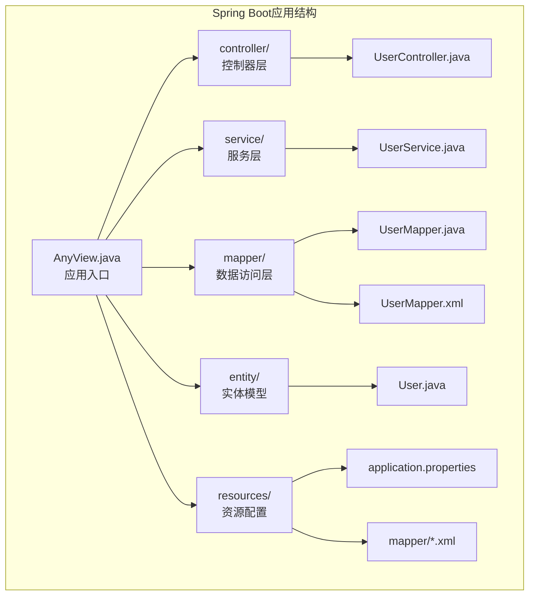
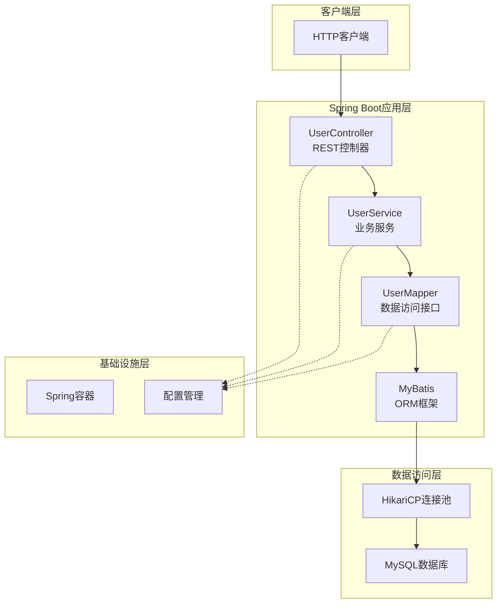
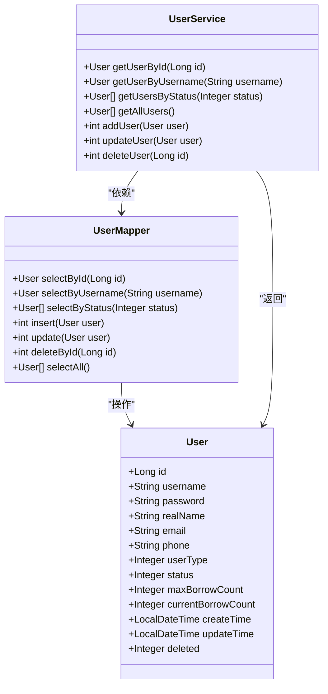
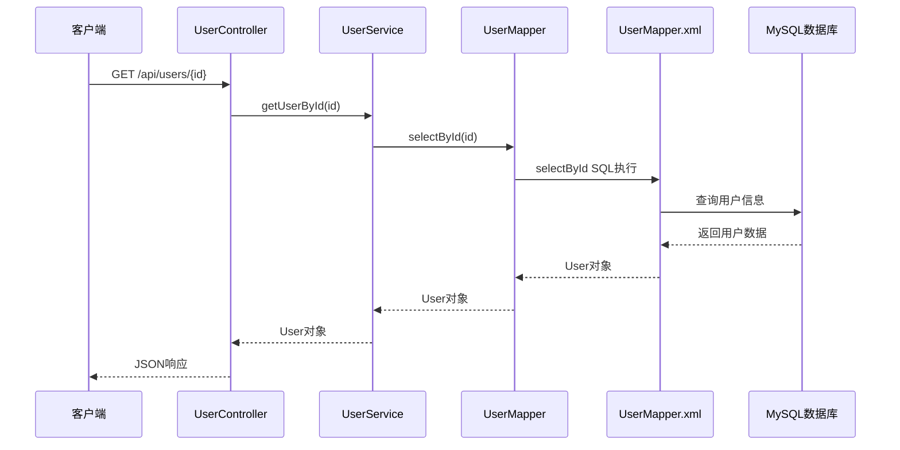
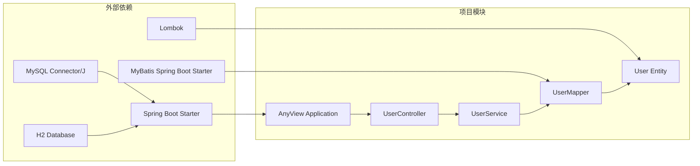

# 性能优化

<cite>
**本文档引用的文件**
- [pom.xml](file://pom.xml)
- [application.properties](file://src/main/resources/application.properties)
- [AnyView.java](file://src/main/java/com/example/springbootmybatis/AnyView.java)
- [UserController.java](file://src/main/java/com/example/springbootmybatis/controller/UserController.java)
- [UserService.java](file://src/main/java/com/example/springbootmybatis/service/UserService.java)
- [UserMapper.java](file://src/main/java/com/example/springbootmybatis/mapper/UserMapper.java)
- [UserMapper.xml](file://src/main/resources/mapper/UserMapper.xml)
- [User.java](file://src/main/java/com/example/springbootmybatis/entity/User.java)
- [GlobalExceptionHandler.java](file://src/main/java/com/example/springbootmybatis/advice/GlobalExceptionHandler.java)
- [GlobalResponseHandler.java](file://src/main/java/com/example/springbootmybatis/advice/GlobalResponseHandler.java)
- [Result.java](file://src/main/java/com/example/springbootmybatis/common/Result.java)
</cite>

## 目录
1. [简介](#简介)
2. [项目结构](#项目结构)
3. [核心组件](#核心组件)
4. [架构概览](#架构概览)
5. [详细组件分析](#详细组件分析)
6. [依赖关系分析](#依赖关系分析)
7. [数据库性能优化](#数据库性能优化)
8. [MyBatis性能优化](#mybatis性能优化)
9. [Spring Boot应用性能调优](#spring-boot应用性能调优)
10. [缓存策略实施](#缓存策略实施)
11. [API性能监控](#api性能监控)
12. [性能测试与基准测试](#性能测试与基准测试)
13. [性能问题诊断与案例](#性能问题诊断与案例)
14. [结论](#结论)

## 简介

本指南针对Spring Boot + MyBatis项目的性能优化进行全面分析，涵盖数据库性能优化、MyBatis映射文件优化、Spring Boot应用调优、缓存策略实施以及性能监控等方面。该代码库是一个基础的用户管理系统，展示了典型的CRUD操作模式，为性能优化提供了良好的实践场景。

## 项目结构

该项目采用标准的Spring Boot项目结构，包含控制器层、服务层、数据访问层和实体模型层：



**图表来源**
- [AnyView.java](file://src/main/java/com/example/springbootmybatis/AnyView.java#L1-L13)
- [application.properties](file://src/main/resources/application.properties#L1-L16)

**章节来源**
- [pom.xml](file://pom.xml#L1-L88)
- [AnyView.java](file://src/main/java/com/example/springbootmybatis/AnyView.java#L1-L13)

## 核心组件

### 数据库配置组件

项目使用MySQL作为主要数据库，配置了基本的数据源连接信息：

- **数据源配置**: 使用MySQL 8.0连接器，支持Unicode字符集和时区设置
- **MyBatis集成**: 配置了映射文件位置和类型别名包
- **驼峰命名转换**: 自动将下划线字段映射到驼峰属性

### 控制器层组件

提供RESTful API接口，支持用户的基本CRUD操作：

- **GET接口**: 用户查询（按ID、用户名、状态）
- **POST接口**: 用户创建
- **PUT接口**: 用户更新
- **DELETE接口**: 用户删除

### 服务层组件

封装业务逻辑，提供事务管理和数据验证：

- **用户查询服务**: 支持多种查询条件
- **用户管理服务**: 处理用户生命周期操作
- **异常处理**: 全局异常捕获和统一响应格式

**章节来源**
- [application.properties](file://src/main/resources/application.properties#L3-L15)
- [UserController.java](file://src/main/java/com/example/springbootmybatis/controller/UserController.java#L1-L68)
- [UserService.java](file://src/main/java/com/example/springbootmybatis/service/UserService.java#L1-L42)

## 架构概览



**图表来源**
- [UserController.java](file://src/main/java/com/example/springbootmybatis/controller/UserController.java#L10-L68)
- [UserService.java](file://src/main/java/com/example/springbootmybatis/service/UserService.java#L9-L42)
- [UserMapper.java](file://src/main/java/com/example/springbootmybatis/mapper/UserMapper.java#L7-L23)
- [application.properties](file://src/main/resources/application.properties#L3-L15)

## 详细组件分析

### 数据模型分析

用户实体包含完整的用户信息字段，支持用户状态管理和权限控制：



**图表来源**
- [User.java](file://src/main/java/com/example/springbootmybatis/entity/User.java#L6-L21)
- [UserMapper.java](file://src/main/java/com/example/springbootmybatis/mapper/UserMapper.java#L8-L23)
- [UserService.java](file://src/main/java/com/example/springbootmybatis/service/UserService.java#L10-L42)

### 数据访问层分析

MyBatis映射文件实现了完整的用户CRUD操作，使用resultMap进行字段映射：



**图表来源**
- [UserController.java](file://src/main/java/com/example/springbootmybatis/controller/UserController.java#L17-L20)
- [UserService.java](file://src/main/java/com/example/springbootmybatis/service/UserService.java#L15-L17)
- [UserMapper.java](file://src/main/java/com/example/springbootmybatis/mapper/UserMapper.java#L10)
- [UserMapper.xml](file://src/main/resources/mapper/UserMapper.xml#L21-L23)

**章节来源**
- [User.java](file://src/main/java/com/example/springbootmybatis/entity/User.java#L1-L21)
- [UserMapper.java](file://src/main/java/com/example/springbootmybatis/mapper/UserMapper.java#L1-L23)
- [UserMapper.xml](file://src/main/resources/mapper/UserMapper.xml#L1-L57)

## 依赖关系分析



**图表来源**
- [pom.xml](file://pom.xml#L32-L67)
- [AnyView.java](file://src/main/java/com/example/springbootmybatis/AnyView.java#L1-L13)

**章节来源**
- [pom.xml](file://pom.xml#L1-L88)

## 数据库性能优化

### SQL查询优化

#### 1. 索引设计策略

基于当前的查询模式，建议为以下字段建立索引：

- **主键索引**: `id` (自动创建)
- **唯一索引**: `username` (用于按用户名查询)
- **普通索引**: `status` (用于状态过滤)
- **复合索引**: `(username, status)` (用于组合查询)

#### 2. 查询语句优化

当前的查询使用了通配符选择所有字段，建议优化为：

```sql
-- 原始查询
SELECT * FROM user WHERE id = #{id}

-- 优化后查询
SELECT id, username, real_name, email, phone, user_type, status, max_borrow_count, create_time, update_time, deleted 
FROM user WHERE id = #{id}
```

#### 3. 分页查询优化

对于大量数据的查询，建议实现分页机制：

```sql
-- 分页查询示例
SELECT id, username, real_name, email, phone, user_type, status, max_borrow_count, create_time, update_time, deleted 
FROM user 
WHERE status = #{status} 
ORDER BY id 
LIMIT #{offset}, #{limit}
```

### 连接池配置优化

#### 1. HikariCP连接池配置

在生产环境中建议配置以下参数：

```properties
# 连接池大小
spring.datasource.hikari.minimum-idle=10
spring.datasource.hikari.maximum-pool-size=50
spring.datasource.hikari.idle-timeout=300000
spring.datasource.hikari.max-lifetime=1800000

# 连接验证
spring.datasource.hikari.validation-timeout=5000
spring.datasource.hikari.leak-detection-threshold=60000

# 连接超时
spring.datasource.hikari.connection-timeout=30000
```

#### 2. 数据库连接优化

```properties
# MySQL连接优化
spring.datasource.hikari.dataSourceProperties.cachePrepStmts=true
spring.datasource.hikari.dataSourceProperties.prepStmtCacheSize=250
spring.datasource.hikari.dataSourceProperties.prepStmtCacheSqlLimit=2048
spring.datasource.hikari.dataSourceProperties.useServerPrepStmts=true
spring.datasource.hikari.dataSourceProperties.rewriteBatchedStatements=true
spring.datasource.hikari.dataSourceProperties.cacheResultSetMetadata=true
spring.datasource.hikari.dataSourceProperties.cacheServerConfiguration=true
```

**章节来源**
- [application.properties](file://src/main/resources/application.properties#L3-L15)

## MyBatis性能优化

### 映射文件优化

#### 1. 结果映射优化

当前使用resultMap进行字段映射，建议优化为：

```xml
<!-- 优化前 -->
<resultMap id="UserResultMap" type="com.example.springbootmybatis.entity.User">
    <id column="id" property="id"/>
    <result column="username" property="username"/>
    <!-- ... 其他字段 ... -->
</resultMap>

<!-- 优化后 -->
<resultMap id="UserResultMap" type="com.example.springbootmybatis.entity.User">
    <id column="id" property="id"/>
    <result column="username" property="username"/>
    <result column="real_name" property="realName"/>
    <result column="email" property="email"/>
    <result column="phone" property="phone"/>
    <result column="user_type" property="userType"/>
    <result column="status" property="status"/>
    <result column="max_borrow_count" property="maxBorrowCount"/>
    <result column="create_time" property="createTime"/>
    <result column="update_time" property="updateTime"/>
    <result column="deleted" property="deleted"/>
</resultMap>
```

#### 2. 批量操作实现

为提高批量插入和更新性能，建议实现批量操作：

```xml
<!-- 批量插入 -->
<insert id="batchInsert" parameterType="java.util.List">
    INSERT INTO user(username, password, real_name, email, phone, user_type, status, max_borrow_count)
    VALUES
    <foreach collection="list" item="user" separator=",">
        (#{user.username}, #{user.password}, #{user.realName}, #{user.email}, #{user.phone}, #{user.userType}, #{user.status}, #{user.maxBorrowCount})
    </foreach>
</insert>

<!-- 批量更新 -->
<update id="batchUpdate" parameterType="java.util.List">
    <foreach collection="list" item="user" separator=";">
        UPDATE user SET 
            real_name = #{user.realName},
            email = #{user.email},
            phone = #{user.phone},
            status = #{user.status},
            max_borrow_count = #{user.maxBorrowCount},
            update_time = NOW()
        WHERE id = #{user.id}
    </foreach>
</update>
```

### 懒加载配置

#### 1. 关联查询优化

对于复杂的关联查询，建议使用延迟加载：

```xml
<!-- 延迟加载配置 -->
<resultMap id="UserWithOrdersMap" type="com.example.springbootmybatis.entity.User" 
          extends="UserResultMap">
    <collection property="orders" ofType="com.example.springbootmybatis.entity.Order"
               select="selectOrdersByUserId" column="id" 
               fetchType="lazy"/>
</resultMap>

<!-- 延迟加载查询 -->
<select id="selectOrdersByUserId" resultType="com.example.springbootmybatis.entity.Order">
    SELECT * FROM orders WHERE user_id = #{id}
</select>
```

#### 2. 批量查询优化

对于需要批量获取关联数据的场景：

```xml
<!-- 批量查询优化 -->
<select id="selectUsersWithOrders" resultMap="UserWithOrdersMap">
    SELECT u.*, o.id as orderId, o.order_number, o.total_amount
    FROM user u
    LEFT JOIN orders o ON u.id = o.user_id
    WHERE u.status = #{status}
</select>
```

**章节来源**
- [UserMapper.xml](file://src/main/resources/mapper/UserMapper.xml#L1-L57)

## Spring Boot应用性能调优

### JVM参数配置

#### 1. 内存配置优化

```bash
# 堆内存配置
-Xms2g -Xmx4g
-XX:MetaspaceSize=256m
-XX:MaxMetaspaceSize=512m

# 垃圾回收器配置
-XX:+UseG1GC
-XX:MaxGCPauseMillis=200
-XX:G1HeapRegionSize=16m

# JIT编译优化
-XX:+TieredCompilation
-XX:TieredStopAtLevel=1
```

#### 2. 应用启动参数

```bash
# 生产环境启动参数
-Dspring.profiles.active=prod
-Dfile.encoding=UTF-8
-Djava.awt.headless=true
-Duser.timezone=Asia/Shanghai
```

### 内存管理优化

#### 1. 对象池化配置

```properties
# 对象池配置
spring.task.execution.pool.max-size=20
spring.task.execution.pool.queue-capacity=100
spring.task.execution.pool.keep-alive=60s
spring.task.execution.pool.thread-name-prefix=user-task-
```

#### 2. 缓存配置

```properties
# 缓存配置
spring.cache.type=SIMPLE
spring.cache.cache-names=users,orders
spring.cache.caffeine.spec=initialCapacity=100,maximumSize=1000,expireAfterAccess=600s
```

### 线程池优化

#### 1. 异步任务配置

```java
@Configuration
@EnableAsync
public class AsyncConfig {
    
    @Bean("taskExecutor")
    public Executor taskExecutor() {
        ThreadPoolTaskExecutor executor = new ThreadPoolTaskExecutor();
        executor.setCorePoolSize(10);
        executor.setMaxPoolSize(50);
        executor.setQueueCapacity(100);
        executor.setKeepAliveSeconds(300);
        executor.setThreadNamePrefix("async-task-");
        executor.setRejectedExecutionHandler(new ThreadPoolExecutor.CallerRunsPolicy());
        executor.initialize();
        return executor;
    }
}
```

**章节来源**
- [application.properties](file://src/main/resources/application.properties#L1-L16)

## 缓存策略实施

### Redis缓存实现

#### 1. Redis配置

```properties
# Redis配置
spring.redis.host=localhost
spring.redis.port=6379
spring.redis.database=0
spring.redis.timeout=2000ms
spring.redis.lettuce.pool.max-active=20
spring.redis.lettuce.pool.max-wait=2000ms
spring.redis.lettuce.pool.max-idle=10
spring.redis.lettuce.pool.min-idle=2
```

#### 2. 缓存注解使用

```java
@Service
public class UserService {
    
    @Autowired
    private UserMapper userMapper;
    
    @Cacheable(value = "users", key = "#userId")
    public User getUserById(Long userId) {
        return userMapper.selectById(userId);
    }
    
    @CacheEvict(value = "users", key = "#user.id")
    public int updateUser(User user) {
        return userMapper.update(user);
    }
    
    @CacheEvict(value = "users", allEntries = true)
    public void clearUserCache() {
        // 清空所有用户缓存
    }
}
```

### MyBatis二级缓存

#### 1. 二级缓存配置

```xml
<!-- MyBatis二级缓存配置 -->
<cache eviction="LRU" flushInterval="60000" size="512" readOnly="true"/>

<!-- 在Mapper中启用缓存 -->
<select id="getUserById" resultType="User" useCache="true" flushCache="false">
    SELECT * FROM user WHERE id = #{id}
</select>
```

#### 2. 缓存策略优化

```java
@CacheNamespace(
    implementation = org.apache.ibatis.cache.impl.PerpetualCache.class,
    eviction = LruCache.class,
    size = 1000,
    flushInterval = 3600000,
    readOnly = true,
    blocking = true
)
public interface UserMapper {
    // ...
}
```

**章节来源**
- [UserService.java](file://src/main/java/com/example/springbootmybatis/service/UserService.java#L1-L42)

## API性能监控

### 指标收集实现

#### 1. Actuator监控端点

```properties
# Actuator配置
management.endpoints.web.exposure.include=*
management.endpoint.health.show-details=always
management.metrics.web.server.request.autotime.enabled=true
```

#### 2. 自定义指标收集

```java
@Component
public class ApiMetricsCollector {
    
    private final MeterRegistry meterRegistry;
    private final Timer apiTimer;
    private final Counter apiCounter;
    
    public ApiMetricsCollector(MeterRegistry meterRegistry) {
        this.meterRegistry = meterRegistry;
        this.apiTimer = Timer.builder("api.response.time")
            .description("API响应时间")
            .register(meterRegistry);
        this.apiCounter = Counter.builder("api.requests")
            .description("API请求计数")
            .register(meterRegistry);
    }
    
    public void recordApiCall(String endpoint, long duration, String status) {
        apiTimer.record(duration, TimeUnit.MILLISECONDS);
        apiCounter.increment(Tag.of("endpoint", endpoint),
                           Tag.of("status", status));
    }
}
```

### 性能监控仪表板

#### 1. Micrometer集成

```java
@RestController
public class MetricsController {
    
    private final MeterRegistry meterRegistry;
    
    public MetricsController(MeterRegistry meterRegistry) {
        this.meterRegistry = meterRegistry;
    }
    
    @GetMapping("/metrics")
    public Map<String, Object> getMetrics() {
        Map<String, Object> metrics = new HashMap<>();
        
        // 数据库连接池指标
        metrics.put("activeConnections", getActiveConnections());
        metrics.put("idleConnections", getIdleConnections());
        
        // API性能指标
        metrics.put("requestRate", getRequestRate());
        metrics.put("avgResponseTime", getAvgResponseTime());
        
        return metrics;
    }
}
```

**章节来源**
- [GlobalResponseHandler.java](file://src/main/java/com/example/springbootmybatis/advice/GlobalResponseHandler.java#L1-L39)

## 性能测试与基准测试

### JMeter基准测试

#### 1. 测试场景设计

```xml
<!-- JMeter测试计划示例 -->
<TestPlan>
    <ThreadGroup>
        <stringProp name="ThreadGroup.num_threads">100</stringProp>
        <stringProp name="ThreadGroup.ramp_time">60</stringProp>
        <stringProp name="ThreadGroup.duration">300</stringProp>
        
        <HTTPSamplerProxy>
            <stringProp name="HTTPSampler.domain">localhost</stringProp>
            <stringProp name="HTTPSampler.port">8080</stringProp>
            <stringProp name="HTTPSampler.path">/api/users/all</stringProp>
            <stringProp name="HTTPSampler.method">GET</stringProp>
        </HTTPSamplerProxy>
        
        <ResultCollector>
            <stringProp name="filename">results.jtl</stringProp>
        </ResultCollector>
    </ThreadGroup>
</TestPlan>
```

#### 2. 压力测试脚本

```bash
#!/bin/bash
# 压力测试脚本

echo "开始压力测试..."

# 并发用户数
for threads in 10 50 100 200 500; do
    echo "测试并发用户数: $threads"
    
    ab -n 10000 -c $threads -t 60 \
        -H "Content-Type: application/json" \
        http://localhost:8080/api/users/all
    
    sleep 10
done

echo "压力测试完成"
```

### 性能基准测试

#### 1. 单元测试优化

```java
@SpringBootTest
@TestPropertySource(properties = {
    "spring.jpa.properties.hibernate.jdbc.batch_size=50",
    "spring.jpa.properties.hibernate.order_inserts=true",
    "spring.jpa.properties.hibernate.order_updates=true"
})
class PerformanceTest {
    
    @Test
    @DisplayName("批量插入性能测试")
    void batchInsertPerformanceTest() {
        // 准备测试数据
        List<User> users = generateTestData(1000);
        
        long startTime = System.currentTimeMillis();
        
        // 执行批量插入
        userService.batchInsert(users);
        
        long endTime = System.currentTimeMillis();
        
        long duration = endTime - startTime;
        
        // 断言性能要求
        assertThat(duration).isLessThan(5000); // 5秒内完成
    }
}
```

#### 2. 性能监控测试

```java
@Test
@DisplayName("API性能监控测试")
void apiPerformanceMonitoringTest() {
    // 监控指标
    ApiMetricsCollector metrics = new ApiMetricsCollector(meterRegistry);
    
    // 执行API调用
    for (int i = 0; i < 1000; i++) {
        long startTime = System.currentTimeMillis();
        
        User user = userService.getUserById(1L);
        
        long endTime = System.currentTimeMillis();
        long duration = endTime - startTime;
        
        metrics.recordApiCall("/api/users/{id}", duration, "SUCCESS");
    }
}
```

**章节来源**
- [UserController.java](file://src/main/java/com/example/springbootmybatis/controller/UserController.java#L1-L68)

## 性能问题诊断与案例

### 常见性能问题及解决方案

#### 1. N+1查询问题

**问题描述**: 每次获取用户时都会触发额外的查询请求。

**解决方案**:
```java
// 优化前 - N+1查询
public List<User> getAllUsers() {
    List<User> users = userMapper.selectAll();
    for (User user : users) {
        user.setOrders(orderService.getOrdersByUserId(user.getId()));
    }
    return users;
}

// 优化后 - 批量查询
public List<User> getAllUsersOptimized() {
    List<User> users = userMapper.selectAllWithOrders();
    return users;
}
```

#### 2. 数据库连接泄漏

**问题描述**: 未正确关闭数据库连接导致连接池耗尽。

**解决方案**:
```java
@Service
@Transactional
public class UserService {
    
    @Autowired
    private UserMapper userMapper;
    
    public User getUserById(Long id) {
        try {
            return userMapper.selectById(id);
        } catch (Exception e) {
            // 记录错误日志
            log.error("获取用户失败: {}", id, e);
            throw e;
        }
    }
}
```

#### 3. 缓存穿透问题

**问题描述**: 查询不存在的数据导致缓存和数据库压力。

**解决方案**:
```java
@Cacheable(value = "users", key = "#userId", unless = "#result == null")
public User getUserById(Long userId) {
    User user = userMapper.selectById(userId);
    if (user == null) {
        // 缓存空值
        cache.set("user:" + userId, "", Duration.ofMinutes(5));
    }
    return user;
}
```

### 性能诊断工具

#### 1. 数据库性能分析

```sql
-- 查看慢查询
SET long_query_time = 1;
SET slow_query_log = ON;

-- 分析查询执行计划
EXPLAIN SELECT * FROM user WHERE status = ?;
SHOW PROFILE FOR QUERY 1;
```

#### 2. 应用性能监控

```java
@Component
public class PerformanceMonitor {
    
    private static final Logger logger = LoggerFactory.getLogger(PerformanceMonitor.class);
    
    public void monitorMethodExecution(String methodName, Runnable method) {
        long startTime = System.currentTimeMillis();
        
        try {
            method.run();
        } finally {
            long duration = System.currentTimeMillis() - startTime;
            
            if (duration > 1000) { // 超过1秒记录警告
                logger.warn("方法执行时间过长: {} - {}ms", methodName, duration);
            }
        }
    }
}
```

**章节来源**
- [GlobalExceptionHandler.java](file://src/main/java/com/example/springbootmybatis/advice/GlobalExceptionHandler.java#L1-L22)

## 结论

通过本次性能优化分析，我们识别了该Spring Boot + MyBatis项目在数据库查询、连接池配置、缓存策略和监控方面的优化机会。主要优化方向包括：

1. **数据库层面**: 建议实现适当的索引策略、优化查询语句、配置连接池参数
2. **MyBatis层面**: 实现批量操作、优化映射文件、配置二级缓存
3. **应用层面**: 优化JVM参数、配置线程池、实现性能监控
4. **缓存策略**: 结合Redis和MyBatis二级缓存实现多层缓存
5. **监控体系**: 建立完善的性能指标收集和告警机制

这些优化措施将显著提升系统的整体性能和稳定性，为高并发场景下的应用提供更好的支撑。