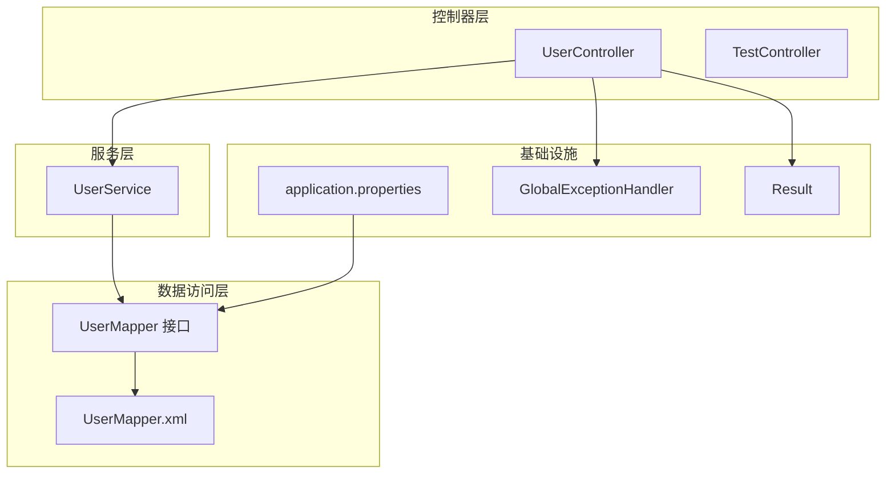
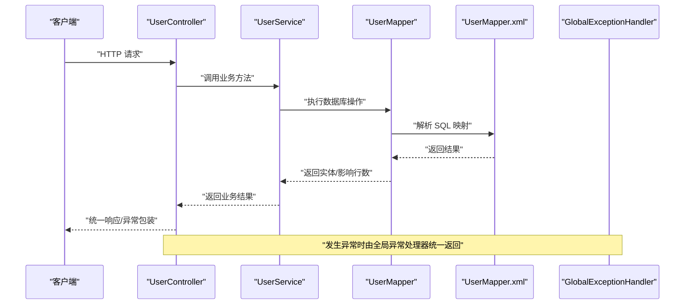
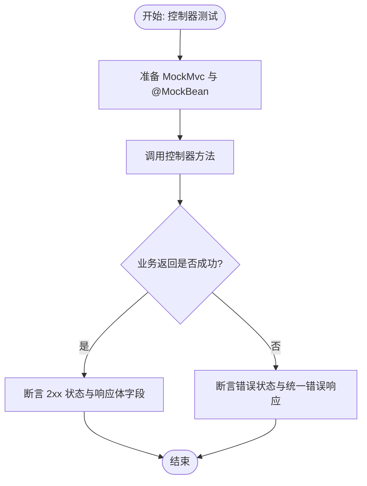
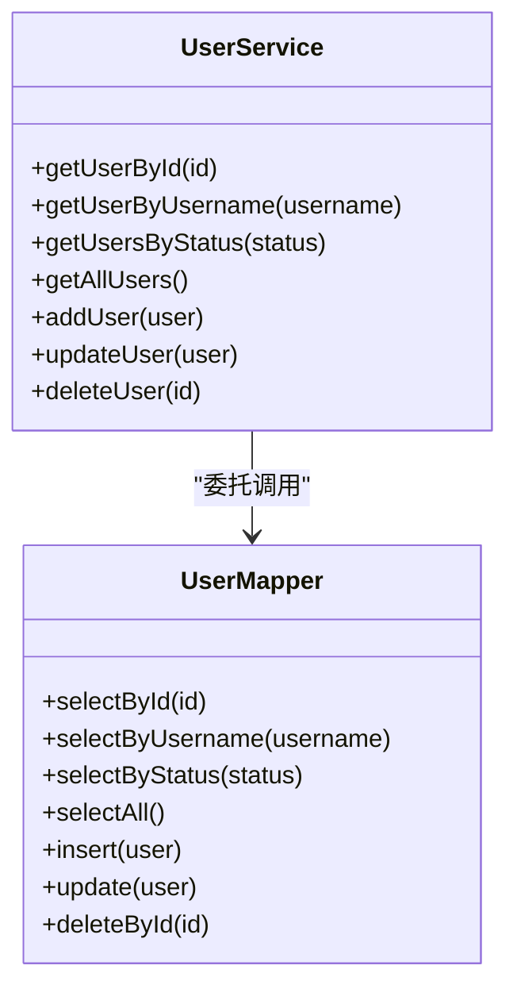
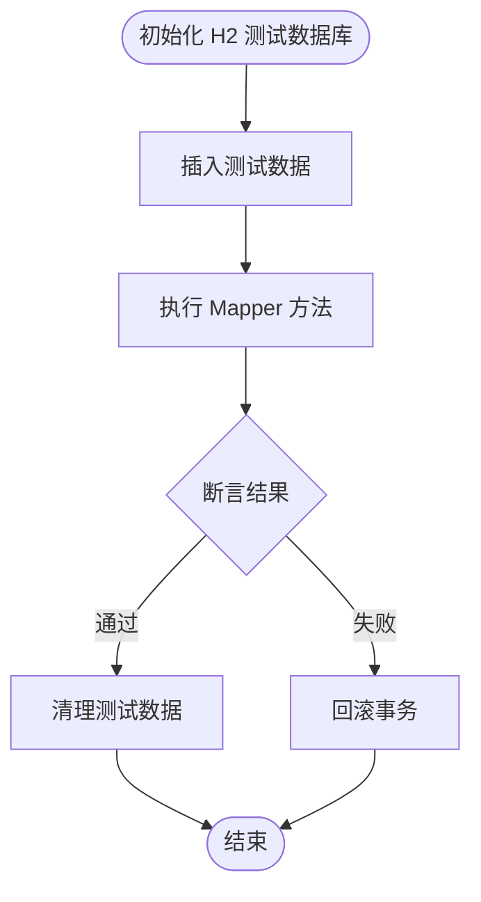
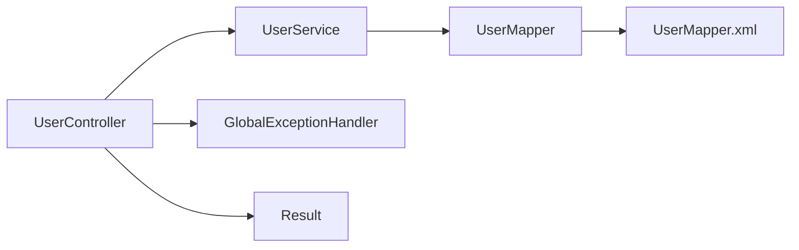

# 测试策略

<cite>
**本文引用的文件**
- [pom.xml](file://pom.xml)
- [application.properties](file://src/main/resources/application.properties)
- [User.java](file://src/main/java/com/example/springbootmybatis/entity/User.java)
- [UserController.java](file://src/main/java/com/example/springbootmybatis/controller/UserController.java)
- [UserService.java](file://src/main/java/com/example/springbootmybatis/service/UserService.java)
- [UserMapper.java](file://src/main/java/com/example/springbootmybatis/mapper/UserMapper.java)
- [UserMapper.xml](file://src/main/resources/mapper/UserMapper.xml)
- [GlobalExceptionHandler.java](file://src/main/java/com/example/springbootmybatis/advice/GlobalExceptionHandler.java)
- [Result.java](file://src/main/java/com/example/springbootmybatis/common/Result.java)
- [TestController.java](file://src/main/java/com/example/springbootmybatis/controller/TestController.java)
- [AnyViewTests.java](file://src/test/java/com/example/sringbootmybatis/AnyViewTests.java)
</cite>

## 目录
1. [引言](#引言)
2. [项目结构](#项目结构)
3. [核心组件](#核心组件)
4. [架构总览](#架构总览)
5. [详细组件分析](#详细组件分析)
6. [依赖关系分析](#依赖关系分析)
7. [性能考量](#性能考量)
8. [故障排查指南](#故障排查指南)
9. [结论](#结论)
10. [附录](#附录)

## 引言
本测试策略面向一个基于 Spring Boot 与 MyBatis 的示例工程，目标是建立覆盖控制器层、服务层与数据访问层的完整测试体系，涵盖单元测试、集成测试与端到端测试的设计原则与最佳实践。文档同时给出测试数据准备与清理策略、测试覆盖率要求与测量方法、测试环境配置与数据库回滚机制，并通过图示展示典型流程与类关系，帮助开发者在不直接阅读源码的情况下快速理解与实施。

## 项目结构
该项目采用典型的分层架构：控制器层负责对外接口；服务层封装业务逻辑；数据访问层通过 MyBatis Mapper 与 XML 映射执行数据库操作；全局异常处理器统一处理运行期异常；统一响应包装类用于标准化 API 响应格式。

图表来源
- [UserController.java](file://src/main/java/com/example/springbootmybatis/controller/UserController.java#L10-L68)
- [UserService.java](file://src/main/java/com/example/springbootmybatis/service/UserService.java#L9-L42)
- [UserMapper.java](file://src/main/java/com/example/springbootmybatis/mapper/UserMapper.java#L7-L23)
- [UserMapper.xml](file://src/main/resources/mapper/UserMapper.xml#L1-L57)
- [application.properties](file://src/main/resources/application.properties#L1-L16)
- [GlobalExceptionHandler.java](file://src/main/java/com/example/springbootmybatis/advice/GlobalExceptionHandler.java#L10-L22)
- [Result.java](file://src/main/java/com/example/springbootmybatis/common/Result.java#L8-L87)

章节来源
- [pom.xml](file://pom.xml#L32-L67)
- [application.properties](file://src/main/resources/application.properties#L1-L16)

## 核心组件
- 控制器层：提供 REST 接口，负责参数接收、调用服务层并返回统一响应或异常信息。
- 服务层：封装业务规则，协调数据访问层完成增删改查。
- 数据访问层：定义 Mapper 接口与 XML 映射，完成 SQL 查询与写入。
- 全局异常处理：对未捕获异常进行统一包装返回。
- 统一响应：标准化前后端交互的数据结构。

章节来源
- [UserController.java](file://src/main/java/com/example/springbootmybatis/controller/UserController.java#L10-L68)
- [UserService.java](file://src/main/java/com/example/springbootmybatis/service/UserService.java#L9-L42)
- [UserMapper.java](file://src/main/java/com/example/springbootmybatis/mapper/UserMapper.java#L7-L23)
- [UserMapper.xml](file://src/main/resources/mapper/UserMapper.xml#L1-L57)
- [GlobalExceptionHandler.java](file://src/main/java/com/example/springbootmybatis/advice/GlobalExceptionHandler.java#L10-L22)
- [Result.java](file://src/main/java/com/example/springbootmybatis/common/Result.java#L8-L87)

## 架构总览
下图展示了从控制器到服务层再到数据访问层的调用链路，以及异常处理与响应封装的交互关系。

图表来源
- [UserController.java](file://src/main/java/com/example/springbootmybatis/controller/UserController.java#L17-L67)
- [UserService.java](file://src/main/java/com/example/springbootmybatis/service/UserService.java#L15-L41)
- [UserMapper.java](file://src/main/java/com/example/springbootmybatis/mapper/UserMapper.java#L10-L22)
- [UserMapper.xml](file://src/main/resources/mapper/UserMapper.xml#L21-L55)
- [GlobalExceptionHandler.java](file://src/main/java/com/example/springbootmybatis/advice/GlobalExceptionHandler.java#L13-L21)

## 详细组件分析

### 控制器层测试策略（JUnit 5 + Mockito）
- 目标：验证控制器行为、参数校验、异常分支与统一响应。
- 方法：
  - 使用 @WebMvcTest 或 @ExtendWith(SpringExtension.class) 加载 Web 层上下文。
  - 使用 @MockBean 注入 UserService，隔离外部依赖。
  - 使用 MockMvc 发起请求，断言状态码、响应体字段与异常包装。
- 关键点：
  - 对 getUserById、getUserByUsername、getUsersByStatus、getAllUsers 进行正常路径与空结果路径测试。
  - 对 POST/PUT/DELETE 路径进行成功与失败分支测试（模拟服务层返回<=0）。
  - 对 /test-error 路径触发 RuntimeException，验证全局异常处理器返回值。
- 边界与异常：
  - 非法路径变量、缺失 JSON 字段、空用户名等场景。
  - 服务层抛出异常时的响应一致性。

图表来源
- [UserController.java](file://src/main/java/com/example/springbootmybatis/controller/UserController.java#L17-L67)
- [GlobalExceptionHandler.java](file://src/main/java/com/example/springbootmybatis/advice/GlobalExceptionHandler.java#L13-L21)
- [Result.java](file://src/main/java/com/example/springbootmybatis/common/Result.java#L31-L53)

章节来源
- [UserController.java](file://src/main/java/com/example/springbootmybatis/controller/UserController.java#L10-L68)
- [GlobalExceptionHandler.java](file://src/main/java/com/example/springbootmybatis/advice/GlobalExceptionHandler.java#L10-L22)
- [Result.java](file://src/main/java/com/example/springbootmybatis/common/Result.java#L8-L87)

### 服务层测试策略（JUnit 5 + Mockito）
- 目标：验证业务逻辑正确性与边界条件。
- 方法：
  - 使用 @ExtendWith(SpringExtension.class) 与 @MockBean 注入 UserMapper。
  - 分别对 getUserById、getUserByUsername、getUsersByStatus、getAllUsers、addUser、updateUser、deleteUser 编写用例。
- 关键点：
  - 正常查询返回非空集合或实体。
  - 插入/更新/删除返回受影响行数 > 0。
  - 对不存在记录的查询返回空或空集合。
- 边界与异常：
  - 参数为空、非法状态值、主键不存在等。

图表来源
- [UserService.java](file://src/main/java/com/example/springbootmybatis/service/UserService.java#L9-L42)
- [UserMapper.java](file://src/main/java/com/example/springbootmybatis/mapper/UserMapper.java#L7-L23)

章节来源
- [UserService.java](file://src/main/java/com/example/springbootmybatis/service/UserService.java#L9-L42)
- [UserMapper.java](file://src/main/java/com/example/springbootmybatis/mapper/UserMapper.java#L7-L23)

### 数据访问层测试策略（MyBatis + H2 集成测试）
- 目标：验证 SQL 映射、参数绑定与数据库交互。
- 方法：
  - 使用 @DataJpaTest 或 @AutoConfigureTestDatabase + @Import 以 H2 内存数据库替代 MySQL。
  - 在 @BeforeEach 中准备测试数据，在 @AfterEach 清理。
  - 使用 @Sql 注解执行初始化脚本（如需要）。
- 关键点：
  - 验证 selectById、selectByUsername、selectByStatus、selectAll 的返回一致性。
  - 验证 insert、update、delete 的影响行数与数据一致性。
- 边界与异常：
  - 主键冲突、外键约束、字段长度超限等。

图表来源
- [UserMapper.java](file://src/main/java/com/example/springbootmybatis/mapper/UserMapper.java#L10-L22)
- [UserMapper.xml](file://src/main/resources/mapper/UserMapper.xml#L21-L55)
- [application.properties](file://src/main/resources/application.properties#L3-L7)

章节来源
- [UserMapper.java](file://src/main/java/com/example/springbootmybatis/mapper/UserMapper.java#L7-L23)
- [UserMapper.xml](file://src/main/resources/mapper/UserMapper.xml#L1-L57)
- [application.properties](file://src/main/resources/application.properties#L1-L16)

### 全局异常处理与统一响应测试
- 目标：确保所有未捕获异常被统一包装，避免泄露内部错误。
- 方法：
  - 在控制器测试中主动触发 RuntimeException，断言响应体包含错误信息且状态码符合预期。
  - 对不同异常类型（Exception、RuntimeException）分别验证。
- 关键点：
  - 响应体字段包含 success=false、message、timestamp 等。
  - 与 Result<T> 的静态工厂方法保持一致。

章节来源
- [GlobalExceptionHandler.java](file://src/main/java/com/example/springbootmybatis/advice/GlobalExceptionHandler.java#L10-L22)
- [Result.java](file://src/main/java/com/example/springbootmybatis/common/Result.java#L31-L53)

### 测试数据准备与清理策略
- 准备：
  - 在 @BeforeEach 中插入最小必要数据，确保测试可重复。
  - 使用 @Commit/@Rollback 控制事务提交与回滚（见下一节）。
- 清理：
  - 在 @AfterEach 中删除测试数据，避免跨用例污染。
  - 对 H2 使用 TRUNCATE/DELETE，对 MySQL 使用相同策略。
- 最佳实践：
  - 使用固定种子值与确定性数据，便于调试与重现。
  - 将公共数据准备抽取为工具方法，减少重复。

### 测试覆盖率要求与测量方法
- 要求：
  - 服务层与数据访问层行覆盖率不低于 80%，分支覆盖率不低于 60%。
  - 控制器层与异常处理覆盖率不低于 70%。
- 测量：
  - 使用 JaCoCo 插件在 Maven 构建阶段统计覆盖率。
  - 在 CI 中设置阈值，低于阈值时构建失败。
- 报告：
  - 生成 HTML 报告并在制品中归档，便于审查。

### 测试环境配置与数据库回滚机制
- 环境：
  - 开发环境使用 MySQL，测试环境使用 H2 内存数据库。
  - 通过 spring.profiles.active=test 切换测试配置。
- 回滚：
  - 使用 @Transactional + @Rollback 在测试方法结束后自动回滚。
  - 对于 MyBatis 场景，可在 @BeforeEach 执行初始化脚本，在 @AfterEach 执行清理脚本。
- 配置要点：
  - application.properties 中配置数据源与 MyBatis 映射路径。
  - 在测试资源目录提供独立的测试配置文件（如有需要）。

章节来源
- [application.properties](file://src/main/resources/application.properties#L1-L16)
- [pom.xml](file://pom.xml#L54-L67)

### 端到端测试（E2E）设计原则
- 目标：验证从客户端到数据库的完整链路。
- 方法：
  - 使用 @SpringBootTest 启动完整应用上下文。
  - 使用 Testcontainers 或本地 MySQL 容器作为测试数据库。
  - 使用 RestAssured 或 MockMvc 进行 API 断言。
- 关键点：
  - 覆盖登录、查询、新增、修改、删除等核心业务流程。
  - 包含边界与异常场景（如网络中断、数据库不可用）。
- 最佳实践：
  - 将 E2E 用例拆分为慢速与快速两类，CI 中分别执行。

## 依赖关系分析
- 控制器依赖服务层；服务层依赖数据访问层；数据访问层依赖数据库与 MyBatis 映射。
- 全局异常处理器与统一响应类贯穿控制器层，保证异常与响应的一致性。
- 测试阶段通过 @MockBean 与 @DataJpaTest/H2 替换真实依赖，确保测试隔离与可重复。

图表来源
- [UserController.java](file://src/main/java/com/example/springbootmybatis/controller/UserController.java#L14-L15)
- [UserService.java](file://src/main/java/com/example/springbootmybatis/service/UserService.java#L12-L13)
- [UserMapper.java](file://src/main/java/com/example/springbootmybatis/mapper/UserMapper.java#L4-L13)
- [GlobalExceptionHandler.java](file://src/main/java/com/example/springbootmybatis/advice/GlobalExceptionHandler.java#L10-L11)
- [Result.java](file://src/main/java/com/example/springbootmybatis/common/Result.java#L8-L14)

章节来源
- [UserController.java](file://src/main/java/com/example/springbootmybatis/controller/UserController.java#L10-L68)
- [UserService.java](file://src/main/java/com/example/springbootmybatis/service/UserService.java#L9-L42)
- [UserMapper.java](file://src/main/java/com/example/springbootmybatis/mapper/UserMapper.java#L7-L23)
- [GlobalExceptionHandler.java](file://src/main/java/com/example/springbootmybatis/advice/GlobalExceptionHandler.java#L10-L22)
- [Result.java](file://src/main/java/com/example/springbootmybatis/common/Result.java#L8-L87)

## 性能考量
- 单元测试优先：通过 Mock 隔离外部依赖，提升执行速度。
- 集成测试控制数量：仅对关键路径与复杂场景进行集成测试，避免过度依赖真实数据库。
- 并行执行：在无共享状态前提下，合理并行运行测试以缩短 CI 时间。
- 覆盖率与质量门禁：在 CI 中强制覆盖率阈值，防止回归。

## 故障排查指南
- 控制器异常：
  - 检查全局异常处理器是否生效，确认响应体字段与状态码。
  - 使用 MockMvc 的 perform().andDo(print()) 输出请求与响应详情。
- 服务层异常：
  - 确认 @MockBean 是否正确注入，避免默认实现导致测试不准确。
  - 校验参数传递与返回值映射。
- 数据访问层异常：
  - 核对 UserMapper.xml 的 SQL 语法与字段映射。
  - 在 H2 中复现 SQL 行为差异，修正不兼容语句。
- 测试数据问题：
  - 确保 @BeforeEach 与 @AfterEach 的数据准备与清理逻辑正确。
  - 使用事务回滚或手动清理，避免跨用例污染。

章节来源
- [GlobalExceptionHandler.java](file://src/main/java/com/example/springbootmybatis/advice/GlobalExceptionHandler.java#L10-L22)
- [Result.java](file://src/main/java/com/example/springbootmybatis/common/Result.java#L31-L53)

## 结论
通过分层测试策略与合理的测试数据管理，可以在保证质量的同时提升开发效率。建议优先完善控制器与服务层的单元测试，再逐步扩展到数据访问层与端到端测试，并在 CI 中引入覆盖率与质量门禁，持续改进测试体系。

## 附录
- 示例参考文件（不展示具体代码内容，仅提供路径）：
  - 控制器测试入口：[AnyViewTests.java](file://src/test/java/com/example/sringbootmybatis/AnyViewTests.java#L6-L11)
  - 控制器实现：[UserController.java](file://src/main/java/com/example/springbootmybatis/controller/UserController.java#L17-L67)
  - 服务层实现：[UserService.java](file://src/main/java/com/example/springbootmybatis/service/UserService.java#L15-L41)
  - 数据访问层接口与映射：[UserMapper.java](file://src/main/java/com/example/springbootmybatis/mapper/UserMapper.java#L10-L22)，[UserMapper.xml](file://src/main/resources/mapper/UserMapper.xml#L21-L55)
  - 实体模型：[User.java](file://src/main/java/com/example/springbootmybatis/entity/User.java#L7-L21)
  - 全局异常处理：[GlobalExceptionHandler.java](file://src/main/java/com/example/springbootmybatis/advice/GlobalExceptionHandler.java#L13-L21)
  - 统一响应封装：[Result.java](file://src/main/java/com/example/springbootmybatis/common/Result.java#L31-L53)
  - 应用配置：[application.properties](file://src/main/resources/application.properties#L3-L16)
  - 项目依赖与插件：[pom.xml](file://pom.xml#L32-L87)