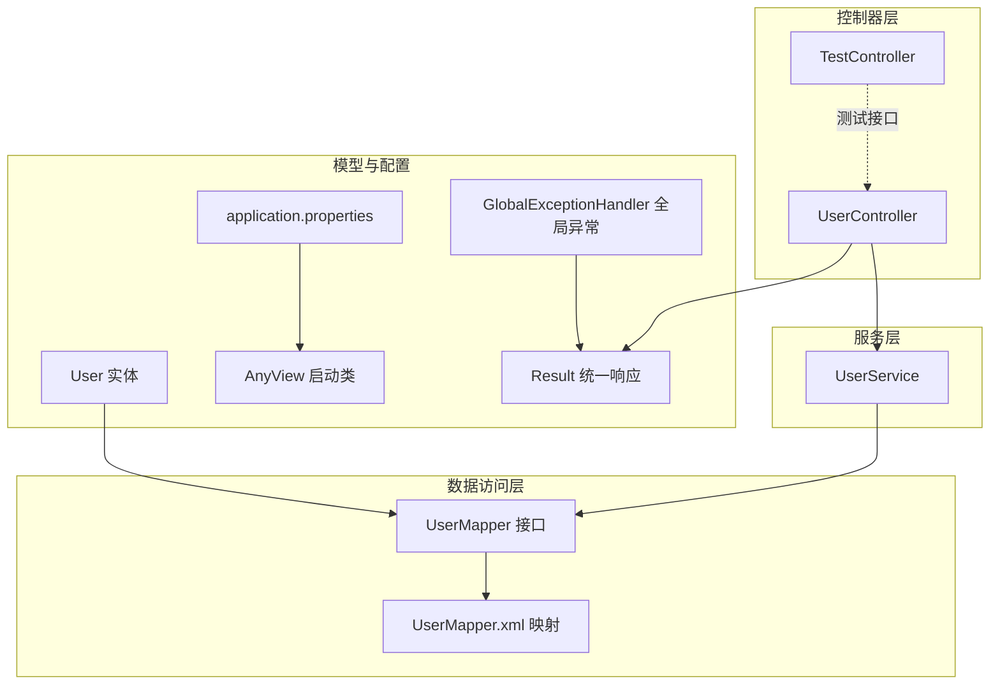
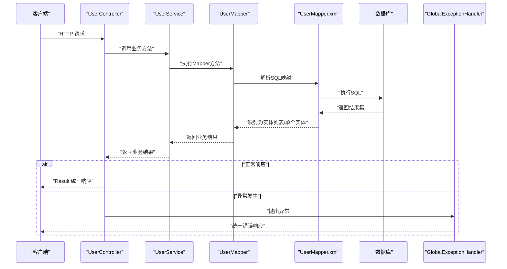
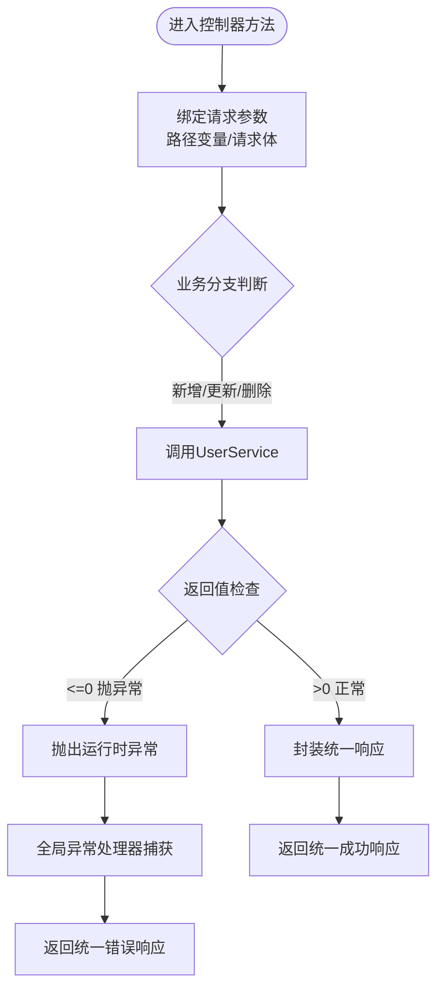
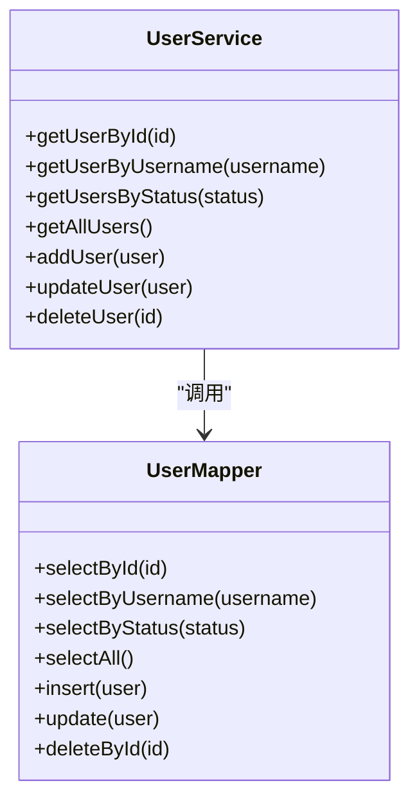
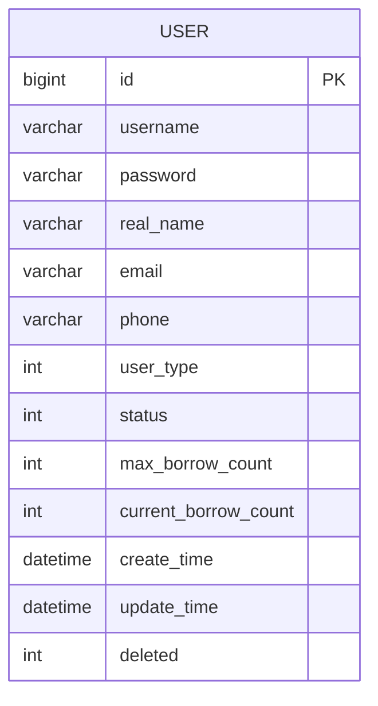
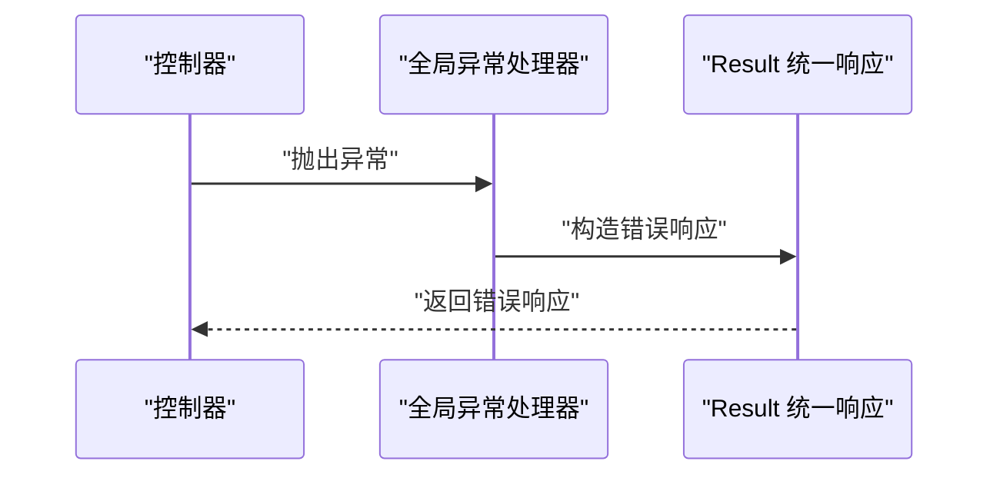
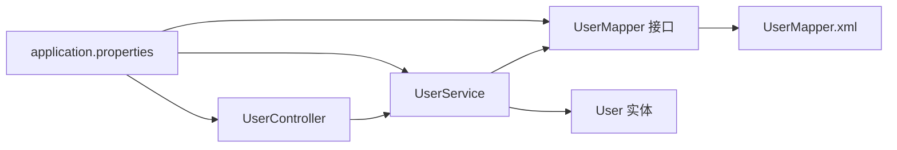

# 调试技巧

<cite>
**本文档引用的文件**
- [AnyView.java](file://src/main/java/com/example/springbootmybatis/AnyView.java)
- [application.properties](file://src/main/resources/application.properties)
- [UserController.java](file://src/main/java/com/example/springbootmybatis/controller/UserController.java)
- [TestController.java](file://src/main/java/com/example/springbootmybatis/controller/TestController.java)
- [UserService.java](file://src/main/java/com/example/springbootmybatis/service/UserService.java)
- [UserMapper.java](file://src/main/java/com/example/springbootmybatis/mapper/UserMapper.java)
- [UserMapper.xml](file://src/main/resources/mapper/UserMapper.xml)
- [GlobalExceptionHandler.java](file://src/main/java/com/example/springbootmybatis/advice/GlobalExceptionHandler.java)
- [Result.java](file://src/main/java/com/example/springbootmybatis/common/Result.java)
- [User.java](file://src/main/java/com/example/springbootmybatis/entity/User.java)
- [pom.xml](file://pom.xml)
- [HELP.md](file://HELP.md)
</cite>

## 目录
1. [简介](#简介)
2. [项目结构](#项目结构)
3. [核心组件](#核心组件)
4. [架构总览](#架构总览)
5. [详细组件分析](#详细组件分析)
6. [依赖关系分析](#依赖关系分析)
7. [性能考虑](#性能考虑)
8. [故障排除指南](#故障排除指南)
9. [结论](#结论)
10. [附录](#附录)

## 简介
本指南面向Spring Boot + MyBatis项目的开发者与测试人员，提供一套系统化的调试方法与实践建议。内容涵盖IDE断点调试、变量监控、调用栈分析；日志系统的配置与输出格式；数据库查询调试（SQL执行跟踪与性能分析）；全局异常处理与错误追踪；网络请求调试工具（Postman与curl）；常见问题诊断与解决方案；以及典型调试场景与问题排查流程。文档中的所有技术细节均基于仓库中现有源码与配置文件进行提炼与总结，确保可操作性与可验证性。

## 项目结构
该项目采用标准的Spring Boot多模块分层结构：
- 控制器层：对外暴露REST接口，负责接收请求参数、调用服务层并返回统一响应。
- 服务层：封装业务逻辑，协调数据访问层完成具体操作。
- 数据访问层：通过MyBatis接口与XML映射文件实现数据库读写。
- 实体模型：定义与数据库表对应的Java实体类。
- 配置与启动：Spring Boot应用入口与数据库连接配置。
- 统一响应与异常处理：提供统一的API响应格式与全局异常捕获。

图表来源
- [AnyView.java](file://src/main/java/com/example/springbootmybatis/AnyView.java#L1-L13)
- [application.properties](file://src/main/resources/application.properties#L1-L16)
- [UserController.java](file://src/main/java/com/example/springbootmybatis/controller/UserController.java#L1-L68)
- [TestController.java](file://src/main/java/com/example/springbootmybatis/controller/TestController.java#L1-L66)
- [UserService.java](file://src/main/java/com/example/springbootmybatis/service/UserService.java#L1-L42)
- [UserMapper.java](file://src/main/java/com/example/springbootmybatis/mapper/UserMapper.java#L1-L23)
- [UserMapper.xml](file://src/main/resources/mapper/UserMapper.xml#L1-L57)
- [Result.java](file://src/main/java/com/example/springbootmybatis/common/Result.java#L1-L87)
- [GlobalExceptionHandler.java](file://src/main/java/com/example/springbootmybatis/advice/GlobalExceptionHandler.java#L1-L22)
- [User.java](file://src/main/java/com/example/springbootmybatis/entity/User.java#L1-L21)

章节来源
- [AnyView.java](file://src/main/java/com/example/springbootmybatis/AnyView.java#L1-L13)
- [application.properties](file://src/main/resources/application.properties#L1-L16)
- [pom.xml](file://pom.xml#L1-L88)

## 核心组件
- 应用启动类：负责应用上下文初始化与主程序入口。
- 控制器：提供用户相关的REST接口，包含查询、新增、修改、删除等常用操作，并内置一个触发运行时异常的测试端点。
- 服务层：封装业务逻辑，调用Mapper完成数据库操作。
- 数据访问层：定义Mapper接口并通过XML映射文件编写SQL语句。
- 实体模型：User实体映射数据库字段，支持驼峰命名自动转换。
- 统一响应：Result类提供统一的成功/失败响应结构。
- 全局异常处理：统一捕获异常并返回标准化错误信息。

章节来源
- [AnyView.java](file://src/main/java/com/example/springbootmybatis/AnyView.java#L1-L13)
- [UserController.java](file://src/main/java/com/example/springbootmybatis/controller/UserController.java#L1-L68)
- [UserService.java](file://src/main/java/com/example/springbootmybatis/service/UserService.java#L1-L42)
- [UserMapper.java](file://src/main/java/com/example/springbootmybatis/mapper/UserMapper.java#L1-L23)
- [UserMapper.xml](file://src/main/resources/mapper/UserMapper.xml#L1-L57)
- [Result.java](file://src/main/java/com/example/springbootmybatis/common/Result.java#L1-L87)
- [GlobalExceptionHandler.java](file://src/main/java/com/example/springbootmybatis/advice/GlobalExceptionHandler.java#L1-L22)
- [User.java](file://src/main/java/com/example/springbootmybatis/entity/User.java#L1-L21)

## 架构总览
下图展示了从HTTP请求到数据库查询再到统一响应的整体流程，以及异常在全局层面的拦截机制。

图表来源
- [UserController.java](file://src/main/java/com/example/springbootmybatis/controller/UserController.java#L1-L68)
- [UserService.java](file://src/main/java/com/example/springbootmybatis/service/UserService.java#L1-L42)
- [UserMapper.java](file://src/main/java/com/example/springbootmybatis/mapper/UserMapper.java#L1-L23)
- [UserMapper.xml](file://src/main/resources/mapper/UserMapper.xml#L1-L57)
- [GlobalExceptionHandler.java](file://src/main/java/com/example/springbootmybatis/advice/GlobalExceptionHandler.java#L1-L22)
- [Result.java](file://src/main/java/com/example/springbootmybatis/common/Result.java#L1-L87)

## 详细组件分析

### 控制器层调试要点
- 断点设置位置
  - 在控制器方法入口处设置断点，观察请求参数绑定是否正确（如路径变量、请求体）。
  - 在业务分支判断处设置断点，验证条件逻辑（如新增/更新/删除后的返回值判断）。
- 变量监控
  - 监控请求参数、业务返回值与统一响应包装结果。
  - 观察异常抛出前后的状态变化，便于定位异常触发点。
- 调用栈分析
  - 通过调用栈确认从控制器到服务层再到数据访问层的调用链路。
  - 异常时查看栈顶异常类型与消息，结合全局异常处理器定位统一错误响应路径。

图表来源
- [UserController.java](file://src/main/java/com/example/springbootmybatis/controller/UserController.java#L1-L68)
- [GlobalExceptionHandler.java](file://src/main/java/com/example/springbootmybatis/advice/GlobalExceptionHandler.java#L1-L22)
- [Result.java](file://src/main/java/com/example/springbootmybatis/common/Result.java#L1-L87)

章节来源
- [UserController.java](file://src/main/java/com/example/springbootmybatis/controller/UserController.java#L1-L68)
- [TestController.java](file://src/main/java/com/example/springbootmybatis/controller/TestController.java#L1-L66)

### 服务层调试要点
- 断点设置位置
  - 在服务层方法入口设置断点，验证传入实体的完整性与合法性。
  - 在Mapper调用前后分别设置断点，观察返回值与异常传播。
- 变量监控
  - 监控实体属性与查询条件，确保与数据库字段一致。
  - 关注驼峰命名转换与字段映射是否生效。
- 调用栈分析
  - 确认服务层作为业务中枢，向上承接控制器，向下委托数据访问层。

图表来源
- [UserService.java](file://src/main/java/com/example/springbootmybatis/service/UserService.java#L1-L42)
- [UserMapper.java](file://src/main/java/com/example/springbootmybatis/mapper/UserMapper.java#L1-L23)

章节来源
- [UserService.java](file://src/main/java/com/example/springbootmybatis/service/UserService.java#L1-L42)

### 数据访问层调试要点
- SQL执行跟踪
  - 在Mapper接口方法上设置断点，观察传入参数与返回值。
  - 在XML映射文件中对应SQL节点设置断点，验证SQL执行路径与参数绑定。
- 性能分析
  - 关注查询条件与返回字段，避免不必要的全表扫描。
  - 对高频查询建立索引或优化WHERE条件。
- 字段映射
  - 利用驼峰命名自动转换配置，确保数据库列名与实体属性一致。

图表来源
- [UserMapper.xml](file://src/main/resources/mapper/UserMapper.xml#L1-L57)
- [User.java](file://src/main/java/com/example/springbootmybatis/entity/User.java#L1-L21)

章节来源
- [UserMapper.java](file://src/main/java/com/example/springbootmybatis/mapper/UserMapper.java#L1-L23)
- [UserMapper.xml](file://src/main/resources/mapper/UserMapper.xml#L1-L57)
- [application.properties](file://src/main/resources/application.properties#L9-L16)

### 全局异常处理调试要点
- 断点设置位置
  - 在全局异常处理器的异常捕获方法处设置断点，观察异常类型与消息。
- 变量监控
  - 监控异常消息与统一响应包装，确保错误信息清晰且不泄露敏感信息。
- 调用栈分析
  - 查看异常在控制器层抛出后如何被全局处理器捕获并返回统一错误响应。

图表来源
- [GlobalExceptionHandler.java](file://src/main/java/com/example/springbootmybatis/advice/GlobalExceptionHandler.java#L1-L22)
- [Result.java](file://src/main/java/com/example/springbootmybatis/common/Result.java#L1-L87)

章节来源
- [GlobalExceptionHandler.java](file://src/main/java/com/example/springbootmybatis/advice/GlobalExceptionHandler.java#L1-L22)

## 依赖关系分析
- 模块耦合
  - 控制器依赖服务层；服务层依赖数据访问层；数据访问层依赖实体模型与配置。
- 外部依赖
  - Spring Boot Starter、MyBatis Starter、MySQL驱动/H2内存数据库。
- 循环依赖
  - 当前结构未发现循环依赖，层次清晰。

图表来源
- [UserController.java](file://src/main/java/com/example/springbootmybatis/controller/UserController.java#L1-L68)
- [UserService.java](file://src/main/java/com/example/springbootmybatis/service/UserService.java#L1-L42)
- [UserMapper.java](file://src/main/java/com/example/springbootmybatis/mapper/UserMapper.java#L1-L23)
- [UserMapper.xml](file://src/main/resources/mapper/UserMapper.xml#L1-L57)
- [User.java](file://src/main/java/com/example/springbootmybatis/entity/User.java#L1-L21)
- [application.properties](file://src/main/resources/application.properties#L1-L16)

章节来源
- [pom.xml](file://pom.xml#L1-L88)

## 性能考虑
- SQL执行效率
  - 使用精确的WHERE条件与必要的索引，避免SELECT *带来的额外开销。
  - 对高频查询建立复合索引，减少全表扫描。
- 事务与批量操作
  - 批量插入/更新时注意事务边界，避免长事务导致锁竞争。
- 缓存策略
  - 对热点数据引入缓存（如Redis），降低数据库压力。
- 日志级别控制
  - 生产环境避免开启过细的日志级别，防止I/O瓶颈。
- 连接池配置
  - 合理设置最大连接数、空闲超时与连接生命周期，避免资源耗尽。

## 故障排除指南

### IDE调试配置与断点策略
- 断点设置
  - 控制器：在方法入口与关键分支处设置断点，便于观察参数与返回值。
  - 服务层：在Mapper调用前后设置断点，验证返回值与异常传播。
  - 数据访问层：在Mapper接口与XML映射节点设置断点，跟踪SQL执行。
- 变量监控
  - 监控请求参数、实体属性、查询结果与异常消息。
  - 使用表达式求值功能快速计算复杂表达式的值。
- 调用栈分析
  - 通过调用栈确认异常来源与传播路径，结合全局异常处理器定位统一错误响应。

### 日志系统使用方法
- 配置与输出格式
  - application.properties中已配置MyBatis相关参数，可结合日志框架（如Logback或Log4j2）进一步细化日志级别与输出格式。
  - 建议对以下模块设置不同日志级别：
    - 控制器：INFO，记录请求与响应概要。
    - 服务层：DEBUG，记录关键业务步骤。
    - 数据访问层：DEBUG，记录SQL与参数。
    - 全局异常：WARN/ERROR，记录异常堆栈与恢复措施。
- 输出格式
  - 建议统一时间戳、线程名、类名与方法名，便于跨模块检索与关联分析。

### 数据库查询调试技巧
- SQL执行跟踪
  - 在UserMapper接口与UserMapper.xml中分别设置断点，观察参数绑定与SQL执行路径。
  - 使用数据库客户端工具（如Navicat、DBeaver或MySQL Workbench）执行相同SQL，对比执行计划与结果。
- 性能分析
  - 使用EXPLAIN分析慢查询，关注索引使用情况与扫描行数。
  - 对高并发场景进行压力测试，识别瓶颈环节。
- 字段映射
  - 确保数据库列名与实体属性遵循驼峰命名约定，避免手动映射导致的字段缺失。

### 全局异常处理调试方法
- 触发与捕获
  - 在控制器中触发异常（例如测试端点），观察全局异常处理器是否正确捕获并返回统一错误响应。
- 错误追踪
  - 结合日志与调用栈，定位异常源头与传播路径，确保错误信息对前端友好且不泄露内部实现细节。

### 网络请求调试工具
- Postman
  - 创建集合，包含用户查询、新增、修改、删除等常用请求。
  - 使用环境变量管理基础URL与认证信息，便于切换不同环境。
  - 开启“Save responses”与“Auto assign vars”，便于复用与回放。
- curl命令
  - 查询用户详情：curl -X GET http://localhost:8080/api/users/1
  - 新增用户：curl -X POST http://localhost:8080/api/users -H "Content-Type: application/json" -d '{"username":"test","password":"pwd","realName":"Test"}'
  - 更新用户：curl -X PUT http://localhost:8080/api/users -H "Content-Type: application/json" -d '{"id":1,"realName":"Updated"}'
  - 删除用户：curl -X DELETE http://localhost:8080/api/users/1
  - 触发异常：curl -X GET http://localhost:8080/api/users/test-error

### 常见问题与解决方案
- 数据库连接失败
  - 检查application.properties中的数据库URL、用户名与密码是否正确。
  - 确认MySQL服务已启动且防火墙未阻断端口。
- SQL映射异常
  - 检查UserMapper.xml中的命名空间与SQL ID是否与接口一致。
  - 确认实体属性与数据库列名映射关系，必要时调整驼峰命名配置。
- 参数绑定失败
  - 检查控制器参数注解（如@PathVariable、@RequestBody）与前端请求是否匹配。
  - 使用Postman或curl验证请求格式与Content-Type。
- 统一响应格式不一致
  - 确认所有控制器方法均返回Result封装的结果，避免直接返回原始对象。
- 全局异常未生效
  - 检查@RestControllerAdvice是否正确扫描到包路径，确保异常被捕获并返回统一格式。

### 实际调试场景与问题排查流程
- 场景一：用户查询接口返回空数据
  - 步骤：在UserController中设置断点，确认参数绑定；在UserService中设置断点，确认Mapper返回值；在UserMapper.xml中设置断点，确认SQL执行与返回结果。
  - 排查：检查数据库是否存在该用户；确认WHERE条件与索引；核对驼峰命名映射。
- 场景二：新增用户失败
  - 步骤：在UserController中设置断点，观察返回值判断；在UserService中设置断点，确认Mapper返回值；在UserMapper.xml中设置断点，确认INSERT语句执行。
  - 排查：检查必填字段是否为空；确认数据库约束与默认值；查看异常消息并结合全局异常处理器定位。
- 场景三：全局异常未捕获
  - 步骤：在控制器中触发异常，设置断点于全局异常处理器。
  - 排查：确认@RestControllerAdvice的包扫描路径；检查异常类型与捕获顺序；核对Result统一响应格式。

## 结论
通过本指南提供的IDE调试方法、日志配置、数据库查询调试、全局异常处理与网络请求工具的使用，可以系统性地提升Spring Boot + MyBatis项目的调试效率与问题定位能力。建议在开发过程中持续完善日志策略与异常处理机制，并结合实际业务场景进行性能优化与压力测试，以保障系统的稳定性与可维护性。

## 附录
- 参考文档与指南链接
  - [官方参考文档](file://HELP.md#L1-L35)

章节来源
- [HELP.md](file://HELP.md#L1-L35)