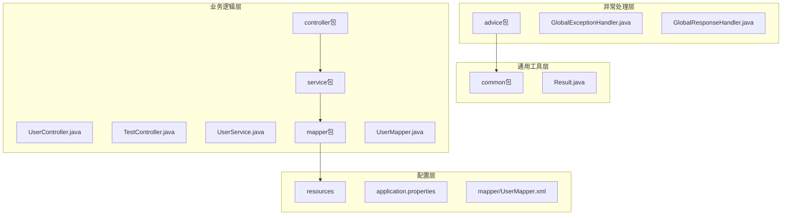
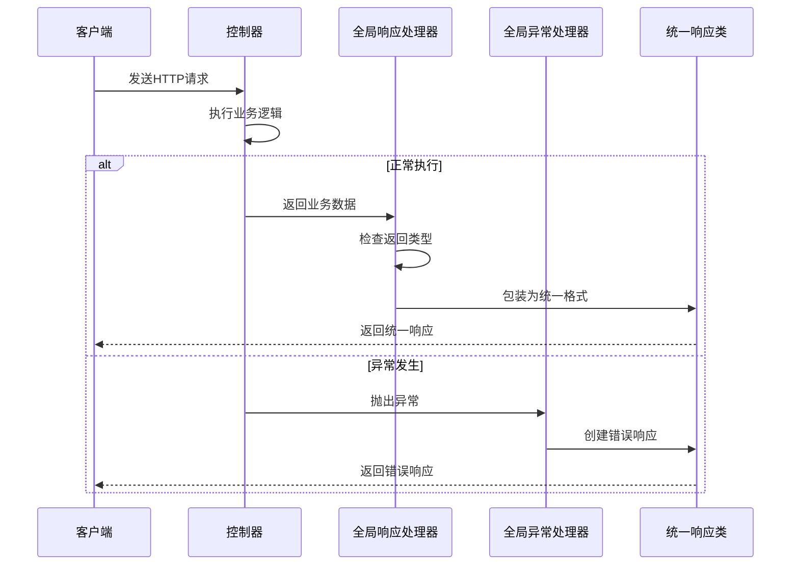
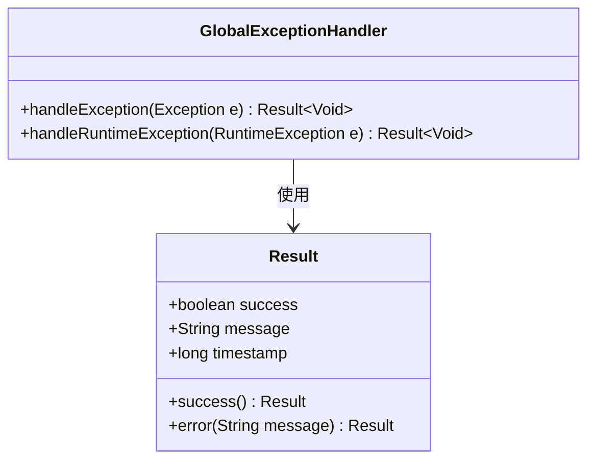
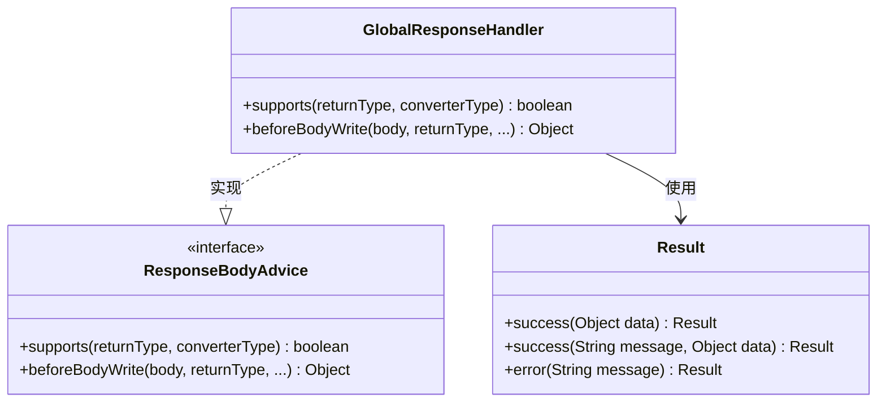
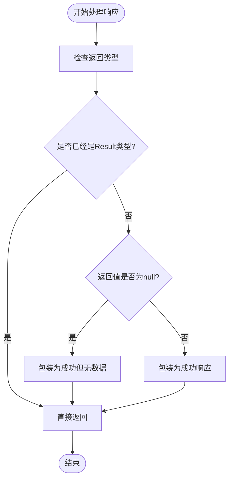
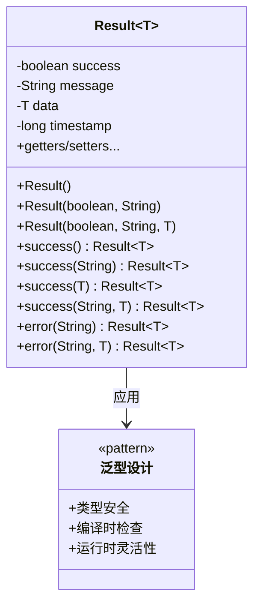
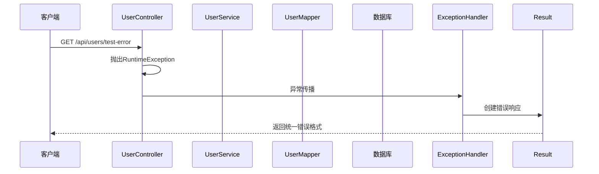
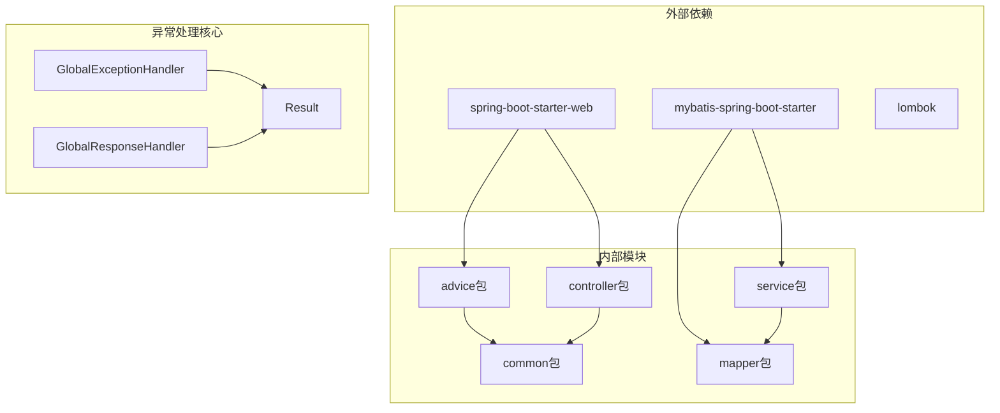

# 异常处理机制

<cite>
**本文档引用的文件**
- [GlobalExceptionHandler.java](file://src/main/java/com/example/springbootmybatis/advice/GlobalExceptionHandler.java)
- [GlobalResponseHandler.java](file://src/main/java/com/example/springbootmybatis/advice/GlobalResponseHandler.java)
- [Result.java](file://src/main/java/com/example/springbootmybatis/common/Result.java)
- [UserController.java](file://src/main/java/com/example/springbootmybatis/controller/UserController.java)
- [TestController.java](file://src/main/java/com/example/springbootmybatis/controller/TestController.java)
- [UserService.java](file://src/main/java/com/example/springbootmybatis/service/UserService.java)
- [UserMapper.java](file://src/main/java/com/example/springbootmybatis/mapper/UserMapper.java)
- [UserMapper.xml](file://src/main/resources/mapper/UserMapper.xml)
- [application.properties](file://src/main/resources/application.properties)
- [pom.xml](file://pom.xml)
</cite>

## 目录
1. [简介](#简介)
2. [项目结构](#项目结构)
3. [核心组件](#核心组件)
4. [架构概览](#架构概览)
5. [详细组件分析](#详细组件分析)
6. [依赖关系分析](#依赖关系分析)
7. [性能考虑](#性能考虑)
8. [故障排除指南](#故障排除指南)
9. [最佳实践](#最佳实践)
10. [结论](#结论)

## 简介

本项目实现了基于Spring Boot和MyBatis的统一异常处理机制。该机制通过全局异常处理器和统一响应包装器，为整个应用程序提供了标准化的错误处理和响应格式。系统采用泛型设计的Result类作为统一的数据传输对象，确保所有API响应具有一致的结构和格式。

## 项目结构

项目采用标准的Spring Boot目录结构，异常处理相关的核心文件分布如下：



**图表来源**
- [GlobalExceptionHandler.java](file://src/main/java/com/example/springbootmybatis/advice/GlobalExceptionHandler.java#L1-L22)
- [GlobalResponseHandler.java](file://src/main/java/com/example/springbootmybatis/advice/GlobalResponseHandler.java#L1-L39)
- [Result.java](file://src/main/java/com/example/springbootmybatis/common/Result.java#L1-L87)

**章节来源**
- [application.properties](file://src/main/resources/application.properties#L1-L16)
- [pom.xml](file://pom.xml#L1-L88)

## 核心组件

### Result泛型类设计

Result类是整个异常处理系统的核心数据传输对象，采用泛型设计支持任意类型的数据封装：

- **统一响应结构**：包含success状态、message描述、data数据体和timestamp时间戳
- **静态工厂方法**：提供多种便捷的构造方式，包括success()、error()等
- **序列化支持**：实现Serializable接口，确保网络传输的兼容性
- **灵活的数据承载**：通过泛型参数T支持不同类型的数据封装

### 全局异常处理器

GlobalExceptionHandler负责捕获应用程序中未处理的异常，提供统一的错误响应：

- **异常层次处理**：分别处理Exception和RuntimeException两类异常
- **标准化错误消息**：将异常信息包装为统一格式的错误响应
- **自动响应转换**：与GlobalResponseHandler配合，确保异常响应格式一致

### 全局响应处理器

GlobalResponseHandler实现了ResponseBodyAdvice接口，负责统一包装所有控制器的响应：

- **智能判断逻辑**：检测返回值类型，避免重复包装
- **空值处理**：对null返回值进行特殊处理
- **类型安全包装**：确保所有非Result类型的响应都被正确包装

**章节来源**
- [Result.java](file://src/main/java/com/example/springbootmybatis/common/Result.java#L1-L87)
- [GlobalExceptionHandler.java](file://src/main/java/com/example/springbootmybatis/advice/GlobalExceptionHandler.java#L1-L22)
- [GlobalResponseHandler.java](file://src/main/java/com/example/springbootmybatis/advice/GlobalResponseHandler.java#L1-L39)

## 架构概览

异常处理系统的整体架构采用分层设计，各组件职责明确且相互协作：



**图表来源**
- [GlobalResponseHandler.java](file://src/main/java/com/example/springbootmybatis/advice/GlobalResponseHandler.java#L18-L38)
- [GlobalExceptionHandler.java](file://src/main/java/com/example/springbootmybatis/advice/GlobalExceptionHandler.java#L13-L21)
- [Result.java](file://src/main/java/com/example/springbootmybatis/common/Result.java#L31-L53)

## 详细组件分析

### GlobalExceptionHandler组件分析

GlobalExceptionHandler采用了基于注解的异常处理模式：



**图表来源**
- [GlobalExceptionHandler.java](file://src/main/java/com/example/springbootmybatis/advice/GlobalExceptionHandler.java#L10-L22)
- [Result.java](file://src/main/java/com/example/springbootmybatis/common/Result.java#L8-L87)

#### 异常捕获策略

- **Exception级别捕获**：处理所有继承自Exception的异常
- **RuntimeException级别捕获**：专门处理运行时异常
- **优先级处理**：RuntimeException的处理方法具有更高的优先级

#### 错误响应格式

异常处理返回的统一格式包含：
- success字段：始终为false表示操作失败
- message字段：包含具体的错误描述
- timestamp字段：记录错误发生的时间戳

**章节来源**
- [GlobalExceptionHandler.java](file://src/main/java/com/example/springbootmybatis/advice/GlobalExceptionHandler.java#L1-L22)

### GlobalResponseHandler组件分析

GlobalResponseHandler实现了ResponseBodyAdvice接口，提供智能的响应包装：



**图表来源**
- [GlobalResponseHandler.java](file://src/main/java/com/example/springbootmybatis/advice/GlobalResponseHandler.java#L15-L39)
- [Result.java](file://src/main/java/com/example/springbootmybatis/common/Result.java#L31-L53)

#### 包装逻辑流程



**图表来源**
- [GlobalResponseHandler.java](file://src/main/java/com/example/springbootmybatis/advice/GlobalResponseHandler.java#L19-L38)

**章节来源**
- [GlobalResponseHandler.java](file://src/main/java/com/example/springbootmybatis/advice/GlobalResponseHandler.java#L1-L39)

### Result泛型类深度分析

Result类的设计体现了良好的面向对象原则：



**图表来源**
- [Result.java](file://src/main/java/com/example/springbootmybatis/common/Result.java#L8-L87)

#### 静态工厂方法设计

Result类提供了丰富的静态工厂方法：
- success()系列：创建成功的响应对象
- error()系列：创建错误的响应对象
- 支持不同参数组合，满足不同的使用场景

#### 序列化特性

- 实现Serializable接口，支持网络传输
- 包含serialVersionUID，确保版本兼容性
- 字段设计简洁，便于JSON序列化

**章节来源**
- [Result.java](file://src/main/java/com/example/springbootmybatis/common/Result.java#L1-L87)

### 异常处理在业务层的应用

UserController展示了异常处理机制在实际业务中的应用：



**图表来源**
- [UserController.java](file://src/main/java/com/example/springbootmybatis/controller/UserController.java#L37-L40)
- [GlobalExceptionHandler.java](file://src/main/java/com/example/springbootmybatis/advice/GlobalExceptionHandler.java#L18-L21)

**章节来源**
- [UserController.java](file://src/main/java/com/example/springbootmybatis/controller/UserController.java#L1-L68)

## 依赖关系分析

异常处理机制的依赖关系清晰且模块化：



**图表来源**
- [pom.xml](file://pom.xml#L32-L67)
- [GlobalExceptionHandler.java](file://src/main/java/com/example/springbootmybatis/advice/GlobalExceptionHandler.java#L1-L22)
- [GlobalResponseHandler.java](file://src/main/java/com/example/springbootmybatis/advice/GlobalResponseHandler.java#L1-L39)

### Spring Boot集成

系统基于Spring Boot 2.7.18版本构建，集成了以下关键组件：

- **Web启动器**：提供RESTful API开发基础
- **MyBatis启动器**：简化数据库访问层开发
- **Lombok支持**：减少样板代码编写

### MyBatis配置

数据库访问层通过MyBatis实现，配置特点包括：

- **驼峰命名映射**：自动将下划线命名转换为驼峰命名
- **XML映射文件**：清晰的SQL语句定义
- **类型别名**：简化实体类引用

**章节来源**
- [pom.xml](file://pom.xml#L1-L88)
- [application.properties](file://src/main/resources/application.properties#L1-L16)
- [UserMapper.xml](file://src/main/resources/mapper/UserMapper.xml#L1-L57)

## 性能考虑

异常处理机制在设计时充分考虑了性能影响：

### 处理器性能特征

- **零拷贝优化**：GlobalResponseHandler避免不必要的对象创建
- **类型检查快速**：使用instanceof操作符进行高效的类型判断
- **异常路径短路**：异常处理不参与正常业务流程

### 内存使用优化

- **对象池化**：Result对象生命周期短，有利于垃圾回收
- **字符串常量**：常用消息使用字符串常量，减少内存分配
- **延迟初始化**：仅在需要时创建Result实例

### 响应时间优化

- **异步异常处理**：异常处理不影响正常业务响应时间
- **缓存友好**：统一的响应格式便于客户端缓存
- **压缩支持**：可结合GZIP压缩减少网络传输开销

## 故障排除指南

### 常见问题诊断

#### 异常未被捕获

**症状**：RuntimeException没有被GlobalExceptionHandler捕获

**排查步骤**：
1. 检查@RestControllerAdvice注解是否正确配置
2. 验证异常处理方法的签名是否匹配
3. 确认异常类型是否在处理范围内

#### 响应格式不统一

**症状**：部分API返回原始数据而非统一格式

**排查步骤**：
1. 检查GlobalResponseHandler的supports方法逻辑
2. 验证控制器返回值类型
3. 确认Result类的导入是否正确

#### 数据库异常处理

**症状**：MyBatis异常没有被正确转换

**排查步骤**：
1. 检查UserService中的异常抛出位置
2. 验证异常类型是否符合预期
3. 确认异常传播链路

### 调试技巧

#### 日志记录

```java
// 在异常处理器中添加详细日志
logger.error("异常发生: ", e);
logger.error("请求URL: {}", request.getRequestURI());
logger.error("异常详情: {}", e.getMessage(), e);
```

#### 调试断点

- 在GlobalExceptionHandler的异常处理方法设置断点
- 在GlobalResponseHandler的beforeBodyWrite方法设置断点
- 监控异常传播过程中的对象状态变化

**章节来源**
- [GlobalExceptionHandler.java](file://src/main/java/com/example/springbootmybatis/advice/GlobalExceptionHandler.java#L1-L22)
- [GlobalResponseHandler.java](file://src/main/java/com/example/springbootmybatis/advice/GlobalResponseHandler.java#L1-L39)

## 最佳实践

### 异常分类策略

#### 业务异常处理

```java
// 推荐：明确的业务异常
if (result <= 0) {
    throw new RuntimeException("用户添加失败");
}

// 不推荐：模糊的异常信息
throw new RuntimeException("操作失败");
```

#### 自定义异常设计

虽然当前项目使用RuntimeException，但建议设计更精确的异常类型：

```java
public class BusinessException extends RuntimeException {
    private final String errorCode;
    private final Object[] params;
    
    public BusinessException(String errorCode, String message, Object... params) {
        super(message);
        this.errorCode = errorCode;
        this.params = params;
    }
}
```

### 错误码定义规范

建议建立统一的错误码体系：

| 类别 | 编码范围 | 描述 |
|------|----------|------|
| 参数验证 | 1000-1999 | 请求参数错误 |
| 业务逻辑 | 2000-2999 | 业务规则违反 |
| 系统异常 | 5000-5999 | 系统内部错误 |
| 数据库异常 | 6000-6999 | 数据库操作失败 |

### 日志记录策略

#### 结构化日志

```java
logger.error(
    "用户操作异常 - 用户ID: {}, 操作类型: {}, 错误码: {}, 错误信息: {}",
    userId, operation, errorCode, errorMessage, e
);
```

#### 分级日志

- **ERROR级别**：记录完整的异常堆栈信息
- **WARN级别**：记录可恢复的异常情况
- **INFO级别**：记录关键业务异常

### 监控指标

建议收集以下关键指标：

- **异常发生率**：每分钟异常数量
- **异常类型分布**：各类异常占比
- **响应时间**：异常处理耗时统计
- **业务成功率**：受异常影响的业务指标

## 结论

本项目的异常处理机制展现了良好的设计原则和实现质量。通过全局异常处理器和统一响应包装器的协同工作，实现了：

1. **一致性**：所有API响应格式统一，便于客户端处理
2. **可维护性**：异常处理逻辑集中，易于维护和扩展
3. **性能**：最小化的性能开销，不影响正常业务流程
4. **可观察性**：完善的日志记录和监控支持

建议在未来版本中进一步完善异常分类、错误码体系和监控指标，以适应更复杂的业务需求和生产环境要求。