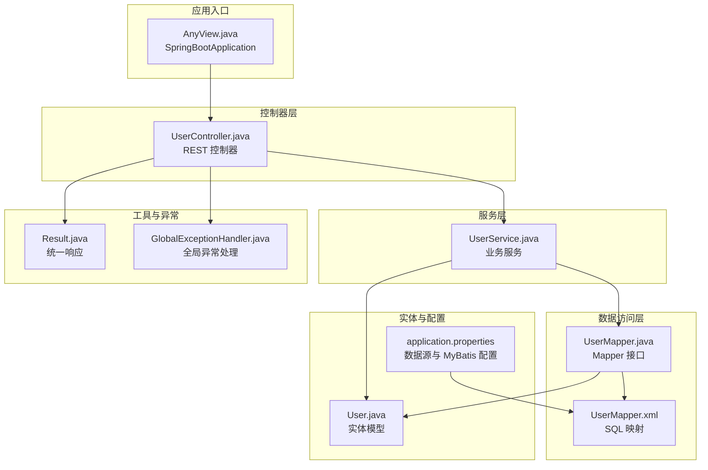
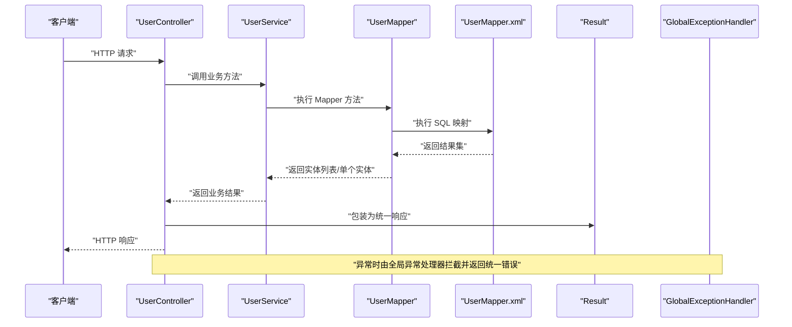
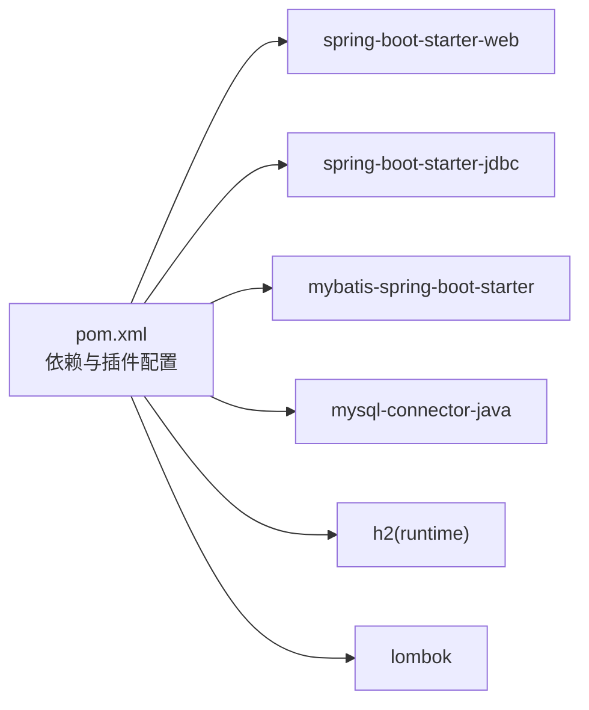

# 快速开始

<cite>
**本文引用的文件**
- [pom.xml](file://pom.xml)
- [application.properties](file://src/main/resources/application.properties)
- [HELP.md](file://HELP.md)
- [UserController.java](file://src/main/java/com/example/springbootmybatis/controller/UserController.java)
- [UserService.java](file://src/main/java/com/example/springbootmybatis/service/UserService.java)
- [UserMapper.java](file://src/main/java/com/example/springbootmybatis/mapper/UserMapper.java)
- [UserMapper.xml](file://src/main/resources/mapper/UserMapper.xml)
- [User.java](file://src/main/java/com/example/springbootmybatis/entity/User.java)
- [AnyView.java](file://src/main/java/com/example/springbootmybatis/AnyView.java)
- [GlobalExceptionHandler.java](file://src/main/java/com/example/springbootmybatis/advice/GlobalExceptionHandler.java)
- [Result.java](file://src/main/java/com/example/springbootmybatis/common/Result.java)
- [.mvn/wrapper/maven-wrapper.properties](file://.mvn/wrapper/maven-wrapper.properties)
- [mvnw](file://mvnw)
- [mvnw.cmd](file://mvnw.cmd)
</cite>

## 目录
1. [简介](#简介)
2. [项目结构](#项目结构)
3. [核心组件](#核心组件)
4. [架构总览](#架构总览)
5. [详细组件分析](#详细组件分析)
6. [依赖分析](#依赖分析)
7. [性能考虑](#性能考虑)
8. [故障排查指南](#故障排查指南)
9. [结论](#结论)
10. [附录](#附录)

## 简介
本指南面向希望快速上手 Spring Boot + MyBatis 的开发者，覆盖从环境准备到项目启动、数据库初始化、API 测试与常见问题排查的完整流程。项目已内置 MySQL/H2 双数据源支持与统一响应封装，便于快速验证功能。

## 项目结构
该项目采用标准的 Spring Boot 多模块结构，按职责分层组织：
- 控制器层：对外暴露 REST 接口
- 服务层：业务逻辑编排
- 数据访问层：MyBatis Mapper 与 XML 映射
- 实体层：数据库表映射模型
- 配置与工具：应用配置、全局异常处理、统一响应封装

图表来源
- [AnyView.java](file://src/main/java/com/example/springbootmybatis/AnyView.java#L1-L13)
- [UserController.java](file://src/main/java/com/example/springbootmybatis/controller/UserController.java#L1-L68)
- [UserService.java](file://src/main/java/com/example/springbootmybatis/service/UserService.java#L1-L42)
- [UserMapper.java](file://src/main/java/com/example/springbootmybatis/mapper/UserMapper.java#L1-L23)
- [UserMapper.xml](file://src/main/resources/mapper/UserMapper.xml#L1-L57)
- [User.java](file://src/main/java/com/example/springbootmybatis/entity/User.java#L1-L21)
- [application.properties](file://src/main/resources/application.properties#L1-L16)
- [Result.java](file://src/main/java/com/example/springbootmybatis/common/Result.java#L1-L87)
- [GlobalExceptionHandler.java](file://src/main/java/com/example/springbootmybatis/advice/GlobalExceptionHandler.java#L1-L22)

章节来源
- [pom.xml](file://pom.xml#L1-L88)
- [application.properties](file://src/main/resources/application.properties#L1-L16)

## 核心组件
- 应用入口：Spring Boot 启动类负责加载上下文与自动配置
- 控制器：提供用户查询、新增、更新、删除等接口
- 服务层：封装业务逻辑，调用 Mapper 完成数据持久化
- 数据访问层：Mapper 接口 + XML 映射，定义 SQL 与结果映射
- 实体模型：User 实体映射数据库字段
- 统一响应：Result 封装统一返回结构
- 全局异常：统一捕获异常并返回标准错误响应

章节来源
- [AnyView.java](file://src/main/java/com/example/springbootmybatis/AnyView.java#L1-L13)
- [UserController.java](file://src/main/java/com/example/springbootmybatis/controller/UserController.java#L1-L68)
- [UserService.java](file://src/main/java/com/example/springbootmybatis/service/UserService.java#L1-L42)
- [UserMapper.java](file://src/main/java/com/example/springbootmybatis/mapper/UserMapper.java#L1-L23)
- [UserMapper.xml](file://src/main/resources/mapper/UserMapper.xml#L1-L57)
- [User.java](file://src/main/java/com/example/springbootmybatis/entity/User.java#L1-L21)
- [Result.java](file://src/main/java/com/example/springbootmybatis/common/Result.java#L1-L87)
- [GlobalExceptionHandler.java](file://src/main/java/com/example/springbootmybatis/advice/GlobalExceptionHandler.java#L1-L22)

## 架构总览
下图展示了请求从控制器到数据库的典型调用链路，以及统一响应与异常处理的横切关注点。

图表来源
- [UserController.java](file://src/main/java/com/example/springbootmybatis/controller/UserController.java#L1-L68)
- [UserService.java](file://src/main/java/com/example/springbootmybatis/service/UserService.java#L1-L42)
- [UserMapper.java](file://src/main/java/com/example/springbootmybatis/mapper/UserMapper.java#L1-L23)
- [UserMapper.xml](file://src/main/resources/mapper/UserMapper.xml#L1-L57)
- [Result.java](file://src/main/java/com/example/springbootmybatis/common/Result.java#L1-L87)
- [GlobalExceptionHandler.java](file://src/main/java/com/example/springbootmybatis/advice/GlobalExceptionHandler.java#L1-L22)

## 详细组件分析

### 控制器层（UserController）
- 提供用户查询接口：按 ID、用户名、状态、全量查询
- 提供用户 CRUD 接口：新增、更新、删除
- 内置测试接口：触发运行时异常以验证全局异常处理
- 统一响应：所有接口返回统一的 Result 结构

章节来源
- [UserController.java](file://src/main/java/com/example/springbootmybatis/controller/UserController.java#L1-L68)
- [Result.java](file://src/main/java/com/example/springbootmybatis/common/Result.java#L1-L87)
- [GlobalExceptionHandler.java](file://src/main/java/com/example/springbootmybatis/advice/GlobalExceptionHandler.java#L1-L22)

### 服务层（UserService）
- 调用 Mapper 执行数据库操作
- 对外暴露业务方法，便于控制器调用

章节来源
- [UserService.java](file://src/main/java/com/example/springbootmybatis/service/UserService.java#L1-L42)
- [UserMapper.java](file://src/main/java/com/example/springbootmybatis/mapper/UserMapper.java#L1-L23)

### 数据访问层（UserMapper + UserMapper.xml）
- Mapper 接口声明方法
- XML 映射定义 SQL 与结果映射（驼峰命名转换）

章节来源
- [UserMapper.java](file://src/main/java/com/example/springbootmybatis/mapper/UserMapper.java#L1-L23)
- [UserMapper.xml](file://src/main/resources/mapper/UserMapper.xml#L1-L57)

### 实体模型（User）
- 字段与数据库列一一对应，支持驼峰映射

章节来源
- [User.java](file://src/main/java/com/example/springbootmybatis/entity/User.java#L1-L21)

### 应用配置（application.properties）
- 数据源：MySQL 默认配置；同时引入 H2 作为可选运行时依赖
- MyBatis：XML 映射路径、类型别名包、驼峰映射开关
- Mapper 扫描：指定 Mapper 包路径

章节来源
- [application.properties](file://src/main/resources/application.properties#L1-L16)

### Maven 依赖与构建（pom.xml）
- Spring Boot Starter：Web、JDBC、测试
- MyBatis：mybatis-spring-boot-starter
- 数据库驱动：MySQL Connector/J、H2
- Lombok：简化实体类代码生成

章节来源
- [pom.xml](file://pom.xml#L1-L88)

### 启动脚本与包装器（mvnw / mvnw.cmd）
- Maven Wrapper 自动下载并使用指定版本的 Maven
- 支持跨平台（Unix shell 与 Windows PowerShell/Batch）

章节来源
- [.mvn/wrapper/maven-wrapper.properties](file://.mvn/wrapper/maven-wrapper.properties#L1-L20)
- [mvnw](file://mvnw#L1-L260)
- [mvnw.cmd](file://mvnw.cmd#L1-L150)

## 依赖分析
- 运行时依赖：Spring Boot Web、JDBC、MyBatis、MySQL 驱动、H2
- 编译期依赖：Lombok
- 构建插件：Spring Boot Maven 插件排除 Lombok

图表来源
- [pom.xml](file://pom.xml#L1-L88)

章节来源
- [pom.xml](file://pom.xml#L1-L88)

## 性能考虑
- 使用 MyBatis 驼峰映射减少字段命名不一致带来的映射成本
- 合理使用分页与索引，避免全表扫描
- 控制一次性批量操作的数据量，避免长时间锁表
- 在高并发场景下，结合连接池参数与事务隔离级别进行调优

## 故障排查指南

### 环境准备
- JDK 版本：项目要求 Java 8，确保 JAVA_HOME 指向 JDK 8+
- Maven：推荐使用 Maven Wrapper（mvnw/mvnw.cmd），自动下载匹配版本
- 数据库：
  - MySQL：按配置文件中的 URL、账号、密码准备数据库与表结构
  - H2：作为 runtime 依赖，可在内存模式下快速验证

章节来源
- [application.properties](file://src/main/resources/application.properties#L1-L16)
- [pom.xml](file://pom.xml#L1-L88)
- [.mvn/wrapper/maven-wrapper.properties](file://.mvn/wrapper/maven-wrapper.properties#L1-L20)

### 启动问题
- 无法找到主类或缺少依赖
  - 清理并重新安装依赖：使用 Maven Wrapper 执行构建
  - 检查 JAVA_HOME 是否正确指向 JDK 8+
- 数据源连接失败
  - 校验 application.properties 中的数据库 URL、用户名、密码
  - 确认数据库服务已启动且网络可达
- MyBatis 映射异常
  - 检查 Mapper XML 文件路径与命名空间是否匹配
  - 确认驼峰映射配置已启用

章节来源
- [application.properties](file://src/main/resources/application.properties#L1-L16)
- [UserMapper.xml](file://src/main/resources/mapper/UserMapper.xml#L1-L57)

### API 测试问题
- 统一响应格式
  - 成功：success=true，message=“操作成功”，data 为业务数据
  - 失败：success=false，message 为错误信息
- 全局异常
  - 未捕获异常会被全局异常处理器拦截，返回统一错误结构

章节来源
- [Result.java](file://src/main/java/com/example/springbootmybatis/common/Result.java#L1-L87)
- [GlobalExceptionHandler.java](file://src/main/java/com/example/springbootmybatis/advice/GlobalExceptionHandler.java#L1-L22)

## 结论
本项目提供了 Spring Boot + MyBatis 的最小可用骨架，具备完善的依赖与配置、清晰的分层结构、统一响应与异常处理机制。按照本指南完成环境准备、依赖安装与数据库初始化后，即可快速启动并验证用户管理相关接口。

## 附录

### 环境准备步骤
- 安装 JDK 8 或更高版本，并设置 JAVA_HOME
- 安装 Maven（可直接使用项目自带的 Maven Wrapper）
- 准备数据库：
  - MySQL：创建数据库与用户，准备表结构（见后续数据库初始化）
  - H2：无需额外准备，运行时自动生效

章节来源
- [application.properties](file://src/main/resources/application.properties#L1-L16)
- [pom.xml](file://pom.xml#L1-L88)

### 项目克隆与依赖安装
- 使用 Maven Wrapper 执行构建与打包
  - Linux/macOS：./mvnw clean install
  - Windows：.\mvnw.cmd clean install

章节来源
- [.mvn/wrapper/maven-wrapper.properties](file://.mvn/wrapper/maven-wrapper.properties#L1-L20)
- [mvnw](file://mvnw#L1-L260)
- [mvnw.cmd](file://mvnw.cmd#L1-L150)

### 数据库初始化
- MySQL 初始化
  - 创建数据库与用户（根据 application.properties 中的配置）
  - 执行建表语句（与 User 实体字段对应）
- H2 初始化
  - 作为 runtime 依赖，可在内存模式下直接运行

章节来源
- [application.properties](file://src/main/resources/application.properties#L1-L16)
- [User.java](file://src/main/java/com/example/springbootmybatis/entity/User.java#L1-L21)
- [pom.xml](file://pom.xml#L1-L88)

### 项目启动命令
- 使用 Maven Wrapper 启动
  - Linux/macOS：./mvnw spring-boot:run
  - Windows：.\mvnw.cmd spring-boot:run
- 或打包后运行
  - ./mvnw package
  - java -jar target/*.jar

章节来源
- [.mvn/wrapper/maven-wrapper.properties](file://.mvn/wrapper/maven-wrapper.properties#L1-L20)
- [mvnw](file://mvnw#L1-L260)
- [mvnw.cmd](file://mvnw.cmd#L1-L150)
- [pom.xml](file://pom.xml#L1-L88)

### 验证步骤
- 访问健康检查端点（如 /actuator/health，若启用）
- 调用用户管理接口，确认返回统一响应结构

章节来源
- [Result.java](file://src/main/java/com/example/springbootmybatis/common/Result.java#L1-L87)

### API 接口测试（curl/Postman）
- 获取单个用户：GET /api/users/{id}
- 按用户名查询：GET /api/users/username/{username}
- 按状态查询：GET /api/users/status/{status}
- 查询全部：GET /api/users/all
- 新增用户：POST /api/users（请求体为 User 对象）
- 更新用户：PUT /api/users（请求体为 User 对象）
- 删除用户：DELETE /api/users/{id}
- 触发错误：GET /api/users/test-error（用于验证全局异常处理）

章节来源
- [UserController.java](file://src/main/java/com/example/springbootmybatis/controller/UserController.java#L1-L68)

### 开发环境配置最佳实践
- 使用 Lombok 简化实体类，但注意 IDE 需要启用注解处理
- 保持 application.properties 与数据库配置一致
- 在开发阶段可切换至 H2 内存数据库以提升调试效率
- 启用日志与 Actuator（如需）以便监控与诊断

章节来源
- [pom.xml](file://pom.xml#L1-L88)
- [application.properties](file://src/main/resources/application.properties#L1-L16)
- [HELP.md](file://HELP.md#L1-L35)