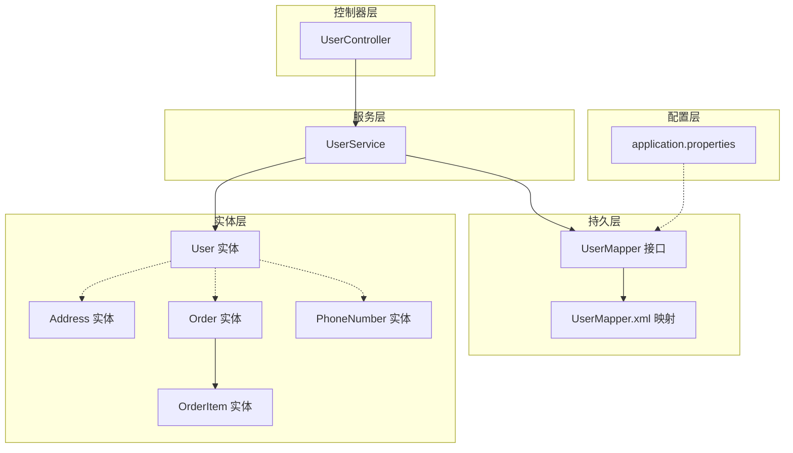
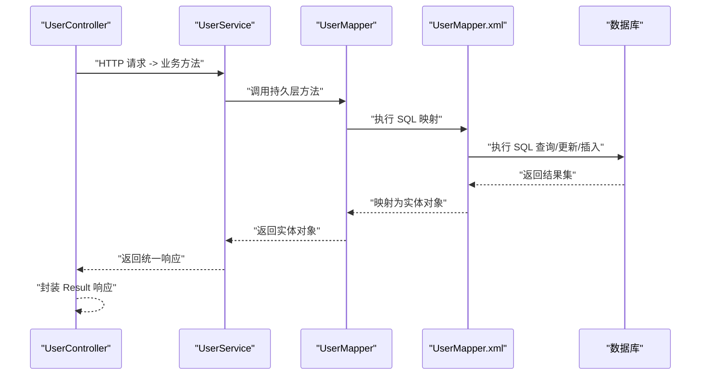
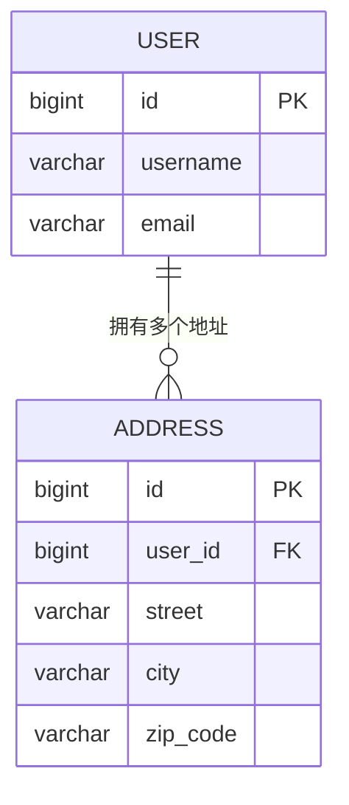
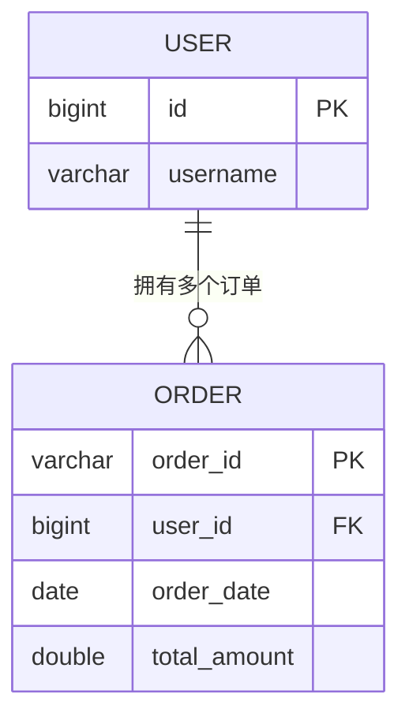
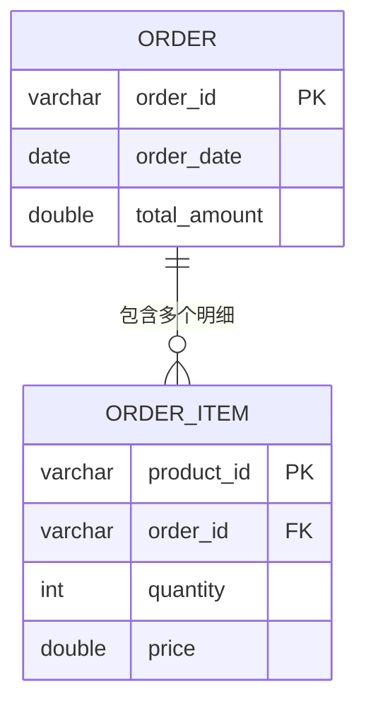
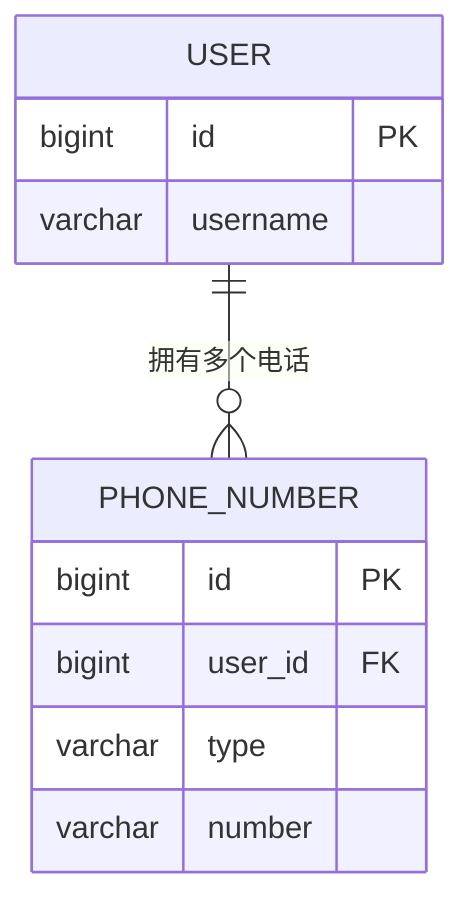
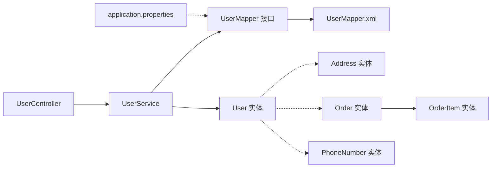

# 实体关系映射

<cite>
**本文引用的文件**
- [User.java](file://src/main/java/com/example/springbootmybatis/entity/User.java)
- [Address.java](file://src/main/java/com/example/springbootmybatis/entity/Address.java)
- [Order.java](file://src/main/java/com/example/springbootmybatis/entity/Order.java)
- [OrderItem.java](file://src/main/java/com/example/springbootmybatis/entity/OrderItem.java)
- [PhoneNumber.java](file://src/main/java/com/example/springbootmybatis/entity/PhoneNumber.java)
- [UserMapper.java](file://src/main/java/com/example/springbootmybatis/mapper/UserMapper.java)
- [UserMapper.xml](file://src/main/resources/mapper/UserMapper.xml)
- [UserService.java](file://src/main/java/com/example/springbootmybatis/service/UserService.java)
- [UserController.java](file://src/main/java/com/example/springbootmybatis/controller/UserController.java)
- [application.properties](file://src/main/resources/application.properties)
- [GlobalExceptionHandler.java](file://src/main/java/com/example/springbootmybatis/advice/GlobalExceptionHandler.java)
- [Result.java](file://src/main/java/com/example/springbootmybatis/common/Result.java)
</cite>

## 目录
1. [引言](#引言)
2. [项目结构](#项目结构)
3. [核心组件](#核心组件)
4. [架构总览](#架构总览)
5. [详细组件分析](#详细组件分析)
6. [依赖分析](#依赖分析)
7. [性能考虑](#性能考虑)
8. [故障排除指南](#故障排除指南)
9. [结论](#结论)
10. [附录](#附录)

## 引言
本文件聚焦于本项目的实体关系映射（ER），系统性梳理实体间的一对一、一对多、多对多关系设计与实现，重点覆盖以下关系：
- User 与 Address 的关联关系
- User 与 Order 的关联关系
- Order 与 OrderItem 的关联关系
- PhoneNumber 与 User 的关联关系

同时，结合现有代码与配置，阐述外键约束设计原则、数据库完整性保障、级联与延迟加载策略、性能优化与查询策略，并提供实体关系图与数据流向分析。

## 项目结构
项目采用 Spring Boot + MyBatis 架构，按职责分层组织：
- 控制器层：处理 HTTP 请求与响应封装
- 服务层：编排业务逻辑与调用持久层
- 持久层：MyBatis Mapper 接口与 XML 映射
- 实体层：领域模型定义
- 配置层：数据库连接与 MyBatis 参数配置

图表来源
- [UserController.java](file://src/main/java/com/example/springbootmybatis/controller/UserController.java#L1-L68)
- [UserService.java](file://src/main/java/com/example/springbootmybatis/service/UserService.java#L1-L42)
- [UserMapper.java](file://src/main/java/com/example/springbootmybatis/mapper/UserMapper.java#L1-L23)
- [UserMapper.xml](file://src/main/resources/mapper/UserMapper.xml#L1-L57)
- [application.properties](file://src/main/resources/application.properties#L1-L16)

章节来源
- [application.properties](file://src/main/resources/application.properties#L1-L16)

## 核心组件
- User 实体：承载用户基本信息与状态字段，用于数据库 user 表映射
- Address 实体：承载地址信息（街道、城市、邮编）
- Order 实体：承载订单信息，包含订单明细集合
- OrderItem 实体：承载订单项信息（产品 ID、名称、数量、单价）
- PhoneNumber 实体：承载电话号码类型与号码
- UserMapper 接口与 UserMapper.xml：负责 User 实体的 CRUD 映射
- UserService：封装用户相关业务逻辑
- UserController：对外提供 REST 接口

章节来源
- [User.java](file://src/main/java/com/example/springbootmybatis/entity/User.java#L1-L21)
- [Address.java](file://src/main/java/com/example/springbootmybatis/entity/Address.java#L1-L17)
- [Order.java](file://src/main/java/com/example/springbootmybatis/entity/Order.java#L1-L18)
- [OrderItem.java](file://src/main/java/com/example/springbootmybatis/entity/OrderItem.java#L1-L16)
- [PhoneNumber.java](file://src/main/java/com/example/springbootmybatis/entity/PhoneNumber.java#L1-L11)
- [UserMapper.java](file://src/main/java/com/example/springbootmybatis/mapper/UserMapper.java#L1-L23)
- [UserMapper.xml](file://src/main/resources/mapper/UserMapper.xml#L1-L57)
- [UserService.java](file://src/main/java/com/example/springbootmybatis/service/UserService.java#L1-L42)
- [UserController.java](file://src/main/java/com/example/springbootmybatis/controller/UserController.java#L1-L68)

## 架构总览
下图展示从控制器到持久层的数据流与实体交互：

图表来源
- [UserController.java](file://src/main/java/com/example/springbootmybatis/controller/UserController.java#L1-L68)
- [UserService.java](file://src/main/java/com/example/springbootmybatis/service/UserService.java#L1-L42)
- [UserMapper.java](file://src/main/java/com/example/springbootmybatis/mapper/UserMapper.java#L1-L23)
- [UserMapper.xml](file://src/main/resources/mapper/UserMapper.xml#L1-L57)

## 详细组件分析

### 用户与地址的关系（一对一/多对一）
- 现状分析
  - User 实体未直接声明 Address 字段；Address 实体为独立值对象，包含街道、城市、邮编
  - 在当前代码中，User 与 Address 之间未建立显式外键关联或集合映射
- 关系设计建议
  - 若为“一个用户对应一个常用地址”，可在 User 中增加 Address 字段，使用嵌套结果映射在 MyBatis 中一次性加载
  - 若为“一个用户可拥有多个地址”，则应在 User 中定义 List<Address>，并在 XML 中通过 association/collection 进行关联映射
- 外键约束与完整性
  - 建议在数据库层为 address.user_id 建立外键，参照 user.id，设置 ON DELETE CASCADE 或 SET NULL 以保证一致性
- 级联与延迟加载
  - 级联：若地址删除需同步清理，可启用级联删除；若地址变更需同步更新，可启用级联更新
  - 延迟加载：可通过 MyBatis 的 association/collection 的 lazyLoadingEnabled 与 aggressiveLazyLoading 配置控制
- 性能优化
  - 使用嵌套查询或嵌套结果映射时，注意 N+1 查询问题，优先采用批量 JOIN 查询
  - 对常用地址字段建立索引，减少查询开销

图表来源
- [User.java](file://src/main/java/com/example/springbootmybatis/entity/User.java#L1-L21)
- [Address.java](file://src/main/java/com/example/springbootmybatis/entity/Address.java#L1-L17)
- [UserMapper.xml](file://src/main/resources/mapper/UserMapper.xml#L1-L57)

章节来源
- [User.java](file://src/main/java/com/example/springbootmybatis/entity/User.java#L1-L21)
- [Address.java](file://src/main/java/com/example/springbootmybatis/entity/Address.java#L1-L17)
- [UserMapper.xml](file://src/main/resources/mapper/UserMapper.xml#L1-L57)

### 用户与订单的关系（一对多）
- 现状分析
  - User 实体未声明订单集合；Order 实体包含 OrderItem 列表
  - 当前仅存在 Order 与 OrderItem 的一对多关系，User 与 Order 的关系未在实体中体现
- 关系设计建议
  - 在 User 中定义 List<Order>，在 XML 中通过 collection 映射实现一对多关联
  - 数据库层面为 order.user_id 建立外键，参照 user.id
- 外键约束与完整性
  - 订单删除时可选择级联删除用户订单，或设置为 SET NULL（若允许无主订单）
- 级联与延迟加载
  - 级联：根据业务需求设置 ON DELETE CASCADE 或 RESTRICT
  - 延迟加载：通过 MyBatis 的 collection.lazyLoadingEnabled 控制
- 性能优化
  - 批量查询用户及其订单时，避免 N+1；可采用 JOIN 或分步查询策略

图表来源
- [User.java](file://src/main/java/com/example/springbootmybatis/entity/User.java#L1-L21)
- [Order.java](file://src/main/java/com/example/springbootmybatis/entity/Order.java#L1-L18)
- [UserMapper.xml](file://src/main/resources/mapper/UserMapper.xml#L1-L57)

章节来源
- [User.java](file://src/main/java/com/example/springbootmybatis/entity/User.java#L1-L21)
- [Order.java](file://src/main/java/com/example/springbootmybatis/entity/Order.java#L1-L18)

### 订单与订单项的关系（一对多）
- 现状分析
  - Order 实体包含 List<OrderItem>，OrderItem 实体包含产品标识与价格等字段
  - 当前未在实体或 XML 中体现外键映射
- 关系设计建议
  - 在 OrderItem 中增加 order_id 外键，指向 Order.order_id
  - 在 XML 中通过 collection 映射实现一对多关联
- 外键约束与完整性
  - 建议 order_item.order_id 外键参照 order.order_id，并设置合适的 ON DELETE 行为
- 级联与延迟加载
  - 级联：通常对订单项采用级联删除，保持订单与明细一致
  - 延迟加载：可按需开启，但需谨慎避免 N+1
- 性能优化
  - 查询订单详情时优先 JOIN 获取明细，减少多次往返

图表来源
- [Order.java](file://src/main/java/com/example/springbootmybatis/entity/Order.java#L1-L18)
- [OrderItem.java](file://src/main/java/com/example/springbootmybatis/entity/OrderItem.java#L1-L16)

章节来源
- [Order.java](file://src/main/java/com/example/springbootmybatis/entity/Order.java#L1-L18)
- [OrderItem.java](file://src/main/java/com/example/springbootmybatis/entity/OrderItem.java#L1-L16)

### 电话号码与用户的关系（一对一/多对一）
- 现状分析
  - PhoneNumber 实体包含 type 与 number 字段；User 实体未声明电话集合
  - 未在实体或 XML 中体现外键映射
- 关系设计建议
  - 若为“一个用户可有多个电话”，在 User 中定义 List<PhoneNumber>，在 XML 中通过 collection 映射
  - 数据库层面为 phone.user_id 建立外键，参照 user.id
- 外键约束与完整性
  - 建议设置合理的 ON DELETE 行为（RESTRICT/CASCADE/SET NULL）
- 级联与延迟加载
  - 级联：根据业务需要设置
  - 延迟加载：可按需开启
- 性能优化
  - 查询用户详情时可一次性 JOIN 获取电话列表，避免 N+1

图表来源
- [User.java](file://src/main/java/com/example/springbootmybatis/entity/User.java#L1-L21)
- [PhoneNumber.java](file://src/main/java/com/example/springbootmybatis/entity/PhoneNumber.java#L1-L11)

章节来源
- [User.java](file://src/main/java/com/example/springbootmybatis/entity/User.java#L1-L21)
- [PhoneNumber.java](file://src/main/java/com/example/springbootmybatis/entity/PhoneNumber.java#L1-L11)

### 外键约束设计原则与数据库完整性
- 设计原则
  - 明确参照关系：每个外键必须明确参照主表主键
  - 选择合适行为：根据业务语义选择 RESTRICT、CASCADE、SET NULL
  - 索引优化：在外键列上建立索引，提升查询与约束检查效率
  - 命名规范：统一命名风格，便于维护与审计
- 完整性保障
  - 引入外键后，数据库层阻止非法插入与更新，确保引用完整性
  - 删除父记录时，遵循预设级联策略，避免悬挂引用

### 级联操作与延迟加载策略
- 级联操作
  - 订单删除时级联删除订单项，保持数据一致性
  - 地址或电话删除时，根据业务决定是否级联清理
- 延迟加载
  - 对于不常访问的关联集合，可启用延迟加载降低初始查询负载
  - 需要避免 N+1 查询陷阱，必要时改用批量 JOIN

### 查询策略与性能优化
- 查询策略
  - 单表查询：使用 UserMapper 提供的按 id/username/status/all 查询
  - 关联查询：通过 XML 的 association/collection 实现 JOIN，减少往返
- 性能优化
  - 启用驼峰命名映射，避免字段名与属性名不匹配导致的额外处理
  - 对高频查询字段建立索引（如 username、status）
  - 分页查询与条件过滤，避免全表扫描

章节来源
- [UserMapper.xml](file://src/main/resources/mapper/UserMapper.xml#L1-L57)
- [application.properties](file://src/main/resources/application.properties#L10-L12)

## 依赖分析
- 控制器依赖服务层，服务层依赖 Mapper 接口，Mapper 通过 XML 映射数据库
- 实体层作为数据载体，被 Mapper 映射到数据库表
- 配置层提供数据库连接与 MyBatis 参数，影响映射与查询行为

图表来源
- [UserController.java](file://src/main/java/com/example/springbootmybatis/controller/UserController.java#L1-L68)
- [UserService.java](file://src/main/java/com/example/springbootmybatis/service/UserService.java#L1-L42)
- [UserMapper.java](file://src/main/java/com/example/springbootmybatis/mapper/UserMapper.java#L1-L23)
- [UserMapper.xml](file://src/main/resources/mapper/UserMapper.xml#L1-L57)
- [application.properties](file://src/main/resources/application.properties#L1-L16)

章节来源
- [UserController.java](file://src/main/java/com/example/springbootmybatis/controller/UserController.java#L1-L68)
- [UserService.java](file://src/main/java/com/example/springbootmybatis/service/UserService.java#L1-L42)
- [UserMapper.java](file://src/main/java/com/example/springbootmybatis/mapper/UserMapper.java#L1-L23)
- [UserMapper.xml](file://src/main/resources/mapper/UserMapper.xml#L1-L57)
- [application.properties](file://src/main/resources/application.properties#L1-L16)

## 性能考虑
- 映射层优化
  - 启用驼峰命名映射，减少字段映射开销
  - 合理使用嵌套结果映射，避免深层嵌套带来的复杂度
- 查询层优化
  - 对高频查询字段建立索引
  - 使用分页与条件过滤，避免全表扫描
  - 关联查询时优先 JOIN，减少往返次数
- 缓存与延迟加载
  - 对不常访问的关联集合启用延迟加载
  - 结合业务场景评估是否引入二级缓存

## 故障排除指南
- 异常处理
  - 全局异常处理器捕获通用异常并返回统一 Result 结构
  - 控制器层对业务异常进行包装，保证对外响应格式一致
- 常见问题
  - 字段映射不一致：检查 application.properties 中驼峰映射配置
  - 关联查询 N+1：通过 XML 的 association/collection 改为 JOIN
  - 外键约束冲突：检查数据库外键定义与级联策略

章节来源
- [GlobalExceptionHandler.java](file://src/main/java/com/example/springbootmybatis/advice/GlobalExceptionHandler.java#L1-L22)
- [Result.java](file://src/main/java/com/example/springbootmybatis/common/Result.java#L1-L87)
- [application.properties](file://src/main/resources/application.properties#L10-L12)

## 结论
本项目已具备清晰的分层架构与基础实体映射。针对用户、地址、订单、订单项与电话号码的关系，建议在实体与 XML 层面补充外键映射与关联关系，明确级联策略与延迟加载配置，并结合数据库索引与查询优化策略，进一步提升系统性能与数据一致性保障。

## 附录
- 统一响应结构
  - 成功/失败标志、消息、数据与时间戳字段，便于前端与监控系统消费

章节来源
- [Result.java](file://src/main/java/com/example/springbootmybatis/common/Result.java#L1-L87)