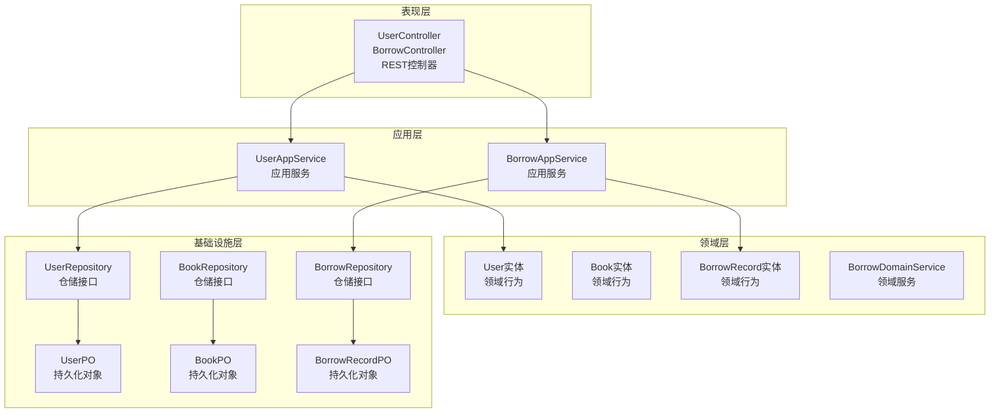
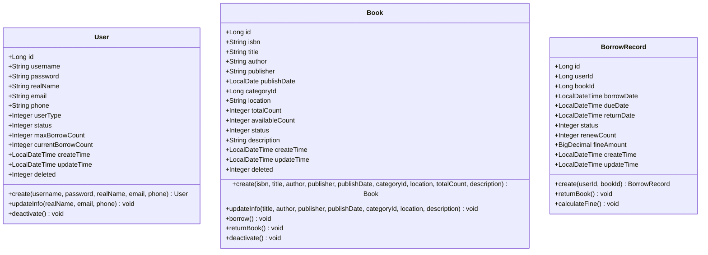
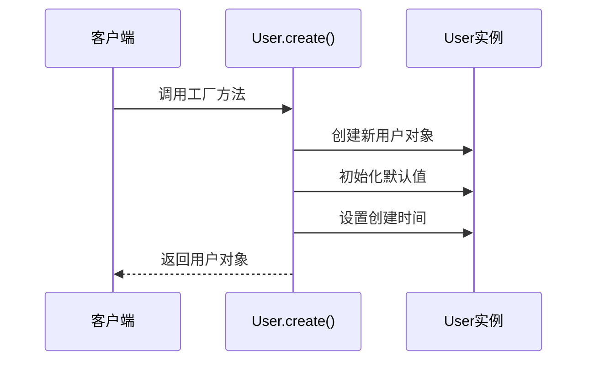
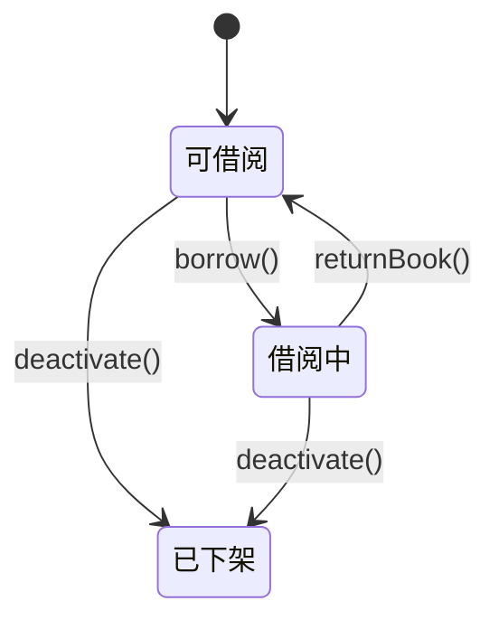
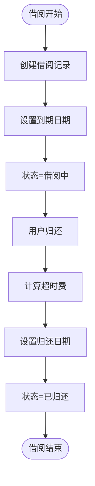
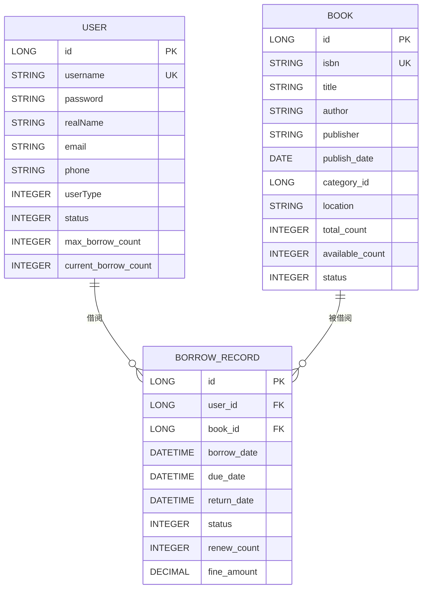

# 实体类设计

<cite>
**本文档引用的文件**
- [User.java](file://src/main/java/com/example/springbootmybatis/domain/model/entity/User.java)
- [Book.java](file://src/main/java/com/example/springbootmybatis/domain/model/entity/Book.java)
- [BorrowRecord.java](file://src/main/java/com/example/springbootmybatis/domain/model/entity/BorrowRecord.java)
- [UserDTO.java](file://src/main/java/com/example/springbootmybatis/application/dto/UserDTO.java)
- [BorrowDTO.java](file://src/main/java/com/example/springbootmybatis/application/dto/BorrowDTO.java)
- [UserAppService.java](file://src/main/java/com/example/springbootmybatis/application/service/UserAppService.java)
- [UserPO.java](file://src/main/java/com/example/springbootmybatis/infrastructure/repository/po/UserPO.java)
- [BookPO.java](file://src/main/java/com/example/springbootmybatis/infrastructure/repository/po/BookPO.java)
- [BorrowRecordPO.java](file://src/main/java/com/example/springbootmybatis/infrastructure/repository/po/BorrowRecordPO.java)
</cite>

## 更新摘要
**所做更改**
- 重构实体类设计文档以反映DDD领域驱动设计架构
- 新增图书(Book)和借阅记录(BorrowRecord)实体类分析
- 更新为包含用户、图书、借阅记录的完整图书馆管理系统实体模型
- 引入领域服务和应用服务的概念
- 更新数据传输对象(DTO)和持久化对象(PO)的设计分析

## 目录
1. [简介](#简介)
2. [项目架构概览](#项目架构概览)
3. [领域模型设计](#领域模型设计)
4. [核心实体类分析](#核心实体类分析)
5. [数据传输对象设计](#数据传输对象设计)
6. [持久化对象设计](#持久化对象设计)
7. [领域服务与应用服务](#领域服务与应用服务)
8. [实体关系分析](#实体关系分析)
9. [最佳实践与设计原则](#最佳实践与设计原则)
10. [性能优化建议](#性能优化建议)
11. [故障排除指南](#故障排除指南)
12. [结论](#结论)

## 简介

本文件全面分析Spring Boot + MyBatis项目中的实体类设计，该设计采用领域驱动设计(DDD)架构，从简单的User实体重构为包含用户、图书、借阅记录等复杂业务实体的完整图书馆管理系统。文档深入探讨了领域实体的设计原则、业务行为封装、数据传输对象和持久化对象的职责分离，以及各层之间的协作关系。

## 项目架构概览

项目采用经典的四层架构设计，实现了清晰的职责分离和关注点分离：

**图表来源**
- [UserAppService.java:15-83](file://src/main/java/com/example/springbootmybatis/application/service/UserAppService.java#L15-L83)
- [BorrowAppService.java:1-50](file://src/main/java/com/example/springbootmybatis/application/service/BorrowAppService.java#L1-L50)
- [User.java:8-158](file://src/main/java/com/example/springbootmybatis/domain/model/entity/User.java#L8-L158)
- [Book.java:9-112](file://src/main/java/com/example/springbootmybatis/domain/model/entity/Book.java#L9-L112)
- [BorrowRecord.java:10-80](file://src/main/java/com/example/springbootmybatis/domain/model/entity/BorrowRecord.java#L10-L80)

## 领域模型设计

### 领域驱动设计原则

项目采用DDD架构，将业务逻辑集中在领域实体中，实现了真正的面向对象设计：

**图表来源**
- [User.java:24-50](file://src/main/java/com/example/springbootmybatis/domain/model/entity/User.java#L24-L50)
- [Book.java:27-76](file://src/main/java/com/example/springbootmybatis/domain/model/entity/Book.java#L27-L76)
- [BorrowRecord.java:24-52](file://src/main/java/com/example/springbootmybatis/domain/model/entity/BorrowRecord.java#L24-L52)

### 业务行为封装

每个实体都封装了相关的业务行为，体现了领域驱动设计的核心思想：

**用户实体业务行为**
- `create()`: 用户创建工厂方法，初始化默认状态和借阅限额
- `updateInfo()`: 用户信息更新，自动更新时间戳
- `deactivate()`: 用户状态变更，软删除实现

**图书实体业务行为**
- `create()`: 图书创建工厂方法，初始化库存和状态
- `borrow()`: 借阅图书，更新可用库存
- `returnBook()`: 归还图书，更新可用库存
- `deactivate()`: 图书状态变更

**借阅记录实体业务行为**
- `create()`: 借阅记录创建，设置默认借阅期限
- `returnBook()`: 归还图书，计算超时费用
- `calculateFine()`: 私有方法，计算超时罚款金额

**章节来源**
- [User.java:24-50](file://src/main/java/com/example/springbootmybatis/domain/model/entity/User.java#L24-L50)
- [Book.java:27-76](file://src/main/java/com/example/springbootmybatis/domain/model/entity/Book.java#L27-L76)
- [BorrowRecord.java:24-52](file://src/main/java/com/example/springbootmybatis/domain/model/entity/BorrowRecord.java#L24-L52)

## 核心实体类分析

### 用户实体(User)

用户实体是图书馆管理系统的核心参与者，承载了完整的用户生命周期管理。

#### 字段定义与业务含义

**标识符字段**
- `id`: 用户唯一标识符，Long类型，数据库自增主键
- `username`: 用户名，String类型，系统唯一标识，用于登录认证
- `password`: 密码，String类型，应进行加密存储

**基本信息字段**
- `realName`: 真实姓名，String类型，用户注册时填写
- `email`: 邮箱地址，String类型，用户联系方式
- `phone`: 电话号码，String类型，用户联系方式

**权限与状态字段**
- `userType`: 用户类型，Integer类型，区分管理员和普通用户
- `status`: 用户状态，Integer类型，1启用，0禁用

**借阅管理字段**
- `maxBorrowCount`: 最大借阅数量，Integer类型，默认10本
- `currentBorrowCount`: 当前借阅数量，Integer类型，默认0本

**审计字段**
- `createTime`: 创建时间，LocalDateTime类型，记录创建时间
- `updateTime`: 更新时间，LocalDateTime类型，记录最后修改时间
- `deleted`: 逻辑删除标识，Integer类型，0未删除，1已删除

#### 工厂方法设计

用户实体提供了专门的工厂方法来创建用户实例，确保用户对象的初始状态正确：

**图表来源**
- [User.java:24-38](file://src/main/java/com/example/springbootmybatis/domain/model/entity/User.java#L24-L38)

**章节来源**
- [User.java:8-158](file://src/main/java/com/example/springbootmybatis/domain/model/entity/User.java#L8-L158)

### 图书实体(Book)

图书实体代表图书馆中的图书资源，包含了完整的图书生命周期管理。

#### 字段定义与业务含义

**标识符字段**
- `id`: 图书唯一标识符，Long类型
- `isbn`: 国际标准书号，String类型，图书唯一标识

**基本信息字段**
- `title`: 书名，String类型
- `author`: 作者，String类型
- `publisher`: 出版社，String类型
- `publishDate`: 出版日期，LocalDate类型

**分类与位置字段**
- `categoryId`: 分类ID，Long类型
- `location`: 书籍位置，String类型，图书馆书架位置

**库存管理字段**
- `totalCount`: 总数量，Integer类型，默认1本
- `availableCount`: 可用数量，Integer类型，初始等于总数

**状态与描述字段**
- `status`: 图书状态，Integer类型，1在架，0下架
- `description`: 图书描述，String类型

**审计字段**
- `createTime`: 创建时间，LocalDateTime类型
- `updateTime`: 更新时间，LocalDateTime类型
- `deleted`: 逻辑删除标识，Integer类型

#### 业务行为实现

图书实体实现了借阅和归还的核心业务逻辑：

**图表来源**
- [Book.java:61-76](file://src/main/java/com/example/springbootmybatis/domain/model/entity/Book.java#L61-L76)

**章节来源**
- [Book.java:9-112](file://src/main/java/com/example/springbootmybatis/domain/model/entity/Book.java#L9-L112)

### 借阅记录实体(BorrowRecord)

借阅记录实体追踪用户的借阅历史和当前借阅状态。

#### 字段定义与业务含义

**标识符字段**
- `id`: 借阅记录唯一标识符，Long类型

**关联字段**
- `userId`: 用户ID，Long类型，关联用户实体
- `bookId`: 图书ID，Long类型，关联图书实体

**时间管理字段**
- `borrowDate`: 借阅日期，LocalDateTime类型
- `dueDate`: 应还日期，LocalDateTime类型，默认30天借阅期
- `returnDate`: 实际归还日期，LocalDateTime类型

**状态与统计字段**
- `status`: 借阅状态，Integer类型，1借阅中，2已归还
- `renewCount`: 续借次数，Integer类型
- `fineAmount`: 罚款金额，BigDecimal类型，默认0

**审计字段**
- `createTime`: 创建时间，LocalDateTime类型
- `updateTime`: 更新时间，LocalDateTime类型

#### 借阅业务逻辑

借阅记录实体实现了复杂的借阅业务逻辑，包括超时费计算：

**图表来源**
- [BorrowRecord.java:36-52](file://src/main/java/com/example/springbootmybatis/domain/model/entity/BorrowRecord.java#L36-L52)

**章节来源**
- [BorrowRecord.java:10-80](file://src/main/java/com/example/springbootmybatis/domain/model/entity/BorrowRecord.java#L10-L80)

## 数据传输对象设计

### 用户DTO(UserDTO)

用户DTO用于应用层和表现层之间的数据传输，采用了精简设计以满足上游业务需求。

#### 字段设计原则

用户DTO采用了最小化设计，只包含应用层所需的字段：

- `id`: 用户标识符
- `username`: 用户名
- `password`: 密码
- `realName`: 真实姓名
- `email`: 邮箱
- `phone`: 电话
- `userType`: 用户类型
- `status`: 用户状态
- `maxBorrowCount`: 最大借阅数量
- `currentBorrowCount`: 当前借阅数量

这种设计遵循了DTO的单一职责原则，避免了领域模型的复杂性泄露到应用层。

**章节来源**
- [UserDTO.java:6-99](file://src/main/java/com/example/springbootmybatis/application/dto/UserDTO.java#L6-L99)

### 借阅DTO(BorrowDTO)

借阅DTO专门用于借阅业务的数据传输，包含了借阅过程中的关键信息。

#### 字段设计分析

借阅DTO的设计充分考虑了借阅业务的特殊需求：

- `id`: 借阅记录标识符
- `userId`: 用户ID
- `bookId`: 图书ID
- `borrowDate`: 借阅日期
- `dueDate`: 到期日期
- `returnDate`: 归还日期
- `status`: 借阅状态
- `renewCount`: 续借次数
- `fineAmount`: 罚款金额

这种设计确保了借阅业务的完整性和准确性，同时保持了数据传输的简洁性。

**章节来源**
- [BorrowDTO.java:9-48](file://src/main/java/com/example/springbootmybatis/application/dto/BorrowDTO.java#L9-L48)

## 持久化对象设计

### 用户PO(UserPO)

用户PO完全对应数据库表结构，采用了Lombok注解简化代码。

#### PO设计特点

用户PO采用了标准的数据库映射设计：

- 字段名称与数据库列名一一对应
- 使用Lombok的@Data注解自动生成getter、setter、toString方法
- 包含所有数据库字段，支持完整的CRUD操作
- 保持与User实体的字段一致性

这种设计确保了ORM映射的准确性和性能优化。

**章节来源**
- [UserPO.java:10-24](file://src/main/java/com/example/springbootmybatis/infrastructure/repository/po/UserPO.java#L10-L24)

### 图书PO(BookPO)

图书PO同样遵循数据库映射的最佳实践，支持完整的图书管理功能。

#### 字段映射策略

图书PO的字段映射策略体现了数据库设计的规范化：

- 基本信息字段：title、author、publisher、description
- 数值字段：totalCount、availableCount、status
- 日期字段：publishDate、createTime、updateTime
- 外键字段：categoryId
- 审计字段：deleted

这种映射策略确保了数据的一致性和完整性。

**章节来源**
- [BookPO.java:11-27](file://src/main/java/com/example/springbootmybatis/infrastructure/repository/po/BookPO.java#L11-L27)

### 借阅记录PO(BorrowRecordPO)

借阅记录PO专门用于借阅业务的持久化存储。

#### 业务相关字段设计

借阅记录PO的设计重点关注借阅业务的完整性：

- 用户和图书关联：userId、bookId
- 时间相关字段：borrowDate、dueDate、returnDate
- 状态字段：status
- 业务计算字段：renewCount、fineAmount
- 审计字段：createTime、updateTime

这种设计确保了借阅历史的完整记录和业务计算的准确性。

**章节来源**
- [BorrowRecordPO.java:11-23](file://src/main/java/com/example/springbootmybatis/infrastructure/repository/po/BorrowRecordPO.java#L11-L23)

## 领域服务与应用服务

### 领域服务(BorrowDomainService)

领域服务封装了复杂的业务逻辑，特别是借阅相关的领域知识。

#### 服务职责

BorrowDomainService负责处理借阅业务的核心逻辑：

- 借阅规则验证
- 库存状态检查
- 超时费计算
- 借阅期限管理

这些职责体现了领域服务的单一职责原则，将复杂的业务逻辑集中在专门的服务中。

**章节来源**
- [BorrowDomainService.java:1-50](file://src/main/java/com/example/springbootmybatis/domain/service/BorrowDomainService.java#L1-L50)

### 应用服务(UserAppService)

应用服务协调领域对象和基础设施，提供用例级别的业务操作。

#### 服务功能

UserAppService提供了完整的用户管理用例：

- 用户查询操作：按ID、用户名、状态查询
- 用户管理操作：新增、更新、删除
- 数据转换：DTO与领域模型之间的转换

应用服务作为用例的协调者，确保业务流程的正确执行。

**章节来源**
- [UserAppService.java:16-83](file://src/main/java/com/example/springbootmybatis/application/service/UserAppService.java#L16-L83)

## 实体关系分析

### 领域模型关系图

项目中的三个核心实体形成了清晰的业务关系：

**图表来源**
- [User.java:9-21](file://src/main/java/com/example/springbootmybatis/domain/model/entity/User.java#L9-L21)
- [Book.java:10-24](file://src/main/java/com/example/springbootmybatis/domain/model/entity/Book.java#L10-L24)
- [BorrowRecord.java:11-22](file://src/main/java/com/example/springbootmybatis/domain/model/entity/BorrowRecord.java#L11-L22)

### 业务规则约束

实体间的关系体现了图书馆管理的业务规则：

**一对一关系**
- 每个借阅记录对应一个用户和一本书
- 用户与借阅记录是一对多关系
- 图书与借阅记录是一对多关系

**状态约束**
- 图书的availableCount必须小于等于totalCount
- 用户的currentBorrowCount不能超过maxBorrowCount
- 借阅记录的状态必须符合业务流程

**时间约束**
- borrowDate必须早于dueDate
- returnDate必须晚于borrowDate
- 超时费计算基于dueDate和returnDate的差异

**章节来源**
- [Book.java:61-76](file://src/main/java/com/example/springbootmybatis/domain/model/entity/Book.java#L61-L76)
- [BorrowRecord.java:45-52](file://src/main/java/com/example/springbootmybatis/domain/model/entity/BorrowRecord.java#L45-L52)

## 最佳实践与设计原则

### DDD设计原则

项目严格遵循领域驱动设计的核心原则：

**聚合根设计**
- User、Book、BorrowRecord都是独立的聚合根
- 每个聚合根维护自己的不变性约束
- 聚合间的关联通过ID而非直接对象引用

**值对象识别**
- 时间类型使用Java 8的时间API，支持时区处理
- BigDecimal用于精确的货币计算
- LocalDate用于日期处理，避免时间部分

**领域事件**
- 通过实体方法触发业务状态变化
- 自动更新时间戳，确保审计信息的准确性

### 代码组织最佳实践

**包结构设计**
- `domain.model.entity`: 领域实体
- `application.dto`: 应用层数据传输对象
- `infrastructure.repository.po`: 基础设施层持久化对象
- `domain.service`: 领域服务
- `application.service`: 应用服务

**命名约定**
- 实体类使用名词短语，如User、Book、BorrowRecord
- DTO使用名词短语+DTO后缀
- PO使用名词短语+PO后缀
- 服务类使用名词短语+Service后缀

**接口设计**
- Repository接口定义领域抽象
- DTO和PO提供数据传输和持久化支持
- 服务接口暴露业务能力

### 性能优化策略

**延迟加载**
- 通过Repository接口实现按需加载
- 避免不必要的关联查询
- 使用分页查询处理大数据量

**缓存策略**
- 用户和图书信息可以缓存
- 借阅记录查询结果可以缓存
- 使用适当的缓存失效策略

**批量操作**
- 支持批量保存和更新操作
- 优化数据库连接池配置
- 使用事务管理保证数据一致性

## 性能优化建议

### 数据库层面优化

**索引策略**
- 在User表的username字段建立唯一索引
- 在Book表的isbn字段建立唯一索引
- 在BorrowRecord表的userId和bookId上建立复合索引
- 在所有状态字段上建立索引以支持查询过滤

**查询优化**
- 使用投影查询只获取必要字段
- 实现分页查询处理大数据量
- 使用连接查询优化关联查询

**事务管理**
- 合理设置事务隔离级别
- 使用合适的超时时间
- 实现事务回滚策略

### 应用层面优化

**缓存策略**
- 实现多级缓存：本地缓存+分布式缓存
- 使用缓存预热减少首次访问延迟
- 实现智能缓存失效机制

**异步处理**
- 借阅记录的超时费计算可以异步处理
- 用户通知可以通过消息队列异步发送
- 大量数据导入可以异步处理

**连接池配置**
- 合理配置数据库连接池大小
- 实现连接池监控和告警
- 使用连接池健康检查

## 故障排除指南

### 常见问题诊断

**实体状态不一致**
- **症状**: 借阅记录状态与图书库存不匹配
- **排查**: 检查borrow()和returnBook()方法的调用顺序
- **解决方案**: 确保业务逻辑的原子性，使用事务保证一致性

**时间相关问题**
- **症状**: 借阅日期和到期日期计算错误
- **排查**: 检查LocalDateTime的时区配置
- **解决方案**: 统一使用系统默认时区，避免跨时区问题

**金额精度问题**
- **症状**: 超时费计算出现精度丢失
- **排查**: 检查BigDecimal的使用方式
- **解决方案**: 使用setScale()方法指定精度，避免浮点数运算

### 监控和调试

**关键监控指标**
- 实体创建和更新的性能指标
- 业务操作的成功率和失败率
- 数据库查询的响应时间和错误率

**日志记录**
- 记录关键业务操作的日志
- 记录异常情况和错误堆栈
- 实现审计日志跟踪用户操作

**测试策略**
- 单元测试覆盖核心业务逻辑
- 集成测试验证实体关系
- 性能测试评估系统瓶颈

## 结论

本次实体类设计重构成功地将简单的User实体升级为包含用户、图书、借阅记录的完整图书馆管理系统，体现了领域驱动设计的精髓和现代企业应用开发的最佳实践。

### 设计成就

**架构完整性**
- 实现了清晰的分层架构和职责分离
- 建立了完整的领域模型和业务逻辑封装
- 提供了灵活的数据传输和持久化支持

**业务覆盖度**
- 支持完整的用户管理功能
- 实现图书借阅和归还业务流程
- 提供借阅历史追踪和超时费计算

**技术先进性**
- 采用Java 8时间API处理时间数据
- 使用BigDecimal确保金额计算精度
- 实现DDD架构模式的最佳实践

### 技术创新点

**领域行为封装**
- 每个实体都封装了相关的业务行为
- 工厂方法确保对象的正确初始化
- 自动化的状态管理和时间戳更新

**数据模型设计**
- DTO和PO的职责分离确保了数据传输的简洁性
- 完整的数据库映射支持CRUD操作
- 合理的字段设计支持业务需求

**服务层架构**
- 应用服务协调领域对象和基础设施
- 领域服务封装复杂业务逻辑
- 清晰的接口设计支持扩展性

### 改进建议

**安全性增强**
- 实现密码加密存储
- 添加用户权限验证机制
- 实现操作审计和日志记录

**性能优化**
- 实现智能缓存策略
- 优化数据库查询性能
- 实现异步处理机制

**监控完善**
- 添加系统性能监控
- 实现业务指标统计
- 建立告警和通知机制

该实体类设计为图书馆管理系统的稳定运行和持续发展奠定了坚实的基础，符合现代企业级应用开发的质量要求和最佳实践标准。