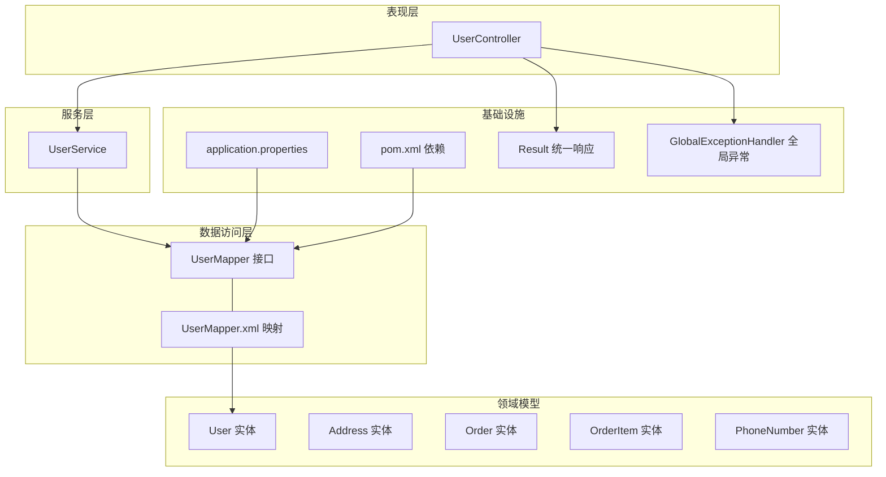
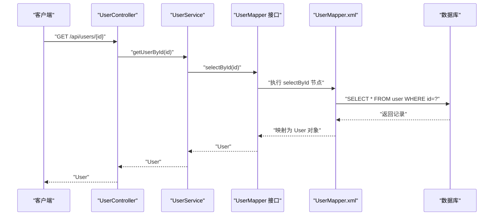
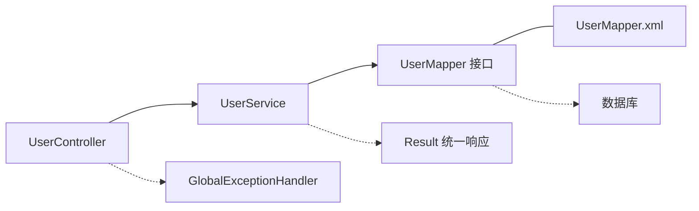

# 数据模型设计

<cite>
**本文引用的文件**
- [User.java](file://src/main/java/com/example/springbootmybatis/entity/User.java)
- [Address.java](file://src/main/java/com/example/springbootmybatis/entity/Address.java)
- [Order.java](file://src/main/java/com/example/springbootmybatis/entity/Order.java)
- [OrderItem.java](file://src/main/java/com/example/springbootmybatis/entity/OrderItem.java)
- [PhoneNumber.java](file://src/main/java/com/example/springbootmybatis/entity/PhoneNumber.java)
- [UserMapper.java](file://src/main/java/com/example/springbootmybatis/mapper/UserMapper.java)
- [UserService.java](file://src/main/java/com/example/springbootmybatis/service/UserService.java)
- [UserController.java](file://src/main/java/com/example/springbootmybatis/controller/UserController.java)
- [UserMapper.xml](file://src/main/resources/mapper/UserMapper.xml)
- [application.properties](file://src/main/resources/application.properties)
- [pom.xml](file://pom.xml)
- [Result.java](file://src/main/java/com/example/springbootmybatis/common/Result.java)
- [GlobalExceptionHandler.java](file://src/main/java/com/example/springbootmybatis/advice/GlobalExceptionHandler.java)
- [TestController.java](file://src/main/java/com/example/springbootmybatis/controller/TestController.java)
</cite>

## 目录
1. [引言](#引言)
2. [项目结构](#项目结构)
3. [核心组件](#核心组件)
4. [架构总览](#架构总览)
5. [详细组件分析](#详细组件分析)
6. [依赖分析](#依赖分析)
7. [性能考虑](#性能考虑)
8. [故障排查指南](#故障排查指南)
9. [结论](#结论)
10. [附录](#附录)

## 引言
本文件面向Spring Boot + MyBatis的仓储项目，聚焦于数据模型设计与实现细节。文档从实体类设计原则、字段映射关系、Lombok注解的使用与代码简化效果出发，系统阐述User、Address、Order、OrderItem、PhoneNumber等核心实体的属性定义与业务含义；进一步说明一对一、一对多关系映射思路；给出数据库表结构设计与字段约束建议；总结实体验证与业务规则实现方式；展示数据访问模式与性能优化策略，并提供数据生命周期管理与迁移路径建议。

## 项目结构
项目采用分层架构：控制器层（Controller）、服务层（Service）、数据访问层（Mapper + XML）、实体层（Entity），并辅以统一响应封装与全局异常处理。MyBatis通过XML映射文件完成SQL与实体的绑定，应用通过application.properties进行数据源与MyBatis配置。



图表来源
- [UserController.java](file://src/main/java/com/example/springbootmybatis/controller/UserController.java#L1-L68)
- [UserService.java](file://src/main/java/com/example/springbootmybatis/service/UserService.java#L1-L42)
- [UserMapper.java](file://src/main/java/com/example/springbootmybatis/mapper/UserMapper.java#L1-L23)
- [UserMapper.xml](file://src/main/resources/mapper/UserMapper.xml#L1-L57)
- [application.properties](file://src/main/resources/application.properties#L1-L16)
- [pom.xml](file://pom.xml#L1-L88)
- [Result.java](file://src/main/java/com/example/springbootmybatis/common/Result.java#L1-L87)
- [GlobalExceptionHandler.java](file://src/main/java/com/example/springbootmybatis/advice/GlobalExceptionHandler.java#L1-L22)

章节来源
- [application.properties](file://src/main/resources/application.properties#L1-L16)
- [pom.xml](file://pom.xml#L1-L88)

## 核心组件
- 实体层：User、Address、Order、OrderItem、PhoneNumber
- 数据访问层：UserMapper接口与UserMapper.xml映射
- 服务层：UserService聚合Mapper能力
- 控制器层：UserController暴露REST接口
- 基础设施：application.properties配置、Result统一响应、GlobalExceptionHandler全局异常

章节来源
- [User.java](file://src/main/java/com/example/springbootmybatis/entity/User.java#L1-L21)
- [Address.java](file://src/main/java/com/example/springbootmybatis/entity/Address.java#L1-L17)
- [Order.java](file://src/main/java/com/example/springbootmybatis/entity/Order.java#L1-L18)
- [OrderItem.java](file://src/main/java/com/example/springbootmybatis/entity/OrderItem.java#L1-L16)
- [PhoneNumber.java](file://src/main/java/com/example/springbootmybatis/entity/PhoneNumber.java#L1-L11)
- [UserMapper.java](file://src/main/java/com/example/springbootmybatis/mapper/UserMapper.java#L1-L23)
- [UserMapper.xml](file://src/main/resources/mapper/UserMapper.xml#L1-L57)
- [UserService.java](file://src/main/java/com/example/springbootmybatis/service/UserService.java#L1-L42)
- [UserController.java](file://src/main/java/com/example/springbootmybatis/controller/UserController.java#L1-L68)
- [Result.java](file://src/main/java/com/example/springbootmybatis/common/Result.java#L1-L87)
- [GlobalExceptionHandler.java](file://src/main/java/com/example/springbootmybatis/advice/GlobalExceptionHandler.java#L1-L22)

## 架构总览
下图展示了从HTTP请求到数据库读写的完整调用链路，体现MyBatis的XML映射与Spring依赖注入的作用。



图表来源
- [UserController.java](file://src/main/java/com/example/springbootmybatis/controller/UserController.java#L17-L20)
- [UserService.java](file://src/main/java/com/example/springbootmybatis/service/UserService.java#L15-L17)
- [UserMapper.java](file://src/main/java/com/example/springbootmybatis/mapper/UserMapper.java#L10-L10)
- [UserMapper.xml](file://src/main/resources/mapper/UserMapper.xml#L21-L23)

## 详细组件分析

### 实体类设计原则与字段映射
- 设计原则
  - 字段命名遵循驼峰与下划线自动映射策略（由配置开启）
  - 使用Lombok注解减少样板代码，提升可读性与维护性
  - 领域对象仅承载数据与简单行为，避免复杂业务逻辑
- 字段映射
  - application.properties中启用下划转驼峰映射，确保数据库列名与实体属性自动对应
  - UserMapper.xml通过resultMap显式声明列与属性的映射关系，保证字段一致性

章节来源
- [application.properties](file://src/main/resources/application.properties#L12-L12)
- [UserMapper.xml](file://src/main/resources/mapper/UserMapper.xml#L5-L19)

### User 实体
- 属性与业务含义
  - 用户标识、登录凭据、实名信息、联系方式、用户类型、状态、借阅限额与当前借阅数量、创建/更新时间、软删标记
- Lombok注解效果
  - 自动生成getter/setter/toString等方法，显著减少重复代码
- 关系映射
  - 作为订单主表（Order）的关联方，通常在Order中维护外键指向User.id
- 字段约束建议
  - id：主键自增
  - username：唯一索引
  - email/phone：唯一或唯一索引，配合校验规则
  - status/deleted：枚举化或字典值，便于查询与统计
  - create_time/update_time：默认值与时效性控制

章节来源
- [User.java](file://src/main/java/com/example/springbootmybatis/entity/User.java#L8-L21)
- [UserMapper.xml](file://src/main/resources/mapper/UserMapper.xml#L5-L19)

### Address 实体
- 属性与业务含义
  - 街道、城市、邮编，用于表达用户的地址信息
- JSON注解
  - 使用Jackson注解将JSON字段名与实体属性映射，便于前后端交互
- 关系映射
  - 一对一：每个User拥有一个Address；或一对多：多个地址（如收货地址、发票地址）需扩展为集合
- 字段约束建议
  - 复合唯一索引（用户+地址类型）或单独地址类型字段

章节来源
- [Address.java](file://src/main/java/com/example/springbootmybatis/entity/Address.java#L11-L16)

### Order 实体
- 属性与业务含义
  - 订单号、下单日期、商品明细集合、总金额
- 关系映射
  - 一对多：Order包含多个OrderItem；OrderItem通过外键关联Order
- 字段约束建议
  - 订单号唯一；总金额与明细金额一致性校验（业务层）

章节来源
- [Order.java](file://src/main/java/com/example/springbootmybatis/entity/Order.java#L10-L18)

### OrderItem 实体
- 属性与业务含义
  - 商品编号、名称、数量、单价
- 关系映射
  - 多对一：多个OrderItem属于一个Order；一对一：与Product建立关联（扩展）
- 字段约束建议
  - 数量与单价非负；与Order的总金额保持一致

章节来源
- [OrderItem.java](file://src/main/java/com/example/springbootmybatis/entity/OrderItem.java#L8-L16)

### PhoneNumber 实体
- 属性与业务含义
  - 号码类型、号码值，用于表达用户多种联系方式
- JSON注解
  - 通过Jackson注解实现灵活的序列化/反序列化
- 关系映射
  - 一对多：一个User可拥有多个PhoneNumber

章节来源
- [PhoneNumber.java](file://src/main/java/com/example/springbootmybatis/entity/PhoneNumber.java#L9-L11)

### Lombok 注解使用与代码简化
- 常见注解
  - @Data：生成getter、setter、toString、equals、hashCode
- 效果
  - 显著减少样板代码，提升开发效率；保持实体简洁易读
- 注意事项
  - 在需要精确控制序列化/反序列化时，结合Jackson注解使用

章节来源
- [User.java](file://src/main/java/com/example/springbootmybatis/entity/User.java#L6-L6)
- [Address.java](file://src/main/java/com/example/springbootmybatis/entity/Address.java#L5-L5)
- [Order.java](file://src/main/java/com/example/springbootmybatis/entity/Order.java#L4-L4)
- [OrderItem.java](file://src/main/java/com/example/springbootmybatis/entity/OrderItem.java#L4-L4)
- [PhoneNumber.java](file://src/main/java/com/example/springbootmybatis/entity/PhoneNumber.java#L4-L4)

### 数据库表结构设计与字段约束
- User 表
  - 主键：id（自增）
  - 唯一索引：username
  - 索引：status、deleted
  - 时间字段：create_time、update_time（默认值与时序）
- Address 表
  - 外键：user_id 指向 User.id
  - 唯一索引：(user_id, address_type)
- Order 表
  - 主键：order_id（或自增id）
  - 唯一索引：order_no
  - 外键：user_id 指向 User.id
- OrderItem 表
  - 外键：order_id 指向 Order.id
  - 复合主键：(order_id, product_id)
- PhoneNumber 表
  - 外键：user_id 指向 User.id
  - 索引：type

章节来源
- [UserMapper.xml](file://src/main/resources/mapper/UserMapper.xml#L37-L40)
- [UserMapper.xml](file://src/main/resources/mapper/UserMapper.xml#L42-L51)

### 实体验证规则与业务规则
- 验证规则
  - 邮箱格式、手机号格式、用户名唯一性、密码强度（扩展）
- 业务规则
  - 借阅上限校验：当前借阅数量不超过最大借阅数量
  - 订单金额一致性：Order.total_amount = Σ(OrderItem.price × quantity)
  - 软删除：deleted=1表示逻辑删除，查询默认过滤deleted=0
- 实现位置
  - 控制器层：参数校验与错误提示
  - 服务层：业务规则校验与事务边界
  - 数据访问层：软删除与条件查询

章节来源
- [UserController.java](file://src/main/java/com/example/springbootmybatis/controller/UserController.java#L43-L49)
- [UserService.java](file://src/main/java/com/example/springbootmybatis/service/UserService.java#L31-L37)
- [User.java](file://src/main/java/com/example/springbootmybatis/entity/User.java#L16-L17)

### 数据访问模式与MyBatis映射
- Mapper接口
  - 定义CRUD方法，交由MyBatis动态代理实现
- XML映射
  - 通过resultMap将数据库列映射到实体属性
  - SQL语句按需编写，支持条件查询与批量操作
- 控制器与服务
  - 控制器负责参数接收与响应封装
  - 服务层组合Mapper，承担事务与业务编排

章节来源
- [UserMapper.java](file://src/main/java/com/example/springbootmybatis/mapper/UserMapper.java#L8-L23)
- [UserMapper.xml](file://src/main/resources/mapper/UserMapper.xml#L5-L19)
- [UserService.java](file://src/main/java/com/example/springbootmybatis/service/UserService.java#L15-L41)
- [UserController.java](file://src/main/java/com/example/springbootmybatis/controller/UserController.java#L17-L67)

### 类关系图（实体）
```mermaid
classDiagram
class User {
+Long id
+String username
+String password
+String realName
+String email
+String phone
+Integer userType
+Integer status
+Integer maxBorrowCount
+Integer currentBorrowCount
+LocalDateTime createTime
+LocalDateTime updateTime
+Integer deleted
}
class Address {
+String street
+String city
+String zipCode
}
class Order {
+String orderId
+String orderDate
+OrderItem[] items
+double totalAmount
}
class OrderItem {
+String productId
+String productName
+int quantity
+double price
}
class PhoneNumber {
+String type
+String number
}
User "1" o-- "0..1" Address : "拥有"
User "1" o-- "0..*" PhoneNumber : "拥有"
Order "1" "0..*" OrderItem : "包含"
```

图表来源
- [User.java](file://src/main/java/com/example/springbootmybatis/entity/User.java#L8-L21)
- [Address.java](file://src/main/java/com/example/springbootmybatis/entity/Address.java#L11-L16)
- [Order.java](file://src/main/java/com/example/springbootmybatis/entity/Order.java#L14-L15)
- [OrderItem.java](file://src/main/java/com/example/springbootmybatis/entity/OrderItem.java#L8-L16)
- [PhoneNumber.java](file://src/main/java/com/example/springbootmybatis/entity/PhoneNumber.java#L9-L11)

## 依赖分析
- 组件耦合
  - Controller依赖Service，Service依赖Mapper，形成清晰的单向依赖
- 外部依赖
  - Spring Boot Starter、MyBatis Starter、MySQL驱动、Lombok
- 配置依赖
  - application.properties中的数据源与MyBatis配置决定运行期行为



图表来源
- [UserController.java](file://src/main/java/com/example/springbootmybatis/controller/UserController.java#L14-L15)
- [UserService.java](file://src/main/java/com/example/springbootmybatis/service/UserService.java#L12-L13)
- [UserMapper.java](file://src/main/java/com/example/springbootmybatis/mapper/UserMapper.java#L3-L3)
- [UserMapper.xml](file://src/main/resources/mapper/UserMapper.xml#L3-L3)
- [Result.java](file://src/main/java/com/example/springbootmybatis/common/Result.java#L8-L14)
- [GlobalExceptionHandler.java](file://src/main/java/com/example/springbootmybatis/advice/GlobalExceptionHandler.java#L10-L11)

章节来源
- [pom.xml](file://pom.xml#L32-L67)
- [application.properties](file://src/main/resources/application.properties#L3-L15)

## 性能考虑
- 查询优化
  - 为高频查询字段（如username、status、deleted）建立索引
  - 使用选择性高的字段作为查询条件，避免全表扫描
- 写入优化
  - 批量插入与更新（扩展Mapper支持批量）
  - 合理使用事务，避免长事务阻塞
- 缓存策略
  - 对热点数据（如用户基本信息）引入缓存（Redis/本地缓存）
- 分页与排序
  - 大数据量场景使用分页查询与合适排序字段
- 日志与监控
  - 开启慢查询日志与SQL执行时间监控

## 故障排查指南
- 统一响应与异常处理
  - 全局异常处理器捕获异常并返回标准化结果
  - 控制器层对业务失败进行明确提示
- 常见问题定位
  - 参数校验失败：检查控制器层参数绑定与校验逻辑
  - 数据库连接失败：核对application.properties中的连接配置
  - 映射异常：确认resultMap列名与数据库字段一致
- 测试辅助
  - 提供基础测试接口验证服务可用性

章节来源
- [GlobalExceptionHandler.java](file://src/main/java/com/example/springbootmybatis/advice/GlobalExceptionHandler.java#L13-L21)
- [Result.java](file://src/main/java/com/example/springbootmybatis/common/Result.java#L31-L53)
- [UserController.java](file://src/main/java/com/example/springbootmybatis/controller/UserController.java#L37-L40)
- [TestController.java](file://src/main/java/com/example/springbootmybatis/controller/TestController.java#L13-L20)

## 结论
本项目以简洁的实体模型与清晰的分层架构为基础，借助Lombok与MyBatis XML映射实现了高效的数据持久化。通过合理的字段映射、关系建模与约束设计，能够支撑基本的用户、地址、订单与商品明细管理场景。建议后续在验证规则、业务规则、缓存与分页等方面进一步完善，并配套完善的迁移脚本与监控体系，保障系统的稳定性与可演进性。

## 附录

### 数据生命周期管理与迁移路径
- 生命周期阶段
  - 初始化：创建数据库与表结构，导入基础数据
  - 运行期：日常增删改查、软删除、备份与归档
  - 升级：结构变更（新增/重命名/删除字段）、索引优化、迁移脚本
- 迁移策略
  - 版本化迁移：使用迁移工具（Flyway/Liquibase）管理版本
  - 渐进式变更：先加列、再补数据、最后启用新逻辑
  - 回滚预案：保留备份与回滚脚本，确保变更可逆
- 规范建议
  - 新增字段采用非空+默认值策略，逐步替换旧逻辑
  - 删除字段采用软删除与废弃字段标记，避免破坏历史数据