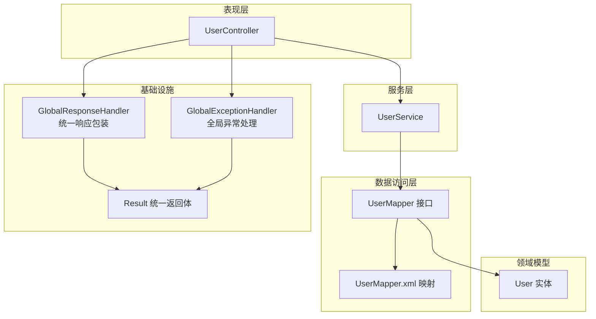
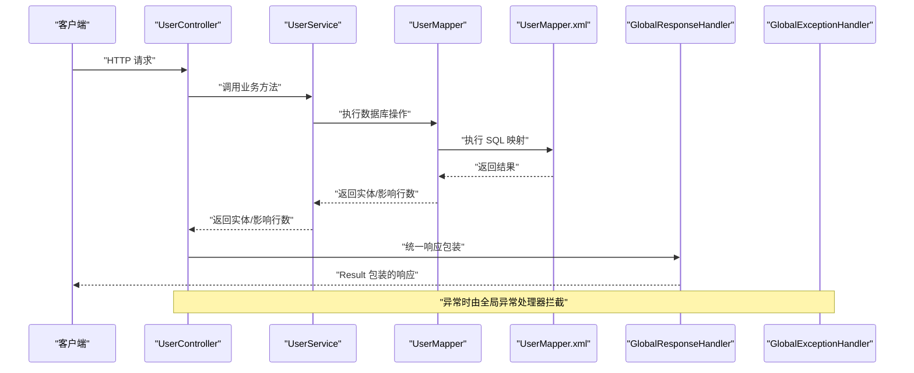
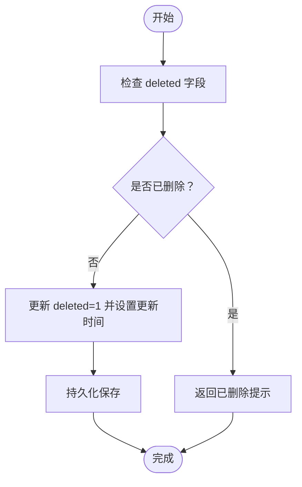
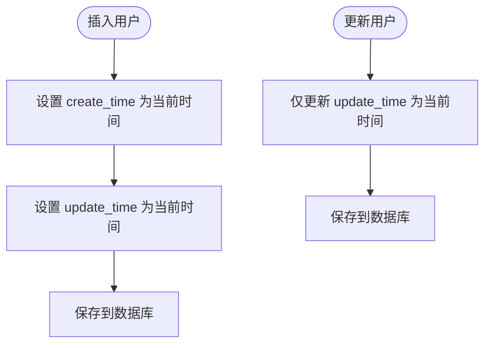
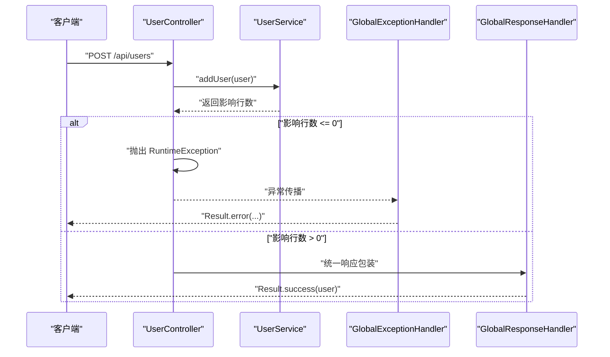
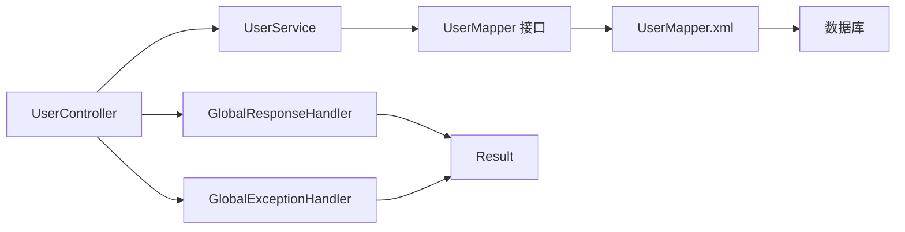

# 数据验证规则

<cite>
**本文引用的文件**
- [User.java](file://src/main/java/com/example/springbootmybatis/entity/User.java)
- [UserMapper.java](file://src/main/java/com/example/springbootmybatis/mapper/UserMapper.java)
- [UserMapper.xml](file://src/main/resources/mapper/UserMapper.xml)
- [UserService.java](file://src/main/java/com/example/springbootmybatis/service/UserService.java)
- [UserController.java](file://src/main/java/com/example/springbootmybatis/controller/UserController.java)
- [GlobalExceptionHandler.java](file://src/main/java/com/example/springbootmybatis/advice/GlobalExceptionHandler.java)
- [GlobalResponseHandler.java](file://src/main/java/com/example/springbootmybatis/advice/GlobalResponseHandler.java)
- [Result.java](file://src/main/java/com/example/springbootmybatis/common/Result.java)
- [TestController.java](file://src/main/java/com/example/springbootmybatis/controller/TestController.java)
- [pom.xml](file://pom.xml)
</cite>

## 目录
1. [简介](#简介)
2. [项目结构](#项目结构)
3. [核心组件](#核心组件)
4. [架构总览](#架构总览)
5. [详细组件分析](#详细组件分析)
6. [依赖关系分析](#依赖关系分析)
7. [性能考量](#性能考量)
8. [故障排查指南](#故障排查指南)
9. [结论](#结论)
10. [附录](#附录)

## 简介
本文件聚焦于实体类中的数据验证策略与业务规则实现，结合现有代码库梳理字段约束、逻辑删除机制、时间戳维护策略、数据完整性与异常处理，并给出最佳实践与扩展建议。需要特别说明：当前仓库未包含基于注解（如 Jakarta Bean Validation）的显式字段校验规则；所有验证逻辑主要通过服务层与数据库层面进行控制。

## 项目结构
项目采用典型的 Spring Boot + MyBatis 分层架构，围绕用户实体展开，包含控制器、服务层、数据访问层、全局响应与异常处理以及通用返回体封装。

图表来源
- [UserController.java](file://src/main/java/com/example/springbootmybatis/controller/UserController.java#L1-L68)
- [UserService.java](file://src/main/java/com/example/springbootmybatis/service/UserService.java#L1-L42)
- [UserMapper.java](file://src/main/java/com/example/springbootmybatis/mapper/UserMapper.java#L1-L23)
- [UserMapper.xml](file://src/main/resources/mapper/UserMapper.xml#L1-L57)
- [User.java](file://src/main/java/com/example/springbootmybatis/entity/User.java#L1-L21)
- [GlobalResponseHandler.java](file://src/main/java/com/example/springbootmybatis/advice/GlobalResponseHandler.java#L1-L39)
- [GlobalExceptionHandler.java](file://src/main/java/com/example/springbootmybatis/advice/GlobalExceptionHandler.java#L1-L22)
- [Result.java](file://src/main/java/com/example/springbootmybatis/common/Result.java#L1-L87)

章节来源
- [UserController.java](file://src/main/java/com/example/springbootmybatis/controller/UserController.java#L1-L68)
- [UserService.java](file://src/main/java/com/example/springbootmybatis/service/UserService.java#L1-L42)
- [UserMapper.java](file://src/main/java/com/example/springbootmybatis/mapper/UserMapper.java#L1-L23)
- [UserMapper.xml](file://src/main/resources/mapper/UserMapper.xml#L1-L57)
- [User.java](file://src/main/java/com/example/springbootmybatis/entity/User.java#L1-L21)
- [GlobalResponseHandler.java](file://src/main/java/com/example/springbootmybatis/advice/GlobalResponseHandler.java#L1-L39)
- [GlobalExceptionHandler.java](file://src/main/java/com/example/springbootmybatis/advice/GlobalExceptionHandler.java#L1-L22)
- [Result.java](file://src/main/java/com/example/springbootmybatis/common/Result.java#L1-L87)

## 核心组件
- 实体 User：承载用户数据模型，包含基础字段与逻辑删除标志位 deleted。
- 数据访问层：UserMapper 接口与 UserMapper.xml 映射文件，负责 CRUD 与查询。
- 服务层：UserService 封装业务流程，协调数据访问与返回值处理。
- 控制器：UserController 提供 REST 接口，调用服务层并进行基本结果判定。
- 响应与异常：GlobalResponseHandler 统一封装响应；GlobalExceptionHandler 统一捕获异常并转换为 Result。

章节来源
- [User.java](file://src/main/java/com/example/springbootmybatis/entity/User.java#L1-L21)
- [UserMapper.java](file://src/main/java/com/example/springbootmybatis/mapper/UserMapper.java#L1-L23)
- [UserMapper.xml](file://src/main/resources/mapper/UserMapper.xml#L1-L57)
- [UserService.java](file://src/main/java/com/example/springbootmybatis/service/UserService.java#L1-L42)
- [UserController.java](file://src/main/java/com/example/springbootmybatis/controller/UserController.java#L1-L68)
- [GlobalResponseHandler.java](file://src/main/java/com/example/springbootmybatis/advice/GlobalResponseHandler.java#L1-L39)
- [GlobalExceptionHandler.java](file://src/main/java/com/example/springbootmybatis/advice/GlobalExceptionHandler.java#L1-L22)
- [Result.java](file://src/main/java/com/example/springbootmybatis/common/Result.java#L1-L87)

## 架构总览
下图展示从控制器到数据库的端到端调用链路，以及响应与异常处理的统一出口。

图表来源
- [UserController.java](file://src/main/java/com/example/springbootmybatis/controller/UserController.java#L1-L68)
- [UserService.java](file://src/main/java/com/example/springbootmybatis/service/UserService.java#L1-L42)
- [UserMapper.java](file://src/main/java/com/example/springbootmybatis/mapper/UserMapper.java#L1-L23)
- [UserMapper.xml](file://src/main/resources/mapper/UserMapper.xml#L1-L57)
- [GlobalResponseHandler.java](file://src/main/java/com/example/springbootmybatis/advice/GlobalResponseHandler.java#L1-L39)
- [GlobalExceptionHandler.java](file://src/main/java/com/example/springbootmybatis/advice/GlobalExceptionHandler.java#L1-L22)

## 详细组件分析

### 实体类 User 的字段与业务规则
- 字段清单与含义
  - id：主键
  - username：用户名
  - password：密码
  - realName：真实姓名
  - email：电子邮箱
  - phone：电话号码
  - userType：用户类型（整型）
  - status：状态（整型）
  - maxBorrowCount：最大可借阅数量
  - currentBorrowCount：当前已借阅数量
  - createTime：创建时间
  - updateTime：更新时间
  - deleted：逻辑删除标志（整型）

- 当前实现中的约束与规则
  - 字段长度与格式：未在实体上声明长度或正则约束；用户名长度、邮箱格式、电话号码格式、用户类型范围、状态值有效性等未见注解式校验。
  - 逻辑删除：实体包含 deleted 字段，但未在实体或映射中设置默认值或枚举值；逻辑删除的具体规则需在服务层或数据库层面补充。
  - 时间戳：实体包含 createTime 与 updateTime，但未在实体侧标注自动填充；数据库映射中仅在更新语句中显式设置 update_time。

- 验证策略现状
  - 控制器层：在新增与更新接口中对影响行数进行简单判断（<=0 则抛出运行时异常），未对请求参数进行细粒度校验。
  - 服务层：未见显式校验逻辑，直接透传实体至数据访问层。
  - 数据库层：UserMapper.xml 中未对字段做额外约束；插入与更新语句未包含字段级校验。

章节来源
- [User.java](file://src/main/java/com/example/springbootmybatis/entity/User.java#L1-L21)
- [UserMapper.xml](file://src/main/resources/mapper/UserMapper.xml#L37-L51)
- [UserController.java](file://src/main/java/com/example/springbootmybatis/controller/UserController.java#L42-L67)

### 字段约束与业务规则建议
以下为针对现有实体字段的建议性约束与规则，便于后续扩展实现：

- 用户名（username）
  - 长度范围：建议最小长度与最大长度限制，避免过短或过长。
  - 字符集：建议仅允许字母、数字与常见字符组合。
  - 唯一性：建议在数据库层面增加唯一索引并在服务层进行重复校验。

- 密码（password）
  - 复杂度：建议包含长度、大小写、数字与特殊字符要求。
  - 加密存储：建议在入库前进行加密处理，避免明文存储。

- 邮箱（email）
  - 格式：建议使用正则表达式进行格式校验。
  - 唯一性：建议在数据库层面增加唯一索引并在服务层进行重复校验。

- 电话号码（phone）
  - 格式：建议使用正则表达式校验手机号或座机号格式。
  - 可空性：根据业务需求决定是否允许为空。

- 用户类型（userType）
  - 范围：建议限定取值范围（例如 1~3），并在服务层进行范围校验。
  - 枚举：建议引入枚举类型以增强可读性与一致性。

- 状态（status）
  - 范围：建议限定取值范围（例如 0~1 或 0~2），并在服务层进行范围校验。
  - 默认值：建议明确默认状态值并在插入时设置。

- 借阅计数（maxBorrowCount、currentBorrowCount）
  - 非负性：建议非负数校验。
  - 逻辑一致性：currentBorrowCount 不应超过 maxBorrowCount。

- 逻辑删除（deleted）
  - 默认值：建议默认 0 表示未删除，1 表示已删除。
  - 查询过滤：建议在查询接口中默认过滤 deleted=0 的记录。
  - 更新策略：建议在软删除时仅更新 deleted 字段与更新时间。

- 时间戳（createTime、updateTime）
  - 自动维护：建议在插入时设置 createTime，在更新时设置 updateTime。
  - 默认值：建议在数据库层面设置默认值与更新触发器。

章节来源
- [User.java](file://src/main/java/com/example/springbootmybatis/entity/User.java#L1-L21)
- [UserMapper.xml](file://src/main/resources/mapper/UserMapper.xml#L37-L51)

### 逻辑删除机制
- 当前实现
  - 实体包含 deleted 字段，但未在实体或映射中设置默认值或枚举值。
  - 控制器与服务层未对 deleted 进行过滤或更新逻辑。
  - 数据库映射中未对 deleted 字段进行显式处理。

- 建议实现
  - 在实体层为 deleted 设置默认值（如 0）。
  - 在查询接口中默认过滤 deleted=0 的记录。
  - 在更新接口中支持仅更新 deleted 字段以实现软删除。
  - 在删除接口中将 deleted 设为 1 并更新时间。

图表来源
- [User.java](file://src/main/java/com/example/springbootmybatis/entity/User.java#L1-L21)
- [UserMapper.xml](file://src/main/resources/mapper/UserMapper.xml#L42-L51)

### 时间戳字段的自动维护策略
- 当前实现
  - 实体包含 createTime 与 updateTime 字段。
  - 数据库映射中仅在更新语句中显式设置 update_time，未对插入时的 create_time 进行设置。

- 建议实现
  - 在插入时设置 createTime 与 updateTime。
  - 在更新时仅更新 updateTime。
  - 如需数据库自动维护，可在数据库层面设置默认值与更新触发器。

图表来源
- [User.java](file://src/main/java/com/example/springbootmybatis/entity/User.java#L1-L21)
- [UserMapper.xml](file://src/main/resources/mapper/UserMapper.xml#L37-L51)

### 数据完整性验证与异常处理
- 数据完整性
  - 字段非空：建议在服务层对关键字段进行非空校验。
  - 字段范围：建议对 userType、status 等整型字段进行范围校验。
  - 业务一致性：建议对借阅计数进行一致性校验（currentBorrowCount ≤ maxBorrowCount）。

- 异常处理
  - 控制器层：在新增与更新接口中对影响行数进行判断，若 <=0 则抛出运行时异常。
  - 全局异常：GlobalExceptionHandler 捕获 Exception 与 RuntimeException，并统一转换为 Result.error。
  - 响应包装：GlobalResponseHandler 对非 Result 类型的返回值进行统一包装。

图表来源
- [UserController.java](file://src/main/java/com/example/springbootmybatis/controller/UserController.java#L42-L67)
- [GlobalExceptionHandler.java](file://src/main/java/com/example/springbootmybatis/advice/GlobalExceptionHandler.java#L13-L21)
- [GlobalResponseHandler.java](file://src/main/java/com/example/springbootmybatis/advice/GlobalResponseHandler.java#L18-L38)

章节来源
- [UserController.java](file://src/main/java/com/example/springbootmybatis/controller/UserController.java#L42-L67)
- [GlobalExceptionHandler.java](file://src/main/java/com/example/springbootmybatis/advice/GlobalExceptionHandler.java#L1-L22)
- [GlobalResponseHandler.java](file://src/main/java/com/example/springbootmybatis/advice/GlobalResponseHandler.java#L1-L39)
- [Result.java](file://src/main/java/com/example/springbootmybatis/common/Result.java#L1-L87)

### 最佳实践与扩展方法
- 使用注解式校验
  - 在实体类上添加 Jakarta Bean Validation 注解（如 @NotBlank、@Size、@Pattern、@Min/@Max）以实现字段级校验。
  - 在控制器层启用 @Validated，以便在进入业务方法前进行参数校验。

- 服务层校验
  - 在服务层对业务规则进行集中校验，如用户类型与状态范围、借阅计数一致性等。
  - 对敏感字段（如密码）进行加密处理后再入库。

- 数据库约束
  - 在数据库层面设置非空、唯一、默认值与检查约束，确保数据一致性。
  - 为高频查询字段建立索引，提升查询性能。

- 逻辑删除与时间戳
  - 在实体与映射中明确 deleted 的默认值与查询过滤策略。
  - 在插入与更新时自动维护时间戳字段。

- 响应与异常
  - 统一使用 Result 封装响应，保持接口风格一致。
  - 全局异常处理器按异常类型返回不同消息，便于前端识别与处理。

- 测试与监控
  - 编写单元测试与集成测试覆盖关键路径与边界条件。
  - 结合日志与监控指标跟踪异常与性能问题。

章节来源
- [User.java](file://src/main/java/com/example/springbootmybatis/entity/User.java#L1-L21)
- [UserMapper.xml](file://src/main/resources/mapper/UserMapper.xml#L37-L51)
- [GlobalResponseHandler.java](file://src/main/java/com/example/springbootmybatis/advice/GlobalResponseHandler.java#L1-L39)
- [GlobalExceptionHandler.java](file://src/main/java/com/example/springbootmybatis/advice/GlobalExceptionHandler.java#L1-L22)
- [Result.java](file://src/main/java/com/example/springbootmybatis/common/Result.java#L1-L87)

## 依赖关系分析
- 控制器依赖服务层，服务层依赖数据访问层接口，数据访问层通过 XML 映射文件与数据库交互。
- 全局响应处理器与异常处理器分别在返回体与异常路径上提供统一出口。
- 实体类作为数据载体贯穿各层，承载字段与业务语义。

图表来源
- [UserController.java](file://src/main/java/com/example/springbootmybatis/controller/UserController.java#L1-L68)
- [UserService.java](file://src/main/java/com/example/springbootmybatis/service/UserService.java#L1-L42)
- [UserMapper.java](file://src/main/java/com/example/springbootmybatis/mapper/UserMapper.java#L1-L23)
- [UserMapper.xml](file://src/main/resources/mapper/UserMapper.xml#L1-L57)
- [GlobalResponseHandler.java](file://src/main/java/com/example/springbootmybatis/advice/GlobalResponseHandler.java#L1-L39)
- [GlobalExceptionHandler.java](file://src/main/java/com/example/springbootmybatis/advice/GlobalExceptionHandler.java#L1-L22)
- [Result.java](file://src/main/java/com/example/springbootmybatis/common/Result.java#L1-L87)

章节来源
- [UserController.java](file://src/main/java/com/example/springbootmybatis/controller/UserController.java#L1-L68)
- [UserService.java](file://src/main/java/com/example/springbootmybatis/service/UserService.java#L1-L42)
- [UserMapper.java](file://src/main/java/com/example/springbootmybatis/mapper/UserMapper.java#L1-L23)
- [UserMapper.xml](file://src/main/resources/mapper/UserMapper.xml#L1-L57)
- [GlobalResponseHandler.java](file://src/main/java/com/example/springbootmybatis/advice/GlobalResponseHandler.java#L1-L39)
- [GlobalExceptionHandler.java](file://src/main/java/com/example/springbootmybatis/advice/GlobalExceptionHandler.java#L1-L22)
- [Result.java](file://src/main/java/com/example/springbootmybatis/common/Result.java#L1-L87)

## 性能考量
- 查询优化：为高频查询字段（如 username、status）建立索引，减少全表扫描。
- 插入与更新：批量操作时尽量复用会话与事务，减少往返开销。
- 响应封装：统一响应体可减少前端解析成本，但需注意序列化开销。
- 异常处理：避免在异常路径中进行复杂计算，保持快速失败与简洁返回。

## 故障排查指南
- 新增失败
  - 检查控制器对影响行数的判断逻辑与异常抛出。
  - 检查数据库连接与事务配置。
  - 查看全局异常处理器返回的错误信息。

- 更新失败
  - 检查更新语句是否正确设置 update_time。
  - 检查实体字段是否完整传递至服务层与数据访问层。

- 查询异常
  - 检查查询接口是否正确过滤 deleted 字段（如需软删除）。
  - 检查数据库索引与查询条件。

章节来源
- [UserController.java](file://src/main/java/com/example/springbootmybatis/controller/UserController.java#L42-L67)
- [GlobalExceptionHandler.java](file://src/main/java/com/example/springbootmybatis/advice/GlobalExceptionHandler.java#L13-L21)
- [UserMapper.xml](file://src/main/resources/mapper/UserMapper.xml#L21-L51)

## 结论
当前代码库在实体层未实现字段级验证，在服务层与数据库层也未体现严格的业务规则与约束。建议在实体层引入注解式校验，在服务层补充业务规则校验，并在数据库层面完善约束与索引。同时，明确逻辑删除与时间戳的维护策略，统一异常与响应处理，以提升系统的健壮性与可维护性。

## 附录
- 依赖项
  - Spring Boot Starter Web、MyBatis、MySQL Connector/J、Lombok、H2（测试）等。

章节来源
- [pom.xml](file://pom.xml#L32-L87)