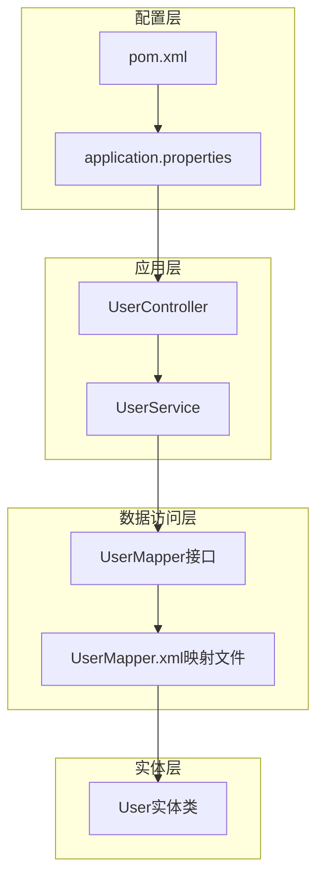
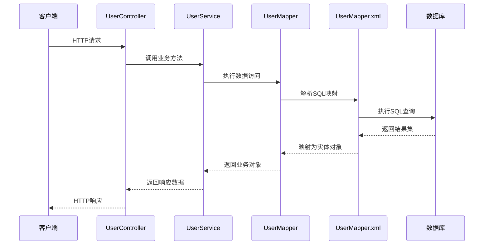
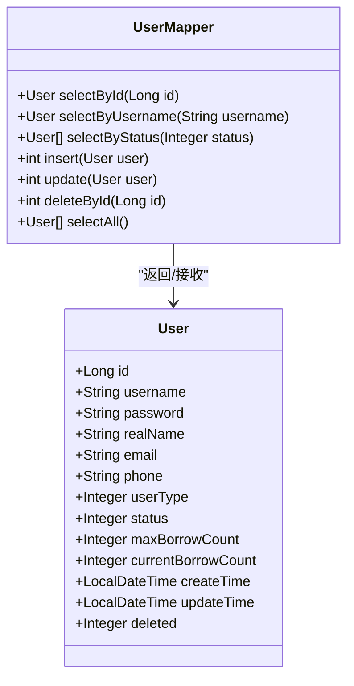
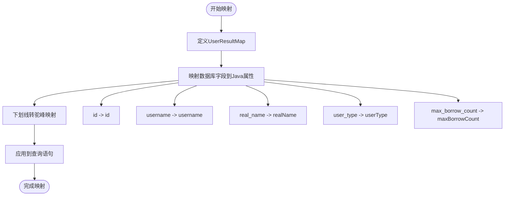
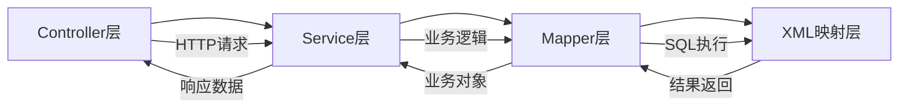
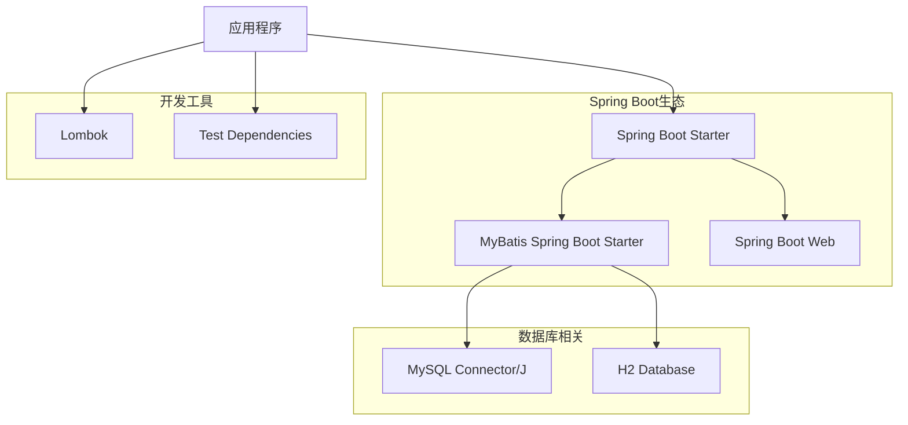
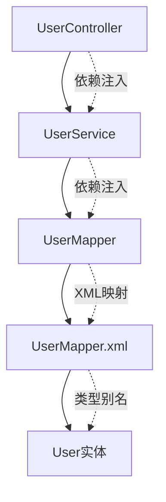

# Mapper接口设计

<cite>
**本文档引用的文件**
- [UserMapper.java](file://src/main/java/com/example/springbootmybatis/mapper/UserMapper.java)
- [UserMapper.xml](file://src/main/resources/mapper/UserMapper.xml)
- [User.java](file://src/main/java/com/example/springbootmybatis/entity/User.java)
- [UserService.java](file://src/main/java/com/example/springbootmybatis/service/UserService.java)
- [UserController.java](file://src/main/java/com/example/springbootmybatis/controller/UserController.java)
- [application.properties](file://src/main/resources/application.properties)
- [pom.xml](file://pom.xml)
</cite>

## 目录
1. [简介](#简介)
2. [项目结构](#项目结构)
3. [核心组件](#核心组件)
4. [架构概览](#架构概览)
5. [详细组件分析](#详细组件分析)
6. [依赖关系分析](#依赖关系分析)
7. [性能考虑](#性能考虑)
8. [故障排除指南](#故障排除指南)
9. [结论](#结论)

## 简介

本文件深入分析了Spring Boot + MyBatis项目中的UserMapper接口设计。该设计遵循了经典的分层架构模式，通过Mapper接口实现数据访问层的抽象，结合XML映射文件提供灵活的SQL映射能力。本文档将详细解释Mapper注解的作用和配置方式、方法签名设计、参数传递机制、命名规范、返回值约定，以及接口与XML映射文件的绑定关系。

## 项目结构

该项目采用标准的Spring Boot项目结构，核心模块包括：

**图表来源**
- [UserMapper.java](file://src/main/java/com/example/springbootmybatis/mapper/UserMapper.java#L1-L23)
- [UserMapper.xml](file://src/main/resources/mapper/UserMapper.xml#L1-L57)
- [UserController.java](file://src/main/java/com/example/springbootmybatis/controller/UserController.java#L1-L68)

**章节来源**
- [UserMapper.java](file://src/main/java/com/example/springbootmybatis/mapper/UserMapper.java#L1-L23)
- [UserMapper.xml](file://src/main/resources/mapper/UserMapper.xml#L1-L57)
- [application.properties](file://src/main/resources/application.properties#L1-L16)

## 核心组件

### Mapper注解系统

MyBatis通过`@Mapper`注解实现接口扫描和代理生成：

- **作用**：标记接口为MyBatis的Mapper，启用自动扫描和代理创建
- **配置方式**：在接口级别使用`@Mapper`注解
- **扫描路径**：通过`mybatis.mapper-packages`属性配置扫描包路径

### 接口设计原则

接口方法遵循以下设计原则：
- **单一职责**：每个方法专注于特定的数据操作
- **类型安全**：使用泛型确保返回类型的安全性
- **异常处理**：通过返回值进行基本的错误状态检查

**章节来源**
- [UserMapper.java](file://src/main/java/com/example/springbootmybatis/mapper/UserMapper.java#L7-L8)
- [application.properties](file://src/main/resources/application.properties#L15-L15)

## 架构概览

**图表来源**
- [UserController.java](file://src/main/java/com/example/springbootmybatis/controller/UserController.java#L17-L67)
- [UserService.java](file://src/main/java/com/example/springbootmybatis/service/UserService.java#L15-L41)
- [UserMapper.java](file://src/main/java/com/example/springbootmybatis/mapper/UserMapper.java#L10-L22)
- [UserMapper.xml](file://src/main/resources/mapper/UserMapper.xml#L21-L55)

## 详细组件分析

### UserMapper接口设计

#### 方法签名设计

接口定义了完整的CRUD操作方法：

**图表来源**
- [UserMapper.java](file://src/main/java/com/example/springbootmybatis/mapper/UserMapper.java#L10-L22)
- [User.java](file://src/main/java/com/example/springbootmybatis/entity/User.java#L8-L20)

#### 参数传递机制

所有方法都采用简单直接的参数传递方式：

- **基本类型参数**：如`Long id`、`String username`、`Integer status`
- **实体对象参数**：如`User user`，通过对象属性映射到SQL参数
- **参数绑定**：使用`#{parameterName}`语法进行参数绑定

#### 命名规范

方法命名遵循清晰的语义约定：
- **查询方法**：以`select`开头，后跟查询条件
- **插入方法**：使用`insert`，返回受影响的行数
- **更新方法**：使用`update`，返回受影响的行数
- **删除方法**：使用`delete`，返回受影响的行数

#### 返回值类型约定

返回值类型根据操作类型而定：
- **单个对象查询**：返回`User`对象或`null`
- **列表查询**：返回`List<User>`集合
- **写操作**：返回`int`类型，表示受影响的行数

**章节来源**
- [UserMapper.java](file://src/main/java/com/example/springbootmybatis/mapper/UserMapper.java#L10-L22)
- [User.java](file://src/main/java/com/example/springbootmybatis/entity/User.java#L8-L20)

### XML映射文件设计

#### 结果映射配置

XML文件提供了完整的数据库字段到Java属性的映射：

**图表来源**
- [UserMapper.xml](file://src/main/resources/mapper/UserMapper.xml#L5-L19)

#### SQL语句设计

每种查询都有对应的SQL语句实现：

- **条件查询**：使用WHERE子句进行精确匹配
- **列表查询**：返回所有记录
- **插入操作**：指定需要插入的字段
- **更新操作**：使用SET子句更新指定字段

**章节来源**
- [UserMapper.xml](file://src/main/resources/mapper/UserMapper.xml#L21-L55)

### 服务层集成

#### 业务逻辑封装

Service层提供了业务逻辑的封装：

**图表来源**
- [UserService.java](file://src/main/java/com/example/springbootmybatis/service/UserService.java#L15-L41)
- [UserController.java](file://src/main/java/com/example/springbootmybatis/controller/UserController.java#L17-L67)

**章节来源**
- [UserService.java](file://src/main/java/com/example/springbootmybatis/service/UserService.java#L1-L42)
- [UserController.java](file://src/main/java/com/example/springbootmybatis/controller/UserController.java#L1-L68)

## 依赖关系分析

### 外部依赖

项目主要依赖于以下技术栈：

**图表来源**
- [pom.xml](file://pom.xml#L32-L67)

### 内部依赖关系

**图表来源**
- [UserController.java](file://src/main/java/com/example/springbootmybatis/controller/UserController.java#L14-L15)
- [UserService.java](file://src/main/java/com/example/springbootmybatis/service/UserService.java#L12-L13)
- [UserMapper.java](file://src/main/java/com/example/springbootmybatis/mapper/UserMapper.java#L3-L4)

**章节来源**
- [pom.xml](file://pom.xml#L32-L67)
- [application.properties](file://src/main/resources/application.properties#L10-L15)

## 性能考虑

### 配置优化

项目配置中包含了多项性能优化设置：

- **驼峰命名转换**：`map-underscore-to-camel-case=true`自动转换数据库下划线命名到Java驼峰命名
- **类型别名**：通过`type-aliases-package`简化实体类引用
- **映射文件位置**：`mapper-locations`配置映射文件扫描路径

### 查询优化建议

基于当前设计，可以考虑以下优化：

1. **索引优化**：为常用查询字段建立数据库索引
2. **批量操作**：对于大量数据操作考虑批量处理
3. **缓存策略**：实现适当的查询结果缓存
4. **分页查询**：对于大数据量的列表查询实现分页

## 故障排除指南

### 常见问题及解决方案

#### Mapper扫描问题

**问题**：Mapper接口无法被正确扫描
**解决方案**：
- 检查`@Mapper`注解是否正确添加
- 验证`mybatis.mapper-packages`配置路径
- 确认接口位于正确的包结构中

#### SQL映射问题

**问题**：SQL执行失败或结果映射错误
**解决方案**：
- 检查XML文件中的SQL语法
- 验证字段映射关系
- 确认数据库连接配置

#### 参数绑定问题

**问题**：参数无法正确绑定到SQL语句
**解决方案**：
- 检查方法参数名称与SQL参数名称的一致性
- 验证实体类属性与数据库字段的对应关系

**章节来源**
- [application.properties](file://src/main/resources/application.properties#L10-L15)
- [UserMapper.xml](file://src/main/resources/mapper/UserMapper.xml#L21-L55)

## 结论

该UserMapper接口设计体现了良好的软件工程实践：

### 设计优势

1. **清晰的分层架构**：遵循MVC模式，职责分离明确
2. **简洁的接口设计**：方法命名直观，功能单一
3. **灵活的映射机制**：XML配置支持复杂的SQL映射需求
4. **完善的依赖注入**：Spring框架提供强大的依赖管理

### 改进建议

1. **参数验证**：在Service层添加参数验证逻辑
2. **异常处理**：实现统一的异常处理机制
3. **日志记录**：添加详细的操作日志
4. **事务管理**：为复杂业务操作添加事务控制

### 最佳实践总结

- **接口设计**：保持方法简洁，职责单一
- **命名规范**：遵循清晰的命名约定
- **配置管理**：合理组织配置文件
- **错误处理**：实现健壮的异常处理机制

该设计为后续的功能扩展和维护奠定了良好的基础，具有良好的可扩展性和可维护性。