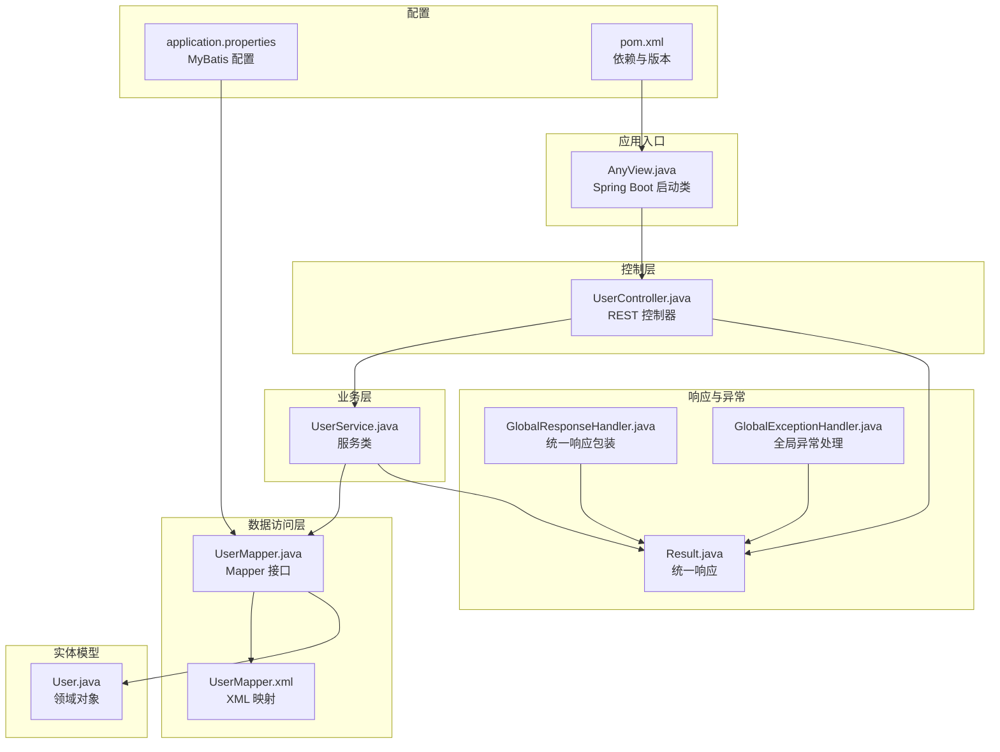
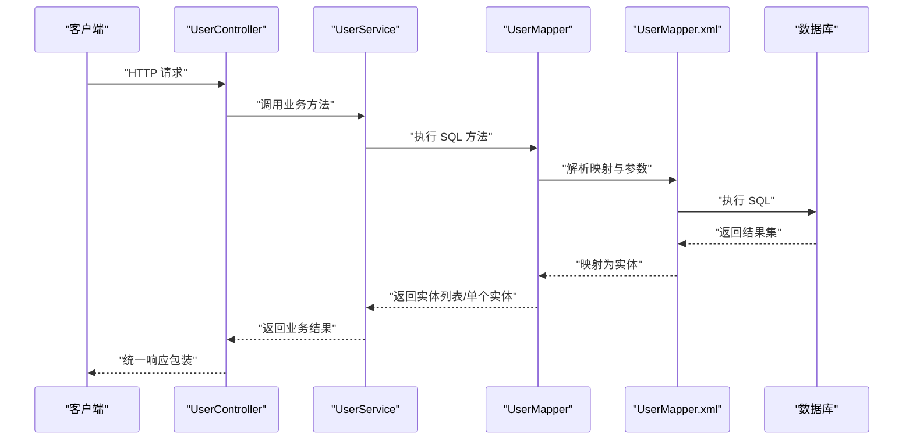
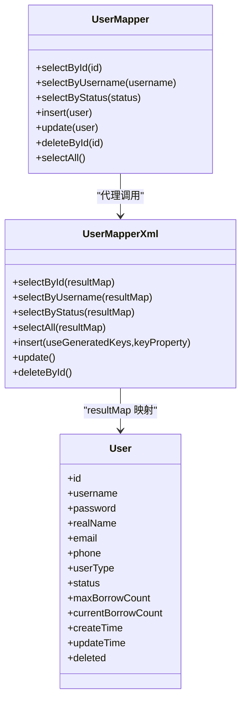
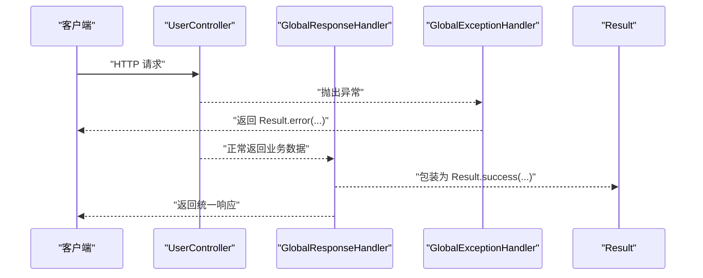
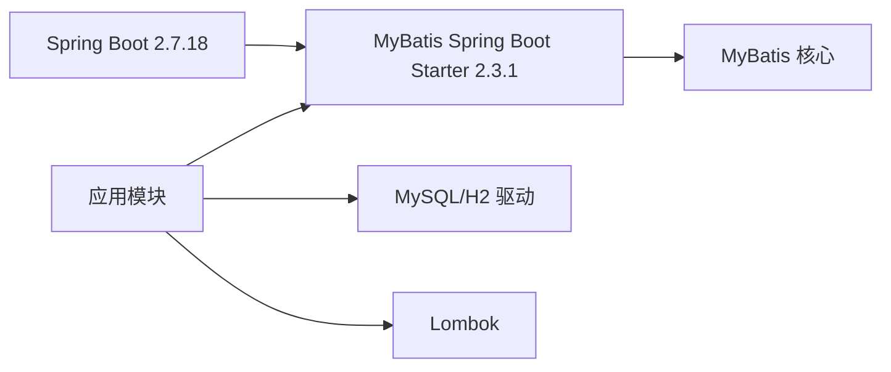
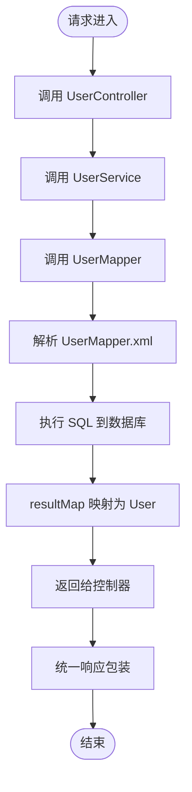

# MyBatis集成模式

<cite>
**本文引用的文件**
- [pom.xml](file://pom.xml)
- [application.properties](file://src/main/resources/application.properties)
- [AnyView.java](file://src/main/java/com/example/springbootmybatis/AnyView.java)
- [UserMapper.java](file://src/main/java/com/example/springbootmybatis/mapper/UserMapper.java)
- [UserMapper.xml](file://src/main/resources/mapper/UserMapper.xml)
- [UserService.java](file://src/main/java/com/example/springbootmybatis/service/UserService.java)
- [UserController.java](file://src/main/java/com/example/springbootmybatis/controller/UserController.java)
- [GlobalExceptionHandler.java](file://src/main/java/com/example/springbootmybatis/advice/GlobalExceptionHandler.java)
- [GlobalResponseHandler.java](file://src/main/java/com/example/springbootmybatis/advice/GlobalResponseHandler.java)
- [Result.java](file://src/main/java/com/example/springbootmybatis/common/Result.java)
- [User.java](file://src/main/java/com/example/springbootmybatis/entity/User.java)
</cite>

## 目录
1. [简介](#简介)
2. [项目结构](#项目结构)
3. [核心组件](#核心组件)
4. [架构总览](#架构总览)
5. [详细组件分析](#详细组件分析)
6. [依赖关系分析](#依赖关系分析)
7. [性能考虑](#性能考虑)
8. [故障排查指南](#故障排查指南)
9. [结论](#结论)
10. [附录](#附录)

## 简介
本项目展示了基于 Spring Boot 2.7.18 与 MyBatis 的完整集成方案，采用注解与 XML 双模式结合的方式，演示了自动配置、Mapper 扫描、SqlSessionFactory 生命周期、以及全局响应包装与异常处理等关键主题。通过该示例，读者可以理解：
- 自动配置与扫描机制如何工作
- 注解与 XML 的选择标准与使用场景
- Mapper 接口注册与代理生成流程
- SqlSessionFactory 与 SqlSession 的生命周期管理
- 插件机制与拦截器的配置思路（概念性）
- 分页插件与通用 Mapper 的集成方案（概念性）
- 集成调试与问题排查方法
- 版本兼容性与升级注意事项

## 项目结构
该项目遵循 Spring Boot 标准目录结构，主要模块包括：
- 应用入口：Spring Boot 启动类
- 控制层：REST 控制器
- 业务层：服务类
- 数据访问层：Mapper 接口与 XML 映射
- 实体模型：领域对象
- 响应与异常：统一响应包装与全局异常处理

图表来源
- [AnyView.java](file://src/main/java/com/example/springbootmybatis/AnyView.java#L1-L13)
- [UserController.java](file://src/main/java/com/example/springbootmybatis/controller/UserController.java#L1-L68)
- [UserService.java](file://src/main/java/com/example/springbootmybatis/service/UserService.java#L1-L42)
- [UserMapper.java](file://src/main/java/com/example/springbootmybatis/mapper/UserMapper.java#L1-L23)
- [UserMapper.xml](file://src/main/resources/mapper/UserMapper.xml#L1-L57)
- [User.java](file://src/main/java/com/example/springbootmybatis/entity/User.java#L1-L21)
- [Result.java](file://src/main/java/com/example/springbootmybatis/common/Result.java#L1-L87)
- [GlobalResponseHandler.java](file://src/main/java/com/example/springbootmybatis/advice/GlobalResponseHandler.java#L1-L39)
- [GlobalExceptionHandler.java](file://src/main/java/com/example/springbootmybatis/advice/GlobalExceptionHandler.java#L1-L22)
- [application.properties](file://src/main/resources/application.properties#L1-L16)
- [pom.xml](file://pom.xml#L1-L88)

章节来源
- [AnyView.java](file://src/main/java/com/example/springbootmybatis/AnyView.java#L1-L13)
- [application.properties](file://src/main/resources/application.properties#L1-L16)
- [pom.xml](file://pom.xml#L1-L88)

## 核心组件
- 启动类：负责应用引导与组件扫描
- 控制器：对外暴露 REST 接口，调用服务层
- 服务层：封装业务逻辑，注入 Mapper
- Mapper 接口与 XML：定义 SQL 语句与映射规则
- 实体类：与数据库表字段映射
- 统一响应与异常处理：规范输出格式与错误处理

章节来源
- [AnyView.java](file://src/main/java/com/example/springbootmybatis/AnyView.java#L1-L13)
- [UserController.java](file://src/main/java/com/example/springbootmybatis/controller/UserController.java#L1-L68)
- [UserService.java](file://src/main/java/com/example/springbootmybatis/service/UserService.java#L1-L42)
- [UserMapper.java](file://src/main/java/com/example/springbootmybatis/mapper/UserMapper.java#L1-L23)
- [UserMapper.xml](file://src/main/resources/mapper/UserMapper.xml#L1-L57)
- [User.java](file://src/main/java/com/example/springbootmybatis/entity/User.java#L1-L21)
- [Result.java](file://src/main/java/com/example/springbootmybatis/common/Result.java#L1-L87)
- [GlobalResponseHandler.java](file://src/main/java/com/example/springbootmybatis/advice/GlobalResponseHandler.java#L1-L39)
- [GlobalExceptionHandler.java](file://src/main/java/com/example/springbootmybatis/advice/GlobalExceptionHandler.java#L1-L22)

## 架构总览
下图展示了从控制器到数据库的端到端调用链路，以及 MyBatis 在 Spring Boot 中的自动装配位置。

图表来源
- [UserController.java](file://src/main/java/com/example/springbootmybatis/controller/UserController.java#L1-L68)
- [UserService.java](file://src/main/java/com/example/springbootmybatis/service/UserService.java#L1-L42)
- [UserMapper.java](file://src/main/java/com/example/springbootmybatis/mapper/UserMapper.java#L1-L23)
- [UserMapper.xml](file://src/main/resources/mapper/UserMapper.xml#L1-L57)

## 详细组件分析

### 自动配置与扫描机制
- Spring Boot Starter：通过 mybatis-spring-boot-starter 2.3.1 自动装配 MyBatis，无需手动配置 SqlSessionFactory 或 MapperScannerConfigurer。
- Mapper 扫描：通过 application.properties 中的 mybatis.mapper-packages 指定扫描包，使 @Mapper 注解的接口被识别并注册为 Spring Bean。
- XML 扫描：通过 mybatis.mapper-locations 指定 XML 路径，加载对应的映射文件。
- 类型别名：通过 mybatis.type-aliases-package 指定实体包，简化 XML 中的类型引用。
- 驼峰映射：开启 map-underscore-to-camel-case，自动将数据库下划线字段映射到 Java 驼峰属性。

章节来源
- [pom.xml](file://pom.xml#L38-L41)
- [application.properties](file://src/main/resources/application.properties#L9-L16)

### 注解方式与 XML 方式的选择标准与使用场景
- 注解方式：适合简单 SQL 与快速开发，减少 XML 文件数量，便于维护。
- XML 方式：适合复杂 SQL、动态 SQL、批量操作、多表关联查询等场景，可读性与可维护性更好。
- 本项目采用注解与 XML 双模式结合：接口使用 @Mapper 注解，SQL 使用 XML 映射，兼顾灵活性与可维护性。

章节来源
- [UserMapper.java](file://src/main/java/com/example/springbootmybatis/mapper/UserMapper.java#L1-L23)
- [UserMapper.xml](file://src/main/resources/mapper/UserMapper.xml#L1-L57)

### Mapper 接口的注册与代理生成
- 注册：@Mapper 注解 + mybatis.mapper-packages 扫描，使接口成为 Spring Bean。
- 代理：MyBatis 为 Mapper 接口生成动态代理，将方法调用转换为 SQL 执行。
- 参数绑定：XML 中的 #{...} 与接口参数名对应，支持基本类型、对象、集合等。
- 结果映射：XML 中的 resultMap 将列名映射到实体属性，支持嵌套映射与集合映射。

图表来源
- [UserMapper.java](file://src/main/java/com/example/springbootmybatis/mapper/UserMapper.java#L1-L23)
- [UserMapper.xml](file://src/main/resources/mapper/UserMapper.xml#L1-L57)
- [User.java](file://src/main/java/com/example/springbootmybatis/entity/User.java#L1-L21)

章节来源
- [UserMapper.java](file://src/main/java/com/example/springbootmybatis/mapper/UserMapper.java#L1-L23)
- [UserMapper.xml](file://src/main/resources/mapper/UserMapper.xml#L1-L57)
- [User.java](file://src/main/java/com/example/springbootmybatis/entity/User.java#L1-L21)

### SqlSessionFactory 与 SqlSession 的生命周期管理
- SqlSessionFactory：由 MyBatis 自动配置创建，作为 MyBatis 的工厂，负责创建 SqlSession。
- SqlSession：每个请求在 MyBatis 层面会话由框架管理，无需手动关闭；在 Spring 环境中，SqlSession 通过 Spring 的事务管理器与声明式事务协同。
- 本项目未显式配置 SqlSessionFactory，完全依赖自动装配，确保生命周期由 Spring 容器托管。

章节来源
- [pom.xml](file://pom.xml#L38-L41)
- [application.properties](file://src/main/resources/application.properties#L9-L16)

### 插件机制与拦截器的配置方法（概念性）
- 插件机制：MyBatis 提供插件接口，可在 SQL 执行前后进行拦截与增强（如分页、审计、加密等）。
- 配置方法（概念性）：
  - 实现 Interceptor 接口，定义拦截点与增强逻辑
  - 在 MyBatis 配置中注册插件
  - 通过 Spring Boot 的配置属性或 Java Config 进行装配
- 本项目未启用插件，建议在需要时按需引入分页插件或通用 Mapper。

[本节为概念性内容，不涉及具体源码分析]

### 分页插件与通用 Mapper 的集成方案（概念性）
- 分页插件（如 PageHelper）：在 SQL 执行前改写为分页查询，返回分页结果集
- 通用 Mapper：提供通用 CRUD 方法，减少重复 SQL 编写
- 集成步骤（概念性）：
  - 引入相应 starter 或依赖
  - 在 MyBatis 配置中注册插件或设置通用 Mapper 的基础类
  - 在实体上标注主键、字段等注解以启用通用功能
- 本项目未集成上述插件，可根据业务需求选择性引入。

[本节为概念性内容，不涉及具体源码分析]

### 统一响应与异常处理
- 统一响应：GlobalResponseHandler 对非 Result 类型的响应进行包装，保证接口输出格式一致
- 全局异常：GlobalExceptionHandler 捕获异常并返回统一错误结构
- 本项目通过 Result 统一承载 success、message、data、timestamp 字段，便于前端消费

图表来源
- [GlobalResponseHandler.java](file://src/main/java/com/example/springbootmybatis/advice/GlobalResponseHandler.java#L1-L39)
- [GlobalExceptionHandler.java](file://src/main/java/com/example/springbootmybatis/advice/GlobalExceptionHandler.java#L1-L22)
- [Result.java](file://src/main/java/com/example/springbootmybatis/common/Result.java#L1-L87)

章节来源
- [GlobalResponseHandler.java](file://src/main/java/com/example/springbootmybatis/advice/GlobalResponseHandler.java#L1-L39)
- [GlobalExceptionHandler.java](file://src/main/java/com/example/springbootmybatis/advice/GlobalExceptionHandler.java#L1-L22)
- [Result.java](file://src/main/java/com/example/springbootmybatis/common/Result.java#L1-L87)

## 依赖关系分析
- Spring Boot 2.7.18：提供自动装配与容器管理
- MyBatis Spring Boot Starter 2.3.1：提供 MyBatis 自动配置与 Mapper 扫描
- 数据库驱动：MySQL Connector/J 8.0.30 与 H2（测试）
- Lombok：简化实体类代码

图表来源
- [pom.xml](file://pom.xml#L32-L67)

章节来源
- [pom.xml](file://pom.xml#L1-L88)

## 性能考虑
- SQL 优化：优先使用 XML 编写复杂 SQL，避免硬编码在注解中
- 结果映射：合理使用 resultMap，避免 N+1 查询，必要时使用联表或批量查询
- 分页：在大数据量场景引入分页插件，限制单页大小
- 连接池：使用连接池组件（如 HikariCP），合理配置最大连接数与超时时间
- 缓存：根据业务场景启用二级缓存，注意缓存一致性
- 日志：开启 SQL 日志（开发环境）以便定位性能瓶颈

[本节提供一般性指导，不涉及具体文件分析]

## 故障排查指南
- Mapper 未被扫描
  - 检查 mybatis.mapper-packages 是否正确
  - 确认 @Mapper 注解是否存在
- XML 未加载
  - 检查 mybatis.mapper-locations 路径是否正确
  - 确认 XML 文件命名与命名空间一致
- 类型别名报错
  - 检查 mybatis.type-aliases-package 是否包含实体类
- 参数绑定失败
  - 确认 XML 中的 #{...} 与接口参数名一致
- 数据库连接异常
  - 检查 application.properties 中的数据库 URL、用户名、密码
- 响应格式不统一
  - 检查 GlobalResponseHandler 是否生效
- 异常未被捕获
  - 检查 GlobalExceptionHandler 是否注册

章节来源
- [application.properties](file://src/main/resources/application.properties#L9-L16)
- [UserMapper.java](file://src/main/java/com/example/springbootmybatis/mapper/UserMapper.java#L1-L23)
- [UserMapper.xml](file://src/main/resources/mapper/UserMapper.xml#L1-L57)
- [GlobalResponseHandler.java](file://src/main/java/com/example/springbootmybatis/advice/GlobalResponseHandler.java#L1-L39)
- [GlobalExceptionHandler.java](file://src/main/java/com/example/springbootmybatis/advice/GlobalExceptionHandler.java#L1-L22)

## 结论
本项目以最小化配置实现了 MyBatis 与 Spring Boot 的无缝集成，展示了注解与 XML 的最佳实践组合，提供了统一响应与异常处理的工程化方案。对于生产环境，建议进一步引入分页插件、通用 Mapper、连接池与缓存策略，并完善日志与监控体系。

[本节为总结性内容，不涉及具体文件分析]

## 附录

### 关键流程图：控制器到数据库

图表来源
- [UserController.java](file://src/main/java/com/example/springbootmybatis/controller/UserController.java#L1-L68)
- [UserService.java](file://src/main/java/com/example/springbootmybatis/service/UserService.java#L1-L42)
- [UserMapper.java](file://src/main/java/com/example/springbootmybatis/mapper/UserMapper.java#L1-L23)
- [UserMapper.xml](file://src/main/resources/mapper/UserMapper.xml#L1-L57)

### 版本兼容性与升级注意事项
- Spring Boot 2.7.18 与 MyBatis Spring Boot Starter 2.3.1 已稳定
- 升级时需关注：
  - Spring Boot 主版本升级可能影响自动配置行为
  - MyBatis 主版本升级可能改变默认行为或移除某些配置项
  - 数据库驱动版本需与 MySQL Server 兼容
- 建议在升级前备份配置文件与测试用例，逐步验证

章节来源
- [pom.xml](file://pom.xml#L38-L41)
- [application.properties](file://src/main/resources/application.properties#L3-L7)