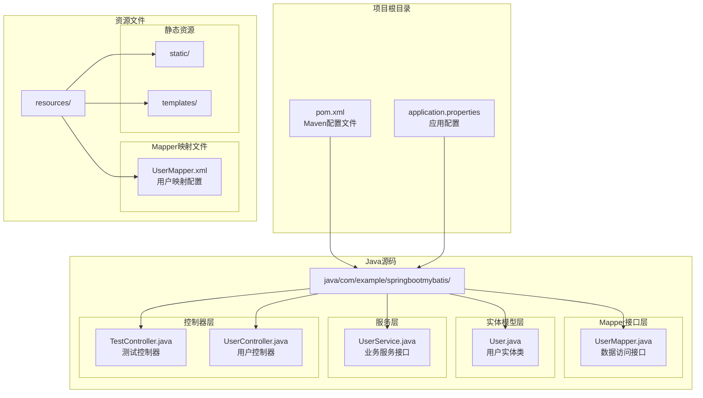
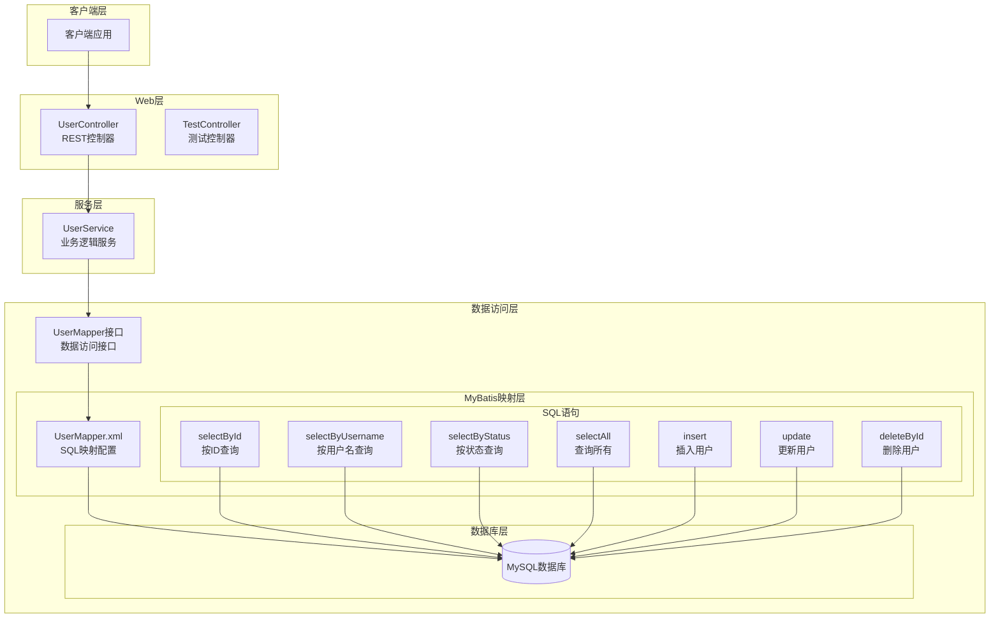
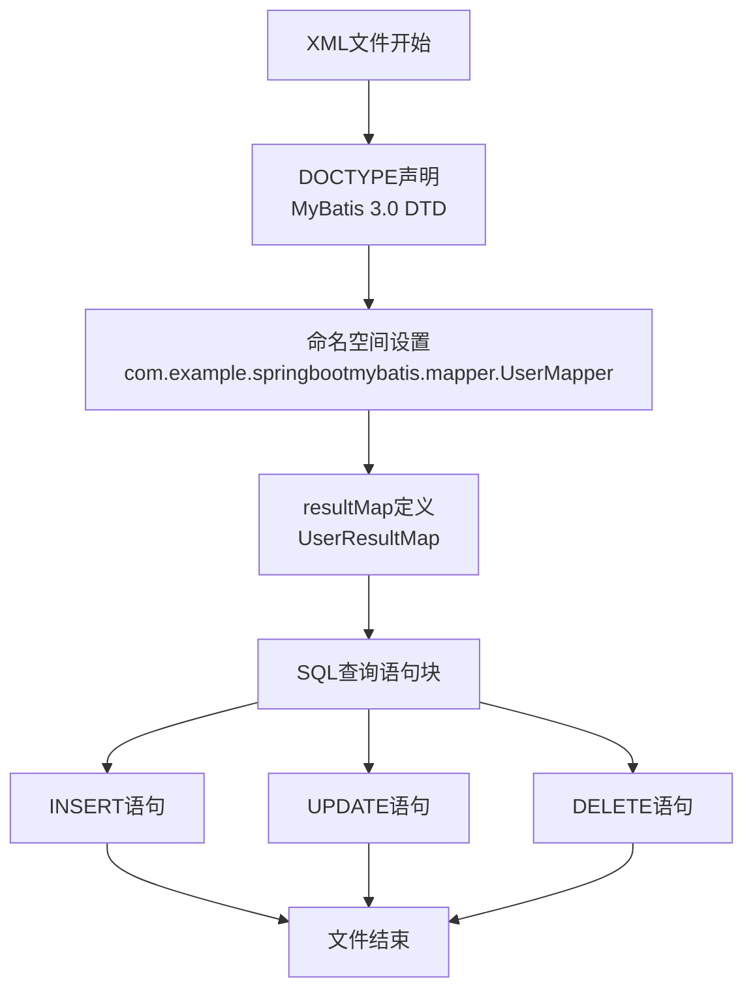
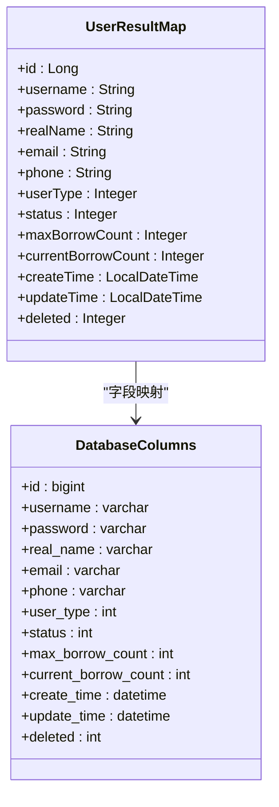
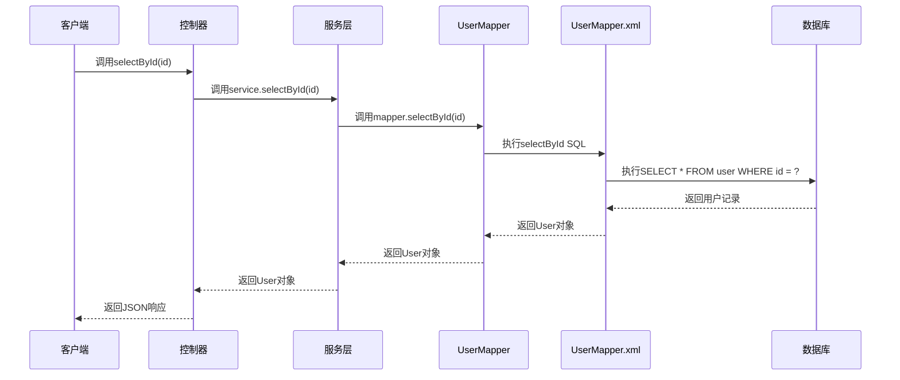
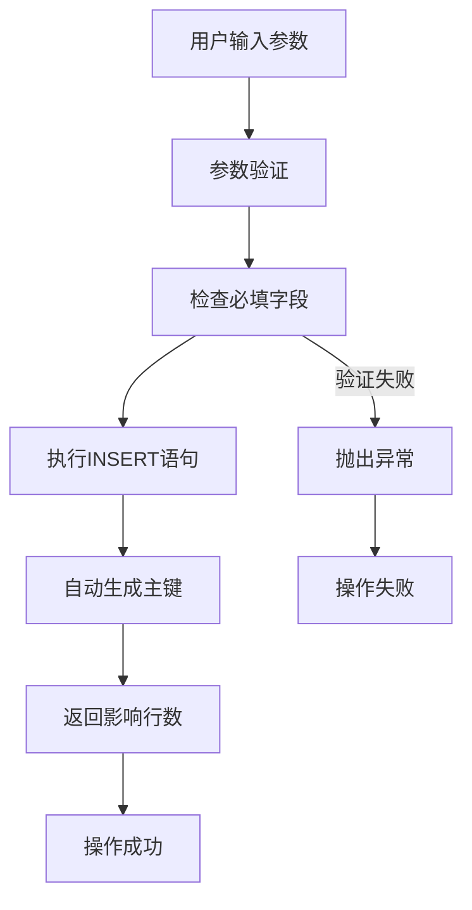
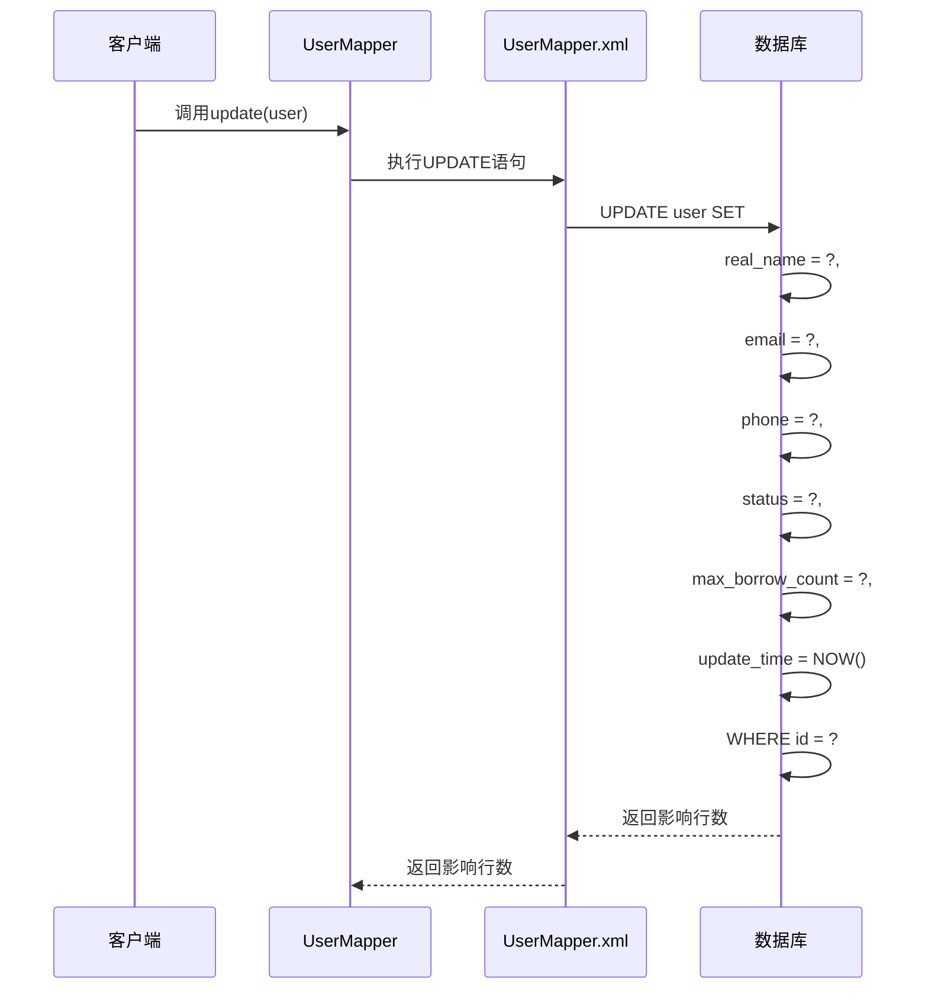
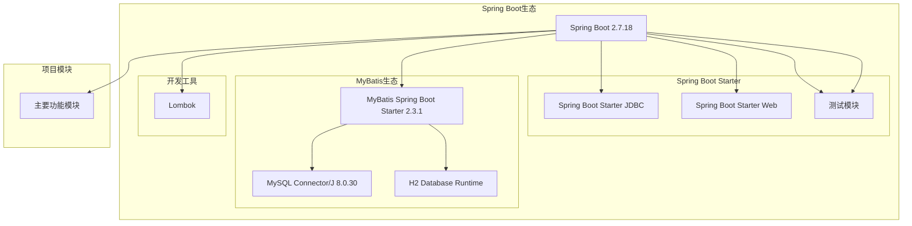
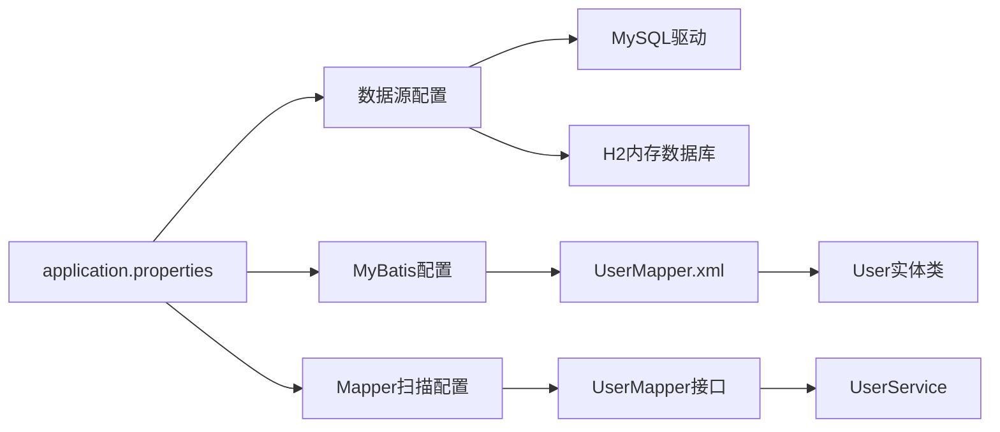
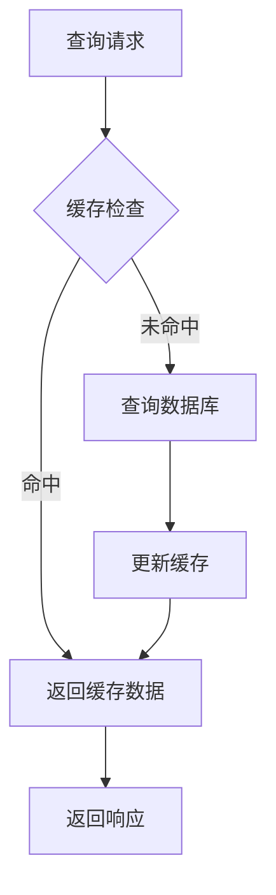

# SQL映射配置

<cite>
**本文档引用的文件**
- [UserMapper.xml](file://src/main/resources/mapper/UserMapper.xml)
- [UserMapper.java](file://src/main/java/com/example/springbootmybatis/mapper/UserMapper.java)
- [User.java](file://src/main/java/com/example/springbootmybatis/entity/User.java)
- [application.properties](file://src/main/resources/application.properties)
- [pom.xml](file://pom.xml)
</cite>

## 目录
1. [简介](#简介)
2. [项目结构](#项目结构)
3. [核心组件](#核心组件)
4. [架构概览](#架构概览)
5. [详细组件分析](#详细组件分析)
6. [依赖关系分析](#依赖关系分析)
7. [性能考虑](#性能考虑)
8. [故障排除指南](#故障排除指南)
9. [结论](#结论)

## 简介

本文件是对Spring Boot MyBatis项目中UserMapper.xml SQL映射配置的全面技术文档。该映射文件定义了用户实体与数据库表之间的映射关系，包含了完整的CRUD操作实现。文档将深入解析XML映射文件的结构、配置项、SQL编写规范、动态SQL实现、resultMap结果映射、参数类型和返回类型使用场景，以及SQL优化和安全编码实践。

## 项目结构

该项目采用标准的Spring Boot Maven项目结构，关键配置文件分布如下：

**图表来源**
- [pom.xml](file://pom.xml#L1-L88)
- [application.properties](file://src/main/resources/application.properties#L1-L16)

**章节来源**
- [pom.xml](file://pom.xml#L1-L88)
- [application.properties](file://src/main/resources/application.properties#L1-L16)

## 核心组件

### 数据库表结构映射

根据User实体类和映射文件，系统中的用户表结构包含以下字段：

| 数据库字段 | Java属性 | 类型 | 描述 |
|------------|----------|------|------|
| id | id | Long | 用户主键标识 |
| username | username | String | 用户名 |
| password | password | String | 密码 |
| real_name | realName | String | 真实姓名 |
| email | email | String | 邮箱地址 |
| phone | phone | String | 电话号码 |
| user_type | userType | Integer | 用户类型 |
| status | status | Integer | 用户状态 |
| max_borrow_count | maxBorrowCount | Integer | 最大借阅数量 |
| current_borrow_count | currentBorrowCount | Integer | 当前借阅数量 |
| create_time | createTime | LocalDateTime | 创建时间 |
| update_time | updateTime | LocalDateTime | 更新时间 |
| deleted | deleted | Integer | 删除标记 |

### MyBatis配置分析

项目采用Spring Boot自动配置方式集成MyBatis，关键配置包括：

- **Mapper扫描路径**: `mybatis.mapper-packages=com.example.springbootmybatis.mapper`
- **映射文件位置**: `mybatis.mapper-locations=classpath:mapper/*.xml`
- **类型别名包**: `mybatis.type-aliases-package=com.example.springbootmybatis.entity`
- **驼峰命名转换**: `mybatis.configuration.map-underscore-to-camel-case=true`

**章节来源**
- [application.properties](file://src/main/resources/application.properties#L9-L15)
- [User.java](file://src/main/java/com/example/springbootmybatis/entity/User.java#L1-L21)

## 架构概览

**图表来源**
- [UserMapper.java](file://src/main/java/com/example/springbootmybatis/mapper/UserMapper.java#L1-L23)
- [UserMapper.xml](file://src/main/resources/mapper/UserMapper.xml#L1-L57)

## 详细组件分析

### XML映射文件结构分析

#### 命名空间和文档声明

映射文件采用标准的MyBatis XML格式，包含完整的文档类型定义：

**图表来源**
- [UserMapper.xml](file://src/main/resources/mapper/UserMapper.xml#L1-L57)

#### resultMap结果映射配置

resultMap是MyBatis的核心映射机制，负责将数据库查询结果映射到Java对象：

**图表来源**
- [UserMapper.xml](file://src/main/resources/mapper/UserMapper.xml#L5-L19)
- [User.java](file://src/main/java/com/example/springbootmybatis/entity/User.java#L7-L21)

##### 字段映射规则

MyBatis通过`map-underscore-to-camel-case`配置实现了数据库下划线命名与Java驼峰命名的自动转换：

| 数据库字段 | Java属性 | 映射规则 |
|------------|----------|----------|
| id | id | 直接匹配 |
| username | username | 直接匹配 |
| real_name | realName | 下划线转驼峰 |
| user_type | userType | 下划线转驼峰 |
| create_time | createTime | 下划线转驼峰 |
| update_time | updateTime | 下划线转驼峰 |

**章节来源**
- [UserMapper.xml](file://src/main/resources/mapper/UserMapper.xml#L5-L19)
- [application.properties](file://src/main/resources/application.properties#L12-L12)

### SQL语句实现分析

#### 查询操作

##### 单条记录查询

**图表来源**
- [UserMapper.java](file://src/main/java/com/example/springbootmybatis/mapper/UserMapper.java#L10-L10)
- [UserMapper.xml](file://src/main/resources/mapper/UserMapper.xml#L21-L23)

##### 条件查询实现

系统提供了多种条件查询方法：

| 查询方法 | 参数类型 | 查询条件 | 使用场景 |
|----------|----------|----------|----------|
| selectById | Long | id = ? | 按主键精确查询 |
| selectByUsername | String | username = ? | 按用户名精确查询 |
| selectByStatus | Integer | status = ? | 按状态过滤查询 |
| selectAll | 无参数 | 无条件 | 获取所有用户记录 |

**章节来源**
- [UserMapper.java](file://src/main/java/com/example/springbootmybatis/mapper/UserMapper.java#L10-L22)
- [UserMapper.xml](file://src/main/resources/mapper/UserMapper.xml#L21-L35)

#### CRUD操作实现

##### 插入操作

**图表来源**
- [UserMapper.xml](file://src/main/resources/mapper/UserMapper.xml#L37-L40)

##### 更新操作

更新操作采用了智能的时间戳更新机制：

**图表来源**
- [UserMapper.xml](file://src/main/resources/mapper/UserMapper.xml#L42-L51)

##### 删除操作

删除操作采用软删除模式，通过删除标记字段实现数据保护：

**章节来源**
- [UserMapper.xml](file://src/main/resources/mapper/UserMapper.xml#L53-L55)

### 参数类型和返回类型分析

#### 参数类型使用场景

| 方法签名 | 参数类型 | 使用场景 | 动态SQL支持 |
|----------|----------|----------|-------------|
| selectById(Long id) | Long | 主键查询 | 不需要 |
| selectByUsername(String username) | String | 精确匹配 | 不需要 |
| selectByStatus(Integer status) | Integer | 状态过滤 | 不需要 |
| insert(User user) | User实体 | 批量插入 | 不需要 |
| update(User user) | User实体 | 批量更新 | 不需要 |
| deleteById(Long id) | Long | 主键删除 | 不需要 |

#### 返回类型设计原则

| 方法签名 | 返回类型 | 设计考虑 |
|----------|----------|----------|
| selectById | User | 单条记录查询，返回完整对象 |
| selectByUsername | User | 单条记录查询，返回完整对象 |
| selectByStatus | List<User> | 多条记录查询，返回集合 |
| selectAll | List<User> | 全量查询，返回集合 |
| insert | int | 插入操作，返回影响行数 |
| update | int | 更新操作，返回影响行数 |
| deleteById | int | 删除操作，返回影响行数 |

**章节来源**
- [UserMapper.java](file://src/main/java/com/example/springbootmybatis/mapper/UserMapper.java#L8-L23)

## 依赖关系分析

### 技术栈依赖

**图表来源**
- [pom.xml](file://pom.xml#L32-L67)

### 配置依赖关系

项目配置文件之间存在以下依赖关系：

**图表来源**
- [application.properties](file://src/main/resources/application.properties#L3-L15)
- [pom.xml](file://pom.xml#L57-L67)

**章节来源**
- [pom.xml](file://pom.xml#L32-L67)
- [application.properties](file://src/main/resources/application.properties#L3-L15)

## 性能考虑

### SQL优化策略

#### 索引优化建议

基于当前查询模式，建议在以下字段建立索引：

| 字段名称 | 建议索引类型 | 使用场景 |
|----------|--------------|----------|
| id | 主键索引 | 主键查询（已自动创建） |
| username | 唯一索引 | 用户名查询 |
| status | 普通索引 | 状态过滤查询 |
| email | 唯一索引 | 邮箱查询 |
| phone | 普通索引 | 电话号码查询 |

#### 查询性能优化

1. **避免SELECT ***：当前映射文件使用了SELECT *，建议在实际生产环境中指定具体字段
2. **批量操作优化**：对于大量数据操作，建议使用批量插入和批量更新
3. **分页查询优化**：建议实现分页查询以减少单次查询数据量

#### 缓存策略

### 连接池配置

建议在生产环境中配置连接池参数：

| 配置项 | 建议值 | 说明 |
|--------|--------|------|
| initialSize | 5 | 初始连接数 |
| minIdle | 5 | 最小空闲连接 |
| maxActive | 20 | 最大连接数 |
| maxWait | 60000 | 获取连接最大等待时间(ms) |
| timeBetweenEvictionRunsMillis | 30000 | 连接回收器运行间隔(ms) |

## 故障排除指南

### 常见问题诊断

#### 映射文件加载失败

**症状**：启动时提示找不到Mapper XML文件

**解决方案**：
1. 检查`mybatis.mapper-locations`配置是否正确
2. 确认UserMapper.xml文件位于`src/main/resources/mapper/`目录
3. 验证文件命名与接口命名一致

#### 字段映射错误

**症状**：查询结果字段为空或映射异常

**解决方案**：
1. 检查resultMap中的column和property配置
2. 确认数据库字段名与映射配置一致
3. 验证驼峰命名转换配置是否启用

#### 参数绑定异常

**症状**：执行SQL时报参数绑定错误

**解决方案**：
1. 检查Mapper接口方法参数类型与XML中#{}占位符对应
2. 确认实体类属性名与数据库字段映射关系
3. 验证参数传递时的数据类型一致性

#### 数据库连接问题

**症状**：无法连接到数据库

**解决方案**：
1. 检查数据库URL、用户名、密码配置
2. 确认数据库驱动版本兼容性
3. 验证数据库服务状态

**章节来源**
- [application.properties](file://src/main/resources/application.properties#L3-L7)
- [UserMapper.xml](file://src/main/resources/mapper/UserMapper.xml#L1-L57)

### 调试技巧

1. **开启MyBatis日志**：在application.properties中添加`logging.level.com.example.springbootmybatis.mapper=DEBUG`
2. **SQL执行监控**：使用数据库性能监控工具观察SQL执行计划
3. **参数验证**：在Mapper接口中添加参数校验逻辑
4. **异常处理**：统一捕获并记录MyBatis相关异常

## 结论

UserMapper.xml作为Spring Boot MyBatis项目的核心配置文件，展现了标准的ORM映射实践。该映射文件具有以下特点：

### 优势分析

1. **结构清晰**：采用标准的XML格式，层次分明
2. **配置简洁**：充分利用MyBatis的自动映射特性
3. **扩展性强**：为后续的功能扩展预留了充足空间
4. **维护友好**：代码组织规范，易于理解和维护

### 改进建议

1. **实现动态SQL**：增加条件查询、分页查询等高级功能
2. **优化查询性能**：针对常用查询建立索引和缓存策略
3. **增强安全性**：完善SQL注入防护和参数验证机制
4. **提升可维护性**：引入SQL片段复用和更完善的错误处理

该映射配置为整个系统的数据访问层奠定了坚实基础，通过合理的架构设计和最佳实践，能够有效支撑业务需求的发展和演进。