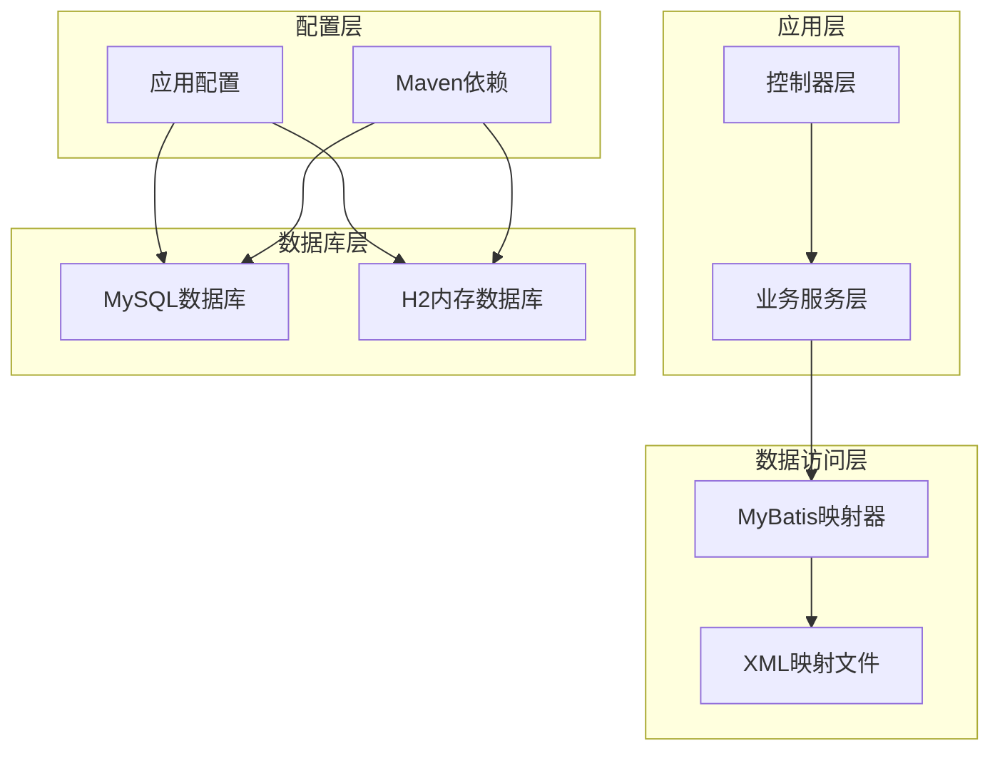
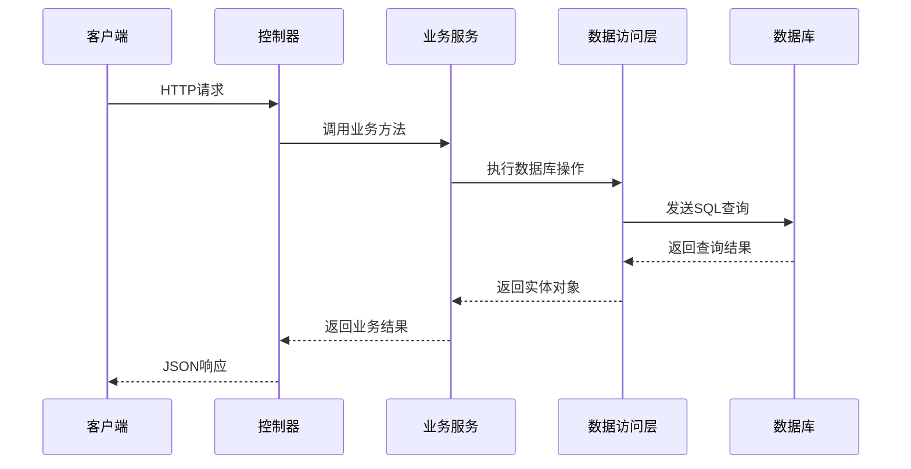
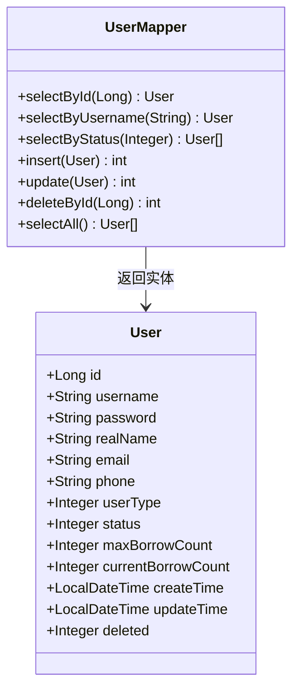
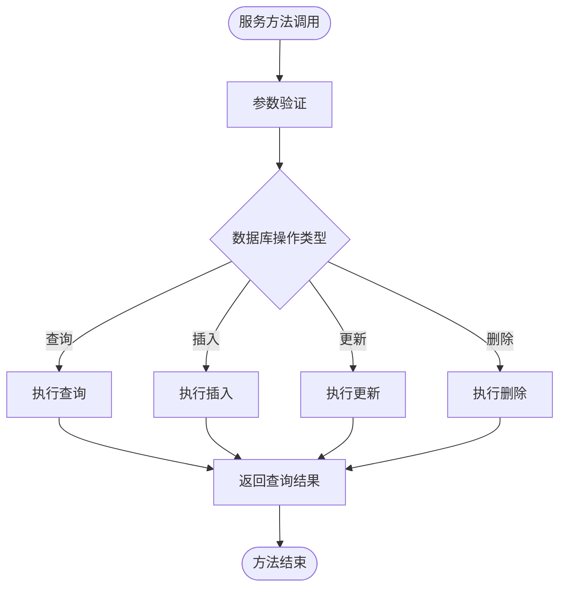
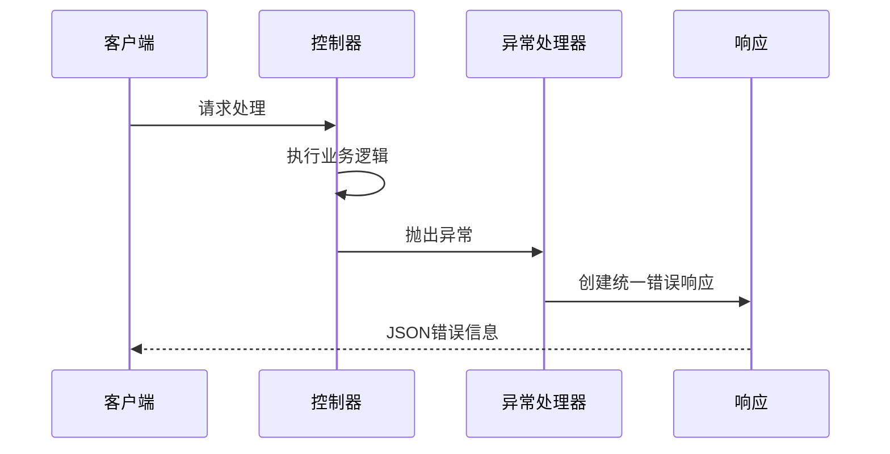
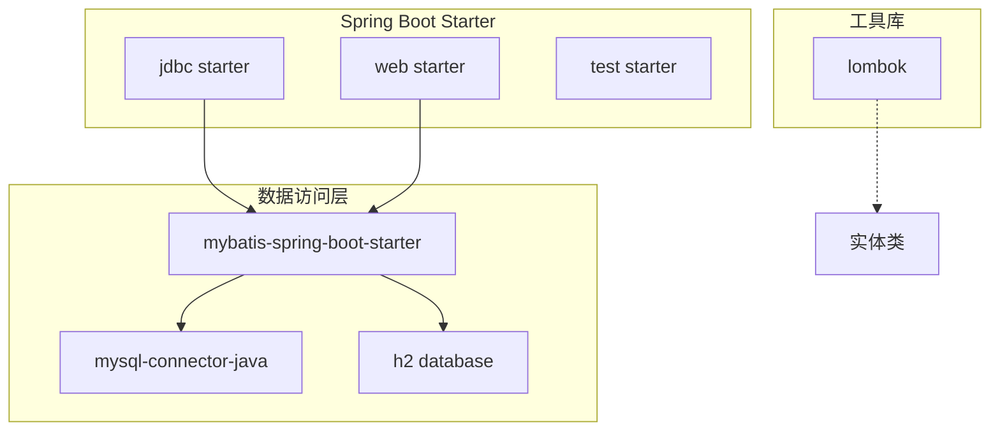
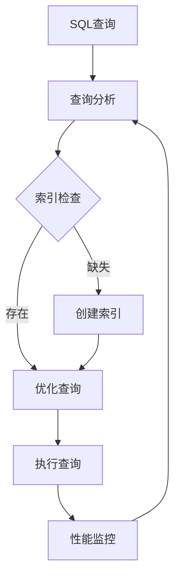

# 数据库连接管理

<cite>
**本文档引用的文件**
- [pom.xml](file://pom.xml)
- [application.properties](file://src/main/resources/application.properties)
- [UserMapper.java](file://src/main/java/com/example/springbootmybatis/mapper/UserMapper.java)
- [UserMapper.xml](file://src/main/resources/mapper/UserMapper.xml)
- [UserService.java](file://src/main/java/com/example/springbootmybatis/service/UserService.java)
- [UserController.java](file://src/main/java/com/example/springbootmybatis/controller/UserController.java)
- [GlobalExceptionHandler.java](file://src/main/java/com/example/springbootmybatis/advice/GlobalExceptionHandler.java)
- [GlobalResponseHandler.java](file://src/main/java/com/example/springbootmybatis/advice/GlobalResponseHandler.java)
- [Result.java](file://src/main/java/com/example/springbootmybatis/common/Result.java)
- [User.java](file://src/main/java/com/example/springbootmybatis/entity/User.java)
</cite>

## 目录
1. [简介](#简介)
2. [项目结构](#项目结构)
3. [核心组件](#核心组件)
4. [架构概览](#架构概览)
5. [详细组件分析](#详细组件分析)
6. [依赖关系分析](#依赖关系分析)
7. [性能考虑](#性能考虑)
8. [故障排除指南](#故障排除指南)
9. [结论](#结论)

## 简介

本项目是一个基于Spring Boot和MyBatis的数据访问层示例，展示了数据库连接管理的最佳实践。项目集成了MySQL和H2两种数据库支持，提供了完整的CRUD操作功能，并实现了统一的异常处理和响应包装机制。

## 项目结构

该项目采用标准的Spring Boot项目结构，重点关注数据访问层的设计和实现：



**图表来源**
- [pom.xml](file://pom.xml#L32-L67)
- [application.properties](file://src/main/resources/application.properties#L1-L16)

**章节来源**
- [pom.xml](file://pom.xml#L1-L88)
- [application.properties](file://src/main/resources/application.properties#L1-L16)

## 核心组件

### 数据源配置

项目当前配置为MySQL数据库，使用Spring Boot自动配置机制：

- **数据库URL**: jdbc:mysql://localhost:3306/zjsy
- **用户名**: root
- **密码**: root  
- **驱动类**: com.mysql.cj.jdbc.Driver
- **字符编码**: UTF-8
- **时区设置**: Asia/Shanghai

### MyBatis配置

- **映射文件位置**: classpath:mapper/*.xml
- **类型别名包**: com.example.springbootmybatis.entity
- **命名转换**: 下划线转驼峰

### 数据库驱动支持

项目同时支持两种数据库驱动：
- **MySQL驱动**: mysql-connector-java 8.0.30
- **H2内存数据库**: 用于开发和测试环境

**章节来源**
- [application.properties](file://src/main/resources/application.properties#L3-L15)
- [pom.xml](file://pom.xml#L57-L67)

## 架构概览

项目采用经典的三层架构模式，数据访问层通过MyBatis实现：



**图表来源**
- [UserController.java](file://src/main/java/com/example/springbootmybatis/controller/UserController.java#L17-L67)
- [UserService.java](file://src/main/java/com/example/springbootmybatis/service/UserService.java#L15-L41)
- [UserMapper.java](file://src/main/java/com/example/springbootmybatis/mapper/UserMapper.java#L10-L22)

## 详细组件分析

### 数据访问层设计

#### UserMapper接口设计



**图表来源**
- [UserMapper.java](file://src/main/java/com/example/springbootmybatis/mapper/UserMapper.java#L7-L22)
- [User.java](file://src/main/java/com/example/springbootmybatis/entity/User.java#L7-L20)

#### XML映射文件结构

每个数据库操作都有对应的XML映射配置，实现了清晰的SQL语句分离：

- **查询操作**: 支持按ID、用户名、状态等多种条件查询
- **插入操作**: 使用自动生成主键
- **更新操作**: 包含时间戳自动更新
- **删除操作**: 基于主键删除

**章节来源**
- [UserMapper.java](file://src/main/java/com/example/springbootmybatis/mapper/UserMapper.java#L1-L23)
- [UserMapper.xml](file://src/main/resources/mapper/UserMapper.xml#L21-L55)

### 业务服务层

#### 服务层职责



**图表来源**
- [UserService.java](file://src/main/java/com/example/springbootmybatis/service/UserService.java#L15-L41)

**章节来源**
- [UserService.java](file://src/main/java/com/example/springbootmybatis/service/UserService.java#L1-L42)

### 控制器层

#### REST API设计

```mermaid
graph LR
subgraph "用户管理API"
GET1[/api/users/{id} GET]
GET2[/api/users/username/{username} GET]
GET3[/api/users/status/{status} GET]
GET4[/api/users/all GET]
POST1[/api/users POST]
PUT1[/api/users PUT]
DEL1[/api/users/{id} DELETE]
end
GET1 --> Service[UserService]
GET2 --> Service
GET3 --> Service
GET4 --> Service
POST1 --> Service
PUT1 --> Service
DEL1 --> Service
```

**图表来源**
- [UserController.java](file://src/main/java/com/example/springbootmybatis/controller/UserController.java#L17-L67)

**章节来源**
- [UserController.java](file://src/main/java/com/example/springbootmybatis/controller/UserController.java#L1-L68)

### 异常处理机制

#### 全局异常处理



**图表来源**
- [GlobalExceptionHandler.java](file://src/main/java/com/example/springbootmybatis/advice/GlobalExceptionHandler.java#L13-L21)
- [GlobalResponseHandler.java](file://src/main/java/com/example/springbootmybatis/advice/GlobalResponseHandler.java#L24-L38)

**章节来源**
- [GlobalExceptionHandler.java](file://src/main/java/com/example/springbootmybatis/advice/GlobalExceptionHandler.java#L1-L22)
- [GlobalResponseHandler.java](file://src/main/java/com/example/springbootmybatis/advice/GlobalResponseHandler.java#L1-L39)

## 依赖关系分析

### Maven依赖配置

项目的关键依赖包括：



**图表来源**
- [pom.xml](file://pom.xml#L32-L67)

### 数据库驱动对比

| 特性 | MySQL驱动 | H2内存数据库 |
|------|-----------|--------------|
| 连接方式 | TCP/IP连接 | 内存连接 |
| 性能 | 高（生产环境） | 极高（内存操作） |
| 持久化 | 文件存储 | 内存存储 |
| 配置复杂度 | 中等 | 简单 |
| 使用场景 | 生产环境 | 开发测试 |

**章节来源**
- [pom.xml](file://pom.xml#L57-L67)
- [application.properties](file://src/main/resources/application.properties#L3-L7)

## 性能考虑

### 连接池配置建议

虽然当前项目使用Spring Boot默认配置，但在生产环境中建议考虑以下优化：

#### MySQL连接池参数优化

- **最大连接数**: 建议设置为CPU核心数的2-4倍
- **连接超时**: 30-60秒
- **空闲超时**: 600秒
- **最大生命周期**: 1800秒

#### H2数据库优化

- **缓存大小**: 根据可用内存调整
- **持久化策略**: 开发环境可使用内存模式
- **并发控制**: 合理设置并发访问限制

### 查询性能优化

#### SQL优化策略



**章节来源**
- [UserMapper.xml](file://src/main/resources/mapper/UserMapper.xml#L21-L55)

## 故障排除指南

### 常见连接问题

#### 连接超时问题

**症状**: 数据库操作超时异常
**解决方案**:
1. 检查网络连接稳定性
2. 调整连接超时参数
3. 优化慢查询语句
4. 增加数据库连接池大小

#### 连接泄漏排查

**排查步骤**:
1. 监控连接池活跃连接数
2. 检查未关闭的资源
3. 确认事务正确提交或回滚
4. 使用连接池监控工具

#### 事务管理问题

**症状**: 数据不一致或事务回滚失败
**解决方案**:
1. 确保业务方法在事务边界内
2. 正确处理异常情况
3. 验证数据库支持的事务隔离级别

**章节来源**
- [GlobalExceptionHandler.java](file://src/main/java/com/example/springbootmybatis/advice/GlobalExceptionHandler.java#L13-L21)
- [UserController.java](file://src/main/java/com/example/springbootmybatis/controller/UserController.java#L37-L48)

### 监控和诊断

#### 连接池监控指标

- **活跃连接数**: 当前正在使用的连接数量
- **空闲连接数**: 可用的空闲连接数量
- **等待时间**: 获取连接的平均等待时间
- **超时次数**: 连接超时的统计次数

#### 性能监控建议

1. **启用数据库慢查询日志**
2. **监控连接池健康状态**
3. **定期分析查询性能**
4. **建立告警机制**

## 结论

本项目展示了Spring Boot与MyBatis集成的最佳实践，提供了完整的数据库连接管理解决方案。通过合理的架构设计和配置优化，可以确保应用程序在不同环境下稳定运行。

### 关键优势

1. **简洁的架构设计**: 清晰的分层结构便于维护
2. **灵活的数据库支持**: 同时支持MySQL和H2数据库
3. **完善的异常处理**: 全局异常处理机制
4. **统一的响应格式**: 标准化的API响应结构

### 改进建议

1. **增加连接池配置**: 在生产环境中配置专用的连接池参数
2. **实现读写分离**: 为高并发场景设计读写分离架构
3. **增强监控能力**: 集成专业的数据库监控工具
4. **优化事务管理**: 实现更精细的事务控制策略

通过持续的优化和完善，该数据库连接管理方案可以满足各种规模应用的需求。