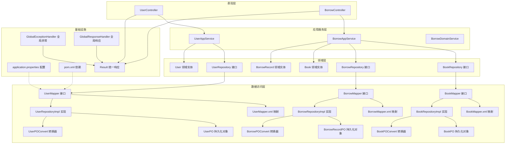
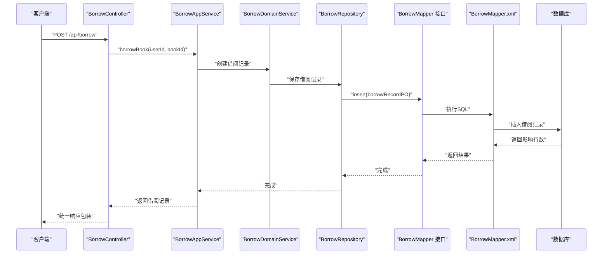
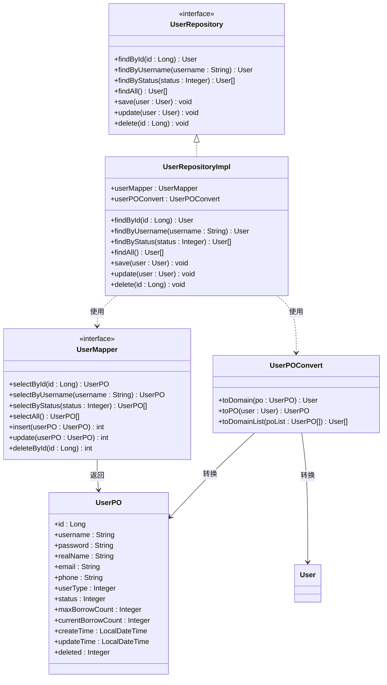
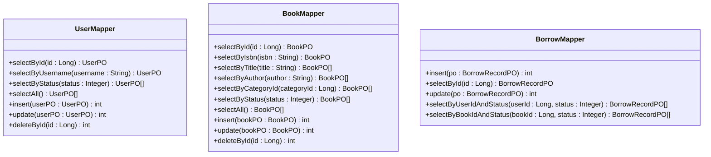
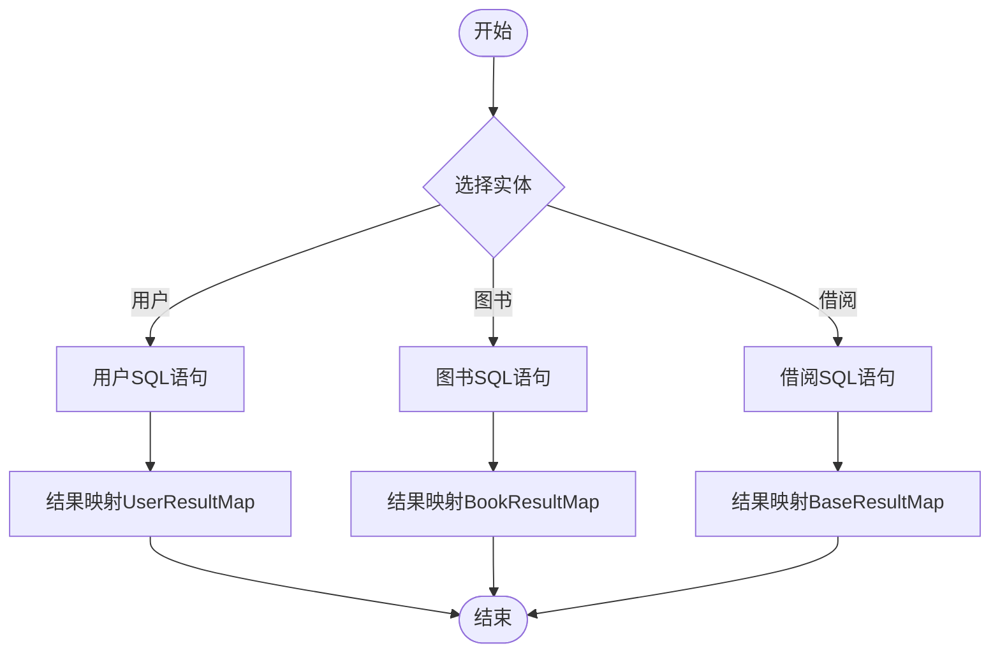
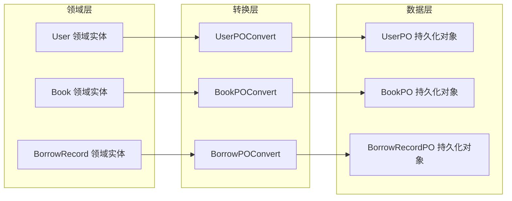
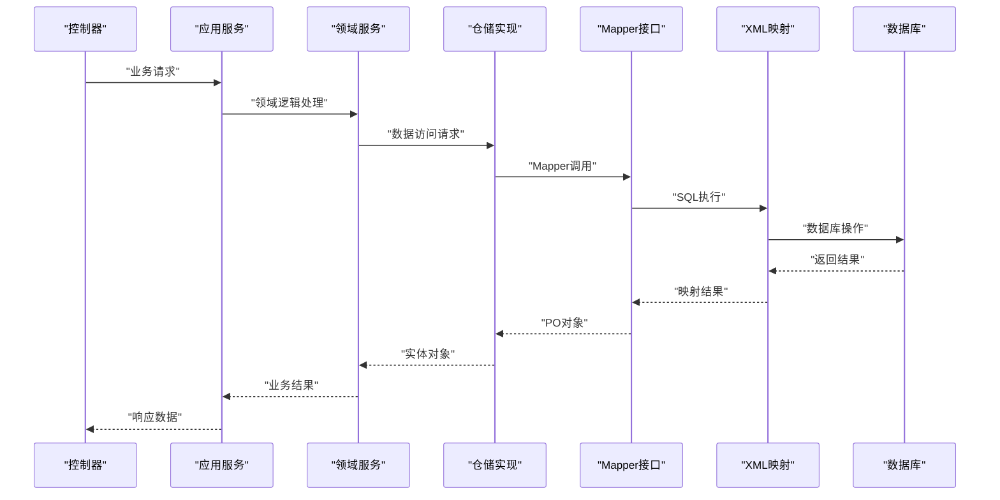
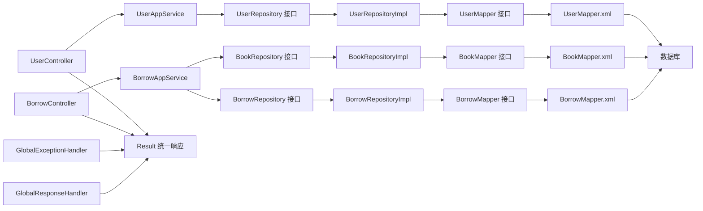

# 数据访问层设计

<cite>
**本文档引用的文件**
- [UserMapper.java](file://src/main/java/com/example/springbootmybatis/infrastructure/repository/mapper/UserMapper.java)
- [BookMapper.java](file://src/main/java/com/example/springbootmybatis/infrastructure/repository/mapper/BookMapper.java)
- [BorrowMapper.java](file://src/main/java/com/example/springbootmybatis/infrastructure/repository/mapper/BorrowMapper.java)
- [UserMapper.xml](file://src/main/resources/mapper/UserMapper.xml)
- [BookMapper.xml](file://src/main/resources/mapper/BookMapper.xml)
- [BorrowMapper.xml](file://src/main/resources/mapper/BorrowMapper.xml)
- [User.java](file://src/main/java/com/example/springbootmybatis/domain/model/entity/User.java)
- [Book.java](file://src/main/java/com/example/springbootmybatis/domain/model/entity/Book.java)
- [BorrowRecord.java](file://src/main/java/com/example/springbootmybatis/domain/model/entity/BorrowRecord.java)
- [UserRepository.java](file://src/main/java/com/example/springbootmybatis/domain/support/UserRepository.java)
- [BookRepository.java](file://src/main/java/com/example/springbootmybatis/domain/support/BookRepository.java)
- [BorrowRepository.java](file://src/main/java/com/example/springbootmybatis/domain/support/BorrowRepository.java)
- [UserRepositoryImpl.java](file://src/main/java/com/example/springbootmybatis/infrastructure/repository/impl/UserRepositoryImpl.java)
- [BookRepositoryImpl.java](file://src/main/java/com/example/springbootmybatis/infrastructure/repository/impl/BookRepositoryImpl.java)
- [BorrowRepositoryImpl.java](file://src/main/java/com/example/springbootmybatis/infrastructure/repository/impl/BorrowRepositoryImpl.java)
- [UserPO.java](file://src/main/java/com/example/springbootmybatis/infrastructure/repository/po/UserPO.java)
- [BookPO.java](file://src/main/java/com/example/springbootmybatis/infrastructure/repository/po/BookPO.java)
- [BorrowRecordPO.java](file://src/main/java/com/example/springbootmybatis/infrastructure/repository/po/BorrowRecordPO.java)
- [UserConvert.java](file://src/main/java/com/example/springbootmybatis/application/convert/UserConvert.java)
- [BookPOConvert.java](file://src/main/java/com/example/springbootmybatis/infrastructure/repository/convert/BookPOConvert.java)
- [BorrowPOConvert.java](file://src/main/java/com/example/springbootmybatis/infrastructure/repository/convert/BorrowPOConvert.java)
- [UserController.java](file://src/main/java/com/example/springbootmybatis/adapter/controller/UserController.java)
- [BorrowController.java](file://src/main/java/com/example/springbootmybatis/adapter/controller/BorrowController.java)
- [UserAppService.java](file://src/main/java/com/example/springbootmybatis/application/service/UserAppService.java)
- [BorrowAppService.java](file://src/main/java/com/example/springbootmybatis/application/service/BorrowAppService.java)
- [BorrowDomainService.java](file://src/main/java/com/example/springbootmybatis/domain/service/BorrowDomainService.java)
- [application.properties](file://src/main/resources/application.properties)
- [pom.xml](file://pom.xml)
- [GlobalExceptionHandler.java](file://src/main/java/com/example/springbootmybatis/advice/GlobalExceptionHandler.java)
- [GlobalResponseHandler.java](file://src/main/java/com/example/springbootmybatis/advice/GlobalResponseHandler.java)
- [Result.java](file://src/main/java/com/example/springbootmybatis/common/Result.java)
- [BookRepositoryTest.java](file://src/test/java/com/example/springbootmybatis/repository/BookRepositoryTest.java)
- [BorrowRepositoryTest.java](file://src/test/java/com/example/springbootmybatis/repository/BorrowRepositoryTest.java)
</cite>

## 目录
1. [引言](#引言)
2. [项目结构](#项目结构)
3. [核心组件](#核心组件)
4. [架构总览](#架构总览)
5. [详细组件分析](#详细组件分析)
6. [依赖关系分析](#依赖关系分析)
7. [性能考虑](#性能考虑)
8. [故障排查指南](#故障排查指南)
9. [结论](#结论)
10. [附录](#附录)

## 引言
本设计文档聚焦于Spring Boot + MyBatis的完整数据访问层重构，涵盖用户、图书、借阅记录等多实体的领域模型设计。系统性阐述以下主题：
- 多实体Mapper接口设计与职责边界
- XML映射中的SQL语句与动态SQL实现思路
- 领域模型与数据模型的分离设计
- 应用服务层与仓储模式的协作机制
- 数据库连接与事务管理机制
- SQL优化策略与性能调优方法
- 分页查询、条件查询与批量操作的实现要点
- 单元测试策略
- 缓存机制与数据一致性保障
- 数据库迁移与版本管理最佳实践

## 项目结构
该项目采用DDD（领域驱动设计）分层架构：控制器层（Controller）负责HTTP请求入口；应用服务层（Application Service）封装业务用例；领域层（Domain）承载核心业务逻辑；数据访问层（Repository + Mapper）负责持久化；实体类（Entity）承载领域模型；PO对象（Persistent Object）承载数据模型；全局响应与异常处理提供统一输出与错误处理。

**图表来源**
- [UserController.java](file://src/main/java/com/example/springbootmybatis/adapter/controller/UserController.java)
- [BorrowController.java](file://src/main/java/com/example/springbootmybatis/adapter/controller/BorrowController.java)
- [UserAppService.java](file://src/main/java/com/example/springbootmybatis/application/service/UserAppService.java)
- [BorrowAppService.java](file://src/main/java/com/example/springbootmybatis/application/service/BorrowAppService.java)
- [UserRepository.java](file://src/main/java/com/example/springbootmybatis/domain/support/UserRepository.java)
- [BookRepository.java](file://src/main/java/com/example/springbootmybatis/domain/support/BookRepository.java)
- [BorrowRepository.java](file://src/main/java/com/example/springbootmybatis/domain/support/BorrowRepository.java)
- [UserMapper.java](file://src/main/java/com/example/springbootmybatis/infrastructure/repository/mapper/UserMapper.java)
- [BookMapper.java](file://src/main/java/com/example/springbootmybatis/infrastructure/repository/mapper/BookMapper.java)
- [BorrowMapper.java](file://src/main/java/com/example/springbootmybatis/infrastructure/repository/mapper/BorrowMapper.java)
- [UserMapper.xml](file://src/main/resources/mapper/UserMapper.xml)
- [BookMapper.xml](file://src/main/resources/mapper/BookMapper.xml)
- [BorrowMapper.xml](file://src/main/resources/mapper/BorrowMapper.xml)
- [UserRepositoryImpl.java](file://src/main/java/com/example/springbootmybatis/infrastructure/repository/impl/UserRepositoryImpl.java)
- [BookRepositoryImpl.java](file://src/main/java/com/example/springbootmybatis/infrastructure/repository/impl/BookRepositoryImpl.java)
- [BorrowRepositoryImpl.java](file://src/main/java/com/example/springbootmybatis/infrastructure/repository/impl/BorrowRepositoryImpl.java)
- [UserPO.java](file://src/main/java/com/example/springbootmybatis/infrastructure/repository/po/UserPO.java)
- [BookPO.java](file://src/main/java/com/example/springbootmybatis/infrastructure/repository/po/BookPO.java)
- [BorrowRecordPO.java](file://src/main/java/com/example/springbootmybatis/infrastructure/repository/po/BorrowRecordPO.java)
- [UserConvert.java](file://src/main/java/com/example/springbootmybatis/application/convert/UserConvert.java)
- [BookPOConvert.java](file://src/main/java/com/example/springbootmybatis/infrastructure/repository/convert/BookPOConvert.java)
- [BorrowPOConvert.java](file://src/main/java/com/example/springbootmybatis/infrastructure/repository/convert/BorrowPOConvert.java)
- [User.java](file://src/main/java/com/example/springbootmybatis/domain/model/entity/User.java)
- [Book.java](file://src/main/java/com/example/springbootmybatis/domain/model/entity/Book.java)
- [BorrowRecord.java](file://src/main/java/com/example/springbootmybatis/domain/model/entity/BorrowRecord.java)

**章节来源**
- [pom.xml](file://pom.xml)
- [application.properties](file://src/main/resources/application.properties)

## 核心组件
- 多实体Mapper接口：UserMapper、BookMapper、BorrowMapper分别声明对应实体的基础CRUD与条件查询方法，作为数据访问契约。
- XML映射配置：UserMapper.xml、BookMapper.xml、BorrowMapper.xml定义SQL语句、参数绑定、结果映射及常用更新逻辑。
- 领域模型：User、Book、BorrowRecord承载核心业务逻辑，包含工厂方法和领域行为。
- 仓储接口：UserRepository、BookRepository、BorrowRepository定义领域层的数据访问抽象。
- 仓储实现：UserRepositoryImpl、BookRepositoryImpl、BorrowRepositoryImpl实现具体的数据访问逻辑。
- PO对象：UserPO、BookPO、BorrowRecordPO与数据库表字段映射，支持驼峰命名自动转换。
- 转换器：UserPOConvert、BookPOConvert、BorrowPOConvert负责领域模型与数据模型之间的双向转换。
- 应用服务：UserAppService、BorrowAppService封装业务用例，协调领域模型与数据访问层。
- 控制器：UserController、BorrowController提供REST接口入口，调用应用服务并返回统一响应包装。
- 全局响应与异常：统一返回格式与异常兜底。

**章节来源**
- [UserMapper.java](file://src/main/java/com/example/springbootmybatis/infrastructure/repository/mapper/UserMapper.java)
- [BookMapper.java](file://src/main/java/com/example/springbootmybatis/infrastructure/repository/mapper/BookMapper.java)
- [BorrowMapper.java](file://src/main/java/com/example/springbootmybatis/infrastructure/repository/mapper/BorrowMapper.java)
- [UserMapper.xml](file://src/main/resources/mapper/UserMapper.xml)
- [BookMapper.xml](file://src/main/resources/mapper/BookMapper.xml)
- [BorrowMapper.xml](file://src/main/resources/mapper/BorrowMapper.xml)
- [User.java](file://src/main/java/com/example/springbootmybatis/domain/model/entity/User.java)
- [Book.java](file://src/main/java/com/example/springbootmybatis/domain/model/entity/Book.java)
- [BorrowRecord.java](file://src/main/java/com/example/springbootmybatis/domain/model/entity/BorrowRecord.java)
- [UserRepository.java](file://src/main/java/com/example/springbootmybatis/domain/support/UserRepository.java)
- [BookRepository.java](file://src/main/java/com/example/springbootmybatis/domain/support/BookRepository.java)
- [BorrowRepository.java](file://src/main/java/com/example/springbootmybatis/domain/support/BorrowRepository.java)
- [UserRepositoryImpl.java](file://src/main/java/com/example/springbootmybatis/infrastructure/repository/impl/UserRepositoryImpl.java)
- [BookRepositoryImpl.java](file://src/main/java/com/example/springbootmybatis/infrastructure/repository/impl/BookRepositoryImpl.java)
- [BorrowRepositoryImpl.java](file://src/main/java/com/example/springbootmybatis/infrastructure/repository/impl/BorrowRepositoryImpl.java)
- [UserPO.java](file://src/main/java/com/example/springbootmybatis/infrastructure/repository/po/UserPO.java)
- [BookPO.java](file://src/main/java/com/example/springbootmybatis/infrastructure/repository/po/BookPO.java)
- [BorrowRecordPO.java](file://src/main/java/com/example/springbootmybatis/infrastructure/repository/po/BorrowRecordPO.java)
- [UserConvert.java](file://src/main/java/com/example/springbootmybatis/application/convert/UserConvert.java)
- [BookPOConvert.java](file://src/main/java/com/example/springbootmybatis/infrastructure/repository/convert/BookPOConvert.java)
- [BorrowPOConvert.java](file://src/main/java/com/example/springbootmybatis/infrastructure/repository/convert/BorrowPOConvert.java)
- [UserAppService.java](file://src/main/java/com/example/springbootmybatis/application/service/UserAppService.java)
- [BorrowAppService.java](file://src/main/java/com/example/springbootmybatis/application/service/BorrowAppService.java)
- [BorrowDomainService.java](file://src/main/java/com/example/springbootmybatis/domain/service/BorrowDomainService.java)
- [GlobalResponseHandler.java](file://src/main/java/com/example/springbootmybatis/advice/GlobalResponseHandler.java)
- [GlobalExceptionHandler.java](file://src/main/java/com/example/springbootmybatis/advice/GlobalExceptionHandler.java)
- [Result.java](file://src/main/java/com/example/springbootmybatis/common/Result.java)

## 架构总览
下图展示从HTTP请求到数据库访问的关键流程与多实体组件交互：

**图表来源**
- [BorrowController.java](file://src/main/java/com/example/springbootmybatis/adapter/controller/BorrowController.java)
- [BorrowAppService.java](file://src/main/java/com/example/springbootmybatis/application/service/BorrowAppService.java)
- [BorrowDomainService.java](file://src/main/java/com/example/springbootmybatis/domain/service/BorrowDomainService.java)
- [BorrowRepository.java](file://src/main/java/com/example/springbootmybatis/domain/support/BorrowRepository.java)
- [BorrowMapper.java](file://src/main/java/com/example/springbootmybatis/infrastructure/repository/mapper/BorrowMapper.java)
- [BorrowMapper.xml](file://src/main/resources/mapper/BorrowMapper.xml)

## 详细组件分析

### 完整仓储模式实现
项目已实现完整的仓储模式，包含Repository接口、实现类、Mapper、PO、Convert等完整组件链路：

**仓储接口层**
- UserRepository：定义用户领域的数据访问抽象，包含findById、findByUsername、findByStatus、findAll、save、update、delete等方法
- BookRepository：定义图书领域的数据访问抽象，包含基于多种条件的查询方法
- BorrowRepository：定义借阅记录领域的数据访问抽象，专注借阅业务场景

**仓储实现层**
- UserRepositoryImpl：实现用户数据访问逻辑，处理UserPO与User实体的转换
- BookRepositoryImpl：实现图书数据访问逻辑，处理BookPO与Book实体的转换
- BorrowRepositoryImpl：实现借阅记录数据访问逻辑，处理BorrowRecordPO与BorrowRecord实体的转换

**数据模型层**
- UserPO、BookPO、BorrowRecordPO：与数据库表结构对应的持久化对象，支持驼峰命名自动转换
- 转换器：UserPOConvert、BookPOConvert、BorrowPOConvert负责领域模型与数据模型之间的双向转换

**图表来源**
- [UserRepository.java](file://src/main/java/com/example/springbootmybatis/domain/support/UserRepository.java)
- [UserRepositoryImpl.java](file://src/main/java/com/example/springbootmybatis/infrastructure/repository/impl/UserRepositoryImpl.java)
- [UserMapper.java](file://src/main/java/com/example/springbootmybatis/infrastructure/repository/mapper/UserMapper.java)
- [UserPO.java](file://src/main/java/com/example/springbootmybatis/infrastructure/repository/po/UserPO.java)
- [UserPOConvert.java](file://src/main/java/com/example/springbootmybatis/infrastructure/repository/convert/UserPOConvert.java)

**章节来源**
- [UserRepository.java](file://src/main/java/com/example/springbootmybatis/domain/support/UserRepository.java)
- [BookRepository.java](file://src/main/java/com/example/springbootmybatis/domain/support/BookRepository.java)
- [BorrowRepository.java](file://src/main/java/com/example/springbootmybatis/domain/support/BorrowRepository.java)
- [UserRepositoryImpl.java](file://src/main/java/com/example/springbootmybatis/infrastructure/repository/impl/UserRepositoryImpl.java)
- [BookRepositoryImpl.java](file://src/main/java/com/example/springbootmybatis/infrastructure/repository/impl/BookRepositoryImpl.java)
- [BorrowRepositoryImpl.java](file://src/main/java/com/example/springbootmybatis/infrastructure/repository/impl/BorrowRepositoryImpl.java)
- [UserMapper.java](file://src/main/java/com/example/springbootmybatis/infrastructure/repository/mapper/UserMapper.java)
- [BookMapper.java](file://src/main/java/com/example/springbootmybatis/infrastructure/repository/mapper/BookMapper.java)
- [BorrowMapper.java](file://src/main/java/com/example/springbootmybatis/infrastructure/repository/mapper/BorrowMapper.java)
- [UserPO.java](file://src/main/java/com/example/springbootmybatis/infrastructure/repository/po/UserPO.java)
- [BookPO.java](file://src/main/java/com/example/springbootmybatis/infrastructure/repository/po/BookPO.java)
- [BorrowRecordPO.java](file://src/main/java/com/example/springbootmybatis/infrastructure/repository/po/BorrowRecordPO.java)
- [UserPOConvert.java](file://src/main/java/com/example/springbootmybatis/infrastructure/repository/convert/UserPOConvert.java)
- [BookPOConvert.java](file://src/main/java/com/example/springbootmybatis/infrastructure/repository/convert/BookPOConvert.java)
- [BorrowPOConvert.java](file://src/main/java/com/example/springbootmybatis/infrastructure/repository/convert/BorrowPOConvert.java)

### 多实体Mapper接口设计
三个核心Mapper接口均采用统一的设计模式：

**UserMapper接口**
- 方法职责：按ID查询、按用户名查询、按状态查询列表、全量查询、新增、更新、删除
- 参数与返回值：Long、String、Integer等标量参数；返回UserPO实体或集合
- 设计特点：专注于用户实体的完整CRUD操作

**BookMapper接口**
- 方法职责：按ID查询、按ISBN查询、按标题/作者/分类/状态查询、全量查询、新增、更新、删除
- 设计特点：支持图书搜索功能，方法签名与查询需求高度匹配

**BorrowMapper接口**
- 方法职责：新增借阅记录、按ID查询、更新、按用户和状态查询、按图书和状态查询
- 设计特点：专门处理借阅业务场景，支持借阅状态管理

**图表来源**
- [UserMapper.java](file://src/main/java/com/example/springbootmybatis/infrastructure/repository/mapper/UserMapper.java)
- [BookMapper.java](file://src/main/java/com/example/springbootmybatis/infrastructure/repository/mapper/BookMapper.java)
- [BorrowMapper.java](file://src/main/java/com/example/springbootmybatis/infrastructure/repository/mapper/BorrowMapper.java)

**章节来源**
- [UserMapper.java](file://src/main/java/com/example/springbootmybatis/infrastructure/repository/mapper/UserMapper.java)
- [BookMapper.java](file://src/main/java/com/example/springbootmybatis/infrastructure/repository/mapper/BookMapper.java)
- [BorrowMapper.java](file://src/main/java/com/example/springbootmybatis/infrastructure/repository/mapper/BorrowMapper.java)

### 多实体XML映射与动态SQL
每个实体的XML映射都遵循统一的结构模式：

**UserMapper.xml配置**
- 结果映射：UserResultMap将数据库列名映射到UserPO属性
- 基础SQL：查询（按id、username、status、全量）、插入、更新、删除
- 特殊设计：自动更新update_time字段

**BookMapper.xml配置**
- 结果映射：BookResultMap将数据库列名映射到BookPO属性
- 基础SQL：查询（按id、isbn、title、author、categoryId、status、全量）、插入、更新、删除
- 特殊设计：软删除机制（deleted=1表示删除），LIKE模糊查询支持

**BorrowMapper.xml配置**
- 结果映射：BaseResultMap将数据库列名映射到BorrowRecordPO属性
- 基础SQL：插入、按ID查询、更新、按用户和状态查询、按图书和状态查询
- 特殊设计：按借阅日期降序排列，支持借阅状态管理

**图表来源**
- [UserMapper.xml](file://src/main/resources/mapper/UserMapper.xml)
- [BookMapper.xml](file://src/main/resources/mapper/BookMapper.xml)
- [BorrowMapper.xml](file://src/main/resources/mapper/BorrowMapper.xml)

**章节来源**
- [UserMapper.xml](file://src/main/resources/mapper/UserMapper.xml)
- [BookMapper.xml](file://src/main/resources/mapper/BookMapper.xml)
- [BorrowMapper.xml](file://src/main/resources/mapper/BorrowMapper.xml)

### 领域模型与数据模型分离设计
项目采用DDD架构，实现了领域模型与数据模型的清晰分离：

**领域模型（Domain Layer）**
- User实体：包含用户创建、信息更新、注销等业务行为
- Book实体：包含图书创建、信息更新、借阅/归还等业务行为
- BorrowRecord实体：包含借阅记录创建、归还、超时费计算等业务行为

**数据模型（Infrastructure Layer）**
- UserPO、BookPO、BorrowRecordPO：与数据库表结构对应的持久化对象
- 支持驼峰命名自动转换，简化数据库字段映射

**转换层（Convert Layer）**
- UserPOConvert：用户领域模型与PO对象之间的转换
- BookPOConvert：图书领域模型与PO对象之间的转换
- BorrowPOConvert：借阅记录领域模型与PO对象之间的转换

**图表来源**
- [User.java](file://src/main/java/com/example/springbootmybatis/domain/model/entity/User.java)
- [Book.java](file://src/main/java/com/example/springbootmybatis/domain/model/entity/Book.java)
- [BorrowRecord.java](file://src/main/java/com/example/springbootmybatis/domain/model/entity/BorrowRecord.java)
- [UserConvert.java](file://src/main/java/com/example/springbootmybatis/application/convert/UserConvert.java)
- [BookPOConvert.java](file://src/main/java/com/example/springbootmybatis/infrastructure/repository/convert/BookPOConvert.java)
- [BorrowPOConvert.java](file://src/main/java/com/example/springbootmybatis/infrastructure/repository/convert/BorrowPOConvert.java)
- [UserPO.java](file://src/main/java/com/example/springbootmybatis/infrastructure/repository/po/UserPO.java)
- [BookPO.java](file://src/main/java/com/example/springbootmybatis/infrastructure/repository/po/BookPO.java)
- [BorrowRecordPO.java](file://src/main/java/com/example/springbootmybatis/infrastructure/repository/po/BorrowRecordPO.java)

**章节来源**
- [User.java](file://src/main/java/com/example/springbootmybatis/domain/model/entity/User.java)
- [Book.java](file://src/main/java/com/example/springbootmybatis/domain/model/entity/Book.java)
- [BorrowRecord.java](file://src/main/java/com/example/springbootmybatis/domain/model/entity/BorrowRecord.java)
- [UserConvert.java](file://src/main/java/com/example/springbootmybatis/application/convert/UserConvert.java)
- [BookPOConvert.java](file://src/main/java/com/example/springbootmybatis/infrastructure/repository/convert/BookPOConvert.java)
- [BorrowPOConvert.java](file://src/main/java/com/example/springbootmybatis/infrastructure/repository/convert/BorrowPOConvert.java)
- [UserPO.java](file://src/main/java/com/example/springbootmybatis/infrastructure/repository/po/UserPO.java)
- [BookPO.java](file://src/main/java/com/example/springbootmybatis/infrastructure/repository/po/BookPO.java)
- [BorrowRecordPO.java](file://src/main/java/com/example/springbootmybatis/infrastructure/repository/po/BorrowRecordPO.java)

### 仓储模式与应用服务层协作
**仓储接口设计**
- UserRepository：定义用户领域的数据访问抽象
- BookRepository：定义图书领域的数据访问抽象  
- BorrowRepository：定义借阅记录领域的数据访问抽象

**仓储实现**
- UserRepositoryImpl：实现用户数据访问逻辑，处理UserPO与User实体的转换
- BookRepositoryImpl：实现图书数据访问逻辑，处理BookPO与Book实体的转换
- BorrowRepositoryImpl：实现借阅记录数据访问逻辑，处理BorrowRecordPO与BorrowRecord实体的转换

**应用服务层**
- UserAppService：处理用户相关的业务用例
- BorrowAppService：处理借阅相关的业务用例，协调BorrowDomainService和仓储层

**图表来源**
- [UserAppService.java](file://src/main/java/com/example/springbootmybatis/application/service/UserAppService.java)
- [BorrowAppService.java](file://src/main/java/com/example/springbootmybatis/application/service/BorrowAppService.java)
- [BorrowDomainService.java](file://src/main/java/com/example/springbootmybatis/domain/service/BorrowDomainService.java)
- [UserRepositoryImpl.java](file://src/main/java/com/example/springbootmybatis/infrastructure/repository/impl/UserRepositoryImpl.java)
- [BookRepositoryImpl.java](file://src/main/java/com/example/springbootmybatis/infrastructure/repository/impl/BookRepositoryImpl.java)
- [BorrowRepositoryImpl.java](file://src/main/java/com/example/springbootmybatis/infrastructure/repository/impl/BorrowRepositoryImpl.java)

**章节来源**
- [UserRepository.java](file://src/main/java/com/example/springbootmybatis/domain/support/UserRepository.java)
- [BookRepository.java](file://src/main/java/com/example/springbootmybatis/domain/support/BookRepository.java)
- [BorrowRepository.java](file://src/main/java/com/example/springbootmybatis/domain/support/BorrowRepository.java)
- [UserRepositoryImpl.java](file://src/main/java/com/example/springbootmybatis/infrastructure/repository/impl/UserRepositoryImpl.java)
- [BookRepositoryImpl.java](file://src/main/java/com/example/springbootmybatis/infrastructure/repository/impl/BookRepositoryImpl.java)
- [BorrowRepositoryImpl.java](file://src/main/java/com/example/springbootmybatis/infrastructure/repository/impl/BorrowRepositoryImpl.java)
- [UserAppService.java](file://src/main/java/com/example/springbootmybatis/application/service/UserAppService.java)
- [BorrowAppService.java](file://src/main/java/com/example/springbootmybatis/application/service/BorrowAppService.java)
- [BorrowDomainService.java](file://src/main/java/com/example/springbootmybatis/domain/service/BorrowDomainService.java)

### 数据库连接与事务管理
- 连接配置：在application.properties中设置MySQL连接URL、用户名、密码与驱动
- MyBatis配置：mapper扫描路径、实体包别名、下划线转驼峰
- 事务管理：默认单次操作在一个事务中执行；批量操作建议显式控制事务边界，确保原子性
- 多实体事务：在应用服务层协调多个仓储操作，确保业务事务的一致性

**章节来源**
- [application.properties](file://src/main/resources/application.properties)
- [pom.xml](file://pom.xml)

### SQL语句优化策略与性能调优
- 索引优化：对查询条件（如username、isbn、user_id、book_id）建立适当索引
- 查询优化：避免SELECT *，仅选择必要字段；使用LIMIT限制结果集
- 更新优化：按需更新字段，减少update_time写入频率
- 批量优化：使用批处理或批量插入，降低网络往返
- 软删除优化：图书删除采用软删除，避免数据丢失
- 缓存策略：开启二级缓存（需配合序列化与合适的作用域），合理设置缓存策略与刷新策略

**章节来源**
- [BookMapper.xml](file://src/main/resources/mapper/BookMapper.xml)
- [UserMapper.xml](file://src/main/resources/mapper/UserMapper.xml)
- [BorrowMapper.xml](file://src/main/resources/mapper/BorrowMapper.xml)

### 分页查询、条件查询与批量操作实现细节
- 分页查询：在XML中使用limit或结合分页插件；在Service层接收pageNo/pageSize参数并传入Mapper
- 条件查询：使用where/trim/choose/when otherwise实现多条件组合查询
- 批量操作：使用foreach遍历集合，构造IN或批量INSERT/UPDATE
- 多实体关联：通过应用服务层协调不同实体间的业务逻辑

**章节来源**
- [UserMapper.xml](file://src/main/resources/mapper/UserMapper.xml)
- [BookMapper.xml](file://src/main/resources/mapper/BookMapper.xml)
- [BorrowMapper.xml](file://src/main/resources/mapper/BorrowMapper.xml)

### 单元测试策略
- 上下文测试：验证Spring上下文加载与Bean装配
- 控制器测试：使用MockMvc或集成测试验证接口行为与统一响应包装
- 服务层测试：Mock仓储接口，验证业务逻辑分支
- 数据访问层测试：使用H2内存数据库或Flyway迁移脚本初始化表结构，验证CRUD与SQL正确性
- 领域模型测试：验证业务行为的正确性
- 集成测试：测试多实体协作的完整业务流程

**章节来源**
- [BookRepositoryTest.java](file://src/test/java/com/example/springbootmybatis/repository/BookRepositoryTest.java)
- [BorrowRepositoryTest.java](file://src/test/java/com/example/springbootmybatis/repository/BorrowRepositoryTest.java)
- [pom.xml](file://pom.xml)

### 缓存机制与数据一致性
- 一级缓存：SqlSession级别的本地缓存，默认开启
- 二级缓存：Mapper级别的跨SqlSession缓存，需启用并注意序列化与刷新策略
- 多实体缓存：针对高频查询的实体启用缓存，如用户和图书信息
- 数据一致性：高并发下建议使用合适的锁或乐观/悲观控制，避免脏读与幻读

**章节来源**
- [UserMapper.xml](file://src/main/resources/mapper/UserMapper.xml)
- [BookMapper.xml](file://src/main/resources/mapper/BookMapper.xml)
- [BorrowMapper.xml](file://src/main/resources/mapper/BorrowMapper.xml)

### 数据库迁移与版本管理最佳实践
- 使用Flyway进行数据库版本管理，将DDL与DML纳入版本控制
- 迁移脚本命名规范：V<版本号>__<描述>.sql，按顺序执行
- 开发环境使用H2内存数据库进行快速验证，生产环境使用MySQL并严格审核变更
- 多实体表结构：用户表、图书表、借阅记录表的完整迁移方案

**章节来源**
- [pom.xml](file://pom.xml)

## 依赖关系分析
- 控制器依赖应用服务层；应用服务层依赖领域服务和仓储接口；仓储接口依赖Mapper接口
- Mapper接口依赖XML映射与数据库；XML映射依赖PO对象
- 领域模型与数据模型通过转换层解耦
- 全局响应与异常处理独立于业务层，提供横切关注点

**图表来源**
- [UserController.java](file://src/main/java/com/example/springbootmybatis/adapter/controller/UserController.java)
- [BorrowController.java](file://src/main/java/com/example/springbootmybatis/adapter/controller/BorrowController.java)
- [UserAppService.java](file://src/main/java/com/example/springbootmybatis/application/service/UserAppService.java)
- [BorrowAppService.java](file://src/main/java/com/example/springbootmybatis/application/service/BorrowAppService.java)
- [UserRepository.java](file://src/main/java/com/example/springbootmybatis/domain/support/UserRepository.java)
- [BookRepository.java](file://src/main/java/com/example/springbootmybatis/domain/support/BookRepository.java)
- [BorrowRepository.java](file://src/main/java/com/example/springbootmybatis/domain/support/BorrowRepository.java)
- [UserRepositoryImpl.java](file://src/main/java/com/example/springbootmybatis/infrastructure/repository/impl/UserRepositoryImpl.java)
- [BookRepositoryImpl.java](file://src/main/java/com/example/springbootmybatis/infrastructure/repository/impl/BookRepositoryImpl.java)
- [BorrowRepositoryImpl.java](file://src/main/java/com/example/springbootmybatis/infrastructure/repository/impl/BorrowRepositoryImpl.java)
- [UserMapper.java](file://src/main/java/com/example/springbootmybatis/infrastructure/repository/mapper/UserMapper.java)
- [BookMapper.java](file://src/main/java/com/example/springbootmybatis/infrastructure/repository/mapper/BookMapper.java)
- [BorrowMapper.java](file://src/main/java/com/example/springbootmybatis/infrastructure/repository/mapper/BorrowMapper.java)
- [UserMapper.xml](file://src/main/resources/mapper/UserMapper.xml)
- [BookMapper.xml](file://src/main/resources/mapper/BookMapper.xml)
- [BorrowMapper.xml](file://src/main/resources/mapper/BorrowMapper.xml)
- [GlobalResponseHandler.java](file://src/main/java/com/example/springbootmybatis/advice/GlobalResponseHandler.java)
- [GlobalExceptionHandler.java](file://src/main/java/com/example/springbootmybatis/advice/GlobalExceptionHandler.java)
- [Result.java](file://src/main/java/com/example/springbootmybatis/common/Result.java)

## 性能考虑
- SQL层面：避免N+1查询，使用JOIN或批量查询；合理分页与索引
- 连接层面：池化连接，合理设置最大连接数与超时
- 缓存层面：利用MyBatis二级缓存与Redis缓存，降低数据库压力
- 并发层面：控制事务粒度，避免长事务；必要时使用锁或重试机制
- 多实体优化：通过应用服务层协调业务逻辑，减少不必要的数据库往返

## 故障排查指南
- 统一响应与异常：全局响应包装确保接口返回一致；全局异常处理器捕获未处理异常并返回标准错误信息
- 日志与监控：开启SQL日志与慢查询日志，结合APM工具定位问题
- 数据一致性：检查事务边界与隔离级别，避免并发冲突
- 多实体调试：通过应用服务层的日志追踪业务流程，定位具体失败环节

**章节来源**
- [GlobalResponseHandler.java](file://src/main/java/com/example/springbootmybatis/advice/GlobalResponseHandler.java)
- [GlobalExceptionHandler.java](file://src/main/java/com/example/springbootmybatis/advice/GlobalExceptionHandler.java)
- [Result.java](file://src/main/java/com/example/springbootmybatis/common/Result.java)

## 结论
本项目成功实现了从单一用户实体到多实体完整数据访问层的重构，采用DDD架构模式，实现了领域模型与数据模型的清晰分离。通过UserMapper、BookMapper、BorrowMapper三个核心Mapper接口和对应的XML映射配置，支持了完整的用户管理、图书管理和借阅管理业务场景。项目具备完整的仓储模式实现，包含Repository接口、实现类、Mapper、PO、Convert等组件，为后续的功能扩展奠定了坚实基础。

## 附录
- 配置要点：数据库连接、MyBatis扫描路径、驼峰映射
- 测试建议：覆盖控制器、应用服务、仓储与数据访问层，结合H2与迁移脚本
- 架构建议：继续完善领域服务层，增强业务逻辑的封装性

**章节来源**
- [application.properties](file://src/main/resources/application.properties)
- [pom.xml](file://pom.xml)