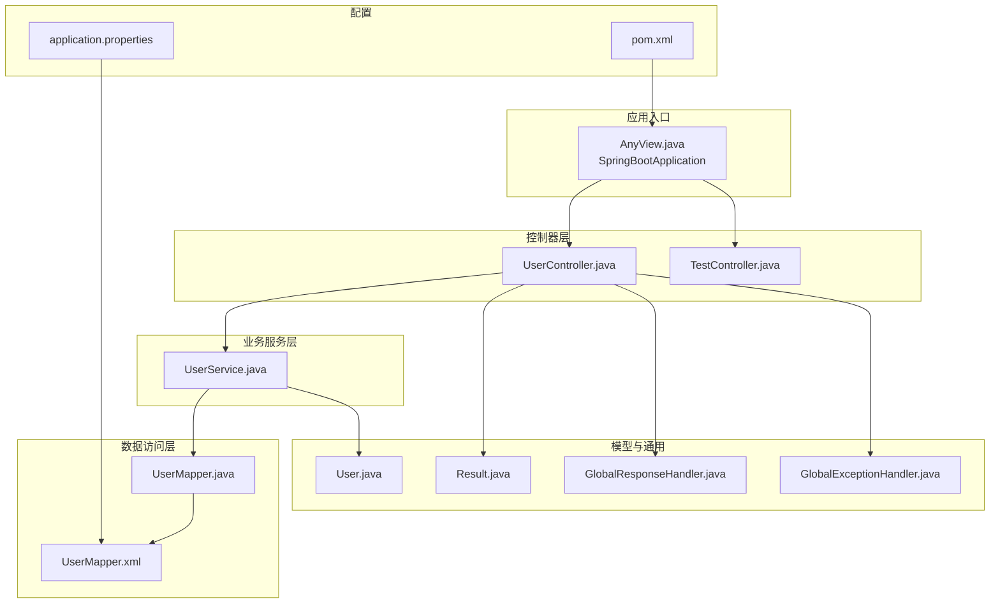
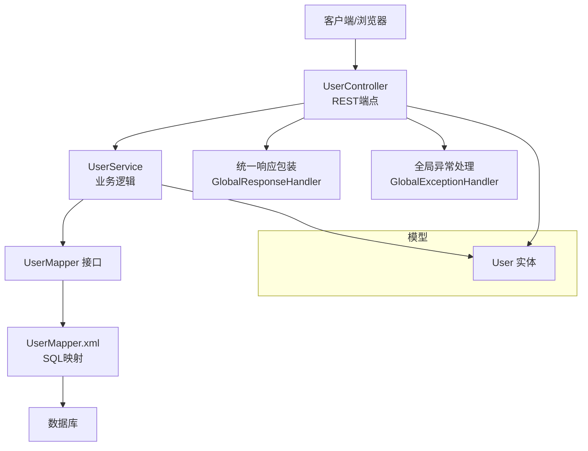
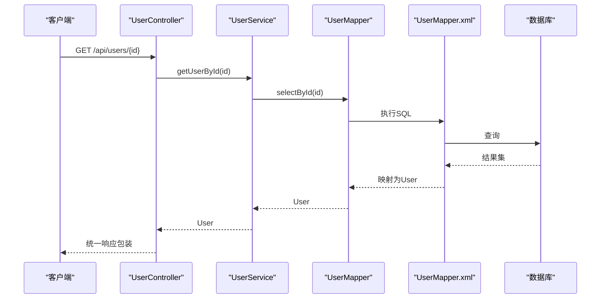
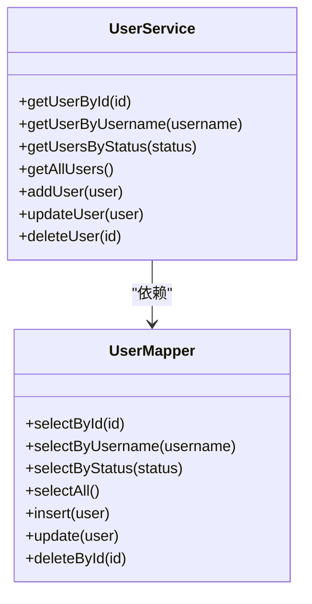
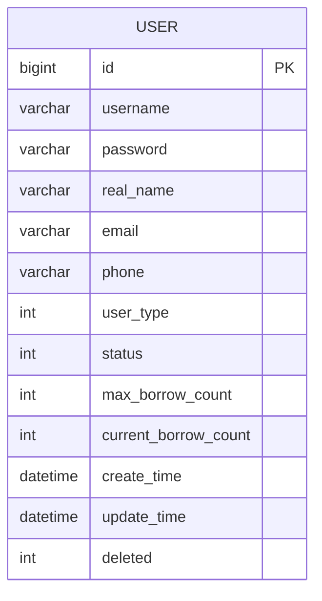
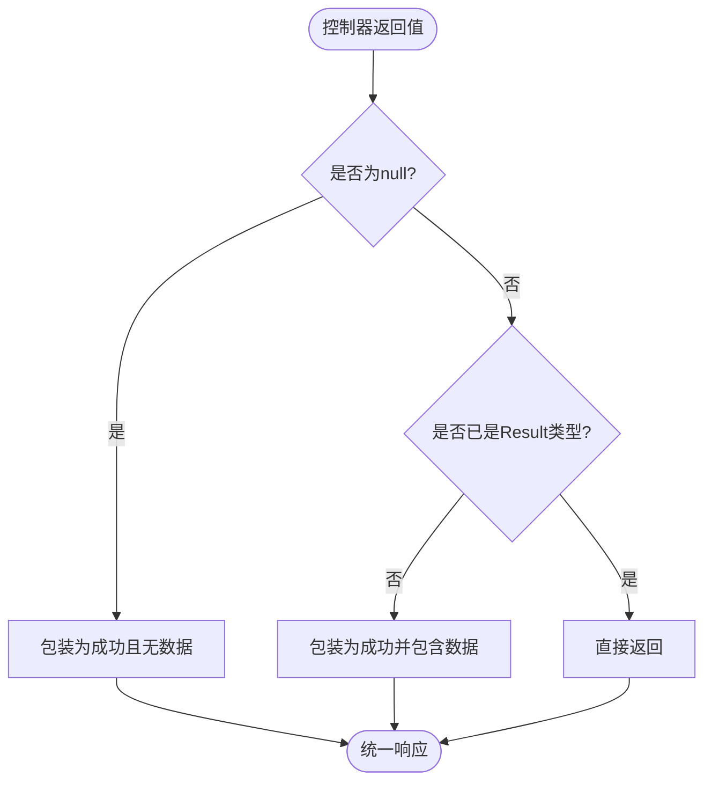
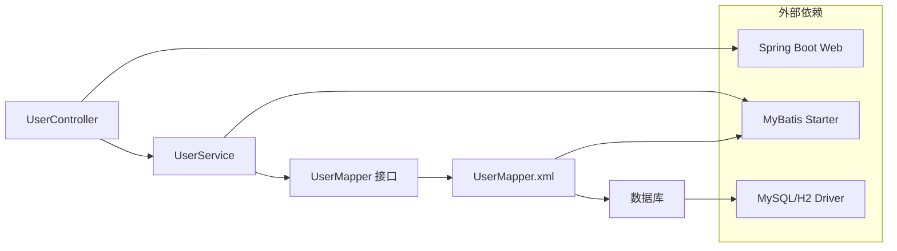

# MVC架构模式

<cite>
**本文档引用的文件**
- [AnyView.java](file://src/main/java/com/example/springbootmybatis/AnyView.java)
- [UserController.java](file://src/main/java/com/example/springbootmybatis/controller/UserController.java)
- [UserService.java](file://src/main/java/com/example/springbootmybatis/service/UserService.java)
- [UserMapper.java](file://src/main/java/com/example/springbootmybatis/mapper/UserMapper.java)
- [UserMapper.xml](file://src/main/resources/mapper/UserMapper.xml)
- [User.java](file://src/main/java/com/example/springbootmybatis/entity/User.java)
- [GlobalExceptionHandler.java](file://src/main/java/com/example/springbootmybatis/advice/GlobalExceptionHandler.java)
- [GlobalResponseHandler.java](file://src/main/java/com/example/springbootmybatis/advice/GlobalResponseHandler.java)
- [Result.java](file://src/main/java/com/example/springbootmybatis/common/Result.java)
- [TestController.java](file://src/main/java/com/example/springbootmybatis/controller/TestController.java)
- [application.properties](file://src/main/resources/application.properties)
- [pom.xml](file://pom.xml)
</cite>

## 目录
1. [简介](#简介)
2. [项目结构](#项目结构)
3. [核心组件](#核心组件)
4. [架构总览](#架构总览)
5. [详细组件分析](#详细组件分析)
6. [依赖关系分析](#依赖关系分析)
7. [性能考虑](#性能考虑)
8. [故障排除指南](#故障排除指南)
9. [结论](#结论)
10. [附录](#附录)

## 简介
本项目基于Spring Boot与MyBatis实现了一个标准的MVC（Model-View-Controller）架构示例，围绕用户管理模块展示了三层架构的职责分离与协作方式：
- Model（模型）：实体类与数据映射，负责数据结构与持久化接口定义。
- View（视图）：本项目采用REST API作为对外输出，不包含传统Web模板视图层。
- Controller（控制器）：接收HTTP请求，调用业务服务，返回标准化响应。
- Service（业务服务）：封装业务规则与流程，协调数据访问层。
- Mapper/DAO：通过MyBatis映射XML执行SQL，完成数据库读写。

该文档将深入解析各层在项目中的具体实现、组件交互流程、数据流向以及最佳实践与设计原则。

## 项目结构
项目采用按功能域分层的目录组织方式，清晰地划分了控制器、服务、数据访问、实体与通用工具等模块。

图表来源
- [AnyView.java](file://src/main/java/com/example/springbootmybatis/AnyView.java#L1-L13)
- [UserController.java](file://src/main/java/com/example/springbootmybatis/controller/UserController.java#L1-L68)
- [UserService.java](file://src/main/java/com/example/springbootmybatis/service/UserService.java#L1-L42)
- [UserMapper.java](file://src/main/java/com/example/springbootmybatis/mapper/UserMapper.java#L1-L23)
- [UserMapper.xml](file://src/main/resources/mapper/UserMapper.xml#L1-L57)
- [User.java](file://src/main/java/com/example/springbootmybatis/entity/User.java#L1-L21)
- [GlobalResponseHandler.java](file://src/main/java/com/example/springbootmybatis/advice/GlobalResponseHandler.java#L1-L39)
- [GlobalExceptionHandler.java](file://src/main/java/com/example/springbootmybatis/advice/GlobalExceptionHandler.java#L1-L22)
- [application.properties](file://src/main/resources/application.properties#L1-L16)
- [pom.xml](file://pom.xml#L1-L88)

章节来源
- [AnyView.java](file://src/main/java/com/example/springbootmybatis/AnyView.java#L1-L13)
- [application.properties](file://src/main/resources/application.properties#L1-L16)
- [pom.xml](file://pom.xml#L1-L88)

## 核心组件
本节从MVC视角概述各层职责与关键实现要点：
- 控制器层（Controller）
  - 负责接收HTTP请求，绑定参数，调用业务服务，返回标准化响应。
  - 示例：UserController提供查询单个用户、按用户名查询、按状态查询、分页查询、新增、更新、删除等接口。
- 业务服务层（Service）
  - 封装业务规则与流程，协调数据访问层，保证事务与一致性。
  - 示例：UserService将控制器传入的实体对象转发给UserMapper执行数据库操作。
- 数据访问层（Mapper/DAO）
  - 定义数据访问接口，配合XML映射SQL语句，完成增删改查。
  - 示例：UserMapper接口声明查询与写入方法；UserMapper.xml定义SQL与结果映射。
- 模型与通用工具
  - 实体类User承载数据字段；Result统一响应结构；全局响应与异常处理器统一对外输出格式。

章节来源
- [UserController.java](file://src/main/java/com/example/springbootmybatis/controller/UserController.java#L1-L68)
- [UserService.java](file://src/main/java/com/example/springbootmybatis/service/UserService.java#L1-L42)
- [UserMapper.java](file://src/main/java/com/example/springbootmybatis/mapper/UserMapper.java#L1-L23)
- [UserMapper.xml](file://src/main/resources/mapper/UserMapper.xml#L1-L57)
- [User.java](file://src/main/java/com/example/springbootmybatis/entity/User.java#L1-L21)
- [GlobalResponseHandler.java](file://src/main/java/com/example/springbootmybatis/advice/GlobalResponseHandler.java#L1-L39)
- [GlobalExceptionHandler.java](file://src/main/java/com/example/springbootmybatis/advice/GlobalExceptionHandler.java#L1-L22)
- [Result.java](file://src/main/java/com/example/springbootmybatis/common/Result.java#L1-L87)

## 架构总览
下图展示MVC在本项目中的整体交互关系与数据流向。

图表来源
- [UserController.java](file://src/main/java/com/example/springbootmybatis/controller/UserController.java#L1-L68)
- [UserService.java](file://src/main/java/com/example/springbootmybatis/service/UserService.java#L1-L42)
- [UserMapper.java](file://src/main/java/com/example/springbootmybatis/mapper/UserMapper.java#L1-L23)
- [UserMapper.xml](file://src/main/resources/mapper/UserMapper.xml#L1-L57)
- [User.java](file://src/main/java/com/example/springbootmybatis/entity/User.java#L1-L21)
- [GlobalResponseHandler.java](file://src/main/java/com/example/springbootmybatis/advice/GlobalResponseHandler.java#L1-L39)
- [GlobalExceptionHandler.java](file://src/main/java/com/example/springbootmybatis/advice/GlobalExceptionHandler.java#L1-L22)

## 详细组件分析

### 控制器层（Controller）
- 职责
  - 接收HTTP请求，进行参数校验与绑定，调用业务服务执行业务逻辑，返回标准化响应。
  - 本项目使用@RestController统一返回JSON，所有方法均通过@RequestMapping或@GetMapping/PostMapping等注解暴露REST端点。
- 关键实现
  - 用户查询：按ID、用户名、状态、全量查询。
  - 用户变更：新增、更新、删除。
  - 错误演示：提供一个抛出运行时异常的端点用于验证全局异常处理。
- 响应与异常
  - 通过全局响应处理器自动包装返回值为统一结构。
  - 全局异常处理器捕获未处理异常并返回统一错误结构。

图表来源
- [UserController.java](file://src/main/java/com/example/springbootmybatis/controller/UserController.java#L17-L20)
- [UserService.java](file://src/main/java/com/example/springbootmybatis/service/UserService.java#L15-L17)
- [UserMapper.java](file://src/main/java/com/example/springbootmybatis/mapper/UserMapper.java#L10)
- [UserMapper.xml](file://src/main/resources/mapper/UserMapper.xml#L21-L23)

章节来源
- [UserController.java](file://src/main/java/com/example/springbootmybatis/controller/UserController.java#L1-L68)
- [GlobalResponseHandler.java](file://src/main/java/com/example/springbootmybatis/advice/GlobalResponseHandler.java#L1-L39)
- [GlobalExceptionHandler.java](file://src/main/java/com/example/springbootmybatis/advice/GlobalExceptionHandler.java#L1-L22)

### 业务服务层（Service）
- 职责
  - 将控制器传入的业务请求转换为数据访问层可执行的操作，必要时进行业务规则校验与组合。
  - 保持对上层控制器的稳定接口，对下层数据访问层进行解耦。
- 关键实现
  - 查询与写入方法直接委托给UserMapper对应方法。
  - 返回值通常为实体或集合，便于控制器进一步处理或包装。

图表来源
- [UserService.java](file://src/main/java/com/example/springbootmybatis/service/UserService.java#L1-L42)
- [UserMapper.java](file://src/main/java/com/example/springbootmybatis/mapper/UserMapper.java#L1-L23)

章节来源
- [UserService.java](file://src/main/java/com/example/springbootmybatis/service/UserService.java#L1-L42)

### 数据访问层（Mapper/DAO）
- 职责
  - 定义数据访问接口，提供面向业务的抽象方法。
  - 配合XML映射SQL语句，完成数据库的增删改查。
- 关键实现
  - 接口方法与XML中SQL ID一一对应。
  - XML中定义了完整的字段映射（resultMap），确保查询结果与User实体字段一致。
  - 支持插入自动生成主键、更新时自动设置更新时间等常见策略。

图表来源
- [UserMapper.xml](file://src/main/resources/mapper/UserMapper.xml#L5-L19)
- [User.java](file://src/main/java/com/example/springbootmybatis/entity/User.java#L1-L21)

章节来源
- [UserMapper.java](file://src/main/java/com/example/springbootmybatis/mapper/UserMapper.java#L1-L23)
- [UserMapper.xml](file://src/main/resources/mapper/UserMapper.xml#L1-L57)
- [User.java](file://src/main/java/com/example/springbootmybatis/entity/User.java#L1-L21)

### 模型与统一响应
- 实体模型（User）
  - 字段覆盖用户基本信息、状态、计数与时间戳等，满足典型用户表结构。
- 统一响应（Result）
  - 提供成功与错误两种静态工厂方法，支持泛型数据封装。
  - 全局响应处理器将控制器返回值自动包装为统一结构，避免重复样板代码。
- 全局异常处理
  - 捕获Exception与RuntimeException，统一返回错误信息，提升用户体验与日志一致性。

图表来源
- [GlobalResponseHandler.java](file://src/main/java/com/example/springbootmybatis/advice/GlobalResponseHandler.java#L18-L38)
- [Result.java](file://src/main/java/com/example/springbootmybatis/common/Result.java#L31-L45)

章节来源
- [Result.java](file://src/main/java/com/example/springbootmybatis/common/Result.java#L1-L87)
- [GlobalResponseHandler.java](file://src/main/java/com/example/springbootmybatis/advice/GlobalResponseHandler.java#L1-L39)
- [GlobalExceptionHandler.java](file://src/main/java/com/example/springbootmybatis/advice/GlobalExceptionHandler.java#L1-L22)

## 依赖关系分析
- 组件耦合与内聚
  - 控制器仅依赖业务服务接口，不直接依赖数据访问实现，降低耦合度。
  - 业务服务仅依赖Mapper接口，通过接口隔离具体实现，提高内聚性。
  - Mapper接口与XML映射文件松耦合，便于扩展与维护。
- 外部依赖
  - Spring Boot Web提供REST框架能力。
  - MyBatis Spring Boot Starter提供ORM与映射能力。
  - MySQL驱动与H2内存数据库用于开发与测试。

图表来源
- [UserController.java](file://src/main/java/com/example/springbootmybatis/controller/UserController.java#L1-L68)
- [UserService.java](file://src/main/java/com/example/springbootmybatis/service/UserService.java#L1-L42)
- [UserMapper.java](file://src/main/java/com/example/springbootmybatis/mapper/UserMapper.java#L1-L23)
- [UserMapper.xml](file://src/main/resources/mapper/UserMapper.xml#L1-L57)
- [pom.xml](file://pom.xml#L32-L67)

章节来源
- [pom.xml](file://pom.xml#L1-L88)
- [application.properties](file://src/main/resources/application.properties#L1-L16)

## 性能考虑
- 数据库连接与事务
  - 使用Spring Boot JDBC与MyBatis集成，建议在业务层合理控制事务边界，避免长事务占用资源。
- SQL优化
  - 在UserMapper.xml中为常用查询条件建立索引，如username、status等字段，减少全表扫描。
- 缓存策略
  - 对高频读取的用户信息可引入缓存（如Redis），降低数据库压力。
- 分页与批量操作
  - 对全量查询建议增加分页参数，避免一次性返回大量数据。
- 连接池与超时
  - 配置合理的连接池大小与超时时间，防止高并发下的连接耗尽。

## 故障排除指南
- 统一异常处理
  - 全局异常处理器会捕获未处理异常并返回统一错误结构，便于前端统一提示。
- 响应格式一致性
  - 全局响应处理器确保所有控制器返回值被包装为统一结构，避免前后端协议不一致。
- 数据库连接问题
  - 检查application.properties中的数据库URL、用户名与密码是否正确。
- MyBatis映射问题
  - 确认UserMapper.xml中的namespace与接口全限定名一致，SQL ID与方法名匹配。
- 控制器参数绑定
  - 确保请求参数与实体字段命名一致，必要时使用@RequestParam/@RequestBody明确绑定。

章节来源
- [GlobalExceptionHandler.java](file://src/main/java/com/example/springbootmybatis/advice/GlobalExceptionHandler.java#L1-L22)
- [GlobalResponseHandler.java](file://src/main/java/com/example/springbootmybatis/advice/GlobalResponseHandler.java#L1-L39)
- [application.properties](file://src/main/resources/application.properties#L1-L16)
- [UserMapper.xml](file://src/main/resources/mapper/UserMapper.xml#L1-L57)

## 结论
本项目以Spring Boot + MyBatis为基础，清晰实现了MVC三层架构：
- 控制器层专注于请求处理与响应包装；
- 业务服务层封装业务规则与流程；
- 数据访问层通过Mapper接口与XML映射实现数据库操作；
- 统一响应与异常处理提升了系统的可维护性与一致性。

该架构模式适合中小型业务系统，具备良好的扩展性与可维护性，推荐在实际项目中遵循本文档的最佳实践与设计原则。

## 附录
- 最佳实践与设计原则
  - 单一职责：每层只做一层的事情，避免交叉职责。
  - 开闭原则：通过接口与抽象隔离变化，新增功能尽量通过扩展而非修改。
  - 依赖倒置：高层模块不依赖低层模块，二者都依赖抽象。
  - 统一响应：所有接口返回统一结构，简化前端处理。
  - 异常治理：集中处理异常，避免异常泄露到控制器层。
  - 参数校验：在控制器层进行基础参数校验，业务层进行领域规则校验。
  - 日志与监控：为关键流程添加日志与指标，便于问题定位与性能分析。