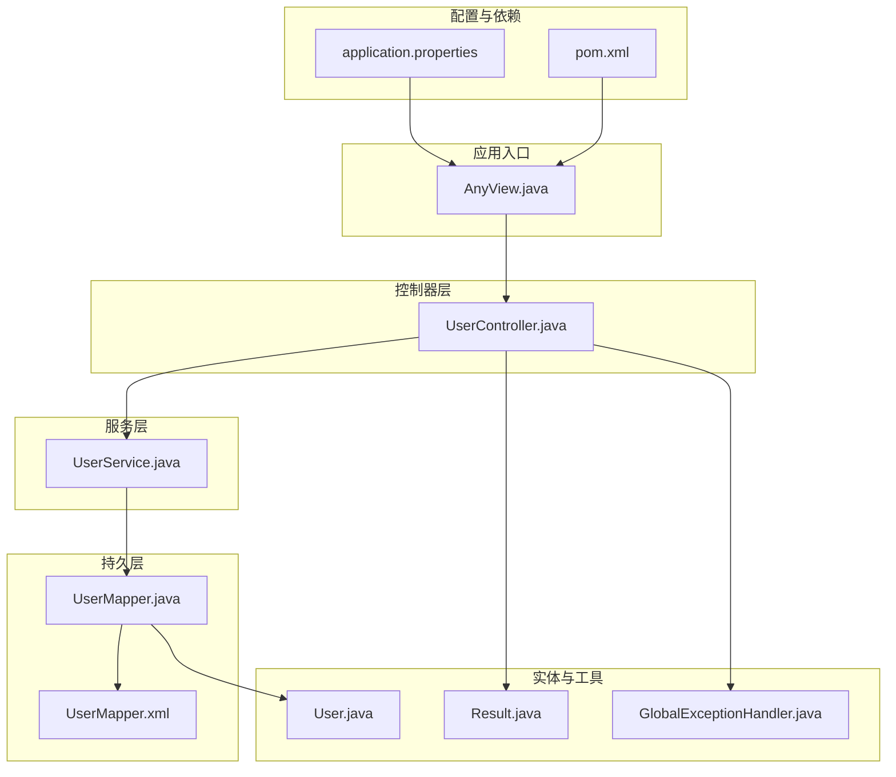
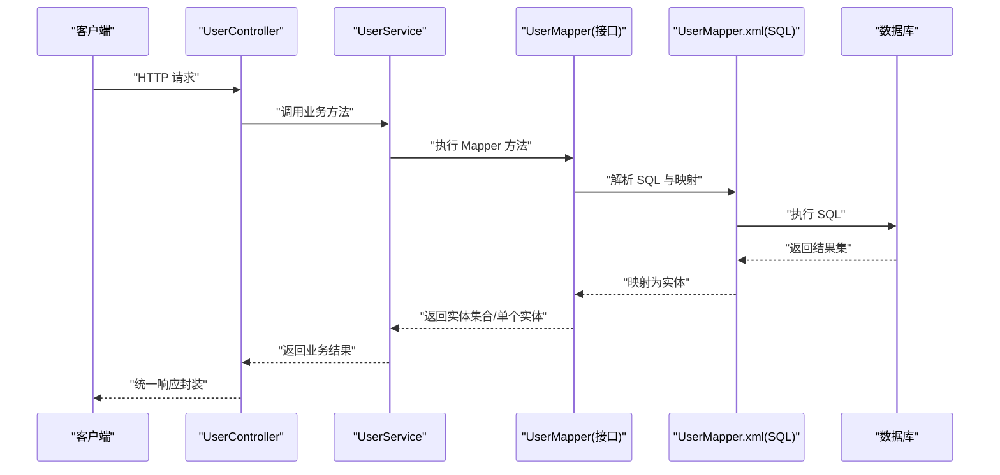
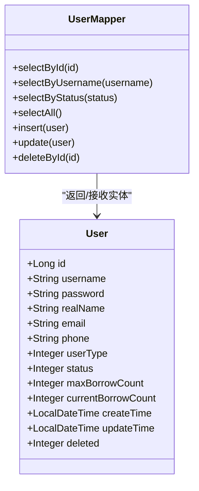
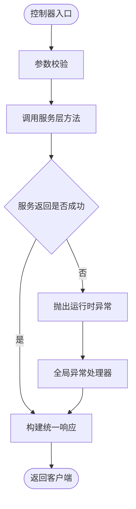
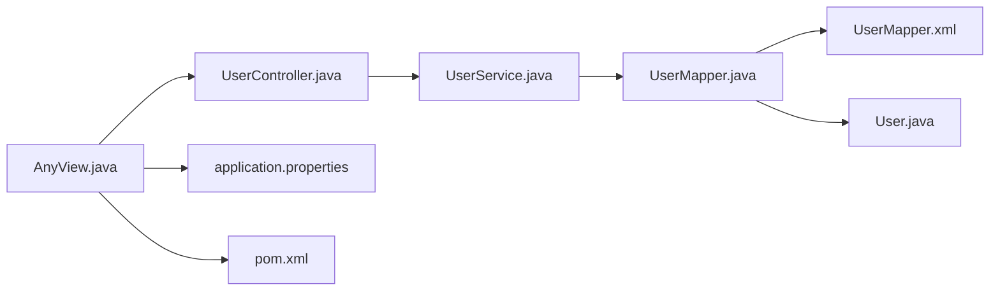

# MyBatis集成

<cite>
**本文引用的文件**
- [pom.xml](file://pom.xml)
- [application.properties](file://src/main/resources/application.properties)
- [AnyView.java](file://src/main/java/com/example/springbootmybatis/AnyView.java)
- [UserMapper.java](file://src/main/java/com/example/springbootmybatis/mapper/UserMapper.java)
- [UserMapper.xml](file://src/main/resources/mapper/UserMapper.xml)
- [UserService.java](file://src/main/java/com/example/springbootmybatis/service/UserService.java)
- [UserController.java](file://src/main/java/com/example/springbootmybatis/controller/UserController.java)
- [User.java](file://src/main/java/com/example/springbootmybatis/entity/User.java)
- [GlobalExceptionHandler.java](file://src/main/java/com/example/springbootmybatis/advice/GlobalExceptionHandler.java)
- [Result.java](file://src/main/java/com/example/springbootmybatis/common/Result.java)
- [Order.java](file://src/main/java/com/example/springbootmybatis/entity/Order.java)
- [OrderItem.java](file://src/main/java/com/example/springbootmybatis/entity/OrderItem.java)
- [Address.java](file://src/main/java/com/example/springbootmybatis/entity/Address.java)
- [PhoneNumber.java](file://src/main/java/com/example/springbootmybatis/entity/PhoneNumber.java)
</cite>

## 目录
1. [简介](#简介)
2. [项目结构](#项目结构)
3. [核心组件](#核心组件)
4. [架构总览](#架构总览)
5. [详细组件分析](#详细组件分析)
6. [依赖关系分析](#依赖关系分析)
7. [性能考虑](#性能考虑)
8. [故障排查指南](#故障排查指南)
9. [结论](#结论)
10. [附录](#附录)

## 简介
本项目是一个基于 Spring Boot 与 MyBatis 的集成示例，展示了如何在 Spring Boot 中启用 MyBatis、配置数据源、扫描 Mapper 接口与 XML 映射文件，并通过 Controller/Service/Mapper 层完成基本的增删改查（CRUD）流程。同时，项目提供了统一响应封装与全局异常处理，便于快速落地实际业务。

## 项目结构
该项目采用典型的分层架构：控制器层负责对外接口；服务层编排业务逻辑；持久层通过 MyBatis 访问数据库；实体类承载数据模型；资源目录包含 MyBatis 的 XML 映射文件与应用配置。

图表来源
- [AnyView.java](file://src/main/java/com/example/springbootmybatis/AnyView.java#L1-L13)
- [UserController.java](file://src/main/java/com/example/springbootmybatis/controller/UserController.java#L1-L68)
- [UserService.java](file://src/main/java/com/example/springbootmybatis/service/UserService.java#L1-L42)
- [UserMapper.java](file://src/main/java/com/example/springbootmybatis/mapper/UserMapper.java#L1-L23)
- [UserMapper.xml](file://src/main/resources/mapper/UserMapper.xml#L1-L57)
- [User.java](file://src/main/java/com/example/springbootmybatis/entity/User.java#L1-L21)
- [Result.java](file://src/main/java/com/example/springbootmybatis/common/Result.java#L1-L87)
- [GlobalExceptionHandler.java](file://src/main/java/com/example/springbootmybatis/advice/GlobalExceptionHandler.java#L1-L22)
- [application.properties](file://src/main/resources/application.properties#L1-L16)
- [pom.xml](file://pom.xml#L1-L88)

章节来源
- [AnyView.java](file://src/main/java/com/example/springbootmybatis/AnyView.java#L1-L13)
- [application.properties](file://src/main/resources/application.properties#L1-L16)
- [pom.xml](file://pom.xml#L1-L88)

## 核心组件
- 应用入口与启动：Spring Boot 启动类负责加载自动配置与组件扫描。
- 数据源与 MyBatis 配置：通过 application.properties 指定 JDBC URL、用户名、密码、驱动以及 MyBatis 的映射文件位置、类型别名包、驼峰映射等。
- Mapper 接口与 XML：Mapper 接口声明 CRUD 方法，XML 文件提供 SQL 实现与结果映射。
- 服务层：封装业务逻辑，调用 Mapper 完成数据访问。
- 控制器层：暴露 REST 接口，接收请求参数，返回统一响应体。
- 统一响应与异常处理：提供 Result 封装与全局异常处理器，保证接口输出一致性与错误兜底。

章节来源
- [application.properties](file://src/main/resources/application.properties#L1-L16)
- [UserMapper.java](file://src/main/java/com/example/springbootmybatis/mapper/UserMapper.java#L1-L23)
- [UserMapper.xml](file://src/main/resources/mapper/UserMapper.xml#L1-L57)
- [UserService.java](file://src/main/java/com/example/springbootmybatis/service/UserService.java#L1-L42)
- [UserController.java](file://src/main/java/com/example/springbootmybatis/controller/UserController.java#L1-L68)
- [Result.java](file://src/main/java/com/example/springbootmybatis/common/Result.java#L1-L87)
- [GlobalExceptionHandler.java](file://src/main/java/com/example/springbootmybatis/advice/GlobalExceptionHandler.java#L1-L22)

## 架构总览
下图展示从 HTTP 请求到数据库访问的整体流程，以及各层之间的依赖关系。

图表来源
- [UserController.java](file://src/main/java/com/example/springbootmybatis/controller/UserController.java#L1-L68)
- [UserService.java](file://src/main/java/com/example/springbootmybatis/service/UserService.java#L1-L42)
- [UserMapper.java](file://src/main/java/com/example/springbootmybatis/mapper/UserMapper.java#L1-L23)
- [UserMapper.xml](file://src/main/resources/mapper/UserMapper.xml#L1-L57)

## 详细组件分析

### 数据源与 MyBatis 配置
- 数据源：通过 application.properties 指定 MySQL 连接信息与驱动类名。
- MyBatis：设置映射文件位置、类型别名包、开启下划线到驼峰映射，以及 Mapper 扫描包路径。
- 依赖：pom.xml 引入 mybatis-spring-boot-starter、MySQL 驱动与 H2（用于测试或本地）。

章节来源
- [application.properties](file://src/main/resources/application.properties#L1-L16)
- [pom.xml](file://pom.xml#L32-L67)

### Mapper 接口与 XML 映射
- 接口定义：在接口上使用注解标识为 Mapper，并声明常用 CRUD 方法。
- XML 映射：命名空间对应接口全限定名；通过 resultMap 将列名映射到实体属性；提供 select、insert、update、delete 等语句。
- 结果映射：resultMap 中包含 id 与 result 节点，覆盖所有字段，确保下划线字段与驼峰命名一致。

图表来源
- [UserMapper.java](file://src/main/java/com/example/springbootmybatis/mapper/UserMapper.java#L1-L23)
- [User.java](file://src/main/java/com/example/springbootmybatis/entity/User.java#L1-L21)

章节来源
- [UserMapper.java](file://src/main/java/com/example/springbootmybatis/mapper/UserMapper.java#L1-L23)
- [UserMapper.xml](file://src/main/resources/mapper/UserMapper.xml#L1-L57)
- [User.java](file://src/main/java/com/example/springbootmybatis/entity/User.java#L1-L21)

### 服务层与控制器层
- 服务层：注入 UserMapper，封装业务方法，如按 ID/用户名/状态查询、分页/批量等可在此扩展。
- 控制器层：提供 REST 接口，调用服务层，进行参数校验与异常处理，返回统一响应体。

图表来源
- [UserController.java](file://src/main/java/com/example/springbootmybatis/controller/UserController.java#L1-L68)
- [UserService.java](file://src/main/java/com/example/springbootmybatis/service/UserService.java#L1-L42)
- [GlobalExceptionHandler.java](file://src/main/java/com/example/springbootmybatis/advice/GlobalExceptionHandler.java#L1-L22)
- [Result.java](file://src/main/java/com/example/springbootmybatis/common/Result.java#L1-L87)

章节来源
- [UserService.java](file://src/main/java/com/example/springbootmybatis/service/UserService.java#L1-L42)
- [UserController.java](file://src/main/java/com/example/springbootmybatis/controller/UserController.java#L1-L68)
- [GlobalExceptionHandler.java](file://src/main/java/com/example/springbootmybatis/advice/GlobalExceptionHandler.java#L1-L22)
- [Result.java](file://src/main/java/com/example/springbootmybatis/common/Result.java#L1-L87)

### 实体模型与扩展
- 用户实体：包含基础字段与时间戳字段，支持 Lombok 注解简化代码。
- 订单与地址：提供订单、订单项、地址、电话号码等实体，便于演示关联查询与复杂映射场景。

章节来源
- [User.java](file://src/main/java/com/example/springbootmybatis/entity/User.java#L1-L21)
- [Order.java](file://src/main/java/com/example/springbootmybatis/entity/Order.java#L1-L18)
- [OrderItem.java](file://src/main/java/com/example/springbootmybatis/entity/OrderItem.java#L1-L16)
- [Address.java](file://src/main/java/com/example/springbootmybatis/entity/Address.java#L1-L17)
- [PhoneNumber.java](file://src/main/java/com/example/springbootmybatis/entity/PhoneNumber.java#L1-L11)

## 依赖关系分析
- 启动类 AnyView 负责引导 Spring Boot 应用。
- 控制器依赖服务层；服务层依赖 Mapper 接口；Mapper 接口由 MyBatis 动态代理实现，实际执行 XML 中的 SQL。
- application.properties 提供数据源与 MyBatis 配置；pom.xml 提供运行时依赖。

图表来源
- [AnyView.java](file://src/main/java/com/example/springbootmybatis/AnyView.java#L1-L13)
- [UserController.java](file://src/main/java/com/example/springbootmybatis/controller/UserController.java#L1-L68)
- [UserService.java](file://src/main/java/com/example/springbootmybatis/service/UserService.java#L1-L42)
- [UserMapper.java](file://src/main/java/com/example/springbootmybatis/mapper/UserMapper.java#L1-L23)
- [UserMapper.xml](file://src/main/resources/mapper/UserMapper.xml#L1-L57)
- [User.java](file://src/main/java/com/example/springbootmybatis/entity/User.java#L1-L21)
- [application.properties](file://src/main/resources/application.properties#L1-L16)
- [pom.xml](file://pom.xml#L1-L88)

章节来源
- [AnyView.java](file://src/main/java/com/example/springbootmybatis/AnyView.java#L1-L13)
- [application.properties](file://src/main/resources/application.properties#L1-L16)
- [pom.xml](file://pom.xml#L1-L88)

## 性能考虑
- 开启驼峰映射：避免手动处理列名与属性名不一致带来的映射成本。
- 使用 resultMap：明确字段映射，减少不必要的反射开销。
- 合理分页：在 SQL 层面使用分页（LIMIT/OFFSET 或方言），避免一次性加载大量数据。
- 批量操作：MyBatis 支持批量插入/更新，可在 XML 中使用 foreach 循环批量提交，降低网络往返次数。
- 缓存策略：MyBatis 提供一级缓存（会话级别）与二级缓存（全局），结合合适的缓存策略与失效策略提升读性能。
- SQL 优化：避免 N+1 查询，优先使用联表查询或批量查询；合理建立索引。
- 连接池：建议使用 HikariCP 等高性能连接池，配合 Spring Boot 默认配置即可。

## 故障排查指南
- 启动报错找不到 Mapper 接口或 XML：
  - 检查 application.properties 中的映射文件路径与 Mapper 扫描包是否正确。
  - 确认 Mapper 接口上存在注解且命名空间与接口全限定名一致。
- 数据库连接失败：
  - 核对 JDBC URL、用户名、密码与驱动类名是否匹配目标数据库。
- 字段映射异常：
  - 检查 XML 中的 resultMap 是否覆盖所有字段，尤其是下划线命名与驼峰命名的对应关系。
- 统一响应未生效：
  - 确认控制器返回值是否被全局异常处理器拦截，必要时在控制器中抛出运行时异常以触发错误响应。
- 全局异常处理：
  - 全局异常处理器已捕获 Exception 与 RuntimeException 并返回统一错误格式，便于前端统一处理。

章节来源
- [application.properties](file://src/main/resources/application.properties#L1-L16)
- [UserMapper.xml](file://src/main/resources/mapper/UserMapper.xml#L1-L57)
- [GlobalExceptionHandler.java](file://src/main/java/com/example/springbootmybatis/advice/GlobalExceptionHandler.java#L1-L22)
- [Result.java](file://src/main/java/com/example/springbootmybatis/common/Result.java#L1-L87)

## 结论
本项目完整演示了 Spring Boot 与 MyBatis 的集成方式：通过 Starter 自动装配、配置文件指定数据源与 MyBatis 参数、使用注解与 XML 定义 Mapper、在服务层与控制器层组织业务流程，并通过统一响应与全局异常处理提升接口稳定性与可维护性。在此基础上，可进一步引入分页、批量操作、缓存与插件机制，以满足更复杂的业务需求。

## 附录

### 常见问题与最佳实践清单
- 配置项核对：确保映射文件路径、类型别名包、驼峰映射、Mapper 扫描包均正确。
- SQL 与映射：保持 XML 中的命名空间、SQL 语句与实体字段一致，避免遗漏字段导致的空值或异常。
- 错误处理：统一使用全局异常处理器，保证错误信息的一致性与可读性。
- 性能优化：优先使用分页与批量操作，合理利用缓存，避免 N+1 查询。
- 插件与扩展：可通过 MyBatis 插件机制扩展日志、分页、审计等功能，但需谨慎评估对性能的影响。