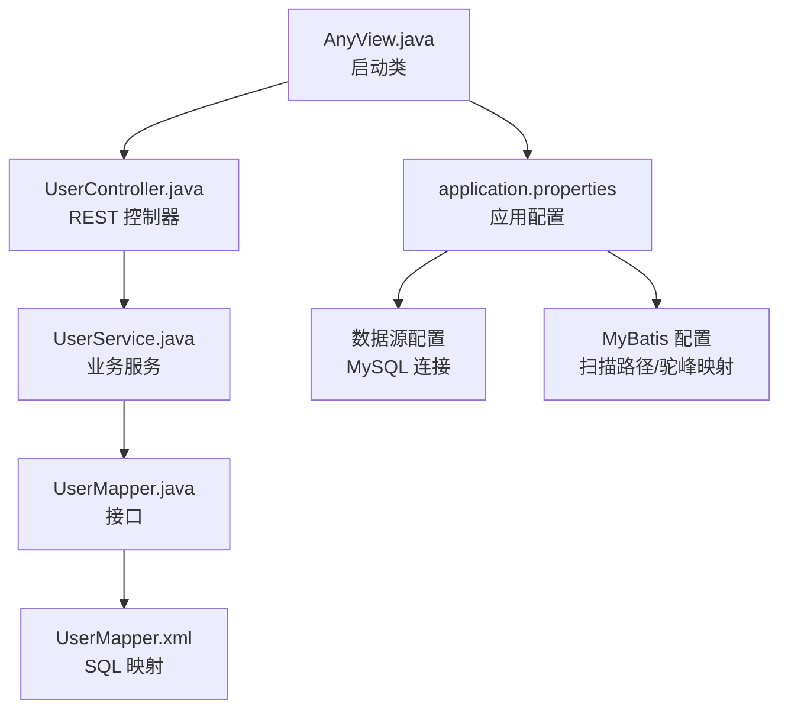
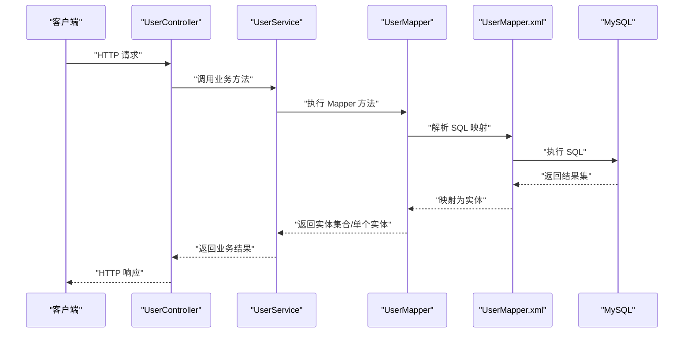
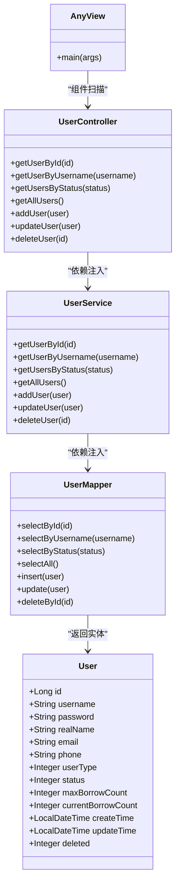
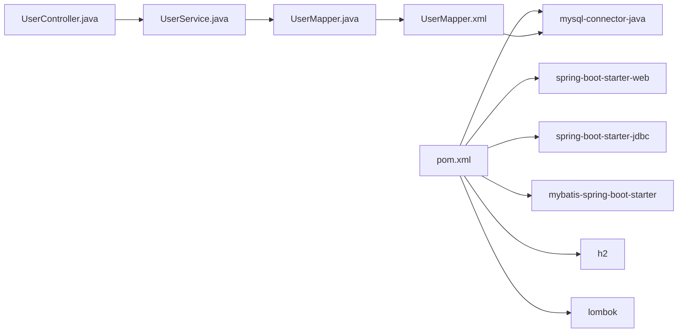

# Spring Boot配置

<cite>
**本文引用的文件**
- [AnyView.java](file://src/main/java/com/example/springbootmybatis/AnyView.java)
- [pom.xml](file://pom.xml)
- [application.properties](file://src/main/resources/application.properties)
- [UserMapper.java](file://src/main/java/com/example/springbootmybatis/mapper/UserMapper.java)
- [UserMapper.xml](file://src/main/resources/mapper/UserMapper.xml)
- [UserController.java](file://src/main/java/com/example/springbootmybatis/controller/UserController.java)
- [UserService.java](file://src/main/java/com/example/springbootmybatis/service/UserService.java)
- [User.java](file://src/main/java/com/example/springbootmybatis/entity/User.java)
- [GlobalExceptionHandler.java](file://src/main/java/com/example/springbootmybatis/advice/GlobalExceptionHandler.java)
- [HELP.md](file://HELP.md)
- [.mvn/wrapper/maven-wrapper.properties](file://.mvn/wrapper/maven-wrapper.properties)
</cite>

## 目录
1. [简介](#简介)
2. [项目结构](#项目结构)
3. [核心组件](#核心组件)
4. [架构总览](#架构总览)
5. [详细组件分析](#详细组件分析)
6. [依赖关系分析](#依赖关系分析)
7. [性能与可维护性建议](#性能与可维护性建议)
8. [故障排查指南](#故障排查指南)
9. [结论](#结论)
10. [附录：配置清单与最佳实践](#附录配置清单与最佳实践)

## 简介
本文件面向使用 Spring Boot + MyBatis 的开发者，系统化梳理项目中的 Spring Boot 配置要点，包括：
- @SpringBootApplication 注解的作用与自动配置机制
- application.properties 中数据库、MyBatis、服务器端口等关键配置项
- Maven 依赖管理与构建插件（pom.xml）
- 启动流程与组件扫描机制
- 配置文件优先级与覆盖规则
- 常见配置场景与最佳实践
- 环境配置与生产部署建议

## 项目结构
该项目采用标准的 Spring Boot 多模块/单模块布局，核心目录与文件如下：
- 启动类位于主包下，负责应用入口与组件扫描
- 资源文件夹包含配置与 MyBatis XML 映射
- 控制器、服务、Mapper、实体分层清晰，便于维护

图表来源
- [AnyView.java](file://src/main/java/com/example/springbootmybatis/AnyView.java#L1-L13)
- [application.properties](file://src/main/resources/application.properties#L1-L16)
- [UserController.java](file://src/main/java/com/example/springbootmybatis/controller/UserController.java#L1-L68)
- [UserService.java](file://src/main/java/com/example/springbootmybatis/service/UserService.java#L1-L42)
- [UserMapper.java](file://src/main/java/com/example/springbootmybatis/mapper/UserMapper.java#L1-L23)
- [UserMapper.xml](file://src/main/resources/mapper/UserMapper.xml#L1-L57)

章节来源
- [AnyView.java](file://src/main/java/com/example/springbootmybatis/AnyView.java#L1-L13)
- [application.properties](file://src/main/resources/application.properties#L1-L16)

## 核心组件
- 启动类与自动配置
  - 启动类通过注解启用 Spring Boot 自动装配与组件扫描，简化配置并快速启动应用。
  - 参考路径：[AnyView.java](file://src/main/java/com/example/springbootmybatis/AnyView.java#L6-L11)
- 数据访问层
  - 使用 MyBatis 接口 + XML 映射实现 CRUD 操作，实体类与数据库字段通过驼峰映射自动对应。
  - 参考路径：
    - [UserMapper.java](file://src/main/java/com/example/springbootmybatis/mapper/UserMapper.java#L7-L22)
    - [UserMapper.xml](file://src/main/resources/mapper/UserMapper.xml#L1-L57)
    - [User.java](file://src/main/java/com/example/springbootmybatis/entity/User.java#L1-L21)
- 控制层与服务层
  - 控制器暴露 REST 接口；服务层编排业务逻辑并调用 Mapper。
  - 参考路径：
    - [UserController.java](file://src/main/java/com/example/springbootmybatis/controller/UserController.java#L10-L67)
    - [UserService.java](file://src/main/java/com/example/springbootmybatis/service/UserService.java#L9-L41)

章节来源
- [AnyView.java](file://src/main/java/com/example/springbootmybatis/AnyView.java#L6-L11)
- [UserMapper.java](file://src/main/java/com/example/springbootmybatis/mapper/UserMapper.java#L1-L23)
- [UserMapper.xml](file://src/main/resources/mapper/UserMapper.xml#L1-L57)
- [User.java](file://src/main/java/com/example/springbootmybatis/entity/User.java#L1-L21)
- [UserController.java](file://src/main/java/com/example/springbootmybatis/controller/UserController.java#L1-L68)
- [UserService.java](file://src/main/java/com/example/springbootmybatis/service/UserService.java#L1-L42)

## 架构总览
下图展示从请求到数据库的典型调用链路，体现 Spring MVC、服务层与 MyBatis 的协作关系。

图表来源
- [UserController.java](file://src/main/java/com/example/springbootmybatis/controller/UserController.java#L17-L35)
- [UserService.java](file://src/main/java/com/example/springbootmybatis/service/UserService.java#L15-L29)
- [UserMapper.java](file://src/main/java/com/example/springbootmybatis/mapper/UserMapper.java#L10-L22)
- [UserMapper.xml](file://src/main/resources/mapper/UserMapper.xml#L21-L35)

## 详细组件分析

### 启动类与自动配置（@SpringBootApplication）
- 作用
  - 组合注解，开启组件扫描、自动配置与 Spring MVC 支持，使应用在无额外配置的情况下即可运行。
  - 参考路径：[AnyView.java](file://src/main/java/com/example/springbootmybatis/AnyView.java#L6-L11)
- 自动配置机制
  - Spring Boot 根据类路径与配置推断并注册合适的 Bean（如数据源、事务、Web 容器、MyBatis 组件等）。
  - 本项目通过 MyBatis Starter 与 JDBC Starter 实现数据访问自动装配。
  - 参考路径：[pom.xml](file://pom.xml#L33-L45)

章节来源
- [AnyView.java](file://src/main/java/com/example/springbootmybatis/AnyView.java#L6-L11)
- [pom.xml](file://pom.xml#L33-L45)

### 数据库与数据源配置（application.properties）
- 关键点
  - 应用名称：用于日志与监控标识
  - 数据源 URL、用户名、密码、驱动类名：指向本地 MySQL 实例
  - MyBatis 配置：XML 映射文件位置、类型别名包、下划线到驼峰映射
  - Mapper 扫描路径：指定接口所在包以启用注解式 Mapper
- 参考路径
  - [application.properties](file://src/main/resources/application.properties#L1-L16)

章节来源
- [application.properties](file://src/main/resources/application.properties#L1-L16)

### MyBatis 配置与实体映射
- Mapper 接口与 XML
  - 接口定义方法，XML 提供 SQL 与结果映射；命名空间与接口全限定名一致
  - 结果映射中将数据库列与实体属性一一对应，支持驼峰转换
- 实体类
  - 使用 Lombok 简化 getter/setter/toString 等；字段与数据库列保持一致或通过映射转换
- 参考路径
  - [UserMapper.java](file://src/main/java/com/example/springbootmybatis/mapper/UserMapper.java#L7-L22)
  - [UserMapper.xml](file://src/main/resources/mapper/UserMapper.xml#L3-L19)
  - [User.java](file://src/main/java/com/example/springbootmybatis/entity/User.java#L7-L21)

章节来源
- [UserMapper.java](file://src/main/java/com/example/springbootmybatis/mapper/UserMapper.java#L1-L23)
- [UserMapper.xml](file://src/main/resources/mapper/UserMapper.xml#L1-L57)
- [User.java](file://src/main/java/com/example/springbootmybatis/entity/User.java#L1-L21)

### 控制器与全局异常处理
- 控制器
  - 提供用户查询、新增、更新、删除等 REST 接口；内部调用服务层完成业务处理
  - 参考路径：[UserController.java](file://src/main/java/com/example/springbootmybatis/controller/UserController.java#L10-L67)
- 全局异常处理
  - 统一捕获异常并返回标准化响应结构，提升接口健壮性
  - 参考路径：[GlobalExceptionHandler.java](file://src/main/java/com/example/springbootmybatis/advice/GlobalExceptionHandler.java#L10-L21)

章节来源
- [UserController.java](file://src/main/java/com/example/springbootmybatis/controller/UserController.java#L1-L68)
- [GlobalExceptionHandler.java](file://src/main/java/com/example/springbootmybatis/advice/GlobalExceptionHandler.java#L1-L22)

### Maven 依赖与构建（pom.xml）
- 依赖说明
  - Spring Boot Starter（Web、JDBC、Test）
  - MyBatis Spring Boot Starter
  - MySQL Connector（运行时）
  - H2 Database（运行时，便于本地测试）
  - Lombok（开发期）
- 构建插件
  - spring-boot-maven-plugin：打包可执行 JAR，并排除 Lombok
- 参考路径
  - [pom.xml](file://pom.xml#L32-L87)

章节来源
- [pom.xml](file://pom.xml#L1-L88)

### 启动流程与组件扫描机制
- 启动流程
  - 启动类加载自动配置，初始化数据源与 MyBatis 组件，扫描控制器并启动 Web 服务器
- 组件扫描
  - 默认扫描启动类同级及子级包下的组件（控制器、服务、Mapper 等）
- 参考路径
  - [AnyView.java](file://src/main/java/com/example/springbootmybatis/AnyView.java#L6-L11)
  - [application.properties](file://src/main/resources/application.properties#L14-L15)

章节来源
- [AnyView.java](file://src/main/java/com/example/springbootmybatis/AnyView.java#L6-L11)
- [application.properties](file://src/main/resources/application.properties#L14-L15)

### 配置文件优先级与覆盖规则（概览）
- Spring Boot 配置优先级（从高到低，后加载的覆盖先前加载的）：
  - 命令行参数
  - SPRING_APPLICATION_JSON 中的属性
  - 系统环境变量
  - 操作系统用户配置目录下的开发工具配置
  - 文件 application-{profile}.properties/yml
  - 文件 application.properties/yml
  - @PropertySource 注解
  - 默认属性
- 在本项目中，可通过不同 profile 文件（如 application-dev.properties、application-prod.properties）按环境切换配置，最终由运行时参数或环境变量微调。

[本节为通用规则概述，不直接分析具体文件，故无“章节来源”]

### 类关系图（代码级）

图表来源
- [AnyView.java](file://src/main/java/com/example/springbootmybatis/AnyView.java#L6-L11)
- [UserController.java](file://src/main/java/com/example/springbootmybatis/controller/UserController.java#L10-L67)
- [UserService.java](file://src/main/java/com/example/springbootmybatis/service/UserService.java#L9-L41)
- [UserMapper.java](file://src/main/java/com/example/springbootmybatis/mapper/UserMapper.java#L7-L22)
- [User.java](file://src/main/java/com/example/springbootmybatis/entity/User.java#L7-L21)

## 依赖关系分析
- 依赖耦合
  - 控制器依赖服务层；服务层依赖 Mapper；Mapper 依赖 XML 映射与数据源
- 外部依赖
  - MySQL Connector 与 H2 作为运行时依赖；MyBatis Starter 与 JDBC Starter 提供自动装配能力
- 插件
  - spring-boot-maven-plugin 用于打包与可执行 JAR 生成

图表来源
- [pom.xml](file://pom.xml#L32-L87)
- [UserController.java](file://src/main/java/com/example/springbootmybatis/controller/UserController.java#L10-L67)
- [UserService.java](file://src/main/java/com/example/springbootmybatis/service/UserService.java#L9-L41)
- [UserMapper.java](file://src/main/java/com/example/springbootmybatis/mapper/UserMapper.java#L7-L22)
- [UserMapper.xml](file://src/main/resources/mapper/UserMapper.xml#L21-L35)

章节来源
- [pom.xml](file://pom.xml#L32-L87)

## 性能与可维护性建议
- 连接池与超时
  - 建议在生产环境配置连接池大小、连接超时与空闲回收策略，避免资源泄漏
- SQL 优化
  - 对高频查询建立必要索引；避免 N+1 查询；合理分页
- 日志与监控
  - 开启慢查询日志与 SQL 执行时间统计；结合 APM 工具定位瓶颈
- 驼峰映射与字段一致性
  - 保持数据库命名与实体命名一致，减少映射配置复杂度
- 测试与覆盖率
  - 补充单元测试与集成测试，确保异常分支与边界条件正确处理

[本节为通用建议，不直接分析具体文件，故无“章节来源”]

## 故障排查指南
- 启动失败
  - 检查数据库连通性与凭据；确认驱动类名与 JDBC URL 正确
  - 参考路径：[application.properties](file://src/main/resources/application.properties#L4-L7)
- MyBatis 映射问题
  - 确认命名空间与接口全限定名一致；检查结果映射列名与实体属性是否匹配
  - 参考路径：
    - [UserMapper.java](file://src/main/java/com/example/springbootmybatis/mapper/UserMapper.java#L3-L3)
    - [UserMapper.xml](file://src/main/resources/mapper/UserMapper.xml#L3-L19)
- 异常统一处理
  - 使用全局异常处理器返回标准化错误信息，便于前端与运维定位
  - 参考路径：[GlobalExceptionHandler.java](file://src/main/java/com/example/springbootmybatis/advice/GlobalExceptionHandler.java#L10-L21)

章节来源
- [application.properties](file://src/main/resources/application.properties#L4-L7)
- [UserMapper.java](file://src/main/java/com/example/springbootmybatis/mapper/UserMapper.java#L3-L3)
- [UserMapper.xml](file://src/main/resources/mapper/UserMapper.xml#L3-L19)
- [GlobalExceptionHandler.java](file://src/main/java/com/example/springbootmybatis/advice/GlobalExceptionHandler.java#L10-L21)

## 结论
本项目通过 Spring Boot 的自动配置与 MyBatis 的简洁映射，实现了开箱即用的数据访问层。配合合理的依赖管理与异常处理机制，能够在开发与生产环境中快速迭代与稳定运行。建议在生产部署前完善连接池、监控与测试体系，确保系统性能与可靠性。

[本节为总结，不直接分析具体文件，故无“章节来源”]

## 附录：配置清单与最佳实践

### 配置清单（摘自 application.properties）
- 应用基础
  - 应用名称：用于日志与监控标识
  - 参考路径：[application.properties](file://src/main/resources/application.properties#L1-L1)
- 数据库连接
  - JDBC URL、用户名、密码、驱动类名
  - 参考路径：[application.properties](file://src/main/resources/application.properties#L4-L7)
- MyBatis 配置
  - XML 映射文件位置、类型别名包、驼峰映射开关
  - Mapper 接口扫描包
  - 参考路径：[application.properties](file://src/main/resources/application.properties#L10-L15)

章节来源
- [application.properties](file://src/main/resources/application.properties#L1-L16)

### 最佳实践
- 环境隔离
  - 使用 profile 切换开发/测试/生产配置，敏感信息放入环境变量或密钥管理
- 依赖版本
  - 使用 Spring Boot Parent 固定兼容版本，避免第三方版本冲突
  - 参考路径：[pom.xml](file://pom.xml#L5-L10)
- 构建与打包
  - 使用 spring-boot-maven-plugin 生成可执行 JAR；排除 Lombok 以减小体积
  - 参考路径：[pom.xml](file://pom.xml#L70-L85)
- 开发工具
  - Maven Wrapper 便于团队统一构建工具版本
  - 参考路径：[HELP.md](file://HELP.md#L8-L9)
  - [.mvn/wrapper/maven-wrapper.properties](file://.mvn/wrapper/maven-wrapper.properties#L17-L20)

章节来源
- [pom.xml](file://pom.xml#L5-L10)
- [pom.xml](file://pom.xml#L70-L85)
- [HELP.md](file://HELP.md#L8-L9)
- [.mvn/wrapper/maven-wrapper.properties](file://.mvn/wrapper/maven-wrapper.properties#L17-L20)