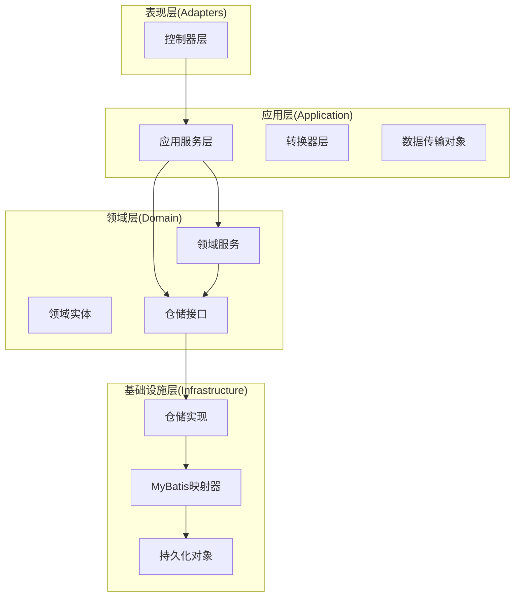
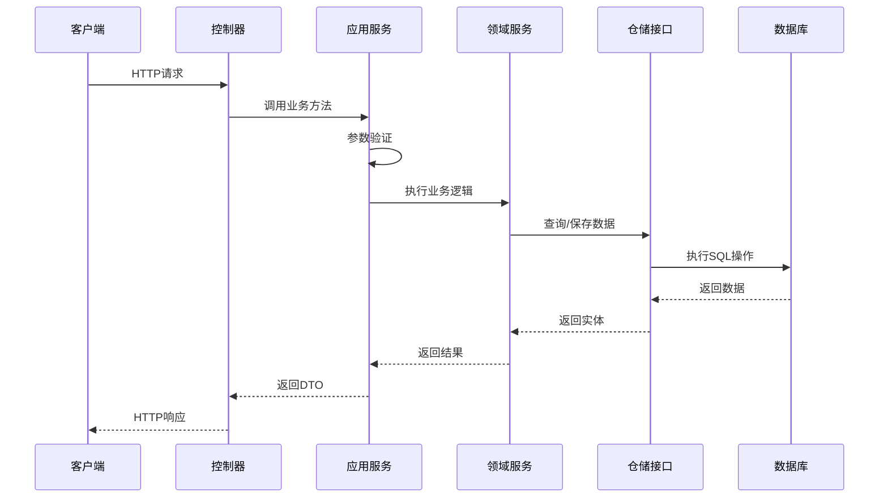
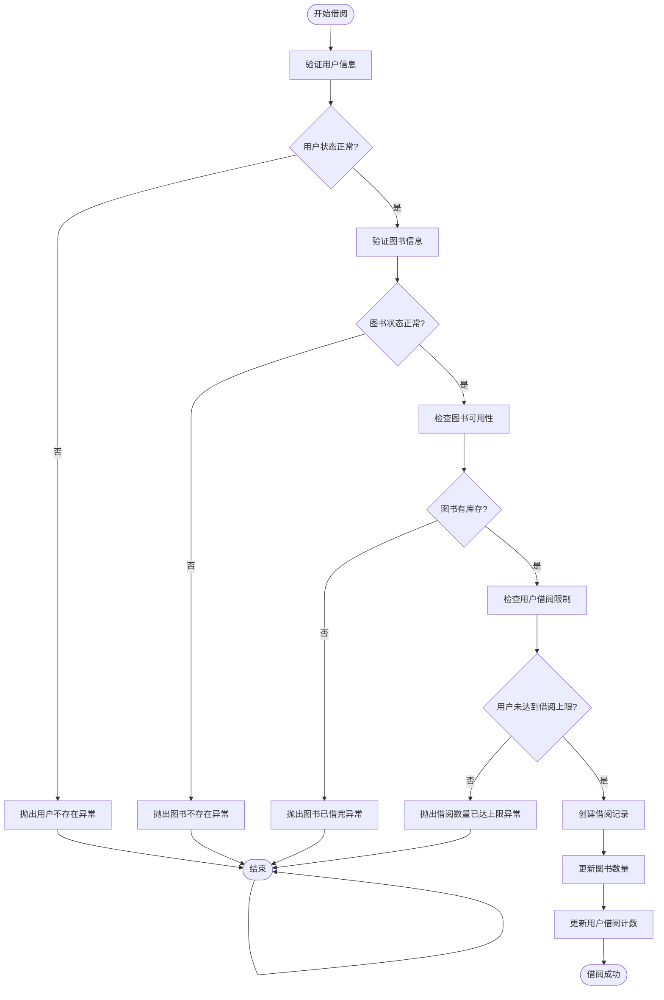
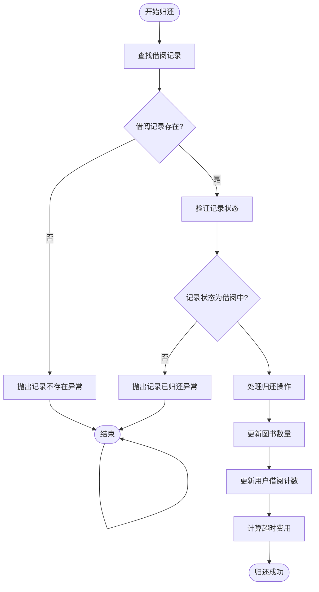
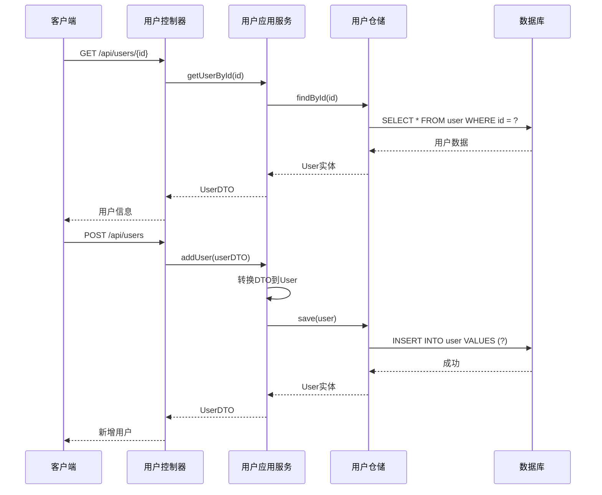
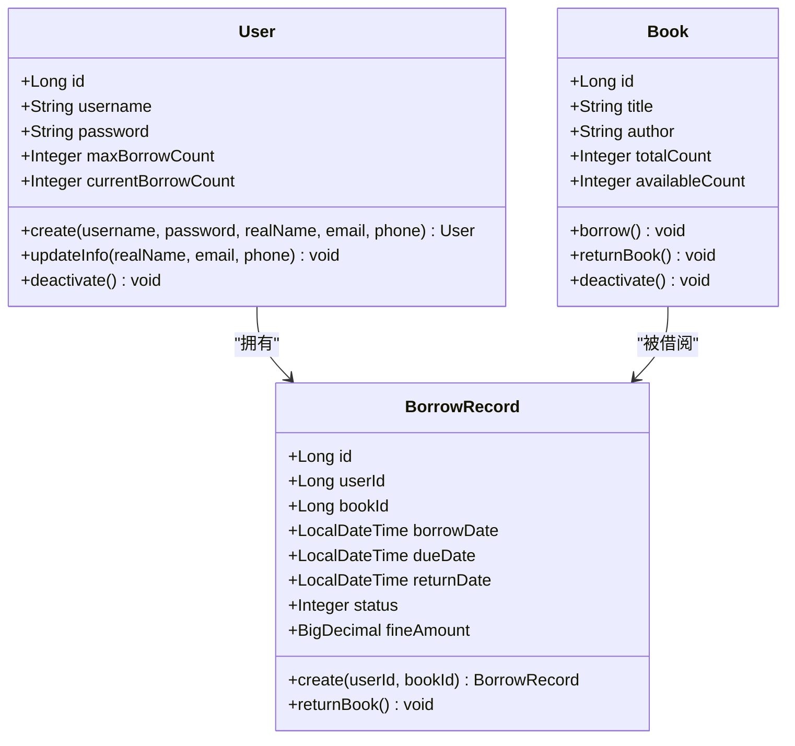
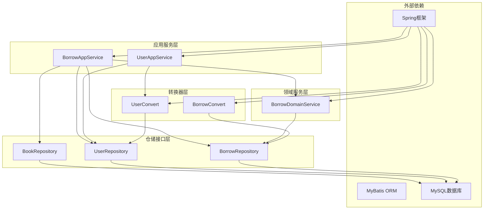

# 业务逻辑层设计

<cite>
**本文档引用的文件**
- [BorrowAppService.java](file://src/main/java/com/example/springbootmybatis/application/service/BorrowAppService.java)
- [UserAppService.java](file://src/main/java/com/example/springbootmybatis/application/service/UserAppService.java)
- [BorrowDomainService.java](file://src/main/java/com/example/springbootmybatis/domain/service/BorrowDomainService.java)
- [BorrowController.java](file://src/main/java/com/example/springbootmybatis/adapter/controller/BorrowController.java)
- [UserController.java](file://src/main/java/com/example/springbootmybatis/adapter/controller/UserController.java)
- [User.java](file://src/main/java/com/example/springbootmybatis/domain/model/entity/User.java)
- [Book.java](file://src/main/java/com/example/springbootmybatis/domain/model/entity/Book.java)
- [BorrowRecord.java](file://src/main/java/com/example/springbootmybatis/domain/model/entity/BorrowRecord.java)
- [BorrowDTO.java](file://src/main/java/com/example/springbootmybatis/application/dto/BorrowDTO.java)
- [UserDTO.java](file://src/main/java/com/example/springbootmybatis/application/dto/UserDTO.java)
- [BorrowConvert.java](file://src/main/java/com/example/springbootmybatis/application/convert/BorrowConvert.java)
- [UserConvert.java](file://src/main/java/com/example/springbootmybatis/application/convert/UserConvert.java)
- [BookRepository.java](file://src/main/java/com/example/springbootmybatis/domain/support/BookRepository.java)
- [UserRepository.java](file://src/main/java/com/example/springbootmybatis/domain/support/UserRepository.java)
- [BorrowRepository.java](file://src/main/java/com/example/springbootmybatis/domain/support/BorrowRepository.java)
</cite>

## 目录
1. [引言](#引言)
2. [项目结构](#项目结构)
3. [核心组件](#核心组件)
4. [架构概览](#架构概览)
5. [详细组件分析](#详细组件分析)
6. [依赖关系分析](#依赖关系分析)
7. [性能考虑](#性能考虑)
8. [故障排除指南](#故障排除指南)
9. [结论](#结论)

## 引言

本项目是一个基于Spring Boot和MyBatis的领域驱动设计(DDD)示例项目，专注于图书馆借阅管理系统的业务逻辑层设计。项目采用分层架构模式，将业务逻辑清晰地分离到不同的层次中，实现了良好的关注点分离和可维护性。

系统主要包含两个核心业务功能：用户管理和图书借阅管理。通过DDD的设计理念，我们将业务规则、领域模型和应用服务有机结合，形成了完整的业务逻辑处理流程。

## 项目结构

该项目遵循DDD分层架构设计，主要分为四个层次：

**图表来源**
- [BorrowController.java:1-70](file://src/main/java/com/example/springbootmybatis/adapter/controller/BorrowController.java#L1-L70)
- [UserController.java:1-69](file://src/main/java/com/example/springbootmybatis/adapter/controller/UserController.java#L1-L69)
- [BorrowAppService.java:1-125](file://src/main/java/com/example/springbootmybatis/application/service/BorrowAppService.java#L1-L125)
- [UserAppService.java:1-83](file://src/main/java/com/example/springbootmybatis/application/service/UserAppService.java#L1-L83)

**章节来源**
- [BorrowController.java:1-70](file://src/main/java/com/example/springbootmybatis/adapter/controller/BorrowController.java#L1-L70)
- [UserController.java:1-69](file://src/main/java/com/example/springbootmybatis/adapter/controller/UserController.java#L1-L69)
- [BorrowAppService.java:1-125](file://src/main/java/com/example/springbootmybatis/application/service/BorrowAppService.java#L1-L125)
- [UserAppService.java:1-83](file://src/main/java/com/example/springbootmybatis/application/service/UserAppService.java#L1-L83)

## 核心组件

### 应用服务层

应用服务层是业务逻辑的核心执行者，负责协调领域模型和仓储接口来完成具体的业务操作。

**借阅应用服务**：处理图书借阅和归还的完整业务流程，包括用户和图书的状态验证、借阅条件检查、事务管理等。

**用户应用服务**：提供用户的基本CRUD操作，包括查询、新增、更新和删除功能。

### 领域服务层

领域服务层封装了复杂的业务规则和算法，确保业务逻辑的正确性和一致性。

**借阅领域服务**：专门处理借阅相关的复杂业务逻辑，如借阅记录的创建、归还操作的验证等。

### 控制器层

控制器层作为系统的入口点，负责接收HTTP请求、参数验证和响应结果的格式化。

**章节来源**
- [BorrowAppService.java:1-125](file://src/main/java/com/example/springbootmybatis/application/service/BorrowAppService.java#L1-L125)
- [UserAppService.java:1-83](file://src/main/java/com/example/springbootmybatis/application/service/UserAppService.java#L1-L83)
- [BorrowDomainService.java:1-50](file://src/main/java/com/example/springbootmybatis/domain/service/BorrowDomainService.java#L1-L50)

## 架构概览

系统采用经典的四层架构模式，每层都有明确的职责分工：

**图表来源**
- [BorrowController.java:29-44](file://src/main/java/com/example/springbootmybatis/adapter/controller/BorrowController.java#L29-L44)
- [BorrowAppService.java:42-82](file://src/main/java/com/example/springbootmybatis/application/service/BorrowAppService.java#L42-L82)
- [BorrowDomainService.java:24-30](file://src/main/java/com/example/springbootmybatis/domain/service/BorrowDomainService.java#L24-L30)

**章节来源**
- [BorrowController.java:1-70](file://src/main/java/com/example/springbootmybatis/adapter/controller/BorrowController.java#L1-L70)
- [BorrowAppService.java:1-125](file://src/main/java/com/example/springbootmybatis/application/service/BorrowAppService.java#L1-L125)
- [BorrowDomainService.java:1-50](file://src/main/java/com/example/springbootmybatis/domain/service/BorrowDomainService.java#L1-L50)

## 详细组件分析

### 借阅业务流程

借阅业务是最复杂的业务场景，涉及多个实体的协作和严格的业务规则验证。

#### 借阅流程图

**图表来源**
- [BorrowAppService.java:42-82](file://src/main/java/com/example/springbootmybatis/application/service/BorrowAppService.java#L42-L82)

#### 归还流程图

**图表来源**
- [BorrowAppService.java:87-113](file://src/main/java/com/example/springbootmybatis/application/service/BorrowAppService.java#L87-L113)
- [BorrowDomainService.java:35-48](file://src/main/java/com/example/springbootmybatis/domain/service/BorrowDomainService.java#L35-L48)

**章节来源**
- [BorrowAppService.java:1-125](file://src/main/java/com/example/springbootmybatis/application/service/BorrowAppService.java#L1-L125)
- [BorrowDomainService.java:1-50](file://src/main/java/com/example/springbootmybatis/domain/service/BorrowDomainService.java#L1-L50)

### 用户管理业务

用户管理相对简单，主要提供基本的CRUD操作和查询功能。

#### 用户管理序列图

**图表来源**
- [UserController.java:20-56](file://src/main/java/com/example/springbootmybatis/adapter/controller/UserController.java#L20-L56)
- [UserAppService.java:27-63](file://src/main/java/com/example/springbootmybatis/application/service/UserAppService.java#L27-L63)

**章节来源**
- [UserController.java:1-69](file://src/main/java/com/example/springbootmybatis/adapter/controller/UserController.java#L1-L69)
- [UserAppService.java:1-83](file://src/main/java/com/example/springbootmybatis/application/service/UserAppService.java#L1-L83)

### 领域模型设计

系统的核心领域模型包括三个重要的实体，每个实体都封装了相应的业务行为。

#### 领域实体类图

**图表来源**
- [User.java:8-158](file://src/main/java/com/example/springbootmybatis/domain/model/entity/User.java#L8-L158)
- [Book.java:9-112](file://src/main/java/com/example/springbootmybatis/domain/model/entity/Book.java#L9-L112)
- [BorrowRecord.java:10-80](file://src/main/java/com/example/springbootmybatis/domain/model/entity/BorrowRecord.java#L10-L80)

**章节来源**
- [User.java:1-158](file://src/main/java/com/example/springbootmybatis/domain/model/entity/User.java#L1-L158)
- [Book.java:1-112](file://src/main/java/com/example/springbootmybatis/domain/model/entity/Book.java#L1-L112)
- [BorrowRecord.java:1-80](file://src/main/java/com/example/springbootmybatis/domain/model/entity/BorrowRecord.java#L1-L80)

### 数据传输对象设计

为了实现不同层之间的松耦合，系统使用DTO模式来传输数据。

#### DTO结构对比

| 字段 | UserDTO | BorrowDTO |
|------|---------|-----------|
| 主键ID | ✓ | ✓ |
| 用户标识 | ✓ | ✗ |
| 图书标识 | ✗ | ✓ |
| 借阅日期 | ✗ | ✓ |
| 应还日期 | ✗ | ✓ |
| 实际归还日期 | ✗ | ✓ |
| 借阅状态 | ✗ | ✓ |
| 续借次数 | ✗ | ✓ |
| 罚款金额 | ✗ | ✓ |

**章节来源**
- [UserDTO.java:1-99](file://src/main/java/com/example/springbootmybatis/application/dto/UserDTO.java#L1-L99)
- [BorrowDTO.java:1-48](file://src/main/java/com/example/springbootmybatis/application/dto/BorrowDTO.java#L1-L48)

## 依赖关系分析

系统采用依赖注入和接口抽象的设计原则，确保各层之间的低耦合高内聚。

**图表来源**
- [BorrowAppService.java:24-37](file://src/main/java/com/example/springbootmybatis/application/service/BorrowAppService.java#L24-L37)
- [UserAppService.java:18-22](file://src/main/java/com/example/springbootmybatis/application/service/UserAppService.java#L18-L22)
- [BorrowDomainService.java:14-18](file://src/main/java/com/example/springbootmybatis/domain/service/BorrowDomainService.java#L14-L18)

**章节来源**
- [BorrowAppService.java:1-125](file://src/main/java/com/example/springbootmybatis/application/service/BorrowAppService.java#L1-L125)
- [UserAppService.java:1-83](file://src/main/java/com/example/springbootmybatis/application/service/UserAppService.java#L1-L83)
- [BorrowDomainService.java:1-50](file://src/main/java/com/example/springbootmybatis/domain/service/BorrowDomainService.java#L1-L50)

## 性能考虑

### 事务管理
- 使用`@Transactional`注解确保业务操作的原子性
- 借阅和归还操作都在同一个事务中完成，保证数据一致性

### 查询优化
- 合理使用仓储接口的查询方法，避免N+1查询问题
- 对常用查询建立适当的数据库索引

### 缓存策略
- 可以考虑引入Redis缓存热点数据
- 对于频繁访问的用户和图书信息进行缓存

### 并发控制
- 在高并发场景下，需要考虑数据库层面的锁机制
- 可以使用乐观锁或悲观锁来处理并发更新问题

## 故障排除指南

### 常见异常类型

| 异常类型 | 触发条件 | 处理建议 |
|----------|----------|----------|
| 用户不存在 | 用户ID无效或用户被删除 | 检查用户ID的有效性，确认用户状态 |
| 图书不存在 | 图书ID无效或图书被删除 | 验证图书状态，检查库存情况 |
| 图书已借完 | 可借数量为0 | 提示用户等待归还或选择其他图书 |
| 借阅数量已达上限 | 用户当前借阅数等于最大借阅数 | 建议用户先归还部分图书 |
| 记录已归还 | 尝试对已归还的记录再次归还 | 检查借阅记录状态 |

### 调试技巧

1. **日志记录**：在关键业务节点添加详细的日志信息
2. **参数验证**：在应用服务层进行充分的参数验证
3. **异常处理**：统一的异常处理机制，提供友好的错误信息
4. **单元测试**：为关键业务逻辑编写单元测试

**章节来源**
- [BorrowAppService.java:46-68](file://src/main/java/com/example/springbootmybatis/application/service/BorrowAppService.java#L46-L68)
- [BorrowDomainService.java:38-43](file://src/main/java/com/example/springbootmybatis/domain/service/BorrowDomainService.java#L38-L43)

## 结论

本项目成功实现了基于DDD的业务逻辑层设计，通过清晰的分层架构和合理的依赖关系，构建了一个具有良好可维护性和扩展性的系统。

### 设计亮点

1. **清晰的分层架构**：表现层、应用层、领域层和基础设施层职责分明
2. **完善的业务规则**：借阅和归还流程包含了完整的业务验证逻辑
3. **良好的扩展性**：通过接口抽象和依赖注入，便于功能扩展和测试
4. **数据一致性保障**：通过事务管理和领域模型约束，确保业务数据的正确性

### 改进建议

1. **增加更多业务规则**：可以扩展续借、罚款等更复杂的业务场景
2. **引入事件驱动**：可以考虑使用事件机制来处理跨领域的业务通知
3. **增强监控能力**：添加业务指标监控和性能分析功能
4. **完善文档体系**：补充更详细的API文档和业务流程说明

这个项目为DDD实践提供了良好的参考范例，展示了如何在实际项目中应用领域驱动设计的思想来构建高质量的业务系统。