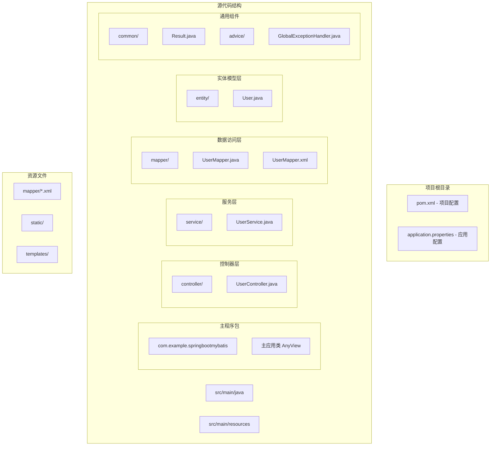
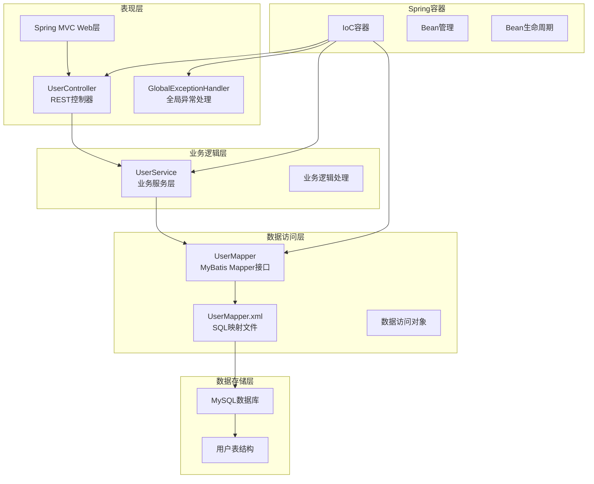
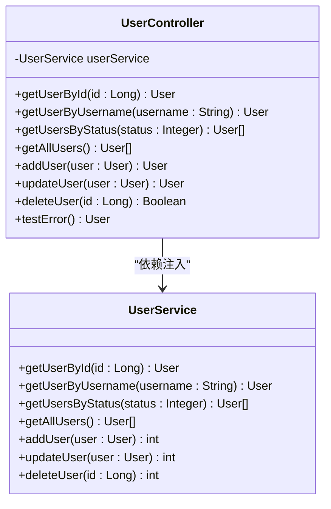
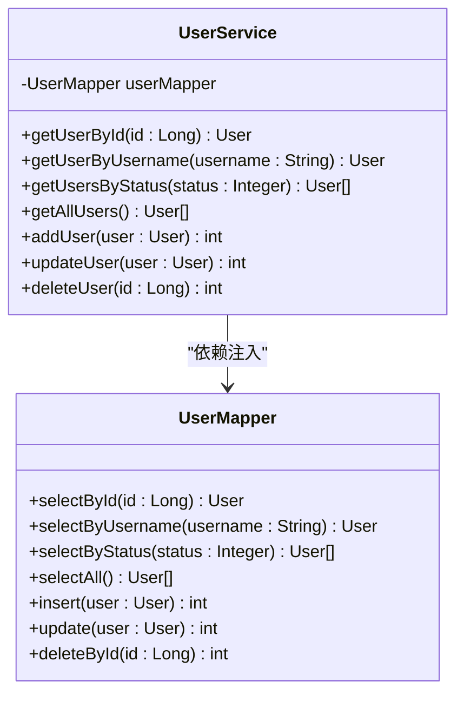
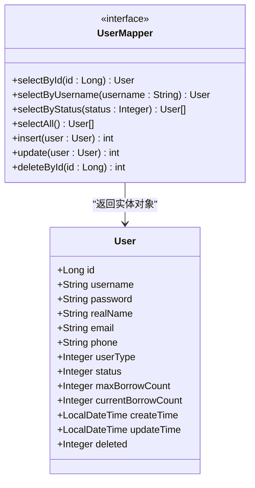
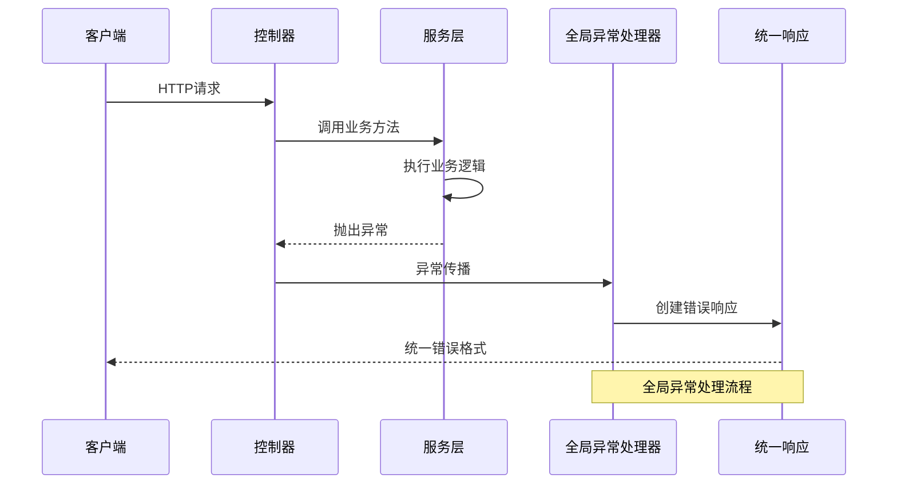
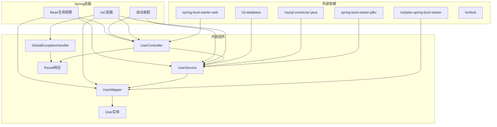

# 依赖注入机制

<cite>
**本文档引用的文件**
- [pom.xml](file://pom.xml)
- [application.properties](file://src/main/resources/application.properties)
- [AnyView.java](file://src/main/java/com/example/springbootmybatis/AnyView.java)
- [UserController.java](file://src/main/java/com/example/springbootmybatis/controller/UserController.java)
- [UserService.java](file://src/main/java/com/example/springbootmybatis/service/UserService.java)
- [UserMapper.java](file://src/main/java/com/example/springbootmybatis/mapper/UserMapper.java)
- [UserMapper.xml](file://src/main/resources/mapper/UserMapper.xml)
- [GlobalExceptionHandler.java](file://src/main/java/com/example/springbootmybatis/advice/GlobalExceptionHandler.java)
- [Result.java](file://src/main/java/com/example/springbootmybatis/common/Result.java)
- [User.java](file://src/main/java/com/example/springbootmybatis/entity/User.java)
- [AnyViewTests.java](file://src/test/java/com/example/sringbootmybatis/AnyViewTests.java)
</cite>

## 目录
1. [简介](#简介)
2. [项目结构](#项目结构)
3. [核心组件](#核心组件)
4. [架构概览](#架构概览)
5. [详细组件分析](#详细组件分析)
6. [依赖关系分析](#依赖关系分析)
7. [性能考虑](#性能考虑)
8. [故障排除指南](#故障排除指南)
9. [结论](#结论)
10. [附录](#附录)

## 简介

本项目是一个基于Spring Boot和MyBatis的Web应用程序，展示了现代Java企业级应用中依赖注入机制的完整实现。通过分析这个项目，我们可以深入了解Spring IoC容器的工作原理、Bean生命周期管理、各种注解的使用场景以及最佳实践。

该项目采用分层架构设计，包括控制器层、服务层、数据访问层和实体模型层，每层都通过依赖注入实现松耦合的组件交互。

## 项目结构

该项目遵循标准的Spring Boot项目结构，采用Maven构建工具管理依赖关系。

**图表来源**
- [pom.xml](file://pom.xml#L1-L88)
- [application.properties](file://src/main/resources/application.properties#L1-L16)

**章节来源**
- [pom.xml](file://pom.xml#L1-L88)
- [application.properties](file://src/main/resources/application.properties#L1-L16)

## 核心组件

### Spring Boot启动类

项目的核心入口点是`AnyView`类，它使用`@SpringBootApplication`注解标记，该注解组合了多个重要注解：
- `@SpringBootConfiguration`：标识这是一个Spring Boot配置类
- `@EnableAutoConfiguration`：启用Spring Boot的自动配置功能
- `@ComponentScan`：启用组件扫描，默认扫描当前包及其子包

### 数据库配置

项目配置了MySQL数据库连接和MyBatis框架：
- 数据库连接：使用MySQL 8.0连接器
- MyBatis配置：自动扫描Mapper接口、启用驼峰命名转换
- 数据源配置：支持本地开发环境

**章节来源**
- [AnyView.java](file://src/main/java/com/example/springbootmybatis/AnyView.java#L1-L13)
- [application.properties](file://src/main/resources/application.properties#L1-L16)

## 架构概览

该项目采用经典的三层架构模式，通过依赖注入实现各层之间的松耦合。

**图表来源**
- [UserController.java](file://src/main/java/com/example/springbootmybatis/controller/UserController.java#L1-L68)
- [UserService.java](file://src/main/java/com/example/springbootmybatis/service/UserService.java#L1-L42)
- [UserMapper.java](file://src/main/java/com/example/springbootmybatis/mapper/UserMapper.java#L1-L23)
- [UserMapper.xml](file://src/main/resources/mapper/UserMapper.xml#L1-L57)

## 详细组件分析

### 控制器层分析

#### UserController组件

`UserController`是REST API的入口点，负责HTTP请求的接收和响应的返回。

**图表来源**
- [UserController.java](file://src/main/java/com/example/springbootmybatis/controller/UserController.java#L1-L68)
- [UserService.java](file://src/main/java/com/example/springbootmybatis/service/UserService.java#L1-L42)

**章节来源**
- [UserController.java](file://src/main/java/com/example/springbootmybatis/controller/UserController.java#L1-L68)

### 服务层分析

#### UserService组件

`UserService`实现了业务逻辑处理，是业务规则的主要承载者。

**图表来源**
- [UserService.java](file://src/main/java/com/example/springbootmybatis/service/UserService.java#L1-L42)
- [UserMapper.java](file://src/main/java/com/example/springbootmybatis/mapper/UserMapper.java#L1-L23)

**章节来源**
- [UserService.java](file://src/main/java/com/example/springbootmybatis/service/UserService.java#L1-L42)

### 数据访问层分析

#### UserMapper组件

`UserMapper`是MyBatis的Mapper接口，定义了数据访问方法。

**图表来源**
- [UserMapper.java](file://src/main/java/com/example/springbootmybatis/mapper/UserMapper.java#L1-L23)
- [User.java](file://src/main/java/com/example/springbootmybatis/entity/User.java#L1-L21)

**章节来源**
- [UserMapper.java](file://src/main/java/com/example/springbootmybatis/mapper/UserMapper.java#L1-L23)
- [UserMapper.xml](file://src/main/resources/mapper/UserMapper.xml#L1-L57)

### 异常处理机制

#### GlobalExceptionHandler组件

全局异常处理器确保应用程序在发生异常时能够优雅地处理并返回统一格式的响应。

**图表来源**
- [GlobalExceptionHandler.java](file://src/main/java/com/example/springbootmybatis/advice/GlobalExceptionHandler.java#L1-L22)
- [Result.java](file://src/main/java/com/example/springbootmybatis/common/Result.java#L1-L87)

**章节来源**
- [GlobalExceptionHandler.java](file://src/main/java/com/example/springbootmybatis/advice/GlobalExceptionHandler.java#L1-L22)

## 依赖关系分析

### 组件依赖图

**图表来源**
- [pom.xml](file://pom.xml#L32-L67)
- [UserController.java](file://src/main/java/com/example/springbootmybatis/controller/UserController.java#L1-L68)
- [UserService.java](file://src/main/java/com/example/springbootmybatis/service/UserService.java#L1-L42)

### Bean生命周期管理

Spring IoC容器负责管理Bean的完整生命周期：

1. **实例化**：容器根据配置创建Bean实例
2. **属性赋值**：注入依赖的其他Bean
3. **初始化**：执行初始化回调方法
4. **可用状态**：Bean可以被应用程序使用
5. **销毁**：容器关闭时执行销毁回调

**章节来源**
- [pom.xml](file://pom.xml#L32-L67)

## 性能考虑

### 依赖注入性能优化

1. **懒加载策略**：对于不常用的Bean，可以使用`@Lazy`注解实现延迟初始化
2. **作用域选择**：合理选择Bean的作用域（Singleton、Prototype等）
3. **循环依赖处理**：避免不必要的循环依赖，使用setter注入解决构造函数循环依赖
4. **缓存策略**：利用Spring的缓存注解减少重复计算

### 数据访问性能

1. **连接池配置**：合理配置数据库连接池参数
2. **查询优化**：使用MyBatis的二级缓存和查询结果映射优化
3. **批量操作**：对于大量数据操作，考虑使用批量插入和更新

## 故障排除指南

### 常见依赖注入问题

#### 循环依赖问题

当两个或多个Bean相互依赖时，Spring容器无法正确初始化这些Bean。

**解决方案**：
1. 重构代码消除循环依赖
2. 使用setter注入替代构造函数注入
3. 使用`@Lazy`注解延迟依赖

#### 自动装配失败

当Spring无法找到合适的Bean进行自动装配时会发生此问题。

**排查步骤**：
1. 检查Bean是否正确标注注解
2. 验证包扫描路径配置
3. 确认Bean的作用域和生命周期

**章节来源**
- [GlobalExceptionHandler.java](file://src/main/java/com/example/springbootmybatis/advice/GlobalExceptionHandler.java#L1-L22)

### 单元测试最佳实践

#### 测试环境配置

项目提供了基础的Spring Boot测试配置，可以用于验证依赖注入的正确性。

**章节来源**
- [AnyViewTests.java](file://src/test/java/com/example/sringbootmybatis/AnyViewTests.java#L1-L14)

## 结论

本项目展示了Spring Boot + MyBatis架构下依赖注入机制的完整实现。通过分析控制器、服务层、数据访问层的组件关系，我们可以看到：

1. **依赖注入的核心价值**：通过IoC容器管理Bean生命周期，实现松耦合的组件交互
2. **注解驱动的配置**：使用`@Service`、`@Repository`、`@Controller`等注解简化Bean声明
3. **自动装配的便利性**：`@Autowired`注解自动解析和注入依赖关系
4. **异常处理的统一性**：全局异常处理器确保一致的错误响应格式

该项目为理解现代Java企业级应用的依赖注入机制提供了良好的实践案例，展示了从简单到复杂的组件交互模式。

## 附录

### 注解使用指南

#### @Component注解
- **用途**：通用的Spring组件注解
- **适用场景**：任何需要被Spring容器管理的类
- **最佳实践**：作为其他特定注解的基础

#### @Service注解
- **用途**：标识业务服务层组件
- **适用场景**：包含业务逻辑的服务类
- **最佳实践**：仅用于服务层，避免在控制器中使用

#### @Repository注解
- **用途**：标识数据访问层组件
- **适用场景**：DAO或Repository类
- **最佳实践**：与Spring Data JPA或MyBatis配合使用

#### @Controller注解
- **用途**：标识Web控制器组件
- **适用场景**：REST API控制器
- **最佳实践**：结合@RestController使用

### 自动装配策略

#### @Autowired注解机制
1. **按类型匹配**：Spring首先尝试按类型查找Bean
2. **按名称匹配**：如果按类型找到多个Bean，则按名称匹配
3. **必需性检查**：默认情况下依赖必须存在，可通过`required = false`设置可选

#### 装配策略选择
- **构造函数注入**：推荐用于必需依赖，保证不可变性和线程安全
- **Setter注入**：适用于可选依赖或需要运行时修改的依赖
- **字段注入**：最简单但不利于测试和依赖可见性

### 依赖注入最佳实践

1. **优先使用构造函数注入**：确保对象创建时的完整性
2. **避免循环依赖**：通过重构消除不必要的循环
3. **合理使用@Lazy**：对于昂贵的依赖使用延迟初始化
4. **明确Bean作用域**：根据使用场景选择合适的Bean作用域
5. **统一异常处理**：使用全局异常处理器提供一致的错误响应