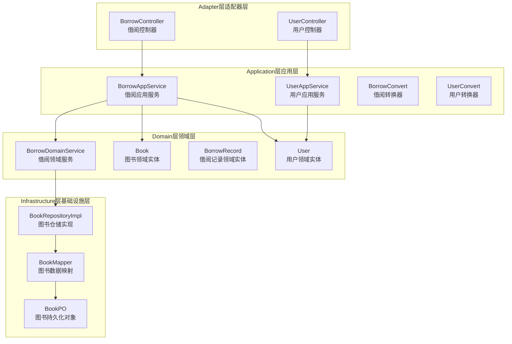
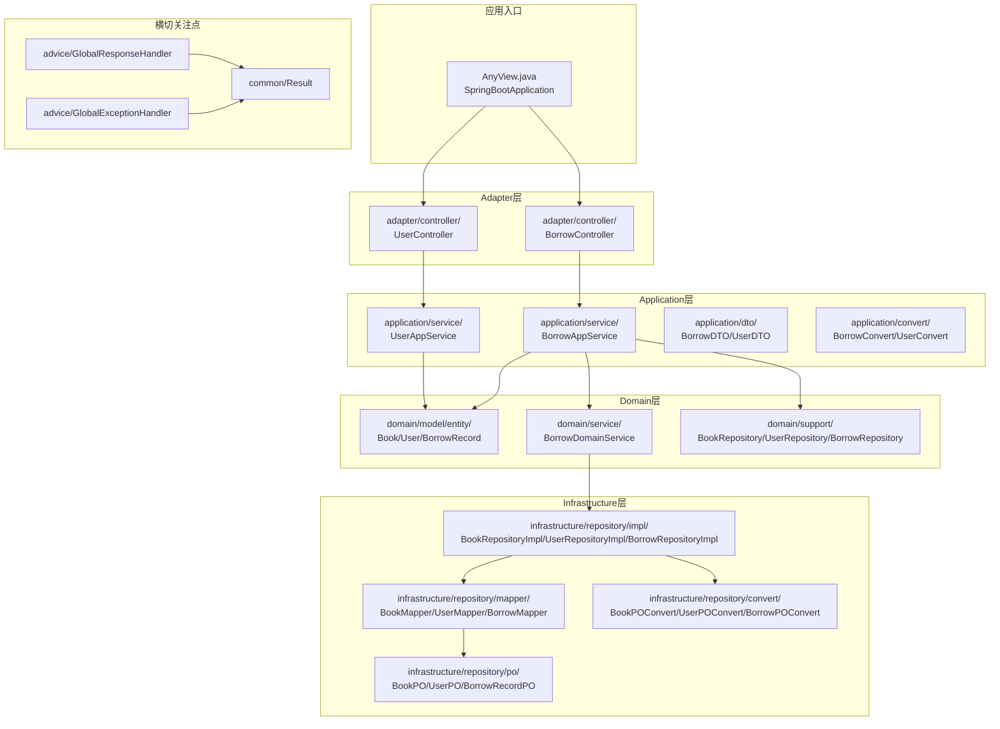
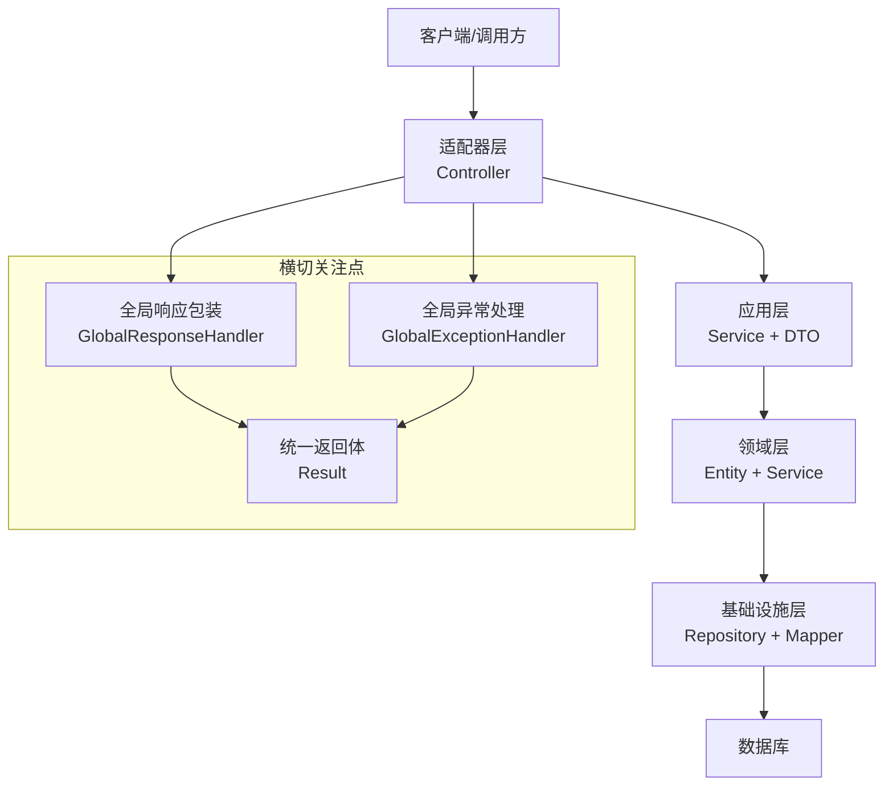
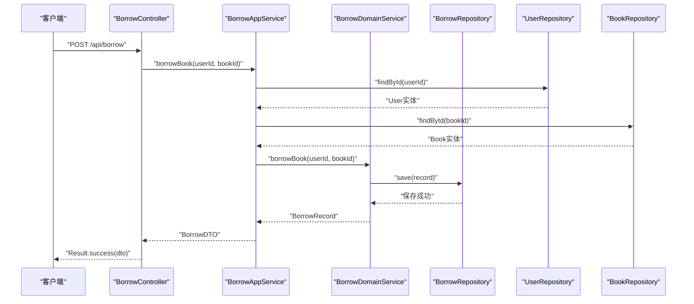
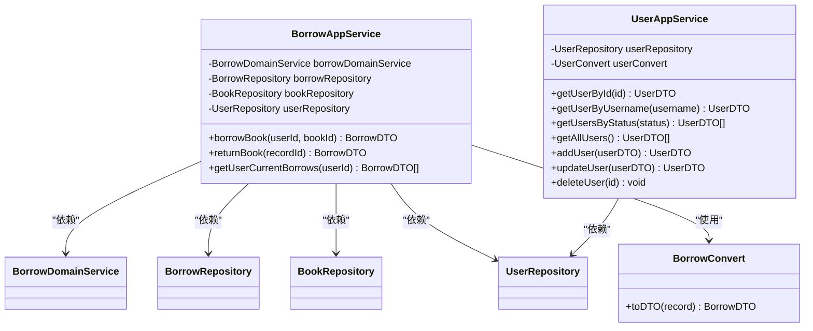
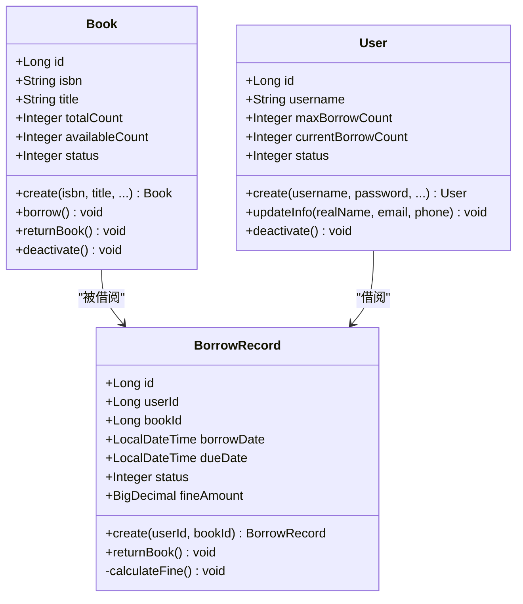
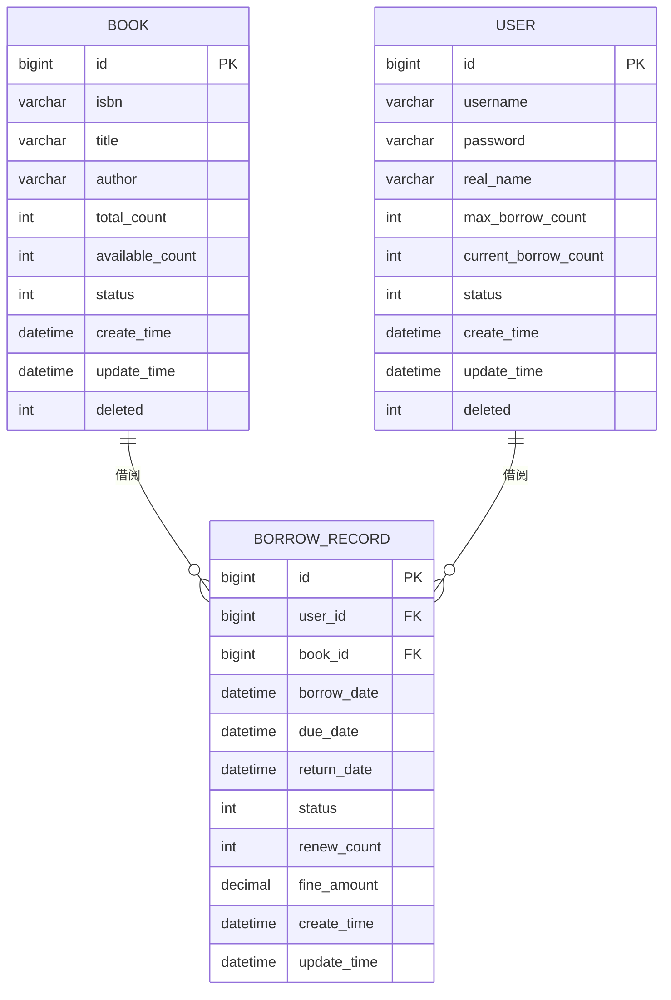
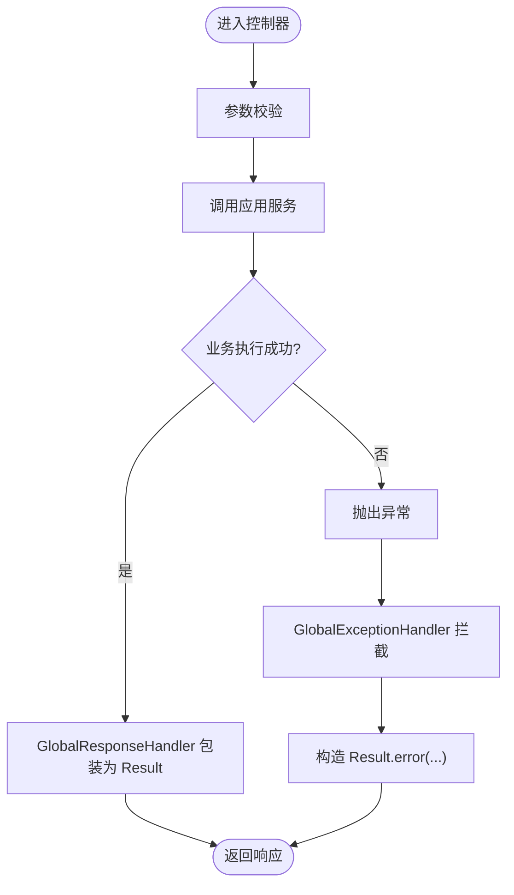
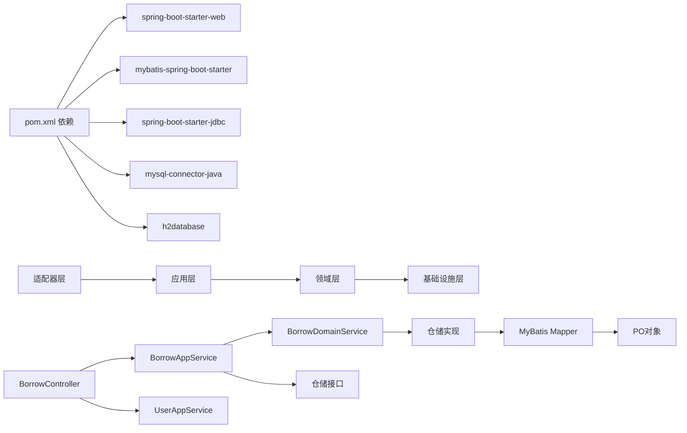

# 架构设计

<cite>
**本文引用的文件**
- [pom.xml](file://pom.xml)
- [application.properties](file://src/main/resources/application.properties)
- [AnyView.java](file://src/main/java/com/example/springbootmybatis/AnyView.java)
- [BorrowController.java](file://src/main/java/com/example/springbootmybatis/adapter/controller/BorrowController.java)
- [UserController.java](file://src/main/java/com/example/springbootmybatis/adapter/controller/UserController.java)
- [BorrowAppService.java](file://src/main/java/com/example/springbootmybatis/application/service/BorrowAppService.java)
- [UserAppService.java](file://src/main/java/com/example/springbootmybatis/application/service/UserAppService.java)
- [BorrowDomainService.java](file://src/main/java/com/example/springbootmybatis/domain/service/BorrowDomainService.java)
- [Book.java](file://src/main/java/com/example/springbootmybatis/domain/model/entity/Book.java)
- [User.java](file://src/main/java/com/example/springbootmybatis/domain/model/entity/User.java)
- [BorrowRecord.java](file://src/main/java/com/example/springbootmybatis/domain/model/entity/BorrowRecord.java)
- [BookRepositoryImpl.java](file://src/main/java/com/example/springbootmybatis/infrastructure/repository/impl/BookRepositoryImpl.java)
- [BookMapper.java](file://src/main/java/com/example/springbootmybatis/infrastructure/repository/mapper/BookMapper.java)
- [BookPO.java](file://src/main/java/com/example/springbootmybatis/infrastructure/repository/po/BookPO.java)
- [BorrowDTO.java](file://src/main/java/com/example/springbootmybatis/application/dto/BorrowDTO.java)
- [UserDTO.java](file://src/main/java/com/example/springbootmybatis/application/dto/UserDTO.java)
- [BorrowConvert.java](file://src/main/java/com/example/springbootmybatis/application/convert/BorrowConvert.java)
- [GlobalExceptionHandler.java](file://src/main/java/com/example/springbootmybatis/advice/GlobalExceptionHandler.java)
- [GlobalResponseHandler.java](file://src/main/java/com/example/springbootmybatis/advice/GlobalResponseHandler.java)
- [Result.java](file://src/main/java/com/example/springbootmybatis/common/Result.java)
</cite>

## 更新摘要
**所做更改**
- 完全重构架构设计以反映DDD四层架构：Adapter、Application、Domain、Infrastructure
- 新增完整的借书系统业务场景和领域模型
- 更新组件关系图以展示新的分层结构
- 重新组织项目结构说明以符合DDD最佳实践
- 新增领域服务和仓储模式的详细说明

## 目录
1. [引言](#引言)
2. [DDD四层架构概览](#ddd四层架构概览)
3. [项目结构](#项目结构)
4. [核心组件](#核心组件)
5. [架构总览](#架构总览)
6. [详细组件分析](#详细组件分析)
7. [依赖分析](#依赖分析)
8. [性能考虑](#性能考虑)
9. [故障排查指南](#故障排查指南)
10. [结论](#结论)
11. [附录](#附录)

## 引言
本项目采用DDD（领域驱动设计）四层架构模式，通过Adapter、Application、Domain、Infrastructure四个层次清晰分离关注点。Adapter层负责外部接口适配，Application层编排业务用例，Domain层承载核心业务逻辑和领域模型，Infrastructure层提供技术基础设施支持。项目基于Spring Boot与MyBatis集成，实现借书系统的完整业务流程，包括用户管理、图书管理和借阅管理等核心功能。

## DDD四层架构概览
DDD四层架构通过清晰的分层边界实现关注点分离：

- **Adapter层（适配器层）**：对外接口适配，处理HTTP请求、参数校验、响应包装
- **Application层（应用层）**：业务用例编排，协调领域服务和仓储操作
- **Domain层（领域层）**：核心业务逻辑，包含领域模型、领域服务和业务规则
- **Infrastructure层（基础设施层）**：技术基础设施，提供数据访问、远程服务等支撑

**图表来源**
- [BorrowController.java:1-70](file://src/main/java/com/example/springbootmybatis/adapter/controller/BorrowController.java#L1-L70)
- [UserController.java:1-69](file://src/main/java/com/example/springbootmybatis/adapter/controller/UserController.java#L1-L69)
- [BorrowAppService.java:1-125](file://src/main/java/com/example/springbootmybatis/application/service/BorrowAppService.java#L1-L125)
- [UserAppService.java:1-83](file://src/main/java/com/example/springbootmybatis/application/service/UserAppService.java#L1-L83)
- [BorrowDomainService.java:1-50](file://src/main/java/com/example/springbootmybatis/domain/service/BorrowDomainService.java#L1-L50)
- [Book.java:1-112](file://src/main/java/com/example/springbootmybatis/domain/model/entity/Book.java#L1-L112)
- [User.java:1-158](file://src/main/java/com/example/springbootmybatis/domain/model/entity/User.java#L1-L158)
- [BorrowRecord.java:1-80](file://src/main/java/com/example/springbootmybatis/domain/model/entity/BorrowRecord.java#L1-L80)
- [BookRepositoryImpl.java:1-85](file://src/main/java/com/example/springbootmybatis/infrastructure/repository/impl/BookRepositoryImpl.java#L1-L85)
- [BookMapper.java:1-35](file://src/main/java/com/example/springbootmybatis/infrastructure/repository/mapper/BookMapper.java#L1-L35)
- [BookPO.java:1-28](file://src/main/java/com/example/springbootmybatis/infrastructure/repository/po/BookPO.java#L1-L28)

## 项目结构
项目采用标准的DDD四层架构分层，每层都有明确的职责边界：

- **adapter**：适配器层，包含控制器和外部接口适配
- **application**：应用层，包含应用服务、DTO和转换器
- **domain**：领域层，包含领域模型、领域服务和仓储接口
- **infrastructure**：基础设施层，包含仓储实现、数据映射和持久化对象
- **advice**：横切关注点（全局异常处理和响应包装）
- **common**：通用工具类（统一响应结构）

**图表来源**
- [AnyView.java:1-13](file://src/main/java/com/example/springbootmybatis/AnyView.java#L1-L13)
- [BorrowController.java:1-70](file://src/main/java/com/example/springbootmybatis/adapter/controller/BorrowController.java#L1-L70)
- [UserController.java:1-69](file://src/main/java/com/example/springbootmybatis/adapter/controller/UserController.java#L1-L69)
- [BorrowAppService.java:1-125](file://src/main/java/com/example/springbootmybatis/application/service/BorrowAppService.java#L1-L125)
- [UserAppService.java:1-83](file://src/main/java/com/example/springbootmybatis/application/service/UserAppService.java#L1-L83)
- [BorrowDomainService.java:1-50](file://src/main/java/com/example/springbootmybatis/domain/service/BorrowDomainService.java#L1-L50)
- [BookRepositoryImpl.java:1-85](file://src/main/java/com/example/springbootmybatis/infrastructure/repository/impl/BookRepositoryImpl.java#L1-L85)
- [BookMapper.java:1-35](file://src/main/java/com/example/springbootmybatis/infrastructure/repository/mapper/BookMapper.java#L1-L35)
- [BookPO.java:1-28](file://src/main/java/com/example/springbootmybatis/infrastructure/repository/po/BookPO.java#L1-L28)
- [GlobalResponseHandler.java:1-39](file://src/main/java/com/example/springbootmybatis/advice/GlobalResponseHandler.java#L1-L39)
- [GlobalExceptionHandler.java:1-22](file://src/main/java/com/example/springbootmybatis/advice/GlobalExceptionHandler.java#L1-L22)
- [Result.java:1-87](file://src/main/java/com/example/springbootmybatis/common/Result.java#L1-L87)

**章节来源**
- [pom.xml:1-101](file://pom.xml#L1-L101)
- [application.properties:1-16](file://src/main/resources/application.properties#L1-L16)
- [AnyView.java:1-13](file://src/main/java/com/example/springbootmybatis/AnyView.java#L1-L13)

## 核心组件

### 应用入口与自动配置
- 使用Spring Boot注解启动，自动装配Web和JDBC环境
- 加载MyBatis Starter完成映射器扫描与类型别名注册
- 支持多数据源配置和连接池管理

### 适配器层（Adapter Layer）
- **BorrowController**：借阅业务控制器，提供借书、还书、查询当前借阅等功能
- **UserController**：用户业务控制器，提供用户查询、新增、更新、删除等REST接口
- 负责HTTP请求处理、参数校验和响应包装

### 应用层（Application Layer）
- **BorrowAppService**：借阅应用服务，编排借阅业务流程，协调领域服务和仓储操作
- **UserAppService**：用户应用服务，处理用户相关的业务用例
- **DTO层**：应用服务与外部交互的数据传输对象
- **转换器**：负责领域模型与DTO之间的双向转换

### 领域层（Domain Layer）
- **Book实体**：图书领域模型，包含图书基本信息和借阅行为方法
- **User实体**：用户领域模型，包含用户信息和借阅限额管理
- **BorrowRecord实体**：借阅记录领域模型，管理借阅状态和费用计算
- **BorrowDomainService**：借阅领域服务，实现核心借阅业务逻辑

### 基础设施层（Infrastructure Layer）
- **仓储实现**：BookRepositoryImpl等仓储接口的具体实现
- **数据映射**：MyBatis Mapper接口定义数据库操作
- **持久化对象**：PO对象映射数据库表结构
- **转换器**：PO与领域模型之间的转换

**章节来源**
- [AnyView.java:1-13](file://src/main/java/com/example/springbootmybatis/AnyView.java#L1-L13)
- [BorrowController.java:1-70](file://src/main/java/com/example/springbootmybatis/adapter/controller/BorrowController.java#L1-L70)
- [UserController.java:1-69](file://src/main/java/com/example/springbootmybatis/adapter/controller/UserController.java#L1-L69)
- [BorrowAppService.java:1-125](file://src/main/java/com/example/springbootmybatis/application/service/BorrowAppService.java#L1-L125)
- [UserAppService.java:1-83](file://src/main/java/com/example/springbootmybatis/application/service/UserAppService.java#L1-L83)
- [BorrowDomainService.java:1-50](file://src/main/java/com/example/springbootmybatis/domain/service/BorrowDomainService.java#L1-L50)
- [Book.java:1-112](file://src/main/java/com/example/springbootmybatis/domain/model/entity/Book.java#L1-L112)
- [User.java:1-158](file://src/main/java/com/example/springbootmybatis/domain/model/entity/User.java#L1-L158)
- [BorrowRecord.java:1-80](file://src/main/java/com/example/springbootmybatis/domain/model/entity/BorrowRecord.java#L1-L80)
- [BookRepositoryImpl.java:1-85](file://src/main/java/com/example/springbootmybatis/infrastructure/repository/impl/BookRepositoryImpl.java#L1-L85)
- [BookMapper.java:1-35](file://src/main/java/com/example/springbootmybatis/infrastructure/repository/mapper/BookMapper.java#L1-L35)
- [BookPO.java:1-28](file://src/main/java/com/example/springbootmybatis/infrastructure/repository/po/BookPO.java#L1-L28)

## 架构总览
系统采用DDD四层架构，通过清晰的分层边界实现关注点分离和职责单一化。每一层都有明确的输入输出契约，层间通过接口进行通信，实现松耦合和高内聚。

**图表来源**
- [BorrowController.java:1-70](file://src/main/java/com/example/springbootmybatis/adapter/controller/BorrowController.java#L1-L70)
- [UserController.java:1-69](file://src/main/java/com/example/springbootmybatis/adapter/controller/UserController.java#L1-L69)
- [BorrowAppService.java:1-125](file://src/main/java/com/example/springbootmybatis/application/service/BorrowAppService.java#L1-L125)
- [UserAppService.java:1-83](file://src/main/java/com/example/springbootmybatis/application/service/UserAppService.java#L1-L83)
- [BorrowDomainService.java:1-50](file://src/main/java/com/example/springbootmybatis/domain/service/BorrowDomainService.java#L1-L50)
- [BookRepositoryImpl.java:1-85](file://src/main/java/com/example/springbootmybatis/infrastructure/repository/impl/BookRepositoryImpl.java#L1-L85)
- [GlobalResponseHandler.java:1-39](file://src/main/java/com/example/springbootmybatis/advice/GlobalResponseHandler.java#L1-L39)
- [GlobalExceptionHandler.java:1-22](file://src/main/java/com/example/springbootmybatis/advice/GlobalExceptionHandler.java#L1-L22)
- [Result.java:1-87](file://src/main/java/com/example/springbootmybatis/common/Result.java#L1-L87)

## 详细组件分析

### 适配器层（Adapter Layer）
**职责**
- 接收HTTP请求，进行参数解析和简单校验
- 调用应用层服务处理业务逻辑
- 统一响应格式，避免重复封装

**关键组件**
- **BorrowController**：提供借阅业务的REST接口，包括借书、还书、查询当前借阅等操作
- **UserController**：提供用户管理的REST接口，支持用户查询、新增、更新、删除等操作

**图表来源**
- [BorrowController.java:1-70](file://src/main/java/com/example/springbootmybatis/adapter/controller/BorrowController.java#L1-L70)
- [BorrowAppService.java:1-125](file://src/main/java/com/example/springbootmybatis/application/service/BorrowAppService.java#L1-L125)
- [BorrowDomainService.java:1-50](file://src/main/java/com/example/springbootmybatis/domain/service/BorrowDomainService.java#L1-L50)

**章节来源**
- [BorrowController.java:1-70](file://src/main/java/com/example/springbootmybatis/adapter/controller/BorrowController.java#L1-L70)
- [UserController.java:1-69](file://src/main/java/com/example/springbootmybatis/adapter/controller/UserController.java#L1-L69)

### 应用层（Application Layer）
**职责**
- 编排业务用例，协调多个领域服务和仓储操作
- 处理业务规则和事务边界
- 负责DTO转换和业务逻辑编排

**关键组件**
- **BorrowAppService**：借阅业务的核心编排者，处理借书、还书的完整业务流程
- **UserAppService**：用户业务的编排者，处理用户相关的CRUD操作
- **转换器**：负责领域模型与DTO之间的双向转换，确保数据格式的一致性

**图表来源**
- [BorrowAppService.java:1-125](file://src/main/java/com/example/springbootmybatis/application/service/BorrowAppService.java#L1-L125)
- [UserAppService.java:1-83](file://src/main/java/com/example/springbootmybatis/application/service/UserAppService.java#L1-L83)
- [BorrowConvert.java:1-28](file://src/main/java/com/example/springbootmybatis/application/convert/BorrowConvert.java#L1-L28)

**章节来源**
- [BorrowAppService.java:1-125](file://src/main/java/com/example/springbootmybatis/application/service/BorrowAppService.java#L1-L125)
- [UserAppService.java:1-83](file://src/main/java/com/example/springbootmybatis/application/service/UserAppService.java#L1-L83)
- [BorrowConvert.java:1-28](file://src/main/java/com/example/springbootmybatis/application/convert/BorrowConvert.java#L1-L28)

### 领域层（Domain Layer）
**职责**
- 承载核心业务逻辑和领域知识
- 定义领域模型和业务规则
- 实现领域服务和业务行为

**关键组件**
- **Book实体**：图书领域模型，包含图书的基本信息和借阅行为方法
- **User实体**：用户领域模型，管理用户信息和借阅限额
- **BorrowRecord实体**：借阅记录领域模型，管理借阅状态和费用计算
- **BorrowDomainService**：借阅领域的核心服务，实现借阅和归还的核心业务逻辑

**图表来源**
- [Book.java:1-112](file://src/main/java/com/example/springbootmybatis/domain/model/entity/Book.java#L1-L112)
- [User.java:1-158](file://src/main/java/com/example/springbootmybatis/domain/model/entity/User.java#L1-L158)
- [BorrowRecord.java:1-80](file://src/main/java/com/example/springbootmybatis/domain/model/entity/BorrowRecord.java#L1-L80)

**章节来源**
- [Book.java:1-112](file://src/main/java/com/example/springbootmybatis/domain/model/entity/Book.java#L1-L112)
- [User.java:1-158](file://src/main/java/com/example/springbootmybatis/domain/model/entity/User.java#L1-L158)
- [BorrowRecord.java:1-80](file://src/main/java/com/example/springbootmybatis/domain/model/entity/BorrowRecord.java#L1-L80)
- [BorrowDomainService.java:1-50](file://src/main/java/com/example/springbootmybatis/domain/service/BorrowDomainService.java#L1-L50)

### 基础设施层（Infrastructure Layer）
**职责**
- 提供技术基础设施支持
- 实现仓储接口的具体逻辑
- 处理数据持久化和数据库操作

**关键组件**
- **仓储实现**：BookRepositoryImpl等具体实现类，负责与数据库的交互
- **数据映射**：MyBatis Mapper接口，定义数据库操作方法
- **持久化对象**：PO对象映射数据库表结构，支持ORM操作

**图表来源**
- [BookPO.java:1-28](file://src/main/java/com/example/springbootmybatis/infrastructure/repository/po/BookPO.java#L1-L28)
- [User.java:1-158](file://src/main/java/com/example/springbootmybatis/domain/model/entity/User.java#L1-L158)
- [BorrowRecord.java:1-80](file://src/main/java/com/example/springbootmybatis/domain/model/entity/BorrowRecord.java#L1-L80)

**章节来源**
- [BookRepositoryImpl.java:1-85](file://src/main/java/com/example/springbootmybatis/infrastructure/repository/impl/BookRepositoryImpl.java#L1-L85)
- [BookMapper.java:1-35](file://src/main/java/com/example/springbootmybatis/infrastructure/repository/mapper/BookMapper.java#L1-L35)
- [BookPO.java:1-28](file://src/main/java/com/example/springbootmybatis/infrastructure/repository/po/BookPO.java#L1-L28)

### 横切关注点（异常与响应）
- **全局响应包装**：在返回体写回前统一包装为Result，避免重复封装
- **全局异常处理**：捕获未处理异常与运行时异常，返回标准化错误信息
- **统一返回体**：Result提供success/message/data/timestamp字段，便于前端统一处理

**图表来源**
- [GlobalResponseHandler.java:1-39](file://src/main/java/com/example/springbootmybatis/advice/GlobalResponseHandler.java#L1-L39)
- [GlobalExceptionHandler.java:1-22](file://src/main/java/com/example/springbootmybatis/advice/GlobalExceptionHandler.java#L1-L22)
- [Result.java:1-87](file://src/main/java/com/example/springbootmybatis/common/Result.java#L1-L87)

**章节来源**
- [GlobalResponseHandler.java:1-39](file://src/main/java/com/example/springbootmybatis/advice/GlobalResponseHandler.java#L1-L39)
- [GlobalExceptionHandler.java:1-22](file://src/main/java/com/example/springbootmybatis/advice/GlobalExceptionHandler.java#L1-L22)
- [Result.java:1-87](file://src/main/java/com/example/springbootmybatis/common/Result.java#L1-L87)

## 依赖分析
**外部依赖**
- spring-boot-starter-web：提供Web运行时与嵌入式容器
- mybatis-spring-boot-starter：集成MyBatis，自动扫描Mapper与XML
- spring-boot-starter-jdbc：提供JDBC抽象与连接池能力
- mysql/mysql-connector-java：MySQL驱动与连接器
- h2database：运行时内存数据库（可用于测试或本地开发）

**内部依赖关系**
- 适配器层依赖应用层服务
- 应用层依赖领域服务和仓储接口
- 领域层依赖仓储接口
- 基础设施层实现仓储接口并依赖数据映射
- 全局处理器依赖Result统一返回体

**图表来源**
- [pom.xml:1-101](file://pom.xml#L1-L101)
- [BorrowController.java:1-70](file://src/main/java/com/example/springbootmybatis/adapter/controller/BorrowController.java#L1-L70)
- [UserController.java:1-69](file://src/main/java/com/example/springbootmybatis/adapter/controller/UserController.java#L1-L69)
- [BorrowAppService.java:1-125](file://src/main/java/com/example/springbootmybatis/application/service/BorrowAppService.java#L1-L125)
- [UserAppService.java:1-83](file://src/main/java/com/example/springbootmybatis/application/service/UserAppService.java#L1-L83)
- [BorrowDomainService.java:1-50](file://src/main/java/com/example/springbootmybatis/domain/service/BorrowDomainService.java#L1-L50)
- [BookRepositoryImpl.java:1-85](file://src/main/java/com/example/springbootmybatis/infrastructure/repository/impl/BookRepositoryImpl.java#L1-L85)
- [BookMapper.java:1-35](file://src/main/java/com/example/springbootmybatis/infrastructure/repository/mapper/BookMapper.java#L1-L35)
- [BookPO.java:1-28](file://src/main/java/com/example/springbootmybatis/infrastructure/repository/po/BookPO.java#L1-L28)

**章节来源**
- [pom.xml:1-101](file://pom.xml#L1-L101)

## 性能考虑
**MyBatis映射优化**
- 使用XML明确SQL与结果映射，减少ORM默认策略带来的隐式开销
- 开启驼峰映射降低字段命名不一致导致的额外处理
- 合理使用缓存策略，避免频繁的数据库查询

**连接与事务**
- 使用JDBC Starter与连接池，建议在生产环境配置连接池大小与超时参数
- 应用层使用@Transactional注解合理控制事务边界
- 避免长事务，及时释放数据库连接

**响应与异常**
- 全局包装减少重复序列化，异常统一处理避免堆栈泄露与不一致响应
- DTO转换器优化对象转换性能
- 合理使用懒加载和延迟初始化

## 故障排查指南
**常见问题定位**
- 适配器异常：查看全局异常处理器是否拦截到对应异常类型
- 业务逻辑异常：检查应用服务中的业务规则和参数校验
- 数据访问异常：确认仓储实现和Mapper配置是否正确
- 领域模型异常：验证领域服务中的业务规则和状态转换

**快速验证**
- 使用借阅接口验证完整的借书流程
- 使用用户接口验证CRUD操作和返回体结构
- 检查数据库连接和表结构是否正确

**章节来源**
- [GlobalExceptionHandler.java:1-22](file://src/main/java/com/example/springbootmybatis/advice/GlobalExceptionHandler.java#L1-L22)
- [GlobalResponseHandler.java:1-39](file://src/main/java/com/example/springbootmybatis/advice/GlobalResponseHandler.java#L1-L39)
- [application.properties:1-16](file://src/main/resources/application.properties#L1-L16)
- [BorrowController.java:1-70](file://src/main/java/com/example/springbootmybatis/adapter/controller/BorrowController.java#L1-L70)
- [UserController.java:1-69](file://src/main/java/com/example/springbootmybatis/adapter/controller/UserController.java#L1-L69)

## 结论
该DDD四层架构以清晰的分层边界和职责分离实现了高内聚、低耦合的系统设计。通过Adapter、Application、Domain、Infrastructure四个层次的有效协作，既满足了借书系统的核心业务需求，又为未来的功能扩展和系统演进提供了良好的基础。结合Spring Boot自动配置和MyBatis集成，实现了快速开发与高效运行的平衡。

## 附录
**部署拓扑建议**
- 单实例部署：适合开发与小规模测试
- 多实例部署：建议配合负载均衡与数据库主从或读写分离
- 微服务部署：可将不同业务模块拆分为独立的服务

**可扩展性考虑**
- 安全：引入Spring Security或网关鉴权
- 监控：集成Actuator、日志与链路追踪
- 容错：引入熔断、限流与重试策略
- 缓存：添加Redis缓存层提升性能

**系统边界**
- 内部：适配器层、应用层、领域层、基础设施层
- 外部：数据库、客户端、监控与运维平台
- 第三方：支付、短信等外部服务集成

**技术权衡**
- 分层架构增加了代码复杂度但提升了可维护性
- DDD模式提高了业务理解但需要更多的设计成本
- 传统MVC模式简单直接但容易产生代码耦合