# 领域模型设计

<cite>
**本文档引用的文件**
- [User.java](file://src/main/java/com/example/springbootmybatis/domain/model/entity/User.java)
- [Book.java](file://src/main/java/com/example/springbootmybatis/domain/model/entity/Book.java)
- [BorrowRecord.java](file://src/main/java/com/example/springbootmybatis/domain/model/entity/BorrowRecord.java)
- [UserRepository.java](file://src/main/java/com/example/springbootmybatis/domain/support/UserRepository.java)
- [BookRepository.java](file://src/main/java/com/example/springbootmybatis/domain/support/BookRepository.java)
- [BorrowRepository.java](file://src/main/java/com/example/springbootmybatis/domain/support/BorrowRepository.java)
- [UserAppService.java](file://src/main/java/com/example/springbootmybatis/application/service/UserAppService.java)
- [BorrowAppService.java](file://src/main/java/com/example/springbootmybatis/application/service/BorrowAppService.java)
- [BorrowDomainService.java](file://src/main/java/com/example/springbootmybatis/domain/service/BorrowDomainService.java)
- [UserConvert.java](file://src/main/java/com/example/springbootmybatis/application/convert/UserConvert.java)
- [BorrowConvert.java](file://src/main/java/com/example/springbootmybatis/application/convert/BorrowConvert.java)
- [UserDTO.java](file://src/main/java/com/example/springbootmybatis/application/dto/UserDTO.java)
- [BorrowDTO.java](file://src/main/java/com/example/springbootmybatis/application/dto/BorrowDTO.java)
- [pom.xml](file://pom.xml)
</cite>

## 更新摘要
**变更内容**
- 完善了三个核心领域实体的完整业务行为方法
- 更新了仓储接口的查询方法设计
- 增强了应用服务的业务逻辑实现
- 完善了领域服务的借阅业务规则
- 优化了转换器的DTO映射逻辑

## 目录
1. [引言](#引言)
2. [项目结构](#项目结构)
3. [核心领域模型](#核心领域模型)
4. [架构概览](#架构概览)
5. [详细组件分析](#详细组件分析)
6. [依赖关系分析](#依赖关系分析)
7. [性能考虑](#性能考虑)
8. [故障排除指南](#故障排除指南)
9. [结论](#结论)

## 引言

本项目是一个基于Spring Boot和MyBatis的领域驱动设计(DDD)示例项目，专注于图书借阅管理系统的设计与实现。该项目采用分层架构模式，将业务逻辑、数据访问和应用服务清晰分离，体现了DDD的核心原则。

项目实现了完整的图书借阅生命周期管理，包括用户管理、图书管理和借阅记录管理等核心功能。通过领域模型设计，确保了业务规则的封装性和数据的一致性。

## 项目结构

该项目遵循标准的Spring Boot项目结构，并采用了DDD的分层架构设计：

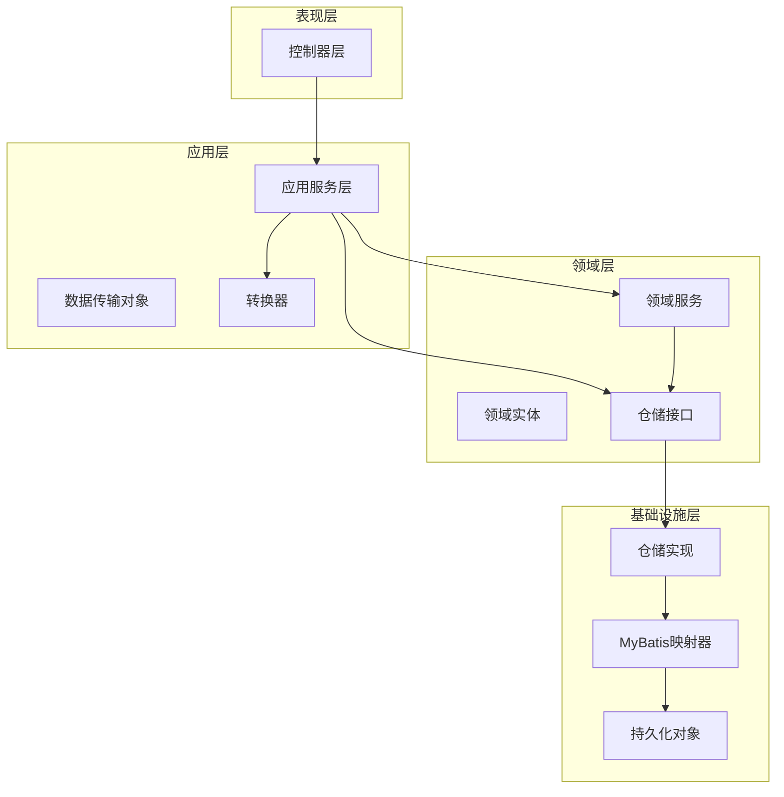

**图表来源**
- [User.java:1-158](file://src/main/java/com/example/springbootmybatis/domain/model/entity/User.java#L1-L158)
- [Book.java:1-112](file://src/main/java/com/example/springbootmybatis/domain/model/entity/Book.java#L1-L112)
- [BorrowRecord.java:1-80](file://src/main/java/com/example/springbootmybatis/domain/model/entity/BorrowRecord.java#L1-L80)

**章节来源**
- [pom.xml:1-101](file://pom.xml#L1-L101)

## 核心领域模型

### 用户领域模型

用户是系统中的核心实体之一，具有完整的生命周期管理能力：

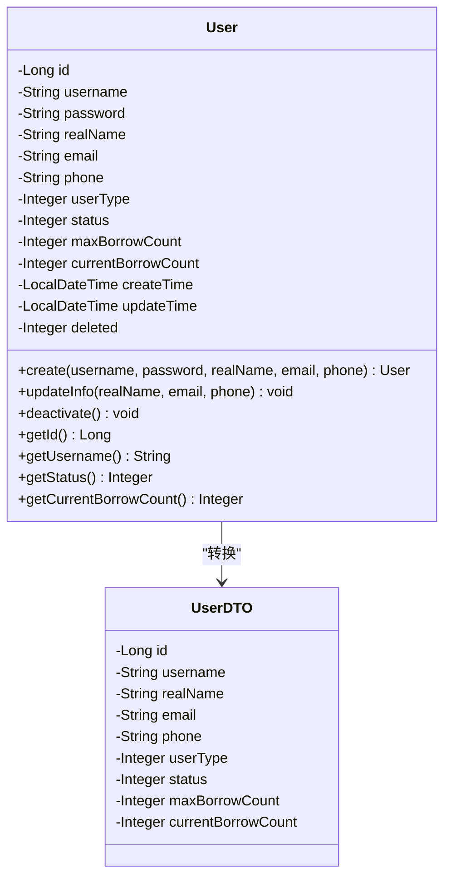

**图表来源**
- [User.java:1-158](file://src/main/java/com/example/springbootmybatis/domain/model/entity/User.java#L1-L158)
- [UserDTO.java:1-99](file://src/main/java/com/example/springbootmybatis/application/dto/UserDTO.java#L1-L99)

### 图书领域模型

图书实体封装了完整的图书信息和借阅状态管理：

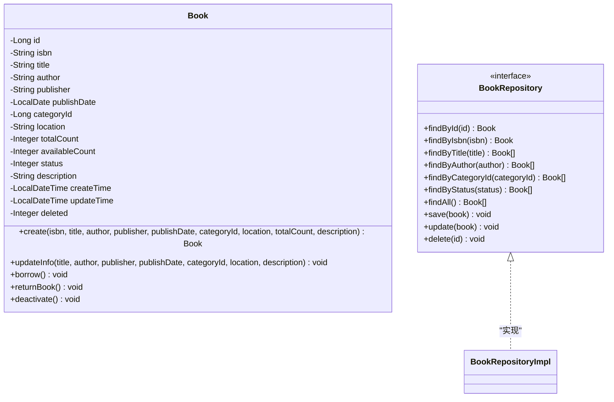

**图表来源**
- [Book.java:1-112](file://src/main/java/com/example/springbootmybatis/domain/model/entity/Book.java#L1-L112)
- [BookRepository.java:1-31](file://src/main/java/com/example/springbootmybatis/domain/support/BookRepository.java#L1-L31)

### 借阅记录领域模型

借阅记录是系统中最复杂的领域实体，负责管理完整的借阅生命周期：

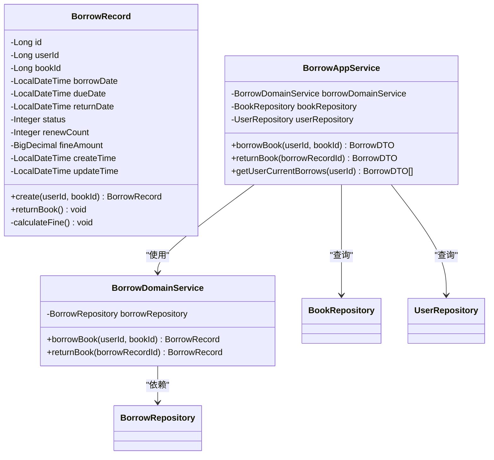

**图表来源**
- [BorrowRecord.java:1-80](file://src/main/java/com/example/springbootmybatis/domain/model/entity/BorrowRecord.java#L1-L80)
- [BorrowDomainService.java:1-50](file://src/main/java/com/example/springbootmybatis/domain/service/BorrowDomainService.java#L1-L50)
- [BorrowAppService.java:1-125](file://src/main/java/com/example/springbootmybatis/application/service/BorrowAppService.java#L1-L125)

**章节来源**
- [User.java:1-158](file://src/main/java/com/example/springbootmybatis/domain/model/entity/User.java#L1-L158)
- [Book.java:1-112](file://src/main/java/com/example/springbootmybatis/domain/model/entity/Book.java#L1-L112)
- [BorrowRecord.java:1-80](file://src/main/java/com/example/springbootmybatis/domain/model/entity/BorrowRecord.java#L1-L80)

## 架构概览

项目采用经典的四层架构模式，每层都有明确的职责分工：

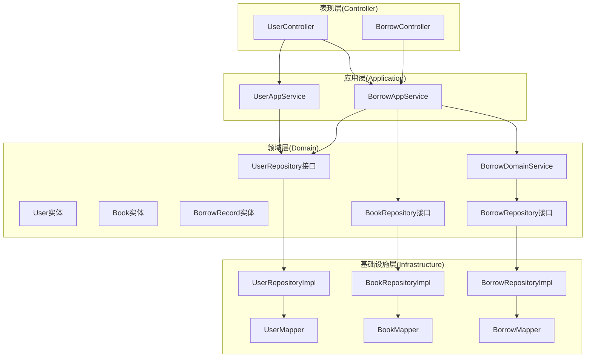

**图表来源**
- [UserAppService.java:1-83](file://src/main/java/com/example/springbootmybatis/application/service/UserAppService.java#L1-L83)
- [BorrowAppService.java:1-125](file://src/main/java/com/example/springbootmybatis/application/service/BorrowAppService.java#L1-L125)
- [UserRepositoryImpl.java:1-68](file://src/main/java/com/example/springbootmybatis/infrastructure/repository/impl/UserRepositoryImpl.java#L1-L68)
- [BookRepositoryImpl.java:1-85](file://src/main/java/com/example/springbootmybatis/infrastructure/repository/impl/BookRepositoryImpl.java#L1-L85)
- [BorrowRepositoryImpl.java:1-60](file://src/main/java/com/example/springbootmybatis/infrastructure/repository/impl/BorrowRepositoryImpl.java#L1-L60)

## 详细组件分析

### 应用服务层

应用服务作为用例的编排者，负责协调多个领域对象完成业务用例：

#### 用户应用服务

用户应用服务提供了完整的用户管理功能：

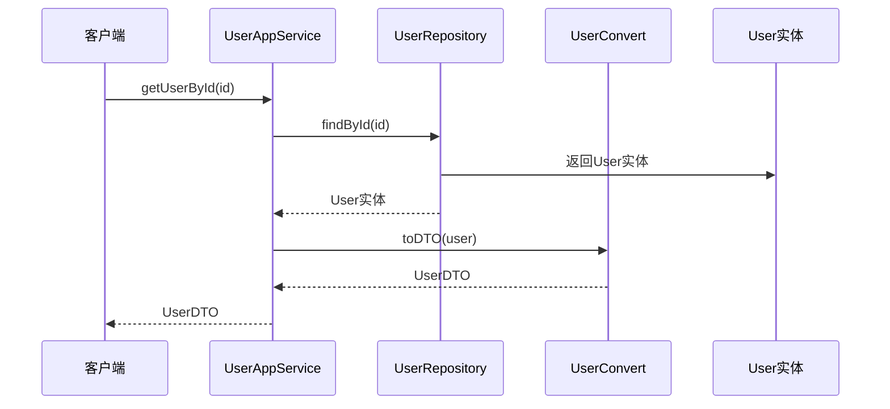

**图表来源**
- [UserAppService.java:27-30](file://src/main/java/com/example/springbootmybatis/application/service/UserAppService.java#L27-L30)
- [UserRepository.java:14-14](file://src/main/java/com/example/springbootmybatis/domain/support/UserRepository.java#L14-L14)

#### 借阅应用服务

借阅应用服务处理复杂的借阅业务流程：

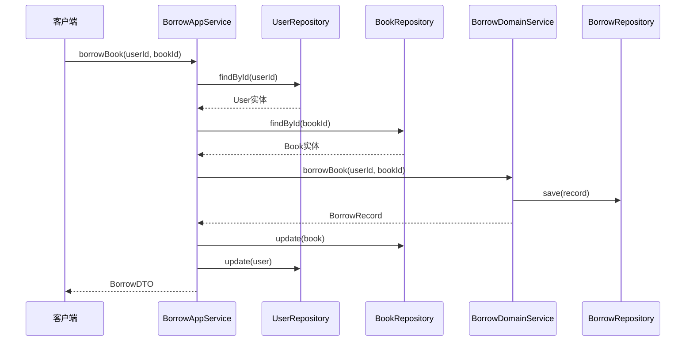

**图表来源**
- [BorrowAppService.java:42-82](file://src/main/java/com/example/springbootmybatis/application/service/BorrowAppService.java#L42-L82)
- [BorrowDomainService.java:24-30](file://src/main/java/com/example/springbootmybatis/domain/service/BorrowDomainService.java#L24-L30)

**章节来源**
- [UserAppService.java:1-83](file://src/main/java/com/example/springbootmybatis/application/service/UserAppService.java#L1-L83)
- [BorrowAppService.java:1-125](file://src/main/java/com/example/springbootmybatis/application/service/BorrowAppService.java#L1-L125)

### 领域服务层

领域服务封装了跨多个实体的复杂业务逻辑：

#### 借阅领域服务

借阅领域服务专注于借阅相关的业务规则：

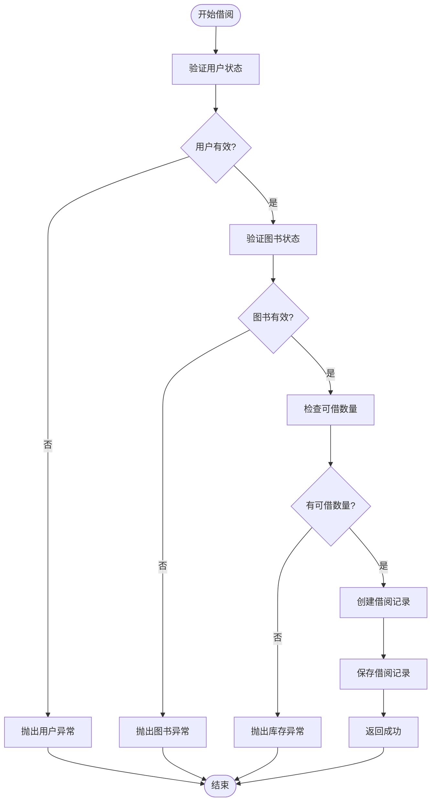

**图表来源**
- [BorrowDomainService.java:24-48](file://src/main/java/com/example/springbootmybatis/domain/service/BorrowDomainService.java#L24-L48)

**章节来源**
- [BorrowDomainService.java:1-50](file://src/main/java/com/example/springbootmybatis/domain/service/BorrowDomainService.java#L1-L50)

### 仓储接口层

仓储接口定义了领域对象的数据访问契约：

#### 仓储接口设计

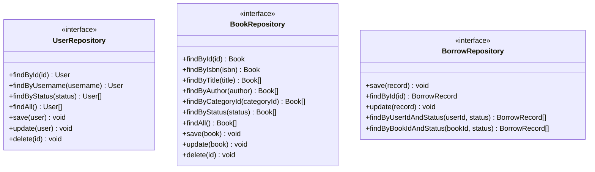

**图表来源**
- [UserRepository.java:1-46](file://src/main/java/com/example/springbootmybatis/domain/support/UserRepository.java#L1-L46)
- [BookRepository.java:1-31](file://src/main/java/com/example/springbootmybatis/domain/support/BookRepository.java#L1-L31)
- [BorrowRepository.java:1-36](file://src/main/java/com/example/springbootmybatis/domain/support/BorrowRepository.java#L1-L36)

**章节来源**
- [UserRepository.java:1-46](file://src/main/java/com/example/springbootmybatis/domain/support/UserRepository.java#L1-L46)
- [BookRepository.java:1-31](file://src/main/java/com/example/springbootmybatis/domain/support/BookRepository.java#L1-L31)
- [BorrowRepository.java:1-36](file://src/main/java/com/example/springbootmybatis/domain/support/BorrowRepository.java#L1-L36)

### 转换器层

转换器负责在应用层DTO和领域层实体之间进行数据转换：

#### 数据转换器设计

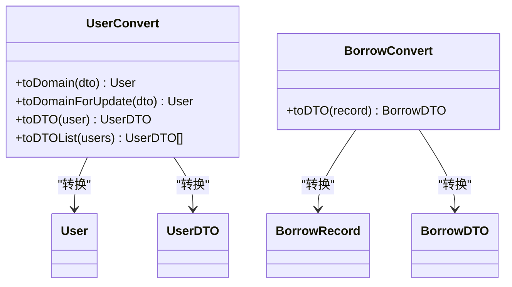

**图表来源**
- [UserConvert.java:1-88](file://src/main/java/com/example/springbootmybatis/application/convert/UserConvert.java#L1-L88)
- [BorrowConvert.java:1-28](file://src/main/java/com/example/springbootmybatis/application/convert/BorrowConvert.java#L1-L28)

**章节来源**
- [UserConvert.java:1-88](file://src/main/java/com/example/springbootmybatis/application/convert/UserConvert.java#L1-L88)
- [BorrowConvert.java:1-28](file://src/main/java/com/example/springbootmybatis/application/convert/BorrowConvert.java#L1-L28)

## 依赖关系分析

项目采用清晰的依赖注入和分层架构设计：

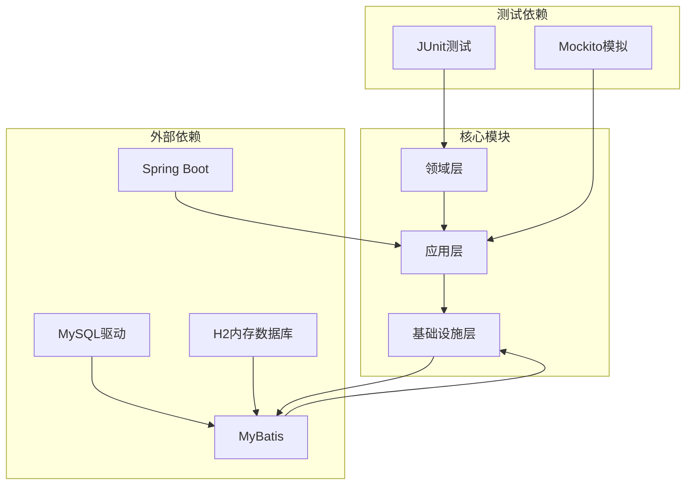

**图表来源**
- [pom.xml:35-71](file://pom.xml#L35-L71)

**章节来源**
- [pom.xml:1-101](file://pom.xml#L1-L101)

## 性能考虑

### 数据访问优化

1. **批量操作支持**：仓储接口提供了批量查询方法，支持大数据量场景下的高效查询
2. **延迟加载策略**：通过DTO模式避免不必要的关联数据加载
3. **缓存友好设计**：实体类设计简洁，便于实现缓存策略

### 事务管理

项目采用声明式事务管理，确保业务操作的原子性和一致性：

- 借阅操作使用`@Transactional`注解确保数据一致性
- 归还操作同样具备完整的事务控制
- 仓储操作自动参与事务边界

## 故障排除指南

### 常见问题及解决方案

#### 借阅失败问题

**问题现象**：借阅操作抛出异常
**可能原因**：
1. 用户状态异常（非激活状态）
2. 图书库存不足
3. 用户借阅数量已达上限

**解决步骤**：
1. 检查用户状态是否为激活状态
2. 验证图书可用数量是否大于0
3. 确认用户当前借阅数量未达到上限

#### 数据不一致问题

**问题现象**：借阅记录与实际状态不符
**解决方法**：
1. 检查事务配置是否正确
2. 验证仓储操作的执行顺序
3. 确保实体状态更新的原子性

**章节来源**
- [BorrowAppService.java:46-68](file://src/main/java/com/example/springbootmybatis/application/service/BorrowAppService.java#L46-L68)

## 结论

本项目成功实现了基于DDD的图书借阅管理系统，展现了清晰的分层架构和完整的领域建模。通过将业务逻辑封装在领域实体和服务中，项目具备了良好的可维护性和扩展性。

### 主要优势

1. **清晰的职责分离**：每层都有明确的职责边界
2. **强类型设计**：通过实体类和DTO类实现数据的强类型约束
3. **事务一致性**：通过应用服务协调确保业务操作的原子性
4. **可测试性**：接口化的仓储设计便于单元测试
5. **完整的业务行为**：每个实体都包含了完整的业务方法和状态管理

### 改进建议

1. **增加领域事件**：可以引入领域事件机制处理跨实体的状态同步
2. **实现CQRS模式**：对于复杂的查询场景，可以考虑命令查询职责分离
3. **添加审计日志**：为重要的业务操作添加审计跟踪功能
4. **增强异常处理**：可以引入更细粒度的异常类型和错误码机制

该项目为DDD实践提供了良好的参考范例，展示了如何在实际项目中应用领域驱动设计的核心原则。