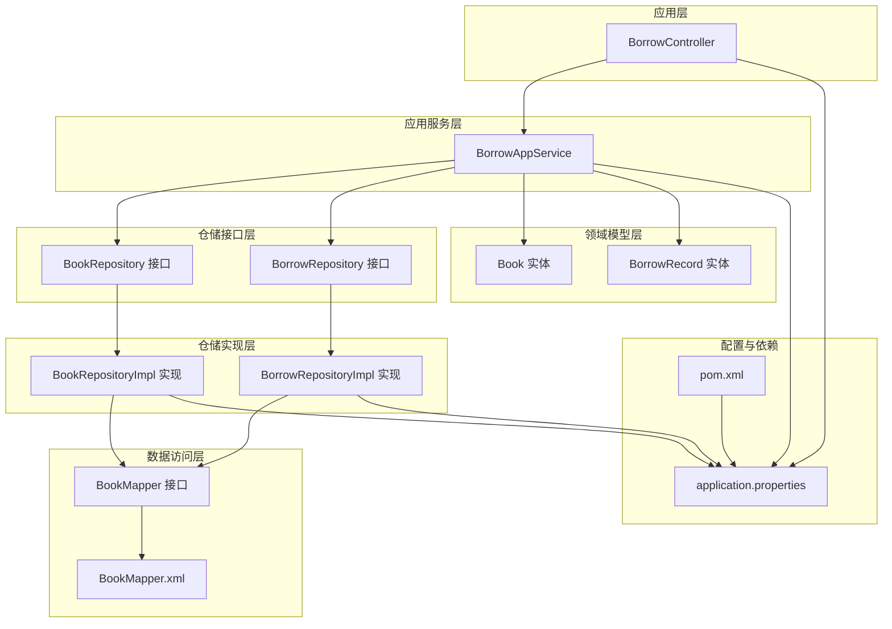
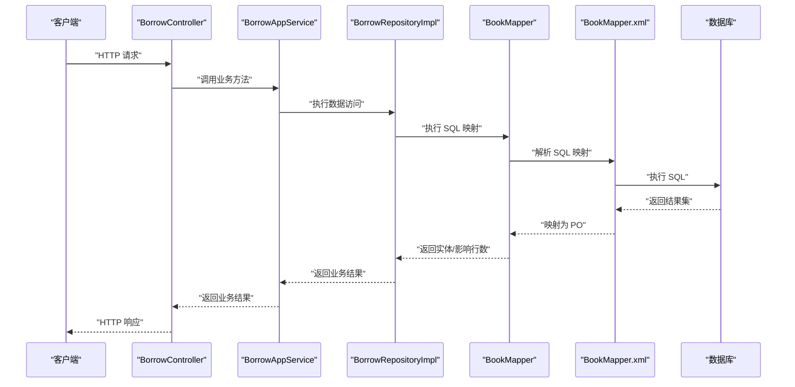
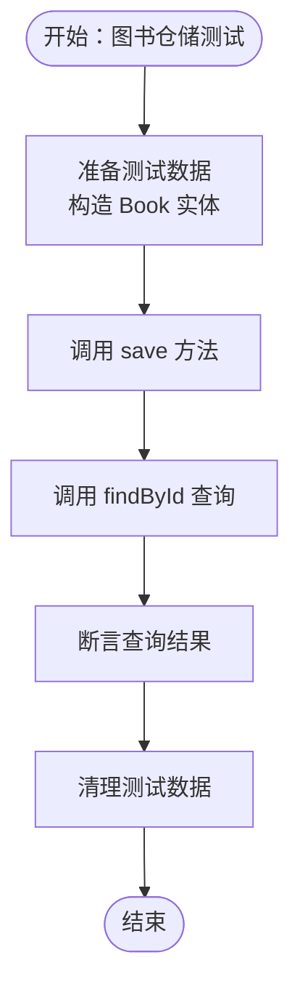
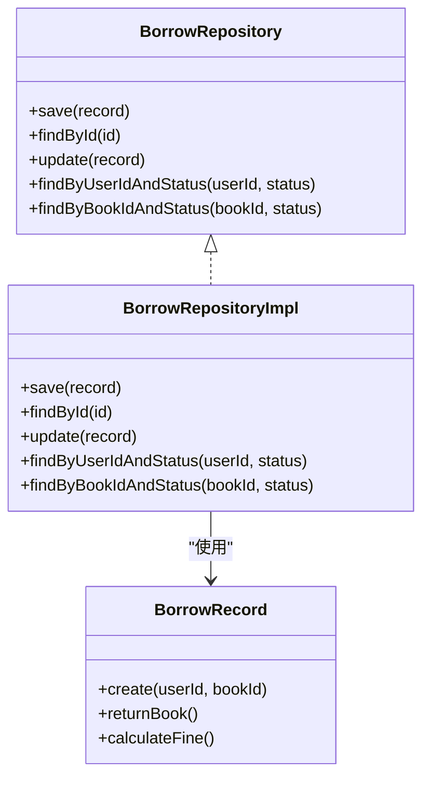
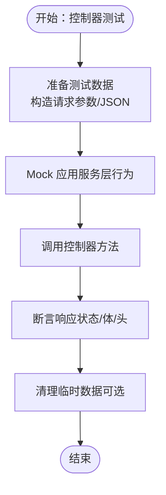
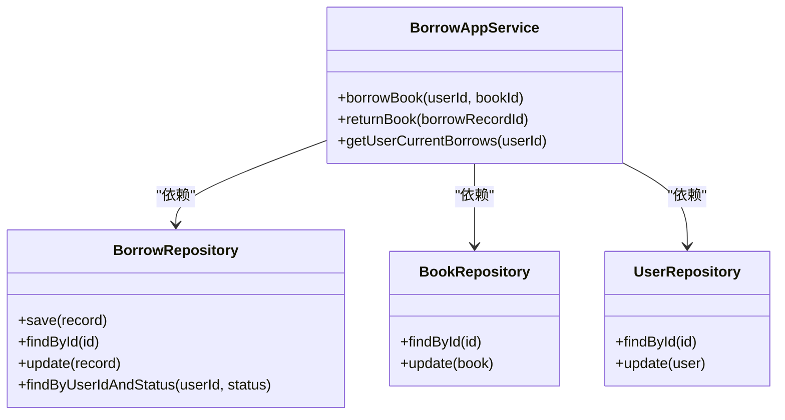
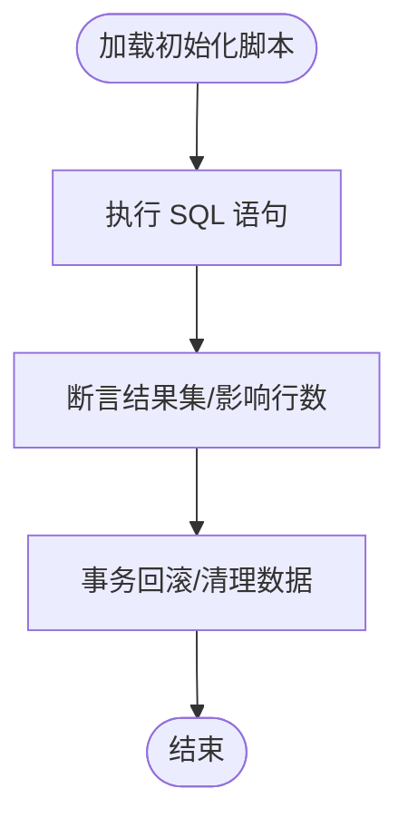
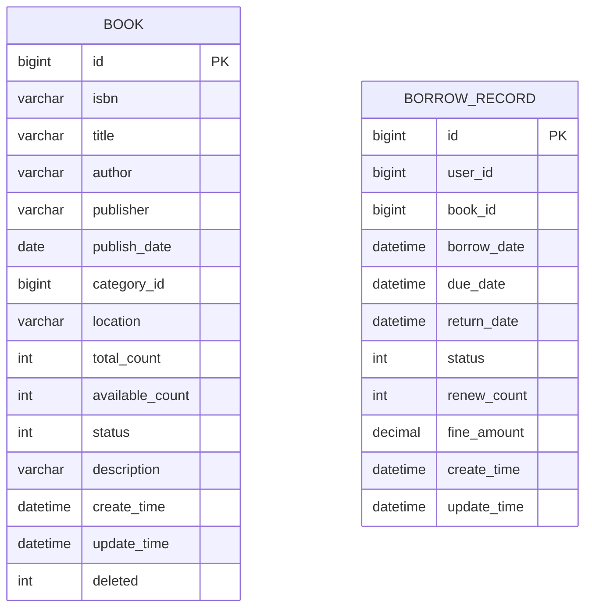
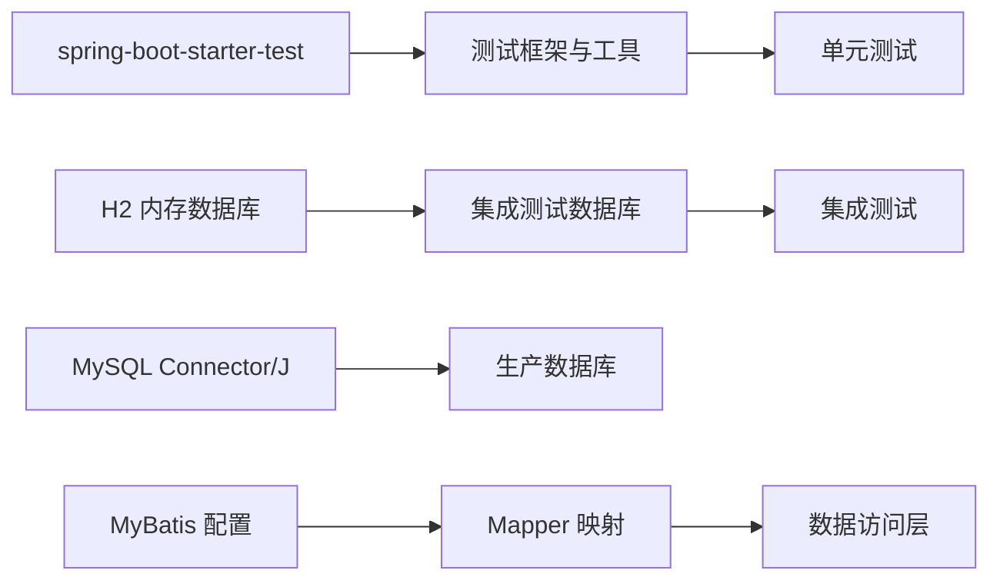

# 测试策略

<cite>
**本文引用的文件**
- [pom.xml](file://pom.xml)
- [application.properties](file://src/main/resources/application.properties)
- [BookRepositoryTest.java](file://src/test/java/com/example/springbootmybatis/repository/BookRepositoryTest.java)
- [BorrowRepositoryTest.java](file://src/test/java/com/example/springbootmybatis/repository/BorrowRepositoryTest.java)
- [BookRepository.java](file://src/main/java/com/example/springbootmybatis/domain/support/BookRepository.java)
- [BorrowRepository.java](file://src/main/java/com/example/springbootmybatis/domain/support/BorrowRepository.java)
- [BookRepositoryImpl.java](file://src/main/java/com/example/springbootmybatis/infrastructure/repository/impl/BookRepositoryImpl.java)
- [BorrowRepositoryImpl.java](file://src/main/java/com/example/springbootmybatis/infrastructure/repository/impl/BorrowRepositoryImpl.java)
- [BookMapper.java](file://src/main/java/com/example/springbootmybatis/infrastructure/repository/mapper/BookMapper.java)
- [BookMapper.xml](file://src/main/resources/mapper/BookMapper.xml)
- [Book.java](file://src/main/java/com/example/springbootmybatis/domain/model/entity/Book.java)
- [BorrowRecord.java](file://src/main/java/com/example/springbootmybatis/domain/model/entity/BorrowRecord.java)
- [BorrowController.java](file://src/main/java/com/example/springbootmybatis/adapter/controller/BorrowController.java)
- [BorrowAppService.java](file://src/main/java/com/example/springbootmybatis/application/service/BorrowAppService.java)
- [AnyViewTests.java](file://src/test/java/com/example/springbootmybatis/AnyViewTests.java)
</cite>

## 目录
1. [引言](#引言)
2. [项目结构](#项目结构)
3. [核心组件](#核心组件)
4. [架构总览](#架构总览)
5. [详细组件分析](#详细组件分析)
6. [依赖分析](#依赖分析)
7. [性能考虑](#性能考虑)
8. [故障排查指南](#故障排查指南)
9. [结论](#结论)
10. [附录](#附录)

## 引言
本测试策略文档面向基于 Spring Boot 与 MyBatis 的示例工程，目标是为该系统建立一套完整的测试体系：覆盖单元测试、集成测试、API 端到端测试与负载测试；明确 Mock 对象与测试隔离技术；规范测试数据准备与清理；给出覆盖率度量与提升建议；提供测试自动化与测试环境搭建及管理的最佳实践，并总结性能与压力测试要点。

**更新** 新增 Repository 层测试策略，完善了图书和借阅记录的仓储接口测试实现，包括查询、保存、更新和复合条件查询等场景。

## 项目结构
该项目采用典型的分层架构：控制器层（Controller）、应用服务层（Application Service）、领域模型（Domain Model）、仓储接口与实现（Repository）、数据访问层（Mapper）与实体模型（Entity）。MyBatis 通过 XML 映射文件定义 SQL 语句，Spring Boot 提供自动配置与运行时支持。测试方面已引入 Spring Boot Starter Test 与 H2 内存数据库依赖，具备进行单元与集成测试的基础能力。

**图表来源**
- [BorrowController.java:1-70](file://src/main/java/com/example/springbootmybatis/adapter/controller/BorrowController.java#L1-L70)
- [BorrowAppService.java:1-125](file://src/main/java/com/example/springbootmybatis/application/service/BorrowAppService.java#L1-L125)
- [Book.java:1-112](file://src/main/java/com/example/springbootmybatis/domain/model/entity/Book.java#L1-L112)
- [BorrowRecord.java:1-80](file://src/main/java/com/example/springbootmybatis/domain/model/entity/BorrowRecord.java#L1-L80)
- [BookRepository.java:1-31](file://src/main/java/com/example/springbootmybatis/domain/support/BookRepository.java#L1-L31)
- [BorrowRepository.java:1-36](file://src/main/java/com/example/springbootmybatis/domain/support/BorrowRepository.java#L1-L36)
- [BookRepositoryImpl.java:1-85](file://src/main/java/com/example/springbootmybatis/infrastructure/repository/impl/BookRepositoryImpl.java#L1-L85)
- [BorrowRepositoryImpl.java:1-60](file://src/main/java/com/example/springbootmybatis/infrastructure/repository/impl/BorrowRepositoryImpl.java#L1-L60)
- [BookMapper.java:1-35](file://src/main/java/com/example/springbootmybatis/infrastructure/repository/mapper/BookMapper.java#L1-L35)
- [BookMapper.xml:1-79](file://src/main/resources/mapper/BookMapper.xml#L1-L79)
- [application.properties:1-16](file://src/main/resources/application.properties#L1-L16)
- [pom.xml:1-101](file://pom.xml#L1-L101)

**章节来源**
- [pom.xml:1-101](file://pom.xml#L1-L101)
- [application.properties:1-16](file://src/main/resources/application.properties#L1-L16)

## 核心组件
- 控制器层：提供 REST 接口，负责请求路由与响应封装，包含借阅申请、归还图书、查询用户当前借阅列表等接口。
- 应用服务层：封装业务逻辑，协调多个仓储接口完成复杂的借阅业务，包括用户状态校验、图书可借数量检查、借阅记录创建等。
- 领域模型层：Book 和 BorrowRecord 实体包含完整的业务状态和领域行为方法，如图书的借阅/归还操作、借阅记录的状态转换。
- 仓储接口层：定义数据访问契约，BookRepository 和 BorrowRepository 提供标准的数据操作接口。
- 仓储实现层：BookRepositoryImpl 和 BorrowRepositoryImpl 实现具体的数据库操作，负责领域模型与持久化对象之间的转换。
- 数据访问层：BookMapper 接口与 BookMapper.xml 定义 SQL 语句，完成图书数据的查询与写入。
- 配置与依赖：MySQL 连接配置与 MyBatis 映射配置；测试依赖包含 H2 内存数据库与 Spring Boot 测试启动器。

**章节来源**
- [BorrowController.java:1-70](file://src/main/java/com/example/springbootmybatis/adapter/controller/BorrowController.java#L1-L70)
- [BorrowAppService.java:1-125](file://src/main/java/com/example/springbootmybatis/application/service/BorrowAppService.java#L1-L125)
- [Book.java:1-112](file://src/main/java/com/example/springbootmybatis/domain/model/entity/Book.java#L1-L112)
- [BorrowRecord.java:1-80](file://src/main/java/com/example/springbootmybatis/domain/model/entity/BorrowRecord.java#L1-L80)
- [BookRepository.java:1-31](file://src/main/java/com/example/springbootmybatis/domain/support/BookRepository.java#L1-L31)
- [BorrowRepository.java:1-36](file://src/main/java/com/example/springbootmybatis/domain/support/BorrowRepository.java#L1-L36)
- [BookRepositoryImpl.java:1-85](file://src/main/java/com/example/springbootmybatis/infrastructure/repository/impl/BookRepositoryImpl.java#L1-L85)
- [BorrowRepositoryImpl.java:1-60](file://src/main/java/com/example/springbootmybatis/infrastructure/repository/impl/BorrowRepositoryImpl.java#L1-L60)
- [BookMapper.java:1-35](file://src/main/java/com/example/springbootmybatis/infrastructure/repository/mapper/BookMapper.java#L1-L35)
- [BookMapper.xml:1-79](file://src/main/resources/mapper/BookMapper.xml#L1-L79)
- [application.properties:1-16](file://src/main/resources/application.properties#L1-L16)
- [pom.xml:1-101](file://pom.xml#L1-L101)

## 架构总览
下图展示从控制器到应用服务再到仓储层的调用链路，以及 MyBatis XML 映射与数据库交互关系。

**图表来源**
- [BorrowController.java:1-70](file://src/main/java/com/example/springbootmybatis/adapter/controller/BorrowController.java#L1-L70)
- [BorrowAppService.java:1-125](file://src/main/java/com/example/springbootmybatis/application/service/BorrowAppService.java#L1-L125)
- [BorrowRepositoryImpl.java:1-60](file://src/main/java/com/example/springbootmybatis/infrastructure/repository/impl/BorrowRepositoryImpl.java#L1-L60)
- [BookMapper.java:1-35](file://src/main/java/com/example/springbootmybatis/infrastructure/repository/mapper/BookMapper.java#L1-L35)
- [BookMapper.xml:1-79](file://src/main/resources/mapper/BookMapper.xml#L1-L79)

## 详细组件分析

### 仓储层测试策略

#### 图书仓储测试
- 单元测试：使用 @SpringBootTest 启动完整应用上下文，通过 @Autowired 注入 BookRepository 接口实现，直接测试仓储接口的所有方法。
- 集成测试：测试查询、保存、更新、删除等完整数据生命周期，验证领域模型与持久化对象的转换正确性。
- 数据验证：断言查询结果的完整性，包括 ID、标题、作者、出版社、ISBN 等关键字段的准确性。

**图表来源**
- [BookRepositoryTest.java:1-41](file://src/test/java/com/example/springbootmybatis/repository/BookRepositoryTest.java#L1-L41)
- [BookRepository.java:1-31](file://src/main/java/com/example/springbootmybatis/domain/support/BookRepository.java#L1-L31)
- [BookRepositoryImpl.java:1-85](file://src/main/java/com/example/springbootmybatis/infrastructure/repository/impl/BookRepositoryImpl.java#L1-L85)

**章节来源**
- [BookRepositoryTest.java:1-41](file://src/test/java/com/example/springbootmybatis/repository/BookRepositoryTest.java#L1-L41)
- [BookRepository.java:1-31](file://src/main/java/com/example/springbootmybatis/domain/support/BookRepository.java#L1-L31)
- [BookRepositoryImpl.java:1-85](file://src/main/java/com/example/springbootmybatis/infrastructure/repository/impl/BookRepositoryImpl.java#L1-L85)

#### 借阅记录仓储测试
- 单元测试：使用 @SpringBootTest 和 @Transactional 注解，确保测试数据的事务性管理和自动回滚。
- 功能测试：测试保存、查询、更新、复合条件查询等核心功能，包括借阅状态的正确转换。
- 状态验证：验证借阅记录的状态流转，从借阅中到已归还的完整生命周期。

**图表来源**
- [BorrowRepository.java:1-36](file://src/main/java/com/example/springbootmybatis/domain/support/BorrowRepository.java#L1-L36)
- [BorrowRepositoryImpl.java:1-60](file://src/main/java/com/example/springbootmybatis/infrastructure/repository/impl/BorrowRepositoryImpl.java#L1-L60)
- [BorrowRecord.java:1-80](file://src/main/java/com/example/springbootmybatis/domain/model/entity/BorrowRecord.java#L1-L80)

**章节来源**
- [BorrowRepositoryTest.java:1-70](file://src/test/java/com/example/springbootmybatis/repository/BorrowRepositoryTest.java#L1-L70)
- [BorrowRepository.java:1-36](file://src/main/java/com/example/springbootmybatis/domain/support/BorrowRepository.java#L1-L36)
- [BorrowRepositoryImpl.java:1-60](file://src/main/java/com/example/springbootmybatis/infrastructure/repository/impl/BorrowRepositoryImpl.java#L1-L60)

### 控制器层测试策略
- 单元测试：对控制器进行行为验证，使用 @WebMvcTest 或 MockMvc 模式，模拟应用服务层返回值，断言响应状态码、内容类型与主体。
- 集成测试：使用 @SpringBootTest 启动完整上下文，结合 @AutoConfigureTestDatabase 与 @ImportRandomPort，验证真实网络栈与数据库交互。
- API 测试：针对借阅申请、归还图书、查询用户当前借阅列表等端点编写场景化测试，覆盖正常与异常分支。

**图表来源**
- [BorrowController.java:1-70](file://src/main/java/com/example/springbootmybatis/adapter/controller/BorrowController.java#L1-L70)

**章节来源**
- [BorrowController.java:1-70](file://src/main/java/com/example/springbootmybatis/adapter/controller/BorrowController.java#L1-L70)

### 应用服务层测试策略
- 单元测试：使用 @ExtendWith(MockitoExtension.class) 创建 BorrowAppService 的 Mockito 测试桩，注入 Mock 仓储接口，断言方法调用次数与返回值。
- 集成测试：在 @SpringBootTest 中以 @MockBean 注入仓储接口，或切换到内存数据库（H2）进行真实 SQL 验证。
- 业务逻辑：验证借阅流程的完整业务逻辑，包括用户状态校验、图书可借数量检查、借阅记录创建等复杂场景。

**图表来源**
- [BorrowAppService.java:1-125](file://src/main/java/com/example/springbootmybatis/application/service/BorrowAppService.java#L1-L125)
- [BorrowRepository.java:1-36](file://src/main/java/com/example/springbootmybatis/domain/support/BorrowRepository.java#L1-L36)
- [BookRepository.java:1-31](file://src/main/java/com/example/springbootmybatis/domain/support/BookRepository.java#L1-L31)

**章节来源**
- [BorrowAppService.java:1-125](file://src/main/java/com/example/springbootmybatis/application/service/BorrowAppService.java#L1-L125)
- [BorrowRepository.java:1-36](file://src/main/java/com/example/springbootmybatis/domain/support/BorrowRepository.java#L1-L36)
- [BookRepository.java:1-31](file://src/main/java/com/example/springbootmybatis/domain/support/BookRepository.java#L1-L31)

### 数据访问层测试策略
- 单元测试：使用 @MockBean 注入 BookMapper，验证仓储实现层调用参数与返回值。
- 集成测试：启用 H2 内存数据库，通过 @Sql 加载初始化脚本，验证 SQL 正确性与 MyBatis 映射。
- 性能与一致性：对高频查询与写入操作进行基准测试，关注索引与事务隔离级别。

**图表来源**
- [BookMapper.xml:1-79](file://src/main/resources/mapper/BookMapper.xml#L1-L79)
- [pom.xml:60-70](file://pom.xml#L60-L70)

**章节来源**
- [BookMapper.xml:1-79](file://src/main/resources/mapper/BookMapper.xml#L1-L79)
- [pom.xml:60-70](file://pom.xml#L60-L70)

### 领域模型与映射
- Book 实体包含完整的图书信息与业务状态，支持借阅和归还的领域行为方法。
- BorrowRecord 实体包含借阅记录的完整生命周期，支持状态转换和超时费用计算。
- MyBatis XML 映射文件定义了查询、插入、更新、软删除的 SQL 语句与结果映射，确保字段一一对应。

**图表来源**
- [BookMapper.xml:5-21](file://src/main/resources/mapper/BookMapper.xml#L5-L21)
- [BorrowRecord.java:1-80](file://src/main/java/com/example/springbootmybatis/domain/model/entity/BorrowRecord.java#L1-L80)

**章节来源**
- [Book.java:1-112](file://src/main/java/com/example/springbootmybatis/domain/model/entity/Book.java#L1-L112)
- [BorrowRecord.java:1-80](file://src/main/java/com/example/springbootmybatis/domain/model/entity/BorrowRecord.java#L1-L80)
- [BookMapper.xml:1-79](file://src/main/resources/mapper/BookMapper.xml#L1-L79)

### 测试辅助端点
- AnyViewTests 提供简单的上下文加载测试，确保 Spring Boot 应用能够正常启动和加载配置。

**章节来源**
- [AnyViewTests.java:1-14](file://src/test/java/com/example/springbootmybatis/AnyViewTests.java#L1-L14)

## 依赖分析
- 测试依赖：spring-boot-starter-test 提供 JUnit、Mockito、AssertJ、JsonPath 等常用测试工具；H2 内存数据库用于集成测试与离线验证。
- 数据库驱动：MySQL Connector/J 与 H2 并存，可通过配置切换测试与生产环境的数据源。
- MyBatis 配置：mapper-locations、type-aliases-package、map-underscore-to-camel-case 等配置确保实体与 SQL 映射正确。

**图表来源**
- [pom.xml:55-70](file://pom.xml#L55-L70)
- [application.properties:3-16](file://src/main/resources/application.properties#L3-L16)

**章节来源**
- [pom.xml:1-101](file://pom.xml#L1-L101)
- [application.properties:1-16](file://src/main/resources/application.properties#L1-L16)

## 性能考虑
- 单元测试：避免真实 IO，优先使用 Mock 与内存对象，保证测试执行速度与稳定性。
- 集成测试：使用 H2 内存数据库与最小化数据集，减少磁盘 IO；合理设置事务与回滚策略。
- API 测试：对高频接口进行基准测试，记录响应时间与吞吐量；识别慢查询与热点接口。
- 负载测试：使用独立压测工具（如 JMeter、Gatling 或 k6），模拟多用户并发访问，观察数据库连接池、线程池与 GC 行为。
- 数据库优化：为常用查询字段建立索引；控制批量写入大小；使用只读事务优化查询路径。

## 故障排查指南
- 控制器异常：利用全局异常处理器捕获运行时异常，确保对外统一响应格式；在测试中验证异常传播与状态码。
- 数据访问异常：检查 SQL 语法、参数绑定与结果映射；确认实体字段与数据库列名一致。
- 配置问题：核对 application.properties 中的数据库 URL、用户名、密码与 MyBatis 配置项；在测试 profile 下使用 H2。
- 日志与追踪：开启调试日志，定位请求到响应的关键路径；结合测试报告与覆盖率工具定位薄弱环节。

**章节来源**
- [BorrowController.java:34-43](file://src/main/java/com/example/springbootmybatis/adapter/controller/BorrowController.java#L34-L43)
- [application.properties:1-16](file://src/main/resources/application.properties#L1-L16)

## 结论
本项目具备良好的测试基础：清晰的分层结构、完善的 MyBatis 映射与 Spring Boot 自动配置。新增的 Repository 层测试实现了对仓储接口的完整覆盖，包括图书和借阅记录的核心业务场景。建议在现有基础上补充：单元测试的 Mock 策略、集成测试的数据库初始化与清理、API 端到端与负载测试方案、覆盖率度量与持续集成流水线，从而形成从单元到端到端的完整测试闭环。

## 附录

### 单元测试设计原则与实现方法
- 隔离性：仅测试单个类或方法的行为，使用 @Mock、@Spy 或 @InjectMocks。
- 可预测性：固定输入与期望输出，避免随机性；必要时使用 @Rule 或 @BeforeEach 准备数据。
- 可维护性：测试命名清晰表达意图；断言聚焦于关键行为；避免过度断言内部实现细节。
- 覆盖率：关注分支、循环与异常路径；对关键业务逻辑达到高覆盖率。

### 集成测试配置与执行策略
- 使用 @SpringBootTest 启动完整应用上下文；通过 @AutoConfigureTestDatabase 指定 H2 作为测试数据库。
- 利用 @Sql 在测试前导入初始化脚本，在测试后清理数据。
- 使用 @ImportRandomPort 为测试服务分配随机端口，避免端口冲突。

### API 测试完整方案
- 端到端测试：使用 RestAssured、WebTestClient 或 Spring Boot Test 的 TestRestTemplate，验证请求、响应与数据库状态。
- 负载测试：使用 JMeter/Gatling/k6 编写脚本，模拟并发用户访问，监控响应时间、错误率与资源占用。
- 场景化测试：覆盖正常流程、边界条件、异常流程与安全校验。

### Mock 对象与测试隔离技术
- 使用 Mockito 创建 Mock Bean，替换真实依赖；使用 @MockBean 注入到 Spring 上下文中。
- 使用 @TestConfiguration 定义测试专用配置，隔离生产配置。
- 使用 @DirtiesContext 或 @Transactional 清理上下文状态，确保测试间互不干扰。

### 测试数据准备与清理策略
- 初始化：在测试前通过 @Sql 导入 SQL 脚本，或在 @BeforeEach 中插入最小化数据集。
- 清理：在 @AfterEach 或 @DirtiesContext 中回滚事务或删除测试数据。
- 复用：将公共数据与断言封装为测试基类或工具类，提高可维护性。

### 测试覆盖率度量与改进方法
- 工具：使用 Jacoco 或 Coveralls 统计行覆盖率、分支覆盖率与指令覆盖率。
- 改进：针对低覆盖率模块补充边界与异常测试；重构难以测试的代码，提升内聚与解耦。

### 测试自动化实施指南
- CI/CD：在构建流水线中集成单元测试、集成测试与覆盖率检查；失败即阻断发布。
- 报告：生成测试报告与覆盖率报告，推送至团队看板。
- 规范：制定测试命名规范、断言规范与提交前自检清单。

### 测试环境搭建与管理
- 开发环境：本地使用 H2 或 Docker 搭建 MySQL，配合 application-dev.yml。
- 测试环境：使用独立数据库实例，按需拉起测试数据。
- 生产环境：通过配置文件或环境变量切换数据源；严格限制测试代码进入生产。

### 性能测试与压力测试最佳实践
- 基准测试：对核心接口进行冷热启动与稳定期测试，记录 P50/P95/P99 延迟。
- 压力测试：逐步增加并发与请求速率，观察系统拐点与恢复时间。
- 数据库：监控连接池使用率、锁等待与慢查询日志；优化索引与 SQL。
- 前端与网关：评估限流、熔断与降级策略对整体性能的影响。