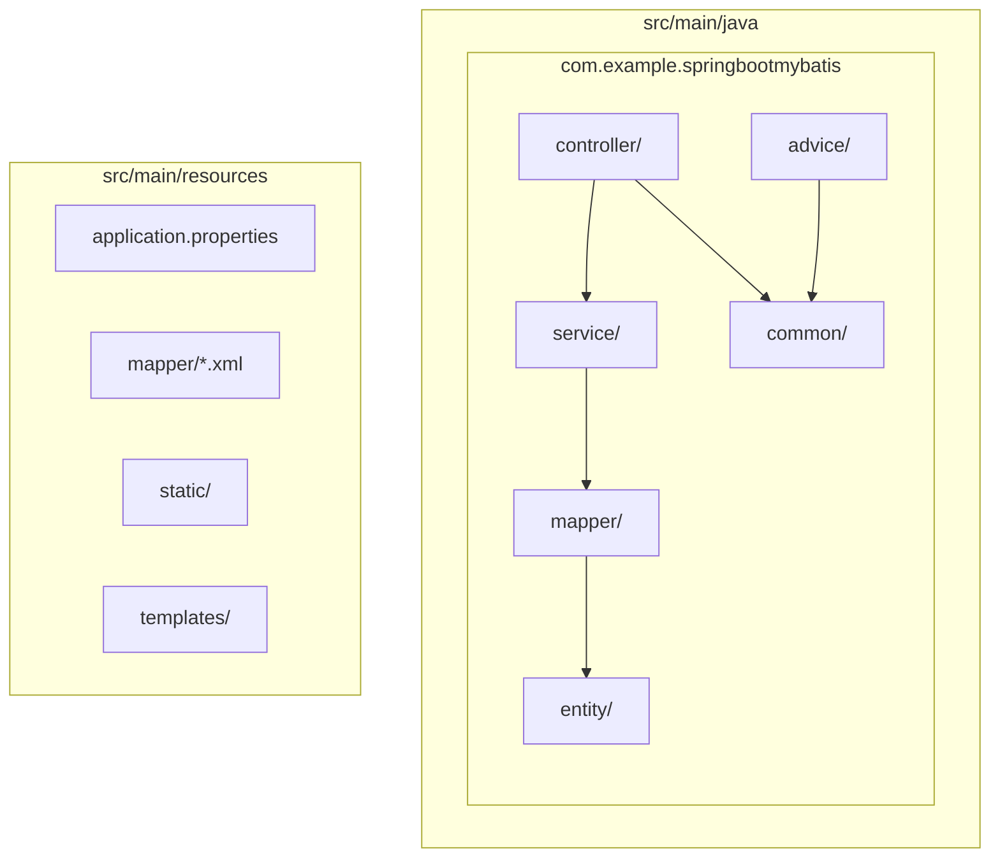
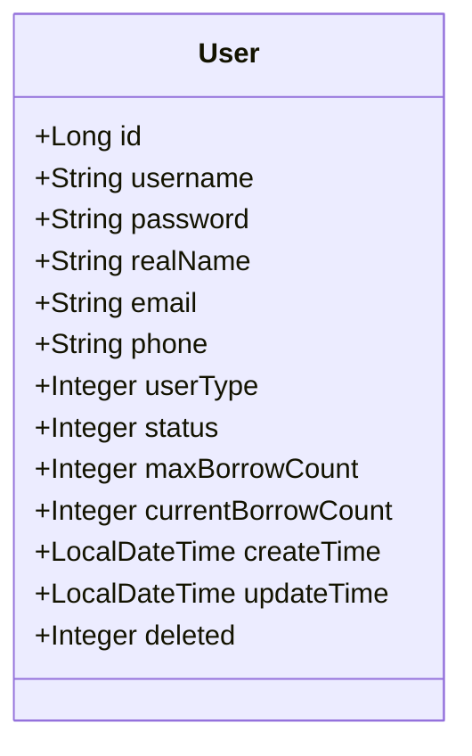
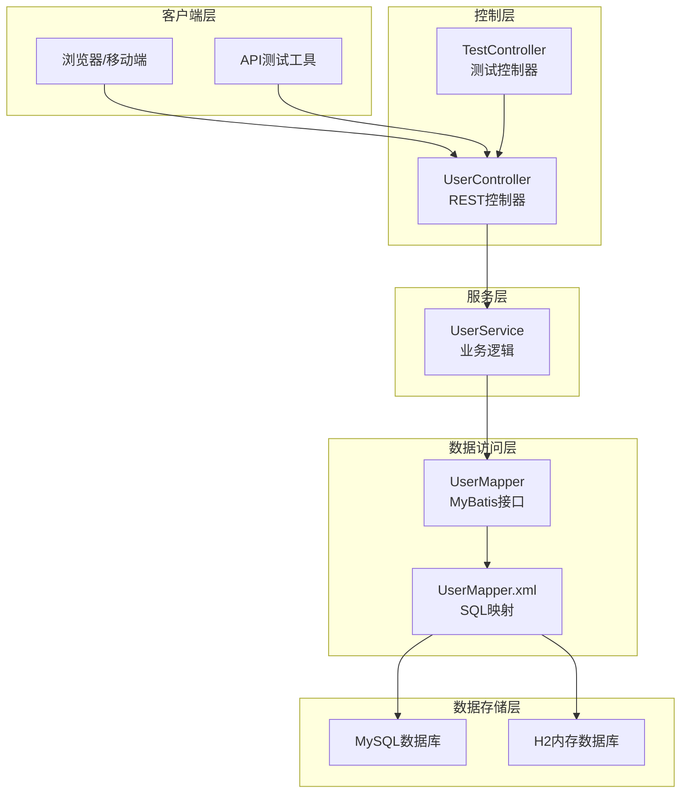
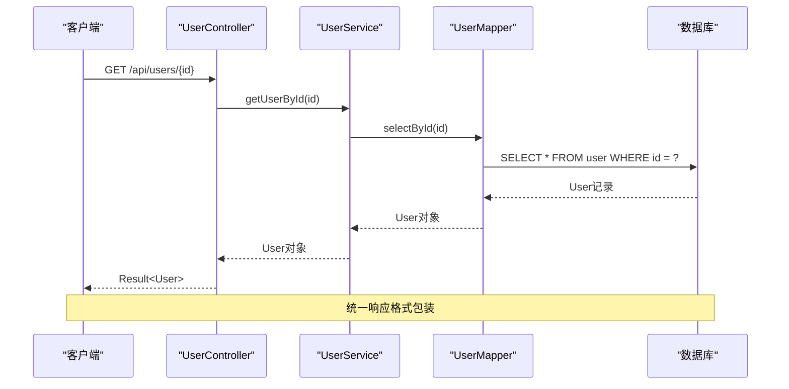
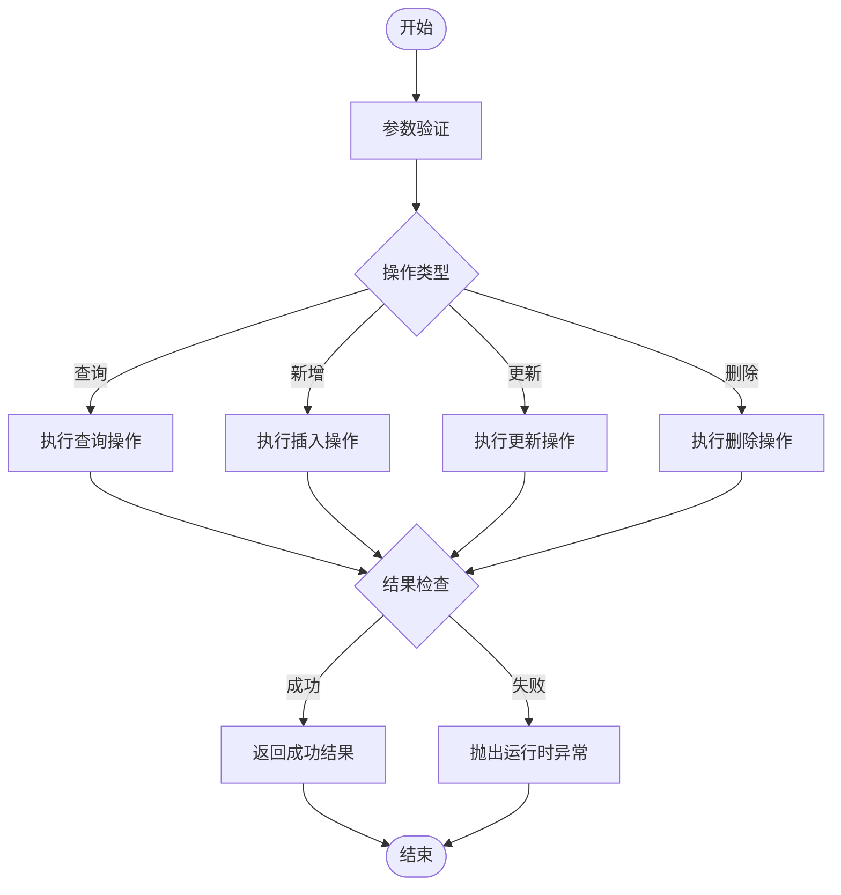
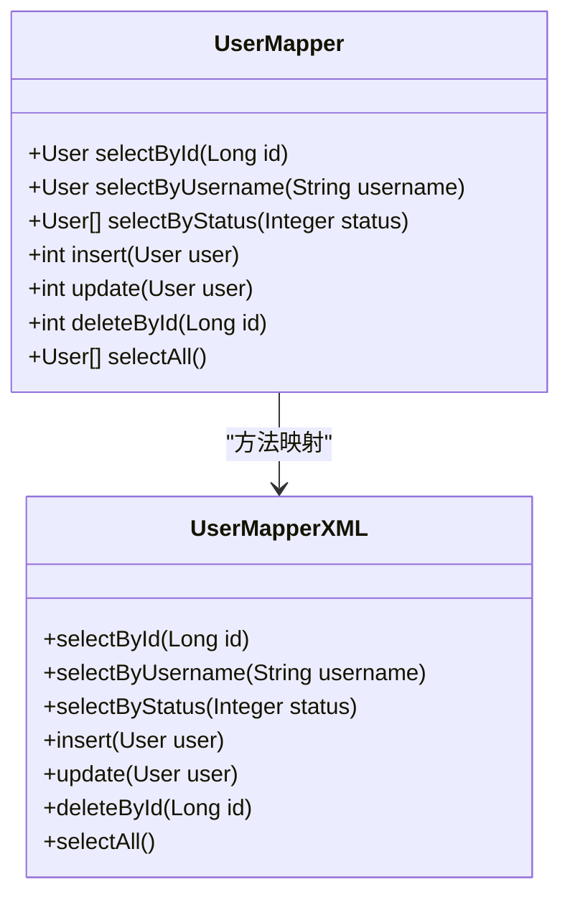
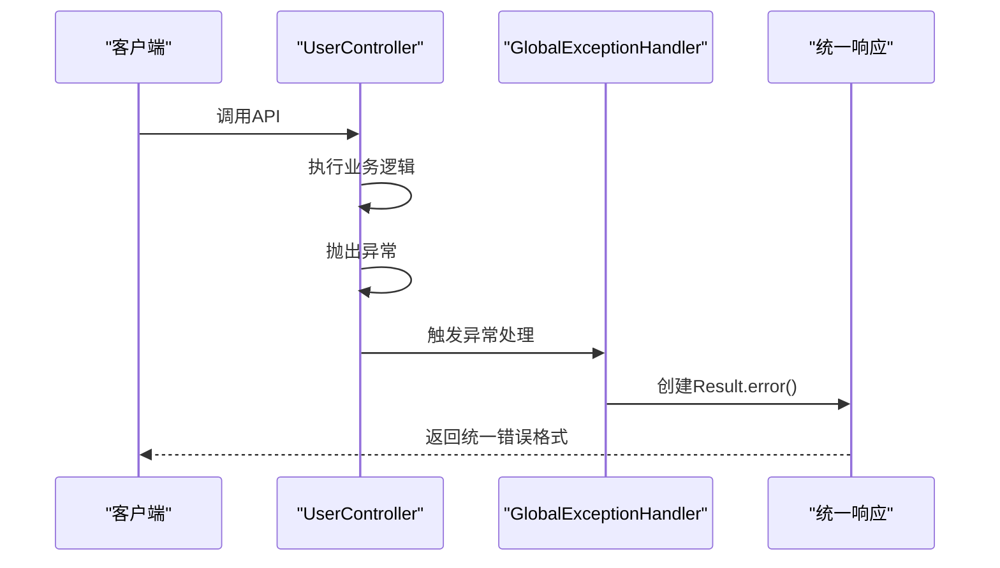
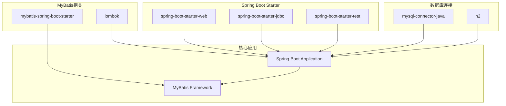

# 项目概述

<cite>
**本文档引用的文件**
- [pom.xml](file://pom.xml)
- [application.properties](file://src/main/resources/application.properties)
- [User.java](file://src/main/java/com/example/springbootmybatis/entity/User.java)
- [UserController.java](file://src/main/java/com/example/springbootmybatis/controller/UserController.java)
- [UserService.java](file://src/main/java/com/example/springbootmybatis/service/UserService.java)
- [UserMapper.java](file://src/main/java/com/example/springbootmybatis/mapper/UserMapper.java)
- [UserMapper.xml](file://src/main/resources/mapper/UserMapper.xml)
- [Result.java](file://src/main/java/com/example/springbootmybatis/common/Result.java)
- [GlobalExceptionHandler.java](file://src/main/java/com/example/springbootmybatis/advice/GlobalExceptionHandler.java)
- [GlobalResponseHandler.java](file://src/main/java/com/example/springbootmybatis/advice/GlobalResponseHandler.java)
- [TestController.java](file://src/main/java/com/example/springbootmybatis/controller/TestController.java)
- [HELP.md](file://HELP.md)
</cite>

## 目录
1. [简介](#简介)
2. [项目结构](#项目结构)
3. [核心组件](#核心组件)
4. [架构总览](#架构总览)
5. [详细组件分析](#详细组件分析)
6. [依赖关系分析](#依赖关系分析)
7. [性能考虑](#性能考虑)
8. [故障排除指南](#故障排除指南)
9. [结论](#结论)

## 简介

本项目是一个基于Spring Boot 2.7.18和MyBatis的用户管理系统，采用现代化的Java企业级开发技术栈。项目实现了完整的用户管理CRUD操作，提供了RESTful API接口设计和统一响应格式，展现了Spring Boot自动配置与MyBatis集成的最佳实践。

### 项目核心目标

- **快速开发**：利用Spring Boot的自动配置特性，减少XML配置和样板代码
- **数据持久化**：通过MyBatis实现灵活的SQL映射和数据库操作
- **API标准化**：提供统一的RESTful API设计和响应格式
- **异常处理**：建立全局异常处理机制，提升系统的健壮性
- **可扩展性**：采用MVC分层架构，便于功能扩展和维护

### 主要功能特性

- **完整的用户CRUD操作**：支持用户查询、新增、修改、删除
- **多维度查询**：支持按ID、用户名、状态等多种条件查询
- **统一响应格式**：所有API响应都遵循统一的Result结构
- **全局异常处理**：自动捕获和处理系统异常
- **RESTful API设计**：符合HTTP标准的资源导向接口设计

## 项目结构

项目采用标准的Maven多模块结构，遵循Spring Boot约定优于配置的原则：

**图表来源**
- [pom.xml](file://pom.xml#L1-L88)
- [application.properties](file://src/main/resources/application.properties#L1-L16)

### 核心包结构说明

- **controller层**：处理HTTP请求，定义RESTful API端点
- **service层**：业务逻辑处理，协调数据访问操作
- **mapper层**：数据访问接口，定义SQL映射方法
- **entity层**：实体模型，对应数据库表结构
- **common层**：通用工具类，如统一响应格式
- **advice层**：全局异常处理和响应包装
- **resources**：配置文件和MyBatis映射文件

**章节来源**
- [pom.xml](file://pom.xml#L1-L88)
- [application.properties](file://src/main/resources/application.properties#L1-L16)

## 核心组件

### 数据模型设计

项目采用简洁而实用的User实体模型，包含用户的基本信息和状态管理字段：

**图表来源**
- [User.java](file://src/main/java/com/example/springbootmybatis/entity/User.java#L1-L21)

### 统一响应格式

项目实现了统一的Result响应格式，确保所有API调用返回一致的数据结构：

| 字段名 | 类型 | 描述 | 示例值 |
|--------|------|------|--------|
| success | boolean | 操作是否成功 | true/false |
| message | String | 操作结果描述 | "操作成功" |
| data | T | 返回的具体数据 | 用户对象或列表 |
| timestamp | long | 时间戳 | 1640995200000 |

**章节来源**
- [Result.java](file://src/main/java/com/example/springbootmybatis/common/Result.java#L1-L87)

## 架构总览

项目采用经典的MVC三层架构模式，结合Spring Boot的依赖注入和MyBatis的ORM特性：

**图表来源**
- [UserController.java](file://src/main/java/com/example/springbootmybatis/controller/UserController.java#L1-L68)
- [UserService.java](file://src/main/java/com/example/springbootmybatis/service/UserService.java#L1-L42)
- [UserMapper.java](file://src/main/java/com/example/springbootmybatis/mapper/UserMapper.java#L1-L23)
- [UserMapper.xml](file://src/main/resources/mapper/UserMapper.xml#L1-L57)

### 技术架构选择

#### Spring Boot自动配置优势

- **零XML配置**：通过注解驱动的方式简化配置
- **开箱即用**：内置Tomcat、H2等组件，无需额外配置
- **生产就绪**：提供健康检查、监控等生产环境特性
- **依赖管理**：通过starter简化依赖引入

#### MyBatis集成优势

- **灵活SQL**：支持复杂的SQL查询和优化
- **类型安全**：通过XML映射文件提供编译时检查
- **学习成本低**：相比JPA更接近传统JDBC编程
- **性能可控**：可以精确控制SQL执行计划

**章节来源**
- [pom.xml](file://pom.xml#L32-L67)
- [application.properties](file://src/main/resources/application.properties#L1-L16)

## 详细组件分析

### 控制器层分析

#### UserController设计

控制器层负责HTTP请求的接收和响应的返回，实现了完整的用户管理API：

**图表来源**
- [UserController.java](file://src/main/java/com/example/springbootmybatis/controller/UserController.java#L17-L20)
- [UserService.java](file://src/main/java/com/example/springbootmybatis/service/UserService.java#L15-L17)
- [UserMapper.java](file://src/main/java/com/example/springbootmybatis/mapper/UserMapper.java#L10-L10)

#### RESTful API设计原则

| HTTP方法 | URL路径 | 功能描述 | 返回类型 |
|----------|---------|----------|----------|
| GET | `/api/users/{id}` | 根据ID查询用户 | User |
| GET | `/api/users/username/{username}` | 根据用户名查询用户 | User |
| GET | `/api/users/status/{status}` | 根据状态查询用户列表 | List<User> |
| GET | `/api/users/all` | 查询所有用户 | List<User> |
| POST | `/api/users` | 新增用户 | User |
| PUT | `/api/users` | 更新用户 | User |
| DELETE | `/api/users/{id}` | 删除用户 | Boolean |

**章节来源**
- [UserController.java](file://src/main/java/com/example/springbootmybatis/controller/UserController.java#L1-L68)

### 服务层分析

#### UserService业务逻辑

服务层作为业务逻辑的核心，负责协调数据访问操作：

**图表来源**
- [UserService.java](file://src/main/java/com/example/springbootmybatis/service/UserService.java#L31-L41)

**章节来源**
- [UserService.java](file://src/main/java/com/example/springbootmybatis/service/UserService.java#L1-L42)

### 数据访问层分析

#### UserMapper接口设计

数据访问层采用MyBatis的接口映射方式，提供了清晰的方法签名：

**图表来源**
- [UserMapper.java](file://src/main/java/com/example/springbootmybatis/mapper/UserMapper.java#L1-L23)
- [UserMapper.xml](file://src/main/resources/mapper/UserMapper.xml#L21-L55)

#### SQL映射优化

MyBatis XML映射文件提供了详细的SQL实现：

- **驼峰命名转换**：通过`map-underscore-to-camel-case=true`实现数据库字段到Java属性的自动映射
- **主键生成**：使用`useGeneratedKeys`和`keyProperty`实现自增主键的自动赋值
- **时间字段处理**：通过`NOW()`函数自动更新时间戳

**章节来源**
- [UserMapper.xml](file://src/main/resources/mapper/UserMapper.xml#L1-L57)

### 异常处理机制

#### 全局异常处理

项目实现了完善的异常处理机制，确保系统在出现错误时能够优雅地处理：

**图表来源**
- [GlobalExceptionHandler.java](file://src/main/java/com/example/springbootmybatis/advice/GlobalExceptionHandler.java#L13-L21)
- [GlobalResponseHandler.java](file://src/main/java/com/example/springbootmybatis/advice/GlobalResponseHandler.java#L24-L38)

**章节来源**
- [GlobalExceptionHandler.java](file://src/main/java/com/example/springbootmybatis/advice/GlobalExceptionHandler.java#L1-L22)
- [GlobalResponseHandler.java](file://src/main/java/com/example/springbootmybatis/advice/GlobalResponseHandler.java#L1-L39)

## 依赖关系分析

项目的技术栈选择体现了现代Java企业应用开发的最佳实践：

**图表来源**
- [pom.xml](file://pom.xml#L32-L67)

### 关键依赖说明

- **Spring Boot Web Starter**：提供Web开发所需的所有依赖
- **MyBatis Spring Boot Starter**：简化MyBatis与Spring Boot的集成
- **MySQL Connector**：数据库驱动程序
- **H2 Database**：内存数据库，用于测试和开发环境
- **Lombok**：简化Java代码，减少样板代码

**章节来源**
- [pom.xml](file://pom.xml#L1-L88)

## 性能考虑

### 数据库性能优化

- **索引策略**：建议在常用查询字段（如username、status）上建立索引
- **查询优化**：使用MyBatis的延迟加载和批量操作减少数据库压力
- **连接池配置**：合理配置数据库连接池大小以平衡性能和资源消耗

### 缓存策略

- **应用层缓存**：对于频繁读取但不经常变化的数据，可以考虑添加缓存层
- **数据库缓存**：利用MySQL的查询缓存机制提升查询性能

### 并发处理

- **线程安全**：确保Service层的业务逻辑是线程安全的
- **事务管理**：合理使用Spring的事务管理机制保证数据一致性

## 故障排除指南

### 常见问题及解决方案

#### 数据库连接问题

**症状**：应用启动时报数据库连接错误
**解决方案**：
1. 检查数据库服务是否正常运行
2. 验证数据库连接URL、用户名和密码配置
3. 确认防火墙设置允许数据库连接

#### MyBatis映射问题

**症状**：查询或更新操作报SQL映射错误
**解决方案**：
1. 检查Mapper接口方法签名与XML映射是否匹配
2. 验证实体类属性与数据库字段的映射关系
3. 确认驼峰命名转换配置正确

#### API响应格式问题

**症状**：API响应不是预期的统一格式
**解决方案**：
1. 检查GlobalResponseHandler的配置
2. 确认返回类型没有被意外包装
3. 验证Result类的序列化配置

**章节来源**
- [GlobalExceptionHandler.java](file://src/main/java/com/example/springbootmybatis/advice/GlobalExceptionHandler.java#L1-L22)
- [GlobalResponseHandler.java](file://src/main/java/com/example/springbootmybatis/advice/GlobalResponseHandler.java#L1-L39)

## 结论

本项目成功展示了Spring Boot与MyBatis的完美结合，通过合理的架构设计和最佳实践，构建了一个功能完整、易于维护的用户管理系统。

### 主要成就

- **架构清晰**：采用标准的MVC分层架构，职责分离明确
- **技术先进**：结合了Spring Boot的便利性和MyBatis的灵活性
- **开发高效**：统一的响应格式和异常处理机制提升了开发效率
- **易于扩展**：模块化的代码结构便于功能扩展和维护

### 技术亮点

- **自动配置**：充分利用Spring Boot的零配置特性
- **ORM集成**：MyBatis提供了比传统JDBC更好的开发体验
- **API标准化**：统一的响应格式确保了API的一致性
- **异常处理**：全局异常处理机制提升了系统的稳定性

### 适用场景

该项目特别适合以下场景：
- 中小型企业级应用开发
- 需要灵活SQL控制的业务系统
- 团队希望快速上手的项目
- 对性能有较高要求的应用

通过本项目的实践，开发者可以深入理解Spring Boot与MyBatis的集成方式，掌握现代Java Web应用的开发模式，为后续的复杂项目开发奠定坚实基础。