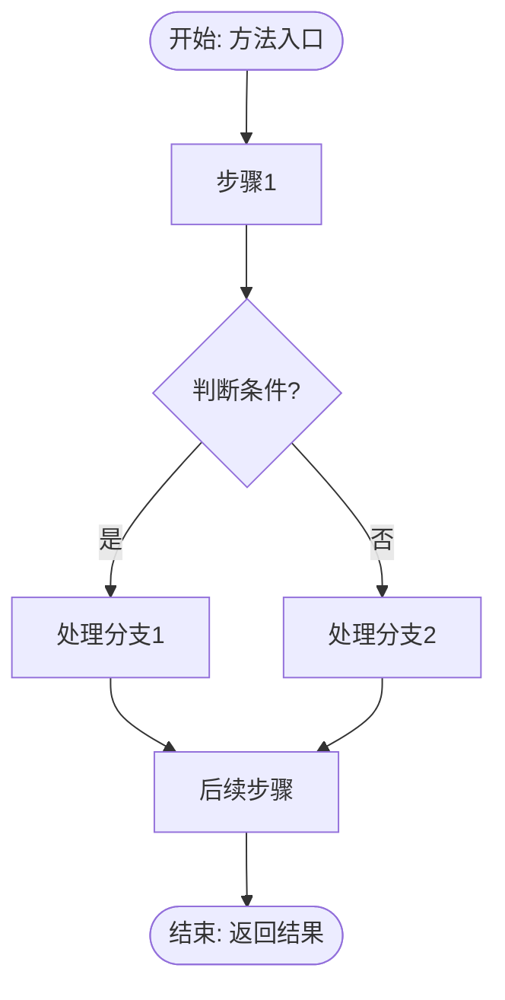
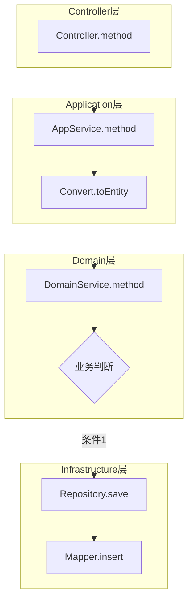
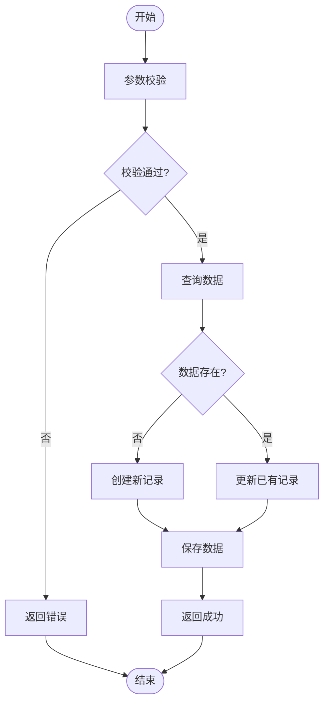
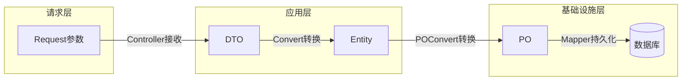

# 输出模板参考

## 目录
1. [结构化文本报告模板](#结构化文本报告模板)
2. [Mermaid流程图模板](#mermaid流程图模板)
3. [分析要点提示](#分析要点提示)

---

## 结构化文本报告模板

```markdown
# [功能名称] 代码逻辑分析报告

## 1. 功能概述

**核心功能**：[一句话描述这段代码实现了什么业务功能]

**入口方法**：`[类名].[方法名]`

**涉及层次**：Controller → AppService → DomainService → Repository → SQL

---

## 2. 调用链路

### 2.1 调用层次图

```
[Controller方法]
    ↓
[AppService方法]
    ├── [Convert] DTO → Entity
    ↓
[DomainService方法]
    ├── [业务逻辑处理]
    ↓
[Repository接口方法]
    ↓
[RepositoryImpl实现]
    ├── [POConvert] Entity ↔ PO
    ↓
[Mapper接口]
    ↓
[SQL语句]
```

### 2.2 关键代码位置

| 层次 | 类名 | 方法名 | 文件位置 |
|-----|------|-------|---------|
| Controller | XxxController | methodName | [path/to/file.java](file:///path#L10-L20) |
| AppService | XxxAppService | methodName | [path/to/file.java](file:///path#L30-L50) |
| DomainService | XxxDomainService | methodName | [path/to/file.java](file:///path#L10-L40) |
| Repository | XxxRepositoryImpl | methodName | [path/to/file.java](file:///path#L20-L35) |
| Mapper | XxxMapper | methodName | [path/to/mapper.xml](file:///path#L5-L15) |

---

## 3. 业务规则详解

### 3.1 核心业务规则

| 序号 | 规则描述 | 代码位置 | 触发条件 |
|-----|---------|---------|---------|
| 1 | [规则1描述] | [类名#方法名] | [条件] |
| 2 | [规则2描述] | [类名#方法名] | [条件] |

### 3.2 条件分支解析

#### 分支1: [分支名称/业务场景]

**判断条件**：`if (condition)`

**业务含义**：[解释这个条件代表什么业务场景]

**执行逻辑**：
1. [步骤1]
2. [步骤2]

**代码位置**：[文件#行号]

---

## 4. 数据流转

### 4.1 数据转换路径

```
请求参数(Request)
    ↓ [Controller接收]
DTO对象
    ↓ [Convert转换]
Entity/Domain对象
    ↓ [业务处理]
Entity/Domain对象（已修改）
    ↓ [POConvert转换]
PO对象
    ↓ [Mapper持久化]
数据库记录
```

### 4.2 关键字段映射

| 层次 | 字段名 | 类型 | 说明 |
|-----|-------|-----|------|
| DTO | fieldA | String | [说明] |
| Entity | fieldA | String | [说明] |
| PO | field_a | VARCHAR | [说明] |
| DB Column | field_a | VARCHAR(100) | [说明] |

### 4.3 数据计算/转换逻辑

[描述任何业务计算或数据转换的逻辑]

---

## 5. 异常处理

### 5.1 校验异常

| 校验点 | 条件 | 异常类型 | 错误信息 |
|-------|-----|---------|---------|
| [校验名称] | [触发条件] | [异常类] | [错误消息] |

### 5.2 业务异常

| 场景 | 触发条件 | 处理方式 |
|-----|---------|---------|
| [场景1] | [条件] | [抛出异常/返回特定值/...] |

### 5.3 事务处理

- 事务边界：[哪个方法上有@Transactional]
- 回滚条件：[什么情况会回滚]

---

## 6. SQL逻辑

### 6.1 主要SQL语句

**SQL名称**：[Mapper方法名]

**SQL类型**：SELECT/INSERT/UPDATE/DELETE

**SQL内容**：
```sql
-- 来自 [XxxMapper.xml]
SELECT xxx FROM table WHERE condition = #{param}
```

**参数说明**：
- `#{param1}`: [参数含义]
- `#{param2}`: [参数含义]

---

## 7. 参数配置（如有）

| 参数名 | 来源 | 作用 | 默认值 |
|-------|-----|------|-------|
| [参数名] | [配置表/文件] | [影响哪个业务逻辑] | [默认值] |

---

## 8. 总结

### 主要流程
1. [步骤1]
2. [步骤2]
3. [步骤3]

### 关键点
- [关键点1]
- [关键点2]

### 潜在风险/注意事项
- [风险1]
- [风险2]
```

---

## Mermaid流程图模板

### 基础流程图



### 调用链流程图



### 业务流程图（带条件分支）



### 数据流转图



---

## 分析要点提示

### 分析条件分支时

问自己：
- 这个if条件代表什么业务场景？
- 为什么需要这个判断？
- 各分支的业务含义是什么？
- 边界情况是如何处理的？

### 分析数据流转时

问自己：
- 数据从哪里来？
- 在各层之间如何转换？
- 哪些字段被映射？哪些被忽略？
- 有没有数据计算或聚合？

### 分析异常处理时

问自己：
- 哪些情况会抛出异常？
- 异常是在哪一层被捕获的？
- 有没有全局异常处理？
- 事务是如何回滚的？

### 分析SQL时

问自己：
- SQL的查询条件是什么？
- 有没有复杂的JOIN或子查询？
- 参数是如何传递的？
- 有没有动态SQL（if/choose等）？
